## Задание
### Вариант 9:
#### Количество работников: 4
#### Таблица зависимостей заданий:

| Предшествующее задание | A | B | C | D | E | F | G | H | I | J | K | L | M |
|------------------------|---|---|---|---|---|---|---|---|---|---|---|---|---|
| Последующее задание    | H | - | A | H | A | M | B | B | E | B | E | D | A |

---
## Решение
### Выбор алгоритма
Так как в задании количество работников равно 4, то сразу можно откинуть **Лексикографическую стратегию**, т.к. она ограничена ровно двумя работниками.
Поэтому будет использоваться **уровневая стратегия**.
### Таблица зависимостей

| Предшествующее задание | A | B | C | D | E | F | G | H | I | J | K | L | M |
|------------------------|---|---|---|---|---|---|---|---|---|---|---|---|---|
| Последующее задание    | H | - | A | H | A | M | B | B | E | B | E | D | A |
### Граф зависимостей

### Диаграмма Ганта

```mermaid
gantt
    
    title Диаграмма Ганта
    dateFormat HH:mm    
    axisFormat %H:%M
    Начало выполнения работ : milestone, m1, 00:00, 0h
    section Исполнитель 1
    F(13)         :a, 00:00, 1h
    M(9)          :e, after a, 1h
    A(5)          :i, after e, 1h
    H(3)          :l, after i, 1h
    B(1)          :m, after l, 1h

    section Исполнитель 2
    K(12)         :b, 00:00, 1h
    E(8)          :f, after b, 1h
    J(4)          :j, after f, 1h

    section Исполнитель 3
    I(11)         :c, 00:00, 1h
    C(7)          :g, after c, 1h
    G(2)          :k, after g, 1h

    section Исполнитель 4
    L(10)         :d, 00:00, 1h
    D(6)         :h, after d, 1h

    Окончание выполнения работ : milestone, m2, 05:00, 0h
```

###  Ответ:  кратчайшее расписание имеет длительность 5.
