## Задание №10 Уровневая/лексикографическая стратегия. Вариант №1

Изначальный граф 

1. Для решения данной задачи применим эффективный алгоритм, основанный на "лексикографической" стратегии, т.к. структура графа подходит под применение данной стратегии, в отличии от уровневой, где граф зависимости представлен в виде дерева, в котором вершины сводятся к одному корню (стоку).

Граф без транзитивных дуг

2. Сначала мы исключаем транзитивные дуги. Всего было выявлено 3 (G:L, H:B, L:J)
Далее расставляем приоритеты для каждой задачи. В первую очередь приоритеты 1, 2, 3, ... назначаются стокам графа (вершины, из которых нет исходящих ребер). 
Для заданий, все прямые потомки которых уже имеют приоритеты, составляется строка из приоритетов прямых потомков, записанных в убывающем порядке. Приоритет (t + 1) назначается заданию, у которого строка из приоритетов является лексикографически наименьшей.
После того как приоритеты для всех задач назначены, задачи добавляются в расписание в соответствии с их приоритетом. В каждый момент времени выбираются задачи готовые к выполнению (для которых все предшествующие задачи выполнены к началу момента времени) из них для добавления в расписание выбирается задача с наибольшим приоритетом.

Расставили следующие приоритеты:
J 1, M 2, O 3, B 4, C 5, I 6, L 7, H 8,  K 9, F 10, G 11, A 12, D 13

Граф зависимостей с приоритетами
Приоритет - # Строка приоритетов прямых потомков - <>

Теперь составим расписание, в таблице будет таковое:
Время, у.е.	    1	2	3	4	5	6	7	8
Исполнитель 1	D	G	K	L	C	B	O	J
Исполнитель 2	A	F	H	I	-	-	M	-    

3. Длительность расписания: 8 условных единиц

4. Расписание в виде диаграммы Ганта:

```mermaid
gantt
title Диаграмма Ганта
dateFormat HH:mm    
axisFormat %H:%M
Начало выполнения работ : milestone, m1, 00:00, 0h
section Исполнитель 1
D         :d, 00:00, 1h
G         :g, after d, 1h    
K         :k, after g, 1h    
L         :l, after k, 1h
C         :c, after l, 1h
B         :b, after c, 1h
O         :o, after b, 1h
J         :j, after o, 1h
section Исполнитель 2
A         :a, 00:00, 1h
F         :f, after a, 1h
H         :h, after f, 1h
I         :i, after h, 1h
M         :m, after b, 1h
Окончание выполнения работ : milestone, m2, 08:00, 0h
```
