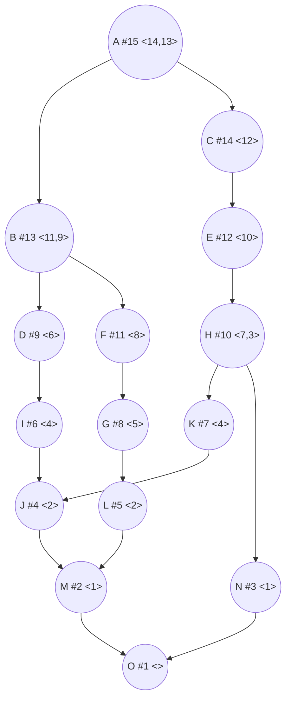

### Вариант 8:
#### Количество работников: 2
#### Таблица зависимостей заданий:

| **Предшествующее** | **Последующее** |
|--------------------|-----------------|
| A                  | B               |
| B                  | D               |
| A                  | D               |
| B                  | I               |
| D                  | I               |
| A                  | C               |
| C                  | E               |
| E                  | H               |
| H                  | K               |
| B                  | F               |
| F                  | G               |
| G                  | L               |
| I                  | J               |
| K                  | J               |
| L                  | M               |
| J                  | M               |
| H                  | N               |
| M                  | O               |
| N                  | O               |


## Изначальный граф

```mermaid
graph TB

A --> B
B --> D
A --> D
B --> I
D --> I
A --> C
C --> E
E --> H
H --> K
B --> F
F --> G
G --> L
I --> J
K --> J
L --> M
J --> M
H --> N
M --> O
N --> O
  ```
Количество вершин = 15. Количество ребер = 19.

**Изначально транзитивными оказались две дуги: A → D и B → I. Они удалены.**

## Граф без транзитивных рёбер
```mermaid
graph TB

A --> B
B --> D
D --> I
A --> C
C --> E
E --> H
H --> K
B --> F
F --> G
G --> L
I --> J
K --> J
L --> M
J --> M
H --> N
M --> O
N --> O
```

## Расстановка приоритетов
Сток графа — O. Им назначаем приоритеты 1.

Далее поднимаемся вверх,и выбираем вершину, у которой все потомки уже имеют приоритеты.После формируем строку приоритетов 

O — 1
M — 2
N — 3
L — 4
J — 5
G — 6
K — 7
I — 8
F — 9
H — 10
D — 11
E — 12
B — 13
C — 14
A — 15

## Итоговый граф с приоритетами


## Построение расписания для 2 исполнителей
Выбираем задачи, у которых выполнены все предшественники в каждый момент времени ,
и запускаем две задачи с максимальными приоритетами


0–1: A(15), B(13)
1–2: I(8), F(9)
2–3: J(5), G(6)
3–4: M(2), L(4)
4–5: O(1), N(3)
5–6: K(7), H(10)
6–7: D(11), E(12)
7–8: C(14)

## Диаграмма Ганта
gantt
  title Диаграмма Ганта
  dateFormat HH:mm
  axisFormat %H:%M

  Начало : milestone, m1, 00:00, 0h

  section Исполнитель 1
  A(15) :a, 00:00, 1h
  I(8)  :i, 01:00, 1h
  J(5)  :j, 02:00, 1h
  M(2)  :m, 03:00, 1h
  O(1)  :o, 04:00, 1h
  K(7)  :k, 05:00, 1h
  D(11) :d, 06:00, 1h
  C(14) :c, 07:00, 1h

  section Исполнитель 2
  B(13) :b, 00:00, 1h
  F(9)  :f, 01:00, 1h
  G(6)  :g, 02:00, 1h
  L(4)  :l, 03:00, 1h
  N(3)  :n, 04:00, 1h
  H(10) :h, 05:00, 1h
  E(12) :e, 06:00, 1h

  Конец : milestone, m2, 08:00, 0h

**Ответ: Длительность оптимального расписания составлет 8 условных единиц времени.**
