# Задание №10
# Оптимальное расписание. Уровневая стратегия/Лексикографическая стратегия

Для каждого варианта представлены условия задачи. Для каждой задачи необходимо построить расписание, выполняемое в кратчайшие сроки: 
1. Выбрать алгоритм решения задачи и обосновать свой выбор.
2. Применить выбранный алгоритм, в решении отобразить ход выполнения алгоритма с **подробными комментариями**.
3. В ответе указать длительность полученного расписания.
4. В ответе вывести полученное расписание **в виде диаграммы Ганта**. Диаграмму Ганта можно оформить с помощью плагина Mermaid, образцы оформления диаграмм представлены в данном файле, в описании алгоритмов.

**Решение должно содержать номер варианта и подробное пошаговое описание.**

Условия задачи расположены в файле `Задание 10/Варианты условий.md` в ветке main репозитория для ручных задач.
Решение задачи нужно оформить в формате Markdown в отдельном файле с названием <название_команды>.md, который добавить в каталог `Задание 10` данного репозитория.

## Информация по Markdown разметке:

Полезная информация для оформления решений:
- [Руководство по оформлению Markdown файлов](https://gist.github.com/Jekins/2bf2d0638163f1294637)
- [Система верстки LaTeX, которую можно использовать для математических формул](https://grammarware.net/text/syutkin/MathInLaTeX.pdf)
- [Рисуем диаграммы Mermaid.js в README-файлах GitHub](https://habr.com/ru/articles/652867/)

## Для выполнения задания необходимо:

1. Обновить ветку main в локальном репозитории (git pull).
2. От ветки main создать ветвь с названием `<название_команды>-task-10`, заменив `<название_команды>` на название команды, решившей задание.
3. В созданной ветке в каталог `Задание 10` добавить файл с решением задачи с названием `<название_команды>.md`.
4. Зафиксировать изменения на ветке (git commit).
5. Отравить ветку с изменениями в репозиторий на Github (git push).
6. Создать на Github запрос на слияние (pull request), указав в качестве base ветки `main`, в качестве compare ветки `<название_команды>-task-10`.

## Лексикографическая стратегия
### Постановка задачи:
1. количество заданий произвольно;
2. все задания имеют одинаковую длительность;
3. задания зависимы, причём **граф зависимостей не должен содержать транзитивных ребер**;
4. запрещены прерывания при выполнении заданий;
5. количество **работников строго 2**;
6. работники универсальны;
7. производительность работников, размеры оплаты из труда и т.д. не учитываются;

*Требуется построить расписание выполнения всех заданий для заданного 
количества исполнителей в кратчайшие сроки.*
### Алгоритм решения задачи
Перед выполнением алгоритма необходимо удалить из графа зависимостей транзитивные ребра.

Для построения расписания необходимо назначить приоритет для каждой задачи. В первую очередь приоритеты 1, 2, 3, ... назначаются стокам графа (вершины, из которых нет исходящих ребер). 

Для заданий, все прямые потомки которых уже имеют приоритеты, составляется строка из приоритетов прямых потомков, записанных в убывающем порядке. Приоритет (t + 1) назначается заданию, у которого строка из приоритетов является лексикографически наименьшей.

После того как приоритеты для всех задач назначены, задачи добавляются в расписание в соответствии с их приоритетом. В каждый момент времени выбираются задачи готовые к выполнению (для которых все предшествующие задачи выполнены к началу момента времени) из них для добавления в расписание выбирается задача с наибольшим приоритетом.
### Таблица зависимостей

| Предшествующее задание | A | A | C | C | D | E | F | G | G | H | H | I | I | L |
|------------------------|---|---|---|---|---|---|---|---|---|---|---|---|---|---|
| Последующее задание    | B | J | E | F | E | H | H | J | K | A | G | H | L | G |

### Граф зависимостей

### Граф зависимостей с приоритетами
Приоритет - #
Строка приоритетов прямых потомков - <>

### Диаграмма Ганта

## Уровневая стратегия
### Постановка задачи:
1. количество заданий произвольно;
2. все задания имеют одинаковую длительность;
3. задания зависимы, причём граф зависимостей имеет вид дерева, ориентированного к корню (или ориентированного леса);
4. запрещены прерывания при выполнении заданий;
5. количество работников произвольно;
6. работники универсальны;
7. производительность работников, размеры оплаты из труда и т.д. не учитываются;

*Требуется построить расписание выполнения всех заданий для заданного количества исполнителей в кратчайшие сроки.*
### Алгоритм решения задачи
Для построения расписания необходимо назначить приоритет для каждой задачи. В первую очередь приоритеты 1, 2, 3, ... назначаются стокам графа (вершины, из которых нет исходящих ребер). Если приоритеты 1, 2, 3, ..., t уже назначены, то приоритет (t + 1) назначается заданию, у которого прямой потомок имеет наименьший приоритет.

После того как приоритеты для всех задач назначены, задачи добавляются в расписание в соответствии с их приоритетом. В каждый момент времени выбираются задачи готовые к выполнению (для которых все предшествующие задачи выполнены к началу момента времени) из них для добавления в расписание выбирается задача с наибольшим приоритетом.

### 1.  Таблица зависимостей

| Предшествующее задание | A | B | C | D | E | F | G | H | J | K | L | M |
|------------------------|---|---|---|---|---|---|---|---|---|---|---|---|
| Последующее задание    | E | D | D | E | I | G | H | I | I | G | K | K |

### Граф зависимостей

###  2. Для решения используется уровневая стратегия, поэтому необходимо расставить приоритеты.
1. Приоритет 1 отдаем корню I
2. Претенденты для приоритета 2: E, H, J. Приоритет отдается тому у кого самый слабый потомок, так как потомки одинаковой силы, то приоритет 2 можно отдать E.
3. Претенденты для приоритета 3: H, J, A, D. Приоритет 3 отдаем H.
4. Претенденты для приоритета 4: J, A, D, G. Приоритет 4 отдаем J.
5. Претенденты для приоритета 5:  A, D, G. Приоритет 5 отдаем A.
6. Претенденты для приоритета 6:  D, G. Приоритет 6 отдаем D.
7. Претенденты для приоритета 7:  G, B, C. Приоритет 7 отдаем G.
8. Претенденты для приоритета 8:  B, C, F, K. Приоритет 8 отдаем B.
9. Претенденты для приоритета 9:  C, F, K. Приоритет 9 отдаем C.
10. Претенденты для приоритета 10:  F, K. Приоритет 10 отдаем F. 
11. Претенденты для приоритета 11:  K. Приоритет 11 отдаем K. 
12. Претенденты для приоритета 12:  L, M. Приоритет 12 отдаем L. 
13. Претенденты для приоритета 10:  M. Приоритет 13 отдаем M. 

###  3. Таким образом, получаем граф зависимостей с приоритетами.

###  4. Построим диаграмму Ганта
### Строим диаграмму Ганта для двух исполнителей, распределяя задачи исполнителям с наибольшим приоритетом в первую очередь.

```mermaid
gantt
    
    title Диаграмма Ганта
    dateFormat HH:mm    
    axisFormat %H:%M
    Начало выполнения работ : milestone, m1, 00:00, 0h
    section Исполнитель 1
    M(13)         :c, 00:00, 1h
    K(11)         :i, after c, 1h    
    C(9)         :e, after i, 1h    
    G(7)         :h, after e, 1h
    A(5)         :a, after h, 1h
    H(3)         :b, after a, 1h
    I(1)         :k, after b, 1h
    section Исполнитель 2
    L(12)         :d, 00:00, 1h
    F(10)         :f, after d, 1h
    B(8)         :l, after f, 1h
    D(6)         :g, after l, 1h
    J(4)         :j, after g, 1h
    E(2)         :x, after j, 1h
    -            :y, after x, 1h
    Окончание выполнения работ : milestone, m2, 07:00, 0h
```

###  Ответ:  кратчайшее расписание имеет длительность 7.