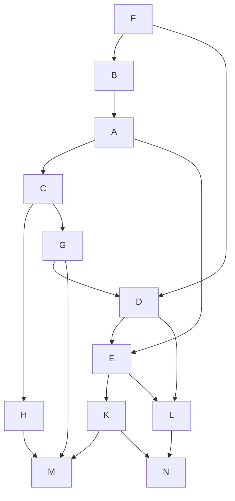
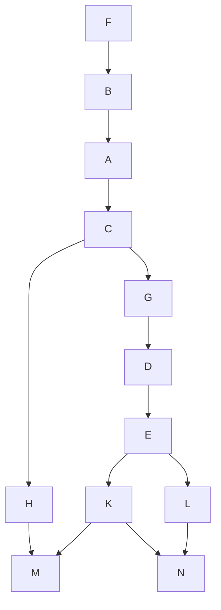

### Вариант 7:
#### Количество работников: 2
#### Таблица зависимостей заданий:

| Предшествующее задание | F | F | G | B | D | D | A | A | C | C | E | E | H | G | K | K | L |
|------------------------|---|---|---|---|---|---|---|---|---|---|---|---|---|---|---|---|---|
| Последующее задание    | B | D | D | A | E | L | C | E | H | G | K | L | M | M | M | N | N |

Для определения стратегии построим граф зависимости заданий:

Количество ребер = 17; количество вершин = 12.  
Тут присутствуют циклы и между вершинами есть несколько путей $\Rightarrow$ данный граф не является деревом, а значит мы не можем применить уровневую стратегию.  
Для применения лексикографической стратегии нам необходимо устранить транзитивные зависимости.  
В итоге получился следующий граф:  

Назначим приоритеты графу:  
1) Изначально самый высокий приоритет отдается стокам графа в нашем случае это N M
2) Если приоритеты уже назначены, то для каждого из потомков с уже назначенными приоритетами мы выбираем строку всех прямых потомков рассматриваемого потомка, такую, которая будет лексикографически наименьшей.  
Более наглядно выбор представлен в таблице ниже (красным представлен наш выбор):  

| 1 | 2 | 3                                                          | 4 | 5 | 6 | 7 | 8 | 9 | 10 | 11 | 12 |
|---|---|------------------------------------------------------------|---|---|---|---|---|---|----|----|----|
| M | N | H: 1 K: 1, 2 L: 2 | L | K | E | D | G | C | A  | B  | F  |

Построим диаграмму Ганта:  

| Исполнитель 1 | $F_{12}$ | $B_{11}$ | $A_{10}$ | $C_{9}$ | $G_{8}$ | $G_{7}$ | $E_{6}$ | $K_{5}$ | $M_{1}$ |
| --- | --- | --- | --- | --- | --- | --- | --- | --- | --- |
| Исполнитель 2 | - | - | - | - | $H_{3}$ | - | - | $L_{4}$ | $N_{2}$ |

**Ответ:** Оптимальное расписание составляет 9 единиц времени, само расписание представлено в диаграмме.