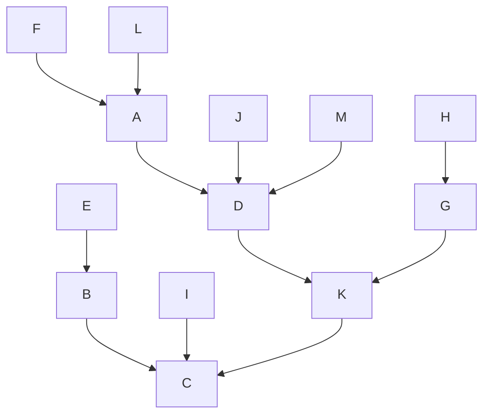
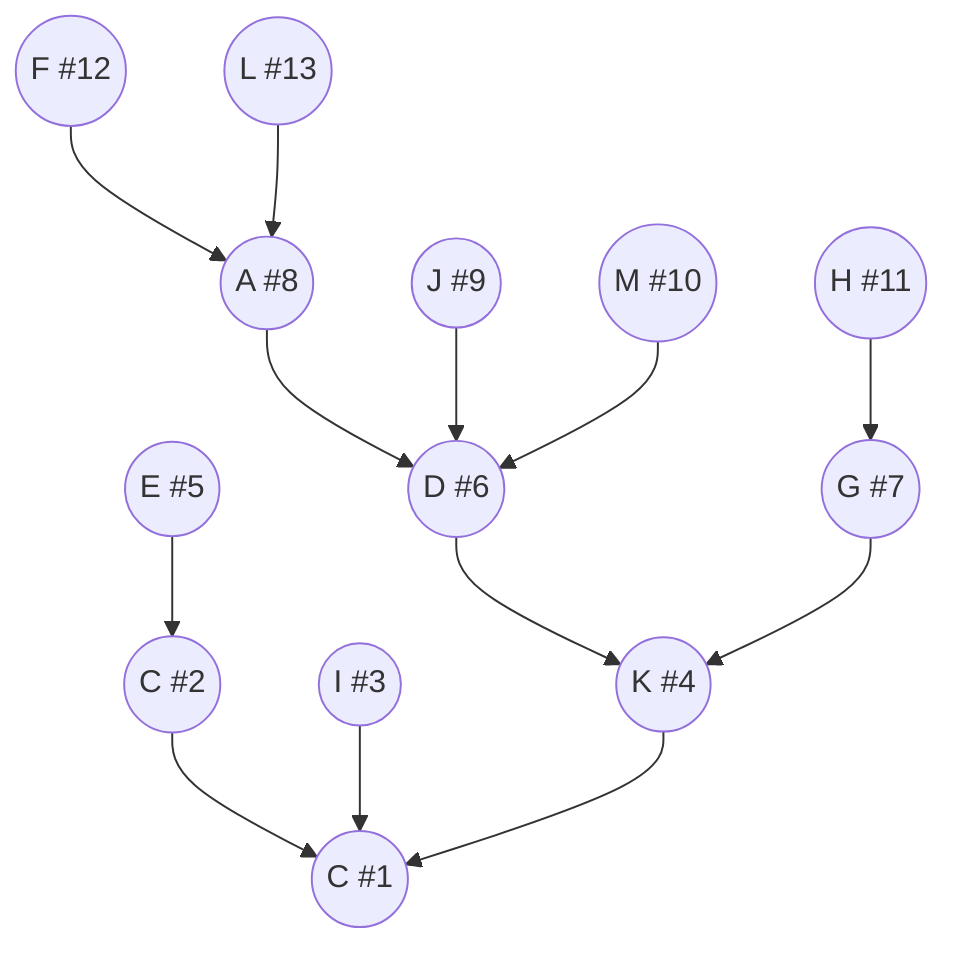

# Дано
## Вариант 6:
### Количество работников: 4
### Таблица зависимостей заданий:

| Предшествующее задание | A | B | C | D | E | F | G | H | I | J | K | L | M |
|------------------------|---|---|---|---|---|---|---|---|---|---|---|---|---|
| Последующее задание    | D | C | - | K | B | A | K | G | C | D | C | A | D |

# Решение:

Рассмотрим данный граф:

Граф зависимостей имеет вид дерева, ориентированного к корню, поэтому подойдет уровневая стратегия. Назначим приоритеты для каждого узла графа:
1. Приоритет 1 отдаем корню С
2. Претенденты для приоритета 2: B, I, K. Так как у всех претендентов потомок один, то можно приоритет 2 можно отдать B.
3. Претенденты для приоритета 3: E, I, K. Приоритет отдаем I.
4. Претенденты для приоритета 4: E, K. Приоритет отдаем K.
5. Претенденты для приоритета 5: E, D, G. Приоритет отдаем E.
6. Претенденты для приоритета 6: D, G. Приоритет отдаем D.
7. Претенденты для приоритета 7: A, J, M, G. Приоритет отдаем G.
8. Претенденты для приоритета 8: A, J, M, H. Приоритет отдаем A.
9. Претенденты для приоритета 9: F, L, J, M, H. Приоритет отдаем J.
10. Претенденты для приоритета 10: F, L, M, H. Приоритет отдаем M.
11. Претенденты для приоритета 11: F, L, H. Приоритет отдаем H.
12. Претенденты для приоритета 12: F, L. Приоритет отдаем F.
13. Претенденты для приоритета 13: L. Приоритет отдаем L.

## Построим диаграмму Ганта

```mermaid
gantt
    
    title Диаграмма Ганта
    dateFormat HH:mm    
    axisFormat %H:%M
    Начало выполнения работ : milestone, m1, 00:00, 0h
    section Исполнитель 1
    L(13)    :a1, 00:00, 1h
    J(9)     :b1, after a1, 1h
    D(6)     :c1, after b1, 1h
    K(4)     :d1, after c1, 1h
    C(1)     :e1, after d1, 1h

    section Исполнитель 2
    F(12)    :a2, 00:00, 1h
    A(8)    :b2, after a2, 1h
    I(3)    :c2, after b2, 1h

    section Исполнитель 3
    H(11)    :a3, 00:00, 1h
    G(7)     :b3, after a3, 1h
    B(2)     :c3, after b3, 1h

    section Исполнитель 4
    M(10)    :a4, 00:00, 1h
    E(5)     :b4, after a4, 1h

    

```

Ответ: кратчайшее расписание имеет длительность 5.

