## Вариант 4:
### Количество работников: 2
### Таблица зависимостей:

| Предшествующее задание | A | A | B | B | B | C | D | F | F | G | G | H | H | I | K | L | L |
|------------------------|---|---|---|---|---|---|---|---|---|---|---|---|---|---|---|---|---|
| Последующее задание    | F | G | J | M | O | B | G | H | L | H | K | B | C | B | C | B | J |

## Изначальный граф

```mermaid
graph TB
  A((A))-->F((F))
  A-->G((G))
  B((B))-->J((J))
  B-->M((M))
  B-->O((O))
  C((C))-->B
  D((D))-->G
  F((F))-->H((H))
  F-->L((L))
  G((G))-->H
  G-->K((K))
  H((H))-->B
  H-->C
  I((I))-->B
  K((K))-->C
  L((L))-->B
  L-->J
  ```
Количество вершин = 13. Количество ребер = 17.

**Изначально транзитивными оказались две дуги: H → B и L → J. Они удалены.**

## 3. Граф без транзитивных рёбер
```mermaid
graph TB
  A((A))-->F((F))
  A-->G((G))
  B((B))-->J((J))
  B-->M((M))
  B-->O((O))
  C((C))-->B
  D((D))-->G
  F((F))-->H((H))
  F-->L((L))
  G((G))-->H
  G-->K((K))
  H((H))-->C
  I((I))-->B
  K((K))-->C
  L((L))-->B
```

## 4. Расстановка приоритетов
Стоки графа — J, M, O. Им назначаем приоритеты 1, 2, 3.

Далее последовательно поднимаемся вверх, каждый раз выбирая вершину, у которой все потомки уже имеют приоритеты, формируя строку приоритетов `<…>` и выбирая лексикографически минимальную.

| Задача | Потомки | Строка | Приоритет |
|--------|---------|---------|------------|
| J | — | `<>` | **1** |
| M | — | `<>` | **2** |
| O | — | `<>` | **3** |
| B | J(1), M(2), O(3) | `<3,2,1>` | **4** |
| C | B(4) | `<4>` | **5** |
| I | B(4) | `<4>` | **6** |
| L | B(4) | `<4>` | **7** |
| H | C(5) | `<5>` | **8** |
| K | C(5) | `<5>` | **9** |
| F | H(8), L(7) | `<8,7>` | **10** |
| G | K(9), H(8) | `<9,8>` | **11** |
| D | G(11) | `<11>` | **12** |
| A | F(10), G(11) | `<11,10>` | **13** |

## 5. Итоговый граф с приоритетами


## 6. Построение расписания (2 исполнителя)
В каждый момент времени выбираются задачи, у которых выполнены все предшественники, и запускаются две задачи с максимальными приоритетами.


- 0–1: A(13), D(12)
- 1–2: G(11), F(10)
- 2–3: K(9), H(8)
- 3–4: L(7), I(6)
- 4–5: C(5)
- 5–6: B(4)
- 6–7: O(3), M(2)
- 7–8: J(1)

## 7. Диаграмма Ганта

```mermaid
gantt
  title Диаграмма Ганта
  dateFormat HH:mm
  axisFormat %H:%M

  Начало : milestone, m1, 00:00, 0h

  section Исполнитель 1
  A(13) :a, 00:00, 1h
  G(11) :g, 01:00, 1h
  K(9)  :k, 02:00, 1h
  L(7)  :l, 03:00, 1h
  C(5)  :c, 04:00, 1h
  B(4)  :b, 05:00, 1h
  O(3)  :o, 06:00, 1h
  J(1)  :j, 07:00, 1h

  section Исполнитель 2
  D(12) :d, 00:00, 1h
  F(10) :f, 01:00, 1h
  H(8)  :h, 02:00, 1h
  I(6)  :i, 03:00, 1h
  M(2)  :m, 06:00, 1h

  Конец : milestone, m2, 08:00, 0h
```


**Ответ: Оптимальное расписание составлет 8 единиц времени.**
