# Задание №10
# Оптимальное расписание. Уровневая стратегия/Лексикографическая стратегия

Для каждого варианта представлены условия задачи. Для каждой задачи необходимо построить расписание, выполняемое в кратчайшие сроки: 
1. Выбрать алгоритм решения задачи и обосновать свой выбор.
2. Применить выбранный алгоритм, в решении отобразить ход выполнения алгоритма с **подробными комментариями**.
3. В ответе указать длительность полученного расписания.
4. В ответе вывести полученное расписание **в виде диаграммы Ганта**.

### Вариант 3:
#### Количество работников: 2
#### Таблица зависимостей заданий:

|Предшествующее задание| B | C | D | E | F | G | H | I | J | K | L | M |
|----------------------|---|---|---|---|---|---|---|---|---|---|---|---|
|Последующее задание   | E | B | A | A | B | L | L | C | C | D | D | L |

## Решение 

### 1. Выбор стратегии

Все стрелки в графе ведут к одной задаче - А. Такой граф называется лесом, 
где все пути направлены к одной вершине (к корню A)

По условию, если граф - это дерево или лес, направленный к корню, 
нужно применять уровневую стратегию. Поэтому для варианта 3 мы выбираем именно её

### 2. Построение графа зависимостей

| Предшествующее | Последующее |
|----------------|------------|
| B | E |
| C | B |
| D | A |
| E | A |
| F | B |
| G | L |
| H | L |
| I | C |
| J | C |
| K | D |
| L | D |
| M | L |

#### Граф зависимостей:

Стоком графа является единственная вершина A, так как у неё нет потомков

С неё и начинаем присвоение приоритетов

### 3. Расстановка приоритетов

#### Итоговые приоритеты:

| Задание| Приоритет|
|:-----:|:-------:|
| A | $1$ |
| D | $2$ |
| E | $3$ |
| K | $4$ |
| L | $5$ |
| B | $6$ |
| G | $7$ |
| H | $8$ |
| M | $9$ |
| C | $10$ |
| F | $11$ |
| I | $12$ |
| J | $13$ |

#### Граф зависимостей с приоритетами

(Приоритет - #, cтрока приоритетов прямых потомков - <>)

### 4. Построение расписания и диаграмма Ганта

#### Расписание выполнения задач

| Исполнитель | Задачи |
|------------|--------------------------|
| **Исполнитель 1** | J -> F -> M -> G -> L -> E -> A |
| **Исполнитель 2** | I -> C -> H -> B -> K -> D -> (простой) |

Всего у нас 13 задач. При двух работниках минимально возможное время - 7 единиц (13 / 2 ~ 6,5 - округляем до 7)

Наше расписание тоже даёт 7, значит оно оптимальное

#### Диаграмма Ганта

```mermaid
gantt
    title Диаграмма Ганта (Вариант 3)
    dateFormat HH:mm    
    axisFormat %H:%M
    Начало выполнения работ : milestone, m1, 00:00, 0h

    section Исполнитель 1
    Задача J         :j, 00:00, 1h
    Задача F         :f, after j, 1h    
    Задача M         :m, after f, 1h    
    Задача G         :g, after m, 1h
    Задача L         :l, after g, 1h
    Задача E         :e, after l, 1h
    Задача A         :a, after e, 1h

    section Исполнитель 2
    Задача I         :i, 00:00, 1h
    Задача C         :c, after i, 1h
    Задача H         :h, after c, 1h
    Задача B         :b, after h, 1h
    Задача K         :k, after b, 1h
    Задача D         :d, after k, 1h

    Окончание выполнения работ : milestone, m2, 07:00, 0h
```

Кратчайшее расписание для варианта 3 при двух работниках имеет длительность
7 единиц времени
