## Вариант 5. Оптимальное расписание
### 1. Исходные данные

| Предшествующее задание| A | B | C | D | E | G | H | J | K | L | M | N | O |
|-----------------------|---|---|---|---|---|---|---|---|---|---|---|---|---|
| Последующее задание   | E | G | K | E | O | I | M | M | O | G | F | I | F |

Все задания имеют одинаковую длительность, прерывания невозможны, работников 2.

### 2. Выбор стратегии

Задания F и I - стоки. Также каждый узел ведёт максимум в одну вершину.
То есть граф представляет собой ориентированный лес, направленный к корням F и I,
поэтому выбираем уровневую стратегию.

### 3. Исходный граф зависимостей

### 4. Расстановка приоритетов

Стоки (F,I), приоритеты (1,2) соответственно:
1. F (1), родители: M (3), O (4).
2. I (2), родители: G (5), N (6).
3. M (3), родители: H (7), J (8).
4. O (4), родители: E (9), K (10).
5. G (5), родители: B (11), L (12).
6. E (9), родители: A (13), D (14).
7. K (10), родители: C (15).

#### 4.1. Граф с приоритетами

### 5. Диаграмма Ганта

```mermaid
gantt
    
    title Диаграмма Ганта
    dateFormat HH:mm    
    axisFormat %H:%M
    Начало выполнения работ : milestone, m1, 00:00, 0h
    section Исполнитель 1
    C(15)         :c, 00:00, 1h
    A(13)         :a, after c, 1h    
    B(11)         :b, after a, 1h    
    E(9)          :e, after b, 1h
    H(7)          :h, after e, 1h
    G(5)          :g, after h, 1h
    M(3)          :m, after g, 1h
    F(1)          :f, after m, 1h
    section Исполнитель 2
    D(14)         :d, 00:00, 1h
    L(12)         :l, after d, 1h
    K(10)         :k, after l, 1h
    J(8)          :j, after k, 1h
    N(6)          :n, after j, 1h
    O(4)          :o, after n, 1h
    I(2)          :i, after o, 1h
    -             :x, after i, 1h
    Окончание выполнения работ : milestone, m2, 08:00, 0h
```

### 6. Ответ

Ответ: кратчайшее расписание имеет длительность 8