# Оптимальное расписание. Уровневая стратегия/Лексикографическая стратегия
## Задание
Для каждого варианта представлены условия задачи. Для каждой задачи необходимо построить расписание, выполняемое в кратчайшие сроки: 
1. Выбрать алгоритм решения задачи и обосновать свой выбор.
2. Применить выбранный алгоритм, в решении отобразить ход выполнения алгоритма с **подробными комментариями**.
3. В ответе указать длительность полученного расписания.
4. В ответе вывести полученное расписание в виде диаграммы Ганта.
---
### Вариант 2:
#### Количество работников: 3
#### Таблица зависимостей заданий:

|Предшествующее задание| K | L | G | H | M | N | I | J | E | F | B | D |
|----------------------|---|---|---|---|---|---|---|---|---|---|---|---|
|Последующее задание   | G | G | C | C | I | I | D | D | B | B | A | A |
---
### Решение
1. Для использования лексико-графической стратегии необходимо, чтобы было ровно 2 работника, в данной задаче их 3, поэтому этим методом воспользоваться нельзя. При этом все задания зависимы и имеют одинаковую длительность (пусть каждое из ним выполняется за 1 час), их нельзя прерывать. По таблице видно, что у заданий $A$ и $C$ нет последующих заданий, то есть в графе эти вершины могли бы быть стоками. Нарисуем ориентированный граф, показывающий зависимости последующих заданий от предыдущих.

Полученный граф - лес из двух деревьев, а вершины $A$ и $C$ в них являются стоками, или корнями. Тогда постановка задачи соответствует условиям для применения **уровневой стратегии** составления оптимального расписания.

2. Согласно выбранной стратегии, нужно расставить приоритеты выполнения заданий.
   - Сначала отдадим приоритеты корням деревьев, пусть $A$ = 1, $C = 2$ (то есть они будут выполняться в последнюю очередь).
   -  Претенденты на приоритет 3: $B, D, G, H$. Приоритет отдаётся вершине с потомком с самым низким приоритетом, это вершины $B$ и $D$. Пусть у $B$ приоритет 3.
   - Претенденты на приоритет 4: $D$, $G$, $H$, $E$, $F$. У вершины $D$ есть потомок с наименьшим приоритетом 1, отдадим ей приоритет $4$.
   - Претенденты на приоритет 5: $G$, $H$, $E$, $F$, $I$, $J.$ У вершин $G$ и $H$ есть потомок с наименьшим приоритетом 2. Пусть у $H$ приоритет 5.
   - Претенденты на приоритет 6: $G$, $E$, $F$, $I,$ $J$. Самый слабый потомок у вершины $G$, ей отдадим приоритет 6.
   - Претенденты на приоритет 7: $E$, $F$, $I$, $J$, $K$, $L$. У вершин $E$ и $F$ есть самый слабый потомок, отдадим $E$ приоритет 7.
   - Претенденты на приоритет 8: $F$, $I$, $J$, $K$, $L$. Приоритет 8 отдадими вершине $F$.
   - Претенденты на приоритет 9: $I$, $J$, $K$, $L$. У вершин $I$ и $J$ есть потомок с самым низким приоритетом 4, отдадим $J$ приоритет 9.
   - Претенденты на приоритет 10: $I$, $K$, $L$. Приоритет 10 отдадим вершине $I$.
   - Претенденты на приоритет 11: $K$, $L$, $M$, $N$. Самый слабый потомок есть у вершин $K$ и $L$, пусть у $K$ приоритет 11.
   - Претенденты на приоритет 12: $L$, $M$, $N$. Приоритет 11 отдадим вевршине $L$.
   - Претенденты на приоритет 13: $M$, $N$. У них один общий потомок с приоритетом 10, пусть у $M$ приоритет 13.
   - Претенденты на приоритет 14: $N$. Отдадим $N$ приоритет 14.
  
3. Добавим приоритеты на граф зависимостей.

4. Далее распределим задания по трём исполнителям в соответствии с приоритетами, начиная с наивысшего, то есть с 14. Полученное расписание изобразим в виде диаграммы Ганта.

```mermaid
gantt
    
    title Диаграмма Ганта
    dateFormat HH:mm    
    axisFormat %H:%M
    Начало выполнения работ : milestone, m1, 00:00, 0h
    section Исполнитель 1
    N(14)         :n, 00:00, 1h
    K(11)         :k, after n, 1h    
    F(8)         :f, after k, 1h    
    H(5)         :h, after f, 1h
    C(2)         :c, after h, 1h
    section Исполнитель 2
    M(13)         :m, 00:00, 1h
    I(10)         :i, after m, 1h    
    E(7)         :e, after i, 1h    
    D(4)         :d, after e, 1h
    A(1)         :a, after d, 1h
    section Исполнитель 3
    L(12)         :l, 00:00, 1h
    J(9)         :j, after l, 1h
    G(6)         :g, after j, 1h
    B(3)         :b, after g, 1h
    -            :x, after b, 1h
    Окончание выполнения работ : milestone, m2, 05:00, 0h
```

Тогда все 14 заданий будут выполнены тремя исполнителями за 5 часов, и это время минимально. Время простоя составляет 1 час, когда перед окончанием работ третий исполнитель не выполняет никакого задания.

###  Ответ:  кратчайшее расписание имеет длительность 5.
