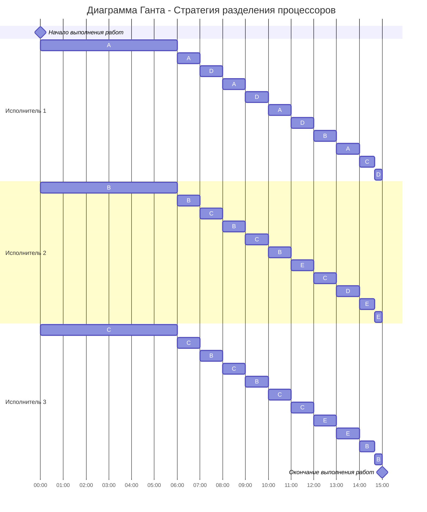

# Задание №12. Вариант 1
## Оптимальное расписание. Стратегия разделения процессоров (пятая модельная задача)
### Постановка задачи:
1. Количество заданий произвольно;
2. Каждое задание имеет свою длительность;
3. Задания независимы и могут выполняться параллельно;
4. Разрешены прерывания при выполнении заданий;
5. Количество работников произвольно и не превышает количество заданий;
6. Работники универсальны в плане выполнения задач - каждый работник может выполнять любую из задач;
7. Производительность работников отличается;
8. Требуется построить расписание выполнения всех заданий в кратчайшие сроки.

### Вариант 1:

| Задания      |  A  |  B  |  C  |  D  |  E  |
|:-------------|:---:|:---:|:---:|:---:|:---:|
| Длительность |  60 |  48 |  36 |  24 |  12 |

| Исполнители           |  1  |  2  |  3  |
|:----------------------|:---:|:---:|:---:|
| Производительность(p) |  6  |  4  |  2  |

### Стратегия разделения процессоров

Длительность оптимального расписания для $k$ исполнителей и $n$ заданий можно рассчитать по формуле:

$$  
T_{min} = \frac {V_1 + V_2 + ... + V_n}{p_1 + p_2 + ... + p_k}  
$$  

где $V_i$ - объем i-го задания, а $p_j$ - производительность j-го исполнителя. Получаем:
$$  
T_{min} = \frac {60 + 48 + 36 + 24 + 12}{6 + 4 + 2} = \frac {180}{12} = 15
$$  

Минимальное время расписания предполагает, что в течении всего времени $T_{min}$ все исполнители будут работать непрерывно (без простоев).

Так как время оптимального расписания рассчитано, необходимо определить над какой задачей и в какое время каждый работник будет работать.

Для описания алгоритма построения оптимального расписания введем понятие **приоритета задания** в определенный момент времени - объем оставшейся части задания, которая в данный момент еще не выполнена. В начальный момент времени приоритет задания соответствует его объему. 

**Основная идея алгоритма**: задания с высоким приоритетом выполняет работник с высокой производительностью.

Шаги алгоритма:
1. Выбрать задания с самым высоким приоритетом (может быть одно задание или несколько заданий с одинаковым приоритетом), назначить на эти задания одного или несколько самых производительных работников. Если остались свободные работники назначить их на задания со следующим приоритетом.
2. Работники выполняют задания до тех пор, пока не наступит одно из событий:
- какое-либо задание будет завершено и освободится исполнитель,
- сравняются приоритеты у каких-то заданий, если до того эти приоритеты были разные, то есть с изменением приоритетов необходимо переназначить работников на задания согласно шагу 1.

## Построение расписания
*Первый час*: 
- 1-й исполнитель с производительностью 6 берёт задачу А с высшим приоритетом 60
- 2-й исполнитель с производительностью 4 берёт задачу В с приоритетом 48
- 3-й исполнитель с производительностью 2 берёт задачу С с приоритетом 36

*Второй час*: А - 54, В - 44, С - 34
- 1-й исполнитель продолжает работать с задачей А 
- 2-й исполнитель продолжает работать с задачей В 
- 3-й исполнитель продолжает работать с задачей С 

Ситуация не будет меняться, пока не сменятся приоритеты:
$$
A - P_1*t = B - P_2*t \\
60 - 6*t = 48 - 4*t \\
2*t = 12
t = 6
$$

*Спустя 6 часов*:
- А - 24, В - 24, С - 24, D - 24, E - 12
- 1-й исполнитель с производительностью 6 берёт задачу А с приоритетом 24
- 2-й исполнитель с производительностью 4 берёт задачу В с приоритетом 24
- 3-й исполнитель с производительностью 2 берёт задачу С с приоритетом 24

***Далее каждый час ситуация будет меняться***

*Спустя 7 часов*:
- А - 18, В - 20, С - 22, D - 24, E - 12
- 1-й исполнитель с производительностью 6 берёт задачу D с приоритетом 24
- 2-й исполнитель с производительностью 4 берёт задачу C с приоритетом 22
- 3-й исполнитель с производительностью 2 берёт задачу B с приоритетом 20

*Спустя 8 часов*:
- А - 18, В - 18, С - 18, D - 18, E - 12
- 1-й исполнитель с производительностью 6 берёт задачу А с приоритетом 18
- 2-й исполнитель с производительностью 4 берёт задачу В с приоритетом 18
- 3-й исполнитель с производительностью 2 берёт задачу С с приоритетом 18

*Спустя 9 часов*:
- А - 12, В - 14, С - 16, D - 18, E - 12
- 1-й исполнитель с производительностью 6 берёт задачу D с приоритетом 18
- 2-й исполнитель с производительностью 4 берёт задачу C с приоритетом 16
- 3-й исполнитель с производительностью 2 берёт задачу B с приоритетом 14

*Спустя 10 часов*:
- А - 12, В - 12, С - 12, D - 12, E - 12
- 1-й исполнитель с производительностью 6 берёт задачу А с приоритетом 12
- 2-й исполнитель с производительностью 4 берёт задачу В с приоритетом 12
- 3-й исполнитель с производительностью 2 берёт задачу С с приоритетом 12

*Спустя 11 часов*:
- А - 6, В - 8, С - 10, D - 12, E - 12
- 1-й исполнитель с производительностью 6 берёт задачу D с приоритетом 12
- 2-й исполнитель с производительностью 4 берёт задачу E с приоритетом 12
- 3-й исполнитель с производительностью 2 берёт задачу С с приоритетом 10

*Спустя 12 часов*:
- А - 6, В - 8, С - 8, D - 6, E - 8
- 1-й исполнитель с производительностью 6 берёт задачу B с приоритетом 8
- 2-й исполнитель с производительностью 4 берёт задачу C с приоритетом 8
- 3-й исполнитель с производительностью 2 берёт задачу E с приоритетом 8

*Спустя 13 часов*:
- А - 6, В - 2, С - 4, D - 6, E - 6
- 1-й исполнитель с производительностью 6 берёт задачу А с приоритетом 6
- 2-й исполнитель с производительностью 4 берёт задачу D с приоритетом 6
- 3-й исполнитель с производительностью 2 берёт задачу E с приоритетом 6

*Спустя 14 часов*:
- А - 0, В - 2, С - 4, D - 2, E - 4
- 1-й исполнитель с производительностью 6 берёт задачу C с приоритетом 4 (выполнит за 40 мин)
- 2-й исполнитель с производительностью 4 берёт задачу E с приоритетом 4
- 3-й исполнитель с производительностью 2 берёт задачу B с приоритетом 2

*Спустя 14 часов 40 минут*:
- А - 0, В = 2 - $\frac{2*4}{6}$ = $\frac{4}{6}$, С - 0, D - 2, E = 4 - $\frac{4*4}{6}$ = $\frac{8}{6}$
- 1-й исполнитель с производительностью 6 берёт задачу D с приоритетом 2 (справится за 20 минут)
- 2-й исполнитель с производительностью 4 берёт задачу E с приоритетом $\frac{8}{6}$ (справится за 20 мин)
- 3-й исполнитель с производительностью 2 берёт задачу B с приоритетом $\frac{4}{6}$ (справится за 20 мин)

Итого: Потребуется 15 часов

## Оптимальное расписание:

