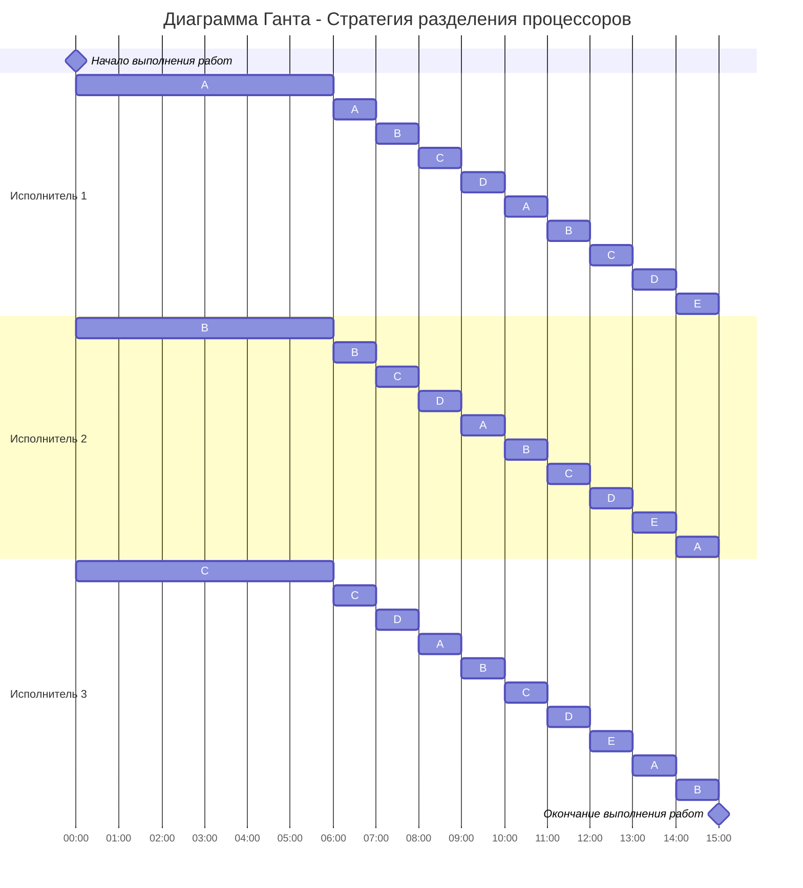

# Задание №12. Вариант 1
## Оптимальное расписание. Стратегия разделения процессоров (пятая модельная задача)
### Постановка задачи:
1. Количество заданий произвольно;
2. Каждое задание имеет свою длительность;
3. Задания независимы и могут выполняться параллельно;
4. Разрешены прерывания при выполнении заданий;
5. Количество работников произвольно и не превышает количество заданий;
6. Работники универсальны в плане выполнения задач - каждый работник может выполнять любую из задач;
7. Производительность работников отличается;
8. Требуется построить расписание выполнения всех заданий в кратчайшие сроки.

### Вариант 1:

| Задания      |  A  |  B  |  C  |  D  |  E  |
|:-------------|:---:|:---:|:---:|:---:|:---:|
| Длительность |  60 |  48 |  36 |  24 |  12 |

| Исполнители           |  1  |  2  |  3  |
|:----------------------|:---:|:---:|:---:|
| Производительность(p) |  6  |  4  |  2  |

### Стратегия разделения процессоров

Длительность оптимального расписания для $k$ исполнителей и $n$ заданий можно рассчитать по формуле:

$$  
T_{min} = \frac {V_1 + V_2 + ... + V_n}{p_1 + p_2 + ... + p_k}  
$$  

где $V_i$ - объем i-го задания, а $p_j$ - производительность j-го исполнителя. Получаем:
$$  
T_{min} = \frac {60 + 48 + 36 + 24 + 12}{6 + 4 + 2} = \frac {180}{12} = 15
$$  

Минимальное время расписания предполагает, что в течении всего времени $T_{min}$ все исполнители будут работать непрерывно (без простоев).

Так как время оптимального расписания рассчитано, необходимо определить над какой задачей и в какое время каждый работник будет работать.

Для описания алгоритма построения оптимального расписания введем понятие **приоритета задания** в определенный момент времени - объем оставшейся части задания, которая в данный момент еще не выполнена. В начальный момент времени приоритет задания соответствует его объему. 

**Основная идея алгоритма**: задания с высоким приоритетом выполняет работник с высокой производительностью.

Шаги алгоритма:
1. Выбрать задания с самым высоким приоритетом (может быть одно задание или несколько заданий с одинаковым приоритетом), назначить на эти задания одного или несколько самых производительных работников. Если остались свободные работники назначить их на задания со следующим приоритетом.
2. Работники выполняют задания до тех пор, пока не наступит одно из событий:
- какое-либо задание будет завершено и освободится исполнитель,
- сравняются приоритеты у каких-то заданий, если до того эти приоритеты были разные, то есть с изменением приоритетов необходимо переназначить работников на задания согласно шагу 1.

## Построение расписания

### Интервал времени с 0 до 6
В начальный момент времени самые высокие приоритеты у заданий A(60), B(48) и C(36). Назначаем на них исполнителей в порядке убывания производительности:
- Исполнитель 1 ($p=6$) $\to$ задание A
- Исполнитель 2 ($p=4$) $\to$ задание B
- Исполнитель 3 ($p=2$) $\to$ задание C

Мы работаем по этой схеме, пока приоритеты не сравняются. Определим время $t$, когда задания сравняются с уровнем следующего по приоритету задания (D = 24):
- Для A: $60 - 6t = 24 \implies 6t = 36 \implies t = 6$
- Для B: $48 - 4t = 24 \implies 4t = 24 \implies t = 6$
- Для C: $36 - 2t = 24 \implies 2t = 12 \implies t = 6$

Состояние на момент $t = 6$:
- A: $60 - (6 \times 6) = 24$
- B: $48 - (4 \times 6) = 24$
- C: $36 - (2 \times 6) = 24$
- D: $24$ (не выполнялось)
- E: $12$ (не выполнялось)

### Интервал времени с 6 до 10
Теперь задания A, B, C, D имеют одинаковый приоритет (24). У нас 3 исполнителя и 4 задания. Чтобы приоритеты оставались равными, нужно распределить суммарную мощность (12) поровну между 4 заданиями. Каждое задание должно получать $12 / 4 = 3$ единицы производительности. 

Работаем, пока приоритеты A, B, C, D не сравняются с E (12). Объем, который нужно выполнить для каждого задания: $24 - 12 = 12$.

При скорости 3 на задание, время составит: $12 / 3 = 4$ единицы времени. Конец интервала: $6 + 4 = 10$.

Распределение работ для диаграммы происходит равномерно между 3-мя исполнителями с условием, что нельзя выполнять одну задачу сразу нескольким исполнителям. Соответственно, каждая из 4-х задач будет выполняться каждым исполнителем по 1ч:
- Исполнитель 1 ($p=6$): A, B, C, D
- Исполнитель 2 ($p=4$): B, C, D, A
- Исполнитель 3 ($p=2$): C, D, A, B

Состояние на момент $t = 10$:
- A: $24 - (6 \times 1) - (4 \times 1) - (2 \times 1) = 12$
- B: $24 - (4 \times 1) - (6 \times 1) - (2 \times 1) = 12$
- C: $24 - (2 \times 1) - (4 \times 1) - (6 \times 1) = 12$
- D: $24 - (2 \times 1) - (4 \times 1) - (6 \times 1) = 12$
- E: $12$ (не выполнялось)

Итого на каждое задание A, B, C, D затрачено по 12 единиц объема за 4 часа.

### Интервал времени с 10 до 15
Все задания A, B, C, D, E имеют равный приоритет (12).Распределяем мощность 12 между 5 заданиями. 

Скорость на задание: $12 / 5 = 2.4$.

Время до завершения: $12 / 2.4 = 5$ единиц времени.

Конец интервала: $10 + 5 = 15$.

Распределение работ для диаграммы происходит равномерно между 3-мя исполнителями с условием, что нельзя выполнять одну задачу сразу нескольким исполнителям. Соответственно, каждая из 5-и задач будет выполняться каждым исполнителем по 1ч:
- Исполнитель 1 ($p=6$): A, B, C, D, E
- Исполнитель 2 ($p=4$): B, C, D, E, A
- Исполнитель 3 ($p=2$): C, D, E, A, B

## Оптимальное расписание:

