Вариант 4

## Оптимальное расписание (стратегия разделения процессоров)

### Исходные данные

Задания:

| Задание      | A  | B  | C  | D  | E  | F  |
| ------------ | -- | -- | -- | -- | -- | -- |
| Длительность | 41 | 35 | 23 | 17 | 14 | 13 |

Исполнители:

| Исполнитель        | 1 | 2 | 3 | 4 |
| ------------------ | - | - | - | - |
| Производительность | 6 | 4 | 2 | 1 |

Задания независимы, прерывания разрешены, каждый исполнитель может выполнять любое задание.

---

## Минимально возможное время выполнения

Сначала найдём нижнюю оценку длительности расписания.  
Минимальное время не может быть меньше, чем общее количество работы, делённое на суммарную производительность исполнителей:

T(min) = (41+35+23+17+14+13) / (6+4+2+1) = 11

Следовательно, быстрее чем за 11 единиц времени выполнить все задания невозможно.  
Если удастся построить расписание длительностью 11, оно будет оптимальным.

---

## Начальное распределение исполнителей

Располагаем задания по убыванию длительности и назначаем наиболее производительных исполнителей самым «длинным» заданиям:

- Исполнитель 1 (p = 6) → задание A (41)  
- Исполнитель 2 (p = 4) → задание B (35)  
- Исполнитель 3 (p = 2) → задание C (23)  
- Исполнитель 4 (p = 1) → задание D (17)  

Задания E и F пока не выполняются.

---

## Первый момент перераспределения (t = 3)

Рассмотрим, когда впервые сравняются оставшиеся объёмы заданий:
(A = B):
41 - 6t = 35 - 4t, t = 3;
(B = C):
35 - 4t = 23 - 2t, t = 6;
(B = D):
35 - 4t = 17 - 1t, t = 6
(C = D):  
23 - 2t = 17 - 1t,  t = 6

| Задание | A   | B   | C   | D   | E   | F   |
| ------- | --- | --- | --- | --- | --- | --- |
| Остаток | 23  | 23  | 17  | 14  | 14  | 13  |

---

## Второй момент перераспределения (t = 2)

Задания A и B объединяются и выполняются совместно исполнителями 1 и 2 с равным разделением времени (по 50% каждому), а также объединяются D и E, которые выполняются исполнителем 4 с равным разделением времени (по 50% каждому). Исполнитель 3 продолжает выполнять задание C в одиночку.
Эффективная производительность на каждое из этих заданий:  

(AB = C):
23 - ((6 + 4) / 2)t = 17 - 2t, t = 2
(C = DE): 
17 - 2t = 14 - (1 / 2)t, t = 6
(DE = F):
14 - (1 / 2)t = 13, t = 2

| Задание | A   | B   | C   | D   | E   | F   |
| ------- | --- | --- | --- | --- | --- | --- |
| Остаток | 13  | 13  | 13  | 13  | 13  | 13  |

Теперь все задания имеют одинаковый приоритет.

## Завершение работ

С момента \( t = 5 \) все исполнители работают поочерёдно над всеми заданиями, деля время поровну.  
Общий объём оставшейся работы: (6 * 13 = 78).  
Суммарная производительность: \(6 + 4 + 2 + 1 = 13\).  
Необходимое время:  
t = 78 / 13 = 6

---

## Диаграмма Ганта

```mermaid
gantt
    title Диаграмма Ганта — Оптимальное расписание (Вариант 4)
    dateFormat  HH:mm
    axisFormat %H:%M

    section Исполнитель 1 (p=6)
    A :00:00, 3h
    A :03:00, 1h
    B :04:00, 1h
    A :05:00, 1h
    B :06:00, 1h
    C :07:00, 1h
    D :08:00, 1h
    E :09:00, 1h
    F :10:00, 1h

    section Исполнитель 2 (p=4)
    B :00:00, 3h
    B :03:00, 1h
    A :04:00, 1h
    B :05:00, 1h
    C :06:00, 1h
    D :07:00, 1h
    E :08:00, 1h
    F :09:00, 1h
    A :10:00, 1h

    section Исполнитель 3 (p=2)
    C :00:00, 3h
    C :03:00, 2h
    C :05:00, 1h
    D :06:00, 1h
    E :07:00, 1h
    F :08:00, 1h
    A :09:00, 1h
    B :10:00, 1h

    section Исполнитель 4 (p=1)
    D :00:00, 3h
    D :03:00, 1h
    E :04:00, 1h
    D :05:00, 1h
    E :06:00, 1h
    F :07:00, 1h
    A :08:00, 1h
    B :09:00, 1h
    C :10:00, 1h
```

