# Задание №12. Вариант 6
# Оптимальное расписание. Стратегия разделения процессоров 
## Задание
Для каждого варианта представлены условия задачи. Для каждой задачи необходимо построить расписание, выполняемое в кратчайшие сроки: 
1. Для решения задачи применить Стратегию разделения процессоров, в решении отобразить ход выполнения алгоритма с **подробными комментариями**.
2. В ответе указать длительность полученного расписания.
3. В ответе вывести полученное расписание в виде диаграммы Ганта.

### Вариант 6:

| Задания      | A  | B  | C  | D  | E |
|:-------------|:--:|:--:|:--:|:--:|:-:|
| Длительность | 41 | 25 | 13 | 11 | 9 |

| Исполнители           |  1  | 2 | 3 |
|:----------------------|:---:|:-:|:-:|
| Производительность(p) |  6  | 2 | 1 |

## Решение

### 1.Расчёт минимальной возможной длительности расписания

#### Сначала найдём теоретический минимум

Суммарный объём работ: 
$V_{sum}$ = 41 + 25 + 13 + 11 + 9 = 99

Суммарная производительность исполнителей: 
$p_{sum}$ = 6 + 2 + 1 = 9

Тогда минимальная возможная длительность:

$$  
T_{min} = \frac {V_1 + V_2 + ... + V_n}{p_1 + p_2 + ... + p_k} = \frac {99}{9} = 11 {единиц} {времени} 
$$  

### 2.Построение оптимального расписания

Приоритет задачи - это просто её оставшийся объём: чем он больше, тем задача важнее и тем скорее её должен делать быстрый исполнитель. Исполнители могут переключаться между задачами, поэтому расписание строится по событиям: от одного момента завершения задачи или изменения приоритетов до следующего

#### 2.1.Интервал времени [0;1.5]

Начальные приоритеты:

| Задача  | Объем |
|:--------|:-----:|
| A       |  41   |
| B       |  25   |
| C       |  13   |
| D       |  11   |
| E       |   9   |

Исполнители по скорости:

| Исполнители        |  1  | 2 | 3 |
|:-------------------|:---:|:-:|:-:|
| Производительность |  6  | 2 | 1 |

Самый высокий приоритет - у задача A, ей назначаем самого быстрого исполнителя 1

Следующий приоритет - у задачи B, ей назначаем исполнителя 2

Следующий приоритет - у задачи С, ей назначаем исполнителя 3

Задачи D,E - не назначаем, все работники заняты

Функции убывания на первом интервале:

1. A = 41 - 6t
2. B = 25 - 2t
3. C = 13 - 1t
4. D = 11 (пока не выполняем) 
5. E = 9 (пока не выполняем) 

Проверим возможные события:

1.Когда A сравняется с B: 41 - 6t = 25 - 2t => 16 = 4t => t = 4

2.Когда A сравняется с D: 41 - 6t = 11 => 30 = 6t => t = 5

3.Когда B сравняется с D: 25 - 2t = 11 => 14 = 2t => t = 7

Поскольку t = 4 < t = 5 и t = 4 < t = 7, первым наступает событие когда A и B сравняются

Далее рассматриваем момент t = 4:

| Задача  | Остаток |
|:--------|:-------:|
| A       |   17    |
| B       |   17    |
| C       |    9    |
| D       |   11    |
| E       |    9    |

#### 2.2.Интервал времени [4; 5.2]

Теперь две задачи A и B имеют одинаковый приоритет 17

Назначаем:
Исполнитель 1 (самый быстрый) → A

Исполнитель 2 → B

Исполнитель 3 → D (так как D=11 > C=9=E=9)

Функции:

1. A = 17 - 6t
2. B = 17 - 2t
3. C = 9
4. D = 11 - 1t
5. E = 9

Проверим события:

Когда A сравняется с D: 17 - 6t = 11 - t => 6 = 5t => t = 1.2

Когда A сравняется с C: 17 - 6t = 9 => 8 = 6t => t ~ 1.333

Первое событие в t = 1.2

Итоговое время: 4 + 1.2 = 5.2

| Задача  | Остаток |
|:--------|:-------:|
| A       |   9.8   |
| B       |  14.6   |
| C       |    9    |
| D       |   9.8   |
| E       |    9    |

#### 2.3.Интервал времени [5.2; 6.16]

Сортируем по приоритетам: B(14.6), A(9.8), D(9.8), C(9), E(9)

Назначаем:

Исполнитель 1 → B

Исполнитель 2 → A

Исполнитель 3 → D

Функции:

B = 14.6 - 6t

A = 9.8 - 2t

D = 9.8 - t

C = 9

E = 9

Проверим события:

Когда B сравняется с D:
14.6 - 6t = 9.8 - t => 4.8 = 5t => t = 0.96

Итоговое время: 5.2 + 0.96 = 6.16

| Задача  | Остаток |
|:--------|:-------:|
| A       |  7.88   |
| B       |  8.84   |
| C       |    9    |
| D       |  8.84   |
| E       |    9    |

#### 2.4.Интервал времени [6.16; 7.66]

Сортируем по приоритетам: C(9), E(9), B(8.84), D(8.84), A(7.88)

Назначаем:

Исполнитель 1 → C

Исполнитель 2 → E

Исполнитель 3 → B

Задача C завершится через: 9/6 = 1.5

Итоговое время: 6.16 + 1.5 = 7.66

| Задача  | Остаток |
|:--------|:-------:|
| A       |  7.88   |
| B       |  7.34   |
| C       |    0    |
| D       |  8.84   |
| E       |    6    |

#### 2.5.Интервал времени [7.66; 11]

Теперь у нас 4 задачи с близкими приоритетами:
A(7.88), B(7.34), D(8.84), E(6)

Суммарный остаток: 7.88 + 7.34 + 8.84 + 6 = 30.06

Суммарная производительность: 6 + 2 + 1 = 9

Время до завершения: 30.06/9 = 3.34

Общее время: 7.66 + 3.34 = 11, что соответствует $T_{min}$

Все задачи завершатся к моменту t = 11

### 3.Диаграмма Ганта

```mermaid
gantt
    title Диаграмма Ганта — Стратегия разделения процессоров, вариант 6
    dateFormat  HH:mm
    axisFormat  %H:%M
    todayMarker off

    Начало работ : milestone, m1, 00:00, 0h
    
    section Исполнитель 1 (p=6)
    Задание A          :a1, 00:00, 4h
    Задание A          :a2, after a1, 1.2h
    Задание B          :a3, after a2, 0.96h
    Задание C          :a4, after a3, 1.5h
    Задание D          :a5, after a4, 0.24h
    Задание D          :a6, after a5, 0.06h
    Задание A          :a7, after a6, 0.05h
    Задание B          :a8, after a7, 1.165h
    Задание E          :a9, after a8, 2.835h
    
    section Исполнитель 2 (p=2)
    Задание B          :b1, 00:00, 4h
    Задание B          :b2, after b1, 1.2h
    Задание A          :b3, after b2, 0.96h
    Задание E          :b4, after b3, 1.5h
    Задание A          :b5, after b4, 0.24h
    Задание A          :b6, after b5, 0.06h
    Задание D          :b7, after b6, 0.05h
    Задание A          :b8, after b7, 2.99h
    
    section Исполнитель 3 (p=1)
    Задание C          :c1, 00:00, 4h
    Задание D          :c2, after c1, 1.2h
    Задание D          :c3, after c2, 0.96h
    Задание B          :c4, after c3, 1.5h
    Задание B          :c5, after c4, 0.24h
    Задание B          :c6, after c5, 0.06h
    Задание B          :c7, after c6, 0.05h
    Задание D          :c8, after c7, 2.99h
    
    Окончание работ : milestone, m2, 11:00, 0h
```

Итог: Получено расписание длительностью 11 единиц времени, что соответствует теоретическому минимуму $T_{min}$. Все исполнители работают непрерывно с полной загрузкой