# Задание №12. Вариант 6
# Оптимальное расписание. Стратегия разделения процессоров 
## Задание
Для каждого варианта представлены условия задачи. Для каждой задачи необходимо построить расписание, выполняемое в кратчайшие сроки: 
1. Для решения задачи применить Стратегию разделения процессоров, в решении отобразить ход выполнения алгоритма с **подробными комментариями**.
2. В ответе указать длительность полученного расписания.
3. В ответе вывести полученное расписание в виде диаграммы Ганта.

### Вариант 6:

| Задания      | A  | B  | C  | D  | E |
|:-------------|:--:|:--:|:--:|:--:|:-:|
| Длительность | 41 | 25 | 13 | 11 | 9 |

| Исполнители           |  1  | 2 | 3 |
|:----------------------|:---:|:-:|:-:|
| Производительность(p) |  6  | 2 | 1 |

## Решение

### 1.Расчёт минимальной возможной длительности расписания

#### Сначала найдём теоретический минимум

Суммарный объём работ: 
$V_{sum}$ = 41 + 25 + 13 + 11 + 9 = 99

Суммарная производительность исполнителей: 
$p_{sum}$ = 6 + 2 + 1 = 9

Тогда минимальная возможная длительность:

$$  
T_{min} = \frac {V_1 + V_2 + ... + V_n}{p_1 + p_2 + ... + p_k} = \frac {99}{9} = 11 {единиц} {времени} 
$$  

### 2.Построение оптимального расписания

Приоритет задачи - это просто её оставшийся объём: чем он больше, тем задача важнее и тем скорее её должен делать быстрый исполнитель. Исполнители могут переключаться между задачами, поэтому расписание строится по событиям: от одного момента завершения задачи или изменения приоритетов до следующего

#### 2.1.Интервал времени [0;2]

Начальные приоритеты:

| Задача  | Объем |
|:--------|:-----:|
| A       |  41   |
| B       |  25   |
| C       |  13   |
| D       |  11   |
| E       |   9   |

Исполнители по скорости:

| Исполнители        |  1  | 2 | 3 |
|:-------------------|:---:|:-:|:-:|
| Производительность |  6  | 2 | 1 |

Самый высокий приоритет - у задача A, ей назначаем самого быстрого исполнителя 1

Следующий приоритет - у задачи B, ей назначаем исполнителя 2

Следующий приоритет - у задачи С, ей назначаем исполнителя 3

Задачи D,E - не назначаем, все работники заняты

Функции убывания на первом интервале:

1. A = 41 - 6t
2. B = 25 - 2t
3. C = 13 - 1t
4. D = 11 (пока не выполняем) 
5. E = 9 (пока не выполняем) 

Проверим возможные события:

1.Когда A сравняется с B: 41 - 6t = 25 - 2t => 16 = 4t => t = 4

2.Когда A сравняется с D: 41 - 6t = 11 => 30 = 6t => t = 5

3.Когда B сравняется с D: 25 - 2t = 11 => 14 = 2t => t = 7

4.Когда C сравняется с D: 13 - t = 11 => t = 2

Поскольку t = 2 минимально, первым наступает событие когда C и D сравняются

Далее рассматриваем момент t = 2:

| Задача  | Остаток |
|:--------|:-------:|
| A       |   29    |
| B       |   21    |
| C       |   11    |
| D       |   11    |
| E       |    9    |

#### 2.2.Интервал времени [2; 4]

Назначаем:
Исполнитель 1 → A

Исполнитель 2 → B

Исполнитель 3 → С + D

Функции:

1. A = 29 - 6t
2. B = 21 - 2t
3. C = 11 - 1/2t
4. D = 11 - 1/2t
5. E = 9

Проверим события:

Когда A сравняется с B: 29 - 6t = 21 - 2t => 8 = 4t => t = 2

Когда C: 11 - 1t = 0 => t = 11

Когда B сравняется с D: 21 - 2t = 11 => t = 5

Первое событие в t = 2

Итоговое время: 2 + 2 = 4

| Задача  | Остаток |
|:--------|:-------:|
| A       |   17    |
| B       |   17    |
| C       |   10    |
| D       |   10    |
| E       |    9    |

#### 2.3.Интервал времени [4; 6]

Теперь две задачи A и B имеют одинаковый приоритет 17

Назначаем:
Исполнитель 1 → A+B

Исполнитель 2 → C+D

Исполнитель 3 → E

Функции:

1. AB = 17 - 4t
3. CD = 10 - 0.5t
5. E = 9 (пока не выполняем)

Проверим события:

Когда AB сравняется с CD: 17 - 4t = 10 - 0.5t => 7 = 3.5t => t = 2

Итоговое время: t=4+2 = 6

| Задача  | Остаток |
|:--------|:-------:|
| A       |    9    |
| B       |    9    |
| C       |    9    |
| D       |    9    |
| E       |    9    |

#### 2.4.Интервал времени [6; 11]

Теперь все 5 задач имеют одинаковый приоритет 9, поэтому распределяем всю суммарную производительность $p_{sum}=9$ поровну между 5 задачами:

Скорость убывания каждой задачи: 9/5 = 1.8

Время до завершения каждой задачи: 9 / 1.8 = 5

Итоговая длительность: $6 + 5 = 11 = T_{min}$

### 3.Диаграмма Ганта

```mermaid
gantt
    title Диаграмма Ганта
    dateFormat  HH:mm
    axisFormat  %H:%M
    todayMarker off

    section Исполнитель 1 (p=6)
    A :00:00, 2h
    A :02:00, 2h
    A :04:00, 1h
    B :05:00, 1h
    A :06:00, 1h
    B :07:00, 1h
    C :08:00, 1h
    D :09:00, 1h
    E :10:00, 1h

    section Исполнитель 2 (p=2)
    B :00:00, 2h
    B :02:00, 2h
    B :04:00, 1h
    A :05:00, 1h
    B :06:00, 1h
    C :07:00, 1h
    D :08:00, 1h
    E :09:00, 1h
    A :10:00, 1h

    section Исполнитель 3 (p=1)
    C :00:00, 2h
    C :02:00, 1h
    D :03:00, 1h
    C :04:00, 1h
    D :05:00, 1h
    C :06:00, 1h
    D :07:00, 1h
    E :08:00, 1h
    A :09:00, 1h
    B :10:00, 1h
```

Итог: Получено расписание длительностью 11 единиц времени, что соответствует теоретическому минимуму $T_{min}$. Все исполнители работают непрерывно с полной загрузкой