# Задание №12. Вариант 8
# Оптимальное расписание. Стратегия разделения процессоров 

### Вариант 8:

| Задания      |  A  |  B  |  C  |  D  |  E  |
|:-------------|:---:|:---:|:---:|:---:|:---:|
| Длительность | 20  |  15 |  15 |  10 | 10  |

| Исполнители           |  1  |  2  |  3  |
|:----------------------|:---:|:---:|:---:|
| Производительность(p) |  5  |  3  |  2  |

## Решение

### 1.Расчёт минимальной возможной длительности расписания

#### Сначала посчитаем теоретический минимум

Суммарный объём работ: 
$V_{sum}$ = 20 + 15 + 15 + 10 + 10 = 70

Суммарная производительность исполнителей: 
$p_{sum}$ = 5 + 3 + 2 = 10

Тогда минимальная возможная длительность:

$$  
T_{min} = \frac {V_1 + V_2 + ... + V_n}{p_1 + p_2 + ... + p_k} = \frac {70}{10} = 7 {единиц} {времени} 
$$  

### 2.Построение оптимального расписания

 Чем больше объем, тем приоритет задачи важнее и тем скорее её должен делать быстрый исполнитель.

Начальные приоритеты:

Исполнители по скорости:
| Задача  | Объем   |
|:--------|:-------:|
| A       |  20     |
| B       |  15     |
| C       |  15     |
| D       |  10     |
| E       |  10     |

Так как у А самый высокий приоритет, то у нее будет исполнитель 1.
Самый высокий приоритет - у задача A, ей назначаем самого быстрого исполнителя 1
Дальше 2 одинаковых приоритета B и C

Исполнители 2 и 3 работают совместно над задачами B, C (p = 3 + 2 = 5)  

Производительность на каждую из задач B и C:

5 / 2 = 2.5

### Функции убывания объёма

- A(t) = 20 − 5t  
- B(t) = 15 − 2.5t  
- C(t) = 15 − 2.5t  
- D(t) = 10  
- E(t) = 10  

### Момент изменения приоритетов

A сравнивается с B и C:

20 − 5t = 15 − 2.5t  
t = 2

B и C сравниваются с D и E:

15 − 2.5t = 10  
t = 2

Следовательно, первое изменение приоритетов происходит при t = 2.

---

### Остаточные объёмы при t = 2

| Задача | Остаток |
|:------:|:-------:|
|   A    |    10   |
|   B    |    10   |  |
|   C    |    10   |
|   D    |    10   |
|   E    |    10   | 

---

## 2.2. Интервал времени [2; 7]

Все задачи имеют одинаковый приоритет.

Суммарная производительность:

p_sum = 10

Производительность на одну задачу:

10 / 5 = 2

Время до завершения каждой задачи:

10 / 2 = 5

Конец выполнения:

2 + 5 = 7 = T_min

Все задачи завершаются одновременно.

## 3. Диаграмма Ганта

```mermaid
gantt
    title Диаграмма Ганта — Стратегия разделения процессоров
    dateFormat  HH:mm
    axisFormat  %H:%M
    todayMarker off

    Начало работ : milestone, m1, 00:00, 0h

    section Исполнитель 1 p - 5
    A :a1, 00:00, 2h
    A :a2, 02:00, 1.5h
    D :a3, 03:30, 1.75h
    E :a4, 05:15, 1.75h

    section Исполнитель 2 p - 3
    B :b1, 00:00, 1h
    C :b2, 01:00, 1h
    B :b3, 02:00, 1.5h
    D :b4, 03:30, 1.75h
    E :b5, 05:15, 1.75h

    section Исполнитель 3 p - 2
    C :c1, 00:00, 1h
    B :c2, 01:00, 1h
    C :c3, 02:00, 1.5h
    D :c4, 03:30, 1.75h
    E :c5, 05:15, 1.75h
    Окончание работ : milestone, m2, 07:00, 0h
```

