1. Для решения задачи применить Стратегию разделения процессоров, в решении отобразить ход выполнения алгоритма с **подробными комментариями**.
2. В ответе указать длительность полученного расписания.
3. В ответе вывести полученное расписание в виде диаграммы Ганта.

### Вариант 2:

| Задания      |  A  |  B  |  C  |  D  |  E  |  F  |  G  |
|:-------------|:---:|:---:|:---:|:---:|:---:|:---:|:---:|
| Длительность |  54 |  37 |  35 |  25 |  19 |  17 |  17 |

| Исполнители           |  1  |  2  |  3  |  4  |
|:----------------------|:---:|:---:|:---:|:---:|
| Производительность(p) |  8  |  4  |  3  |  2  |

### Решение:
1) посчитаем минимальное время:
$t_{min} = \frac{54 + 37 + 35 + 25 + 19 + (17 * 2)}{8 + 4 + 3 + 2} = 12$
3) Выберем задание с наибольшей длительностью это $A = 54$ и назначим на него исполнителя с наивысшей производительностью это исполнитель $1$ с производительностью $8$ далее распределяем по аналогии, т.е.  исп. 2 задание $B$, исп. 3 задание $C$, исп. 4 задание $D$
4) Проследим в какой момент времени уровни длительность задание сравняется. Для этого выясним какие $t$ будут при решении уравнений. Пусть уравнение имеет вид $a - p_1t = b - p_2t$ при $p_1 \neq p_2$, то $t = \frac{a - b}{p_1 - p_2}$, где $a$ и $b$ длительности заданий, а $p_1$ и $p_2$ производительность исполнителей. Таким образом сравняться при $t$ остаточная длительность заданий может в след. случаях: 
- $A = B$, т.е. $\frac{54 - 37}{8 - 4}=4.25$
- $B = C$, т.е. $\frac{37 - 35}{4 - 3}=2$
- $B = D$, т.е. $\frac{37 - 25}{4 - 2}=6$
- $C = D$, т.е. $\frac{35 - 25}{3 - 2}=10$  
Среди них наименьший момент времени $t = 2$. В момент времени $t = 0..2$ ситуация следующая:  

| Задания      | A  | B  | C  | D  |  E  |  F  |  G  |
|:-------------|:--:|:--:|:--:|:--:|:---:|:---:|:---:|
| Длительность | 38 | 29 | 29 | 21 |  19 |  17 |  17 |  

| Исполнители           |  1  |  2  |  3  |  4  |
|:----------------------|:---:|:---:|:---:|:---:|
| Производительность(p) |  8  |  4  |  3  |  2  |

Диаграмма Ганта имеет следующий вид:

| Исполнитель/Время | t = 0..2 |
|-------------------|----------|
| 1 исполнитель     | A = 16   |
| 2 исполнитель     | B = 8    |
| 3 исполнитель     | C = 6    |
| 4 исполнитель     | D = 4    |

В данной ситуации задания $B$ и $С$ сравнялись. Давайте, считать, что вместо них у нас одно задание  $BC$ и один исполнитель с мощностью $\frac{4 + 3}{2} = 3.5$. Из диаграммы выше видно, что ближайшее время наступит через время $t = 1$
- $D = E$, т.е. $\frac{21 - 19}{2}=1$  
Проверим является ли это время наилучшим для выравнивания заданий:
- $A = BC$, т.е. $\frac{38 - 29}{8 - 3.5}=2$ 
- $BC = D$, т.е. $\frac{29 - 21}{3.5 - 2}=5.(3)$

Действительно это время оказалось наименьшим для выравнивания заданий.  
После этого имеем:

| Задания      | A  |  B   |  C   | D |  E  |  F  |  G  |
|:-------------|:--:|:----:|:----:|:--:|:---:|:---:|:---:|
| Длительность | 30 | 25.5 | 25.5 | 19 |  19 |  17 |  17 |

| Исполнители           |  1  |  2  |  3  |  4  |
|:----------------------|:---:|:---:|:---:|:---:|
| Производительность(p) |  8  |  4  |  3  |  2  |

Диаграмма Ганта имеет следующий вид:

| Исполнитель/Время | t = 0..2 | t = 2..3           |
|-------------------|----------|--------------------|
| 1 исполнитель     | A = 16   | A = 8              |
| 2 исполнитель     | B = 8    | B = 3.5 -> C = 3.5 |
| 3 исполнитель     | C = 6    | C = 3.5 -> B = 3.5 |
| 4 исполнитель     | D = 4    | D = 2              |

Разделим исполнителя 4 между двумя заданиями $D$ и $C$, учитывая, что производительность сократиться вдвое до 1. Исполнители $2$ и $3$, совместно выполняют общую объединенную задачу $BC$ (см. пред. шаг). Исполнитель $1$ выполняет задачу $A$, т.к. согласно алгоритму его остаточное время работ наибольшее и единственно. Учитывая это проверим, какое время окажется наибыстрейшим для выравнивания заданий:  
- $A = BC$, т.е. $\frac{30 - 25.5}{8 - 3.5}=1$
- $BC = DE$, т.е. $\frac{25.5 - 19}{3.5 - 1}=2.6$
- $DE = F$, т.е. $19 - 17=2$
Наименьшее время при котором количество времени неких заданий сравняются это 1 и равенство будет у заданий $A$ и $BC$ 

| Задания      | A  |  B   |  C   | D |  E  |  F  |  G  |
|:-------------|:--:|:----:|:----:|:--:|:---:|:---:|:---:|
| Длительность | 22 | 22 | 22 | 18 |  18 |  17 |  17 |

| Исполнители           |  1  |  2  |  3  |  4  |
|:----------------------|:---:|:---:|:---:|:---:|
| Производительность(p) |  8  |  4  |  3  |  2  |

Диаграмма Ганта имеет следующий вид:

| Исполнитель/Время | t = 0..2 | t = 2..3 | t = 3..4           |
|---------------|----------|----------|--------------------|
| 1 исполнитель | A = 16   | A = 8    | A = 8              |
| 2 исполнитель | B = 8    | B = 3.5 -> C = 3.5  | B = 3.5 -> C = 3.5 |
| 3 исполнитель | C = 6    | C = 3.5 -> B = 3.5  | C = 3.5 -> B = 3.5 |
| 4 исполнитель | D = 4    | D = 2    | D = 1 - > E = 1    |

Теперь исполнитель 1 включается в работу между тремя задачами, а именно А, В, С, производительность тогда будет $\frac{8 + 4 + 3}{3}=5$. Посмотрим на наименьшее время при котором достигается равенство заданий:
- $ABC = DE$, т.е. $\frac{22 - 18}{5 - 1}=1$
- $DE = F$, т.е. $18 - 17=1$
Через время $t = 1$ все задания сравняются. В итоге получаем:  

| Задания      | A  |  B   |  C   | D  | E  |  F  |  G  |
|:-------------|:--:|:----:|:----:|:--:|:--:|:---:|:---:|
| Длительность | 17 | 17 | 17 | 17 | 17 |  17 |  17 |

| Исполнители           |  1  |  2  |  3  |  4  |
|:----------------------|:---:|:---:|:---:|:---:|
| Производительность(p) |  8  |  4  |  3  |  2  |

Диаграмма Ганта имеет следующий вид:

| Исполнитель/Время | t = 0..2 | t = 2..3 | t = 3..4           | t = 4..5                 | |
|---------------|----------|----------|--------------------|--------------------------|-|
| 1 исполнитель | A = 16   | A = 8    | A = 8              | A = 5 -> B = 5 -> C = 5  | |
| 2 исполнитель | B = 8    | B = 3.5 -> C = 3.5  | B = 3.5 -> C = 3.5 | B = 5 -> C = 5 -> A = 5  | |
| 3 исполнитель | C = 6    | C = 3.5 -> B = 3.5  | C = 3.5 -> B = 3.5 | C = 5 ->  A = 5 -> B = 5 | |
| 4 исполнитель | D = 4    | D = 2    | D = 1 - > E = 1    | D = 1 -> E = 1           | |

Все задания по количеству времени требуемых для их решения сравнялись. Далее мы распределяем все исполнители по всем заданиям, т.е. $\frac{8 + 4 + 3 + 2}{7} \approx 2.429$  

| Исполнитель/Время | t = 0..2 | t = 2..3 | t = 3..4           | t = 4..5                 | t = 5..12                                                |
|---------------|----------|----------|--------------------|--------------------------|----------------------------------------------------------|
| 1 исполнитель | A = 16   | A = 8    | A = 8              | A = 5 -> B = 5 -> C = 5  | A(2.43)→B(2.43)→C(2.43)→D(2.43)→E(2.43)→F(2.43)→G(2.43)  |
| 2 исполнитель | B = 8    | B = 3.5 -> C = 3.5  | B = 3.5 -> C = 3.5 | B = 5 -> C = 5 -> A = 5  | B(2.43)→C(2.43)→D(2.43)→E(2.43)→F(2.43)→G(2.43)→A(2.43)  |
| 3 исполнитель | C = 6    | C = 3.5 -> B = 3.5  | C = 3.5 -> B = 3.5 | C = 5 ->  A = 5 -> B = 5 | C(2.43)→D(2.43)→E(2.43)→F(2.43)→G(2.43)→A(2.43)→B(2.43)  |
| 4 исполнитель | D = 4    | D = 2    | D = 1 - > E = 1    | D = 1 -> E = 1           | D(2.43)→E(2.43)→F(2.43)→G(2.43)→A(2.43)→B(2.43)→C(2.43)  |

```mermaid
gantt
    title Диаграмма Ганта - Расписание заданий
    dateFormat HH:mm
    axisFormat %H:%M
    
    section Исполнитель 1 (p=8)
    Задание A :00:00, 2h
    Задание A :02:00, 1h
    Задание A :03:00, 1h
    Задание A (1/3 интервала) :04:00, 20m
    Задание B (1/3 интервала) :04:20, 20m
    Задание C (1/3 интервала) :04:40, 20m
    A→B→C→D→E→F→G (по 2.43 ч) :05:00, 7h
    
    section Исполнитель 2 (p=4)
    Задание B :00:00, 2h
    Задание B (1/2 интервала) :02:00, 30m
    Задание C (1/2 интервала) :02:30, 30m
    Задание B (1/2 интервала) :03:00, 30m
    Задание C (1/2 интервала) :03:30, 30m
    Задание B (1/3 интервала) :04:00, 20m
    Задание C (1/3 интервала) :04:20, 20m
    Задание A (1/3 интервала) :04:40, 20m
    B→C→D→E→F→G→A (по 2.43 ч) :05:00, 7h
    
    section Исполнитель 3 (p=3)
    Задание C :00:00, 2h
    Задание C (1/2 интервала) :02:00, 30m
    Задание B (1/2 интервала) :02:30, 30m
    Задание C (1/2 интервала) :03:00, 30m
    Задание B (1/2 интервала) :03:30, 30m
    Задание C (1/3 интервала) :04:00, 20m
    Задание A (1/3 интервала) :04:20, 20m
    Задание B (1/3 интервала) :04:40, 20m
    C→D→E→F→G→A→B (по 2.43 ч) :05:00, 7h
    
    section Исполнитель 4 (p=2)
    Задание D :00:00, 2h
    Задание D :02:00, 1h
    Задание D (1/2 интервала) :03:00, 30m
    Задание E (1/2 интервала) :03:30, 30m
    Задание D (1/2 интервала) :04:00, 30m
    Задание E (1/2 интервала) :04:30, 30m
    D→E→F→G→A→B→C (по 2.43 ч) :05:00, 7h
```

