# Задание №12: Оптимальное расписание
## Стратегия разделения процессоров

### Вариант 5:

| Задания      |  A  |  B  |  C  |  D  |  E  |
|:-------------|:---:|:---:|:---:|:---:|:---:|
| Длительность |  40 |  30 |  20 |  10 |  5  |

| Исполнители           |  1  |  2  |  3  |
|:----------------------|:---:|:---:|:---:|
| Производительность(p) |  4  |  2  |  1  |

---

## Решение:

### 1) Расчет минимального времени выполнения:

По формуле оптимального расписания:

$$T_{min} = \frac{40 + 30 + 20 + 10 + 5}{4 + 2 + 1} = \frac{105}{7} = 15$$

**Минимальное время выполнения всех заданий: 15 единиц времени.**

---

### 2) Построение оптимального расписания:

#### **Шаг 1: Начальное распределение (t = 0)**

Выбираем задания с наибольшим приоритетом и назначаем на них самых производительных исполнителей:
- **Исполнитель 1** (p=4) -> Задание A (приоритет 40)
- **Исполнитель 2** (p=2) -> Задание B (приоритет 30)
- **Исполнитель 3** (p=1) -> Задание C (приоритет 20)

Определяем момент времени, когда приоритеты заданий сравняются. Используем формулу: при уравнении вида $a - p_1t = b - p_2t$ (где $p_1 \neq p_2$), время сравнивания:

$$t = \frac{a - b}{p_1 - p_2}$$

Проверяем все возможные комбинации:
- $A = B$: $t = \frac{40 - 30}{4 - 2} = \frac{10}{2} = 5$
- $A = C$: $t = \frac{40 - 20}{4 - 1} = \frac{20}{3} = 6.67$
- $B = C$: $t = \frac{30 - 20}{2 - 1} = \frac{10}{1} = 10$

**Наименьшее время: t = 5**

В момент времени **t = 0..5** работа распределяется следующим образом:

| Задания      |  A  |  B  |  C  |  D  |  E  |
|:-------------|:---:|:---:|:---:|:---:|:---:|
| Остаток      | 20  | 20  | 15  | 10  |  5  |

Объем выполненной работы:

| Исполнитель/Время | t = 0..5 |
|-------------------|----------|
| 1 исполнитель     | A = 20   |
| 2 исполнитель     | B = 10   |
| 3 исполнитель     | C = 5    |

---

#### **Шаг 2: Первое сравнивание приоритетов (t = 5)**

Задания **A** и **B** сравнялись по приоритету (обе имеют остаток 20). Согласно алгоритму, теперь **исполнители 1 и 2** работают над A и B, распределяя время между ними поровну, чтобы сохранить их приоритеты равными. **Исполнитель 3** продолжает работать только над C.

Распределение работы:
- **Исполнитель 1**: половину времени на A, половину на B (каждое со скоростью 2)
- **Исполнитель 2**: половину времени на B, половину на A (каждое со скоростью 1)
- **Исполнитель 3**: весь на C (со скоростью 1)

Суммарная скорость выполнения:
- A: 2 + 1 = 3
- B: 2 + 1 = 3
- C: 1

Ищем следующий момент сравнивания приоритетов:
- $AB = C$: $t = \frac{20 - 15}{3 - 1} = \frac{5}{2} = 2.5$

**Следующее событие через t = 2.5** (общее время: 7.5)

В момент времени **t = 5..7.5**:

| Задания      |  A   |  B   |  C   |  D  |  E  |
|:-------------|:----:|:----:|:----:|:---:|:---:|
| Остаток      | 12.5 | 12.5 | 12.5 | 10  |  5  |

Объем выполненной работы:

| Исполнитель/Время | t = 0..5 | t = 5..7.5                    |
|-------------------|----------|-------------------------------|
| 1 исполнитель     | A = 20   | A (1/2) = 5 → B (1/2) = 5     |
| 2 исполнитель     | B = 10   | B (1/2) = 2.5 → A (1/2) = 2.5 |
| 3 исполнитель     | C = 5    | C = 2.5                       |

---

#### **Шаг 3: Второе сравнивание приоритетов (t = 7.5)**

Задания A, B и C теперь сравнялись (все имеют остаток 12.5). Теперь все три исполнителя работают над A, B и C, деля своё время поровну между этими тремя заданиями (по 1/3 времени на каждое).

Суммарная скорость выполнения каждого из заданий A, B, C:
$${ABC} = \frac{4}{3} + \frac{2}{3} + \frac{1}{3} = \frac{7}{3} = 2.33$$

Следующее по приоритету задание: D (остаток 10).

Определяем, когда приоритет ABC сравняется с D:
$$12.5 - \frac{7}{3}t = 10$$
$$\frac{7}{3}t = 2.5$$
$$t = \frac{2.5 * 3}{7} = \frac{7.5}{7} = 1.07$$

**Следующее событие через t = 1.07** (общее время: 8.57)

В момент времени **t = 7.5..8.57**:

| Задания      |  A  |  B  |  C  |  D  |  E  |
|:-------------|:---:|:---:|:---:|:---:|:---:|
| Остаток      | 10  | 10  | 10  | 10  |  5  |

Объем выполненной работы:

| Исполнитель/Время | t = 0..5 | t = 5..7.5                    | t = 7.5..8.57                                      |
|-------------------|----------|-------------------------------|----------------------------------------------------|
| 1 исполнитель     | A = 20   | A (1/2) = 5 → B (1/2) = 5     | A (1/3) = 1.43 → B (1/3) = 1.43 → C (1/3) = 1.43   |
| 2 исполнитель     | B = 10   | B (1/2) = 2.5 → A (1/2) = 2.5 | B (1/3) = 0.71 → C (1/3) = 0.71 → A (1/3) = 0.71   |
| 3 исполнитель     | C = 5    | C = 2.5                       | C (1/3) = 0.36 → A (1/3) = 0.36 → B (1/3) = 0.36   |

---

#### **Шаг 4: Третье сравнивание приоритетов (t = 8.57)**

Задания A, B, C и D сравнялись (все имеют остаток 10). Теперь все три исполнителя работают над A, B, C и D, деля своё время поровну между этими четырьмя заданиями (по 1/4 времени на каждое).

Суммарная скорость выполнения каждого из заданий A, B, C, D:
$${ABCD} = \frac{4}{4} + \frac{2}{4} + \frac{1}{4} = \frac{7}{4} = 1.75$$

Следующее задание: E (остаток 5).

Определяем, когда приоритет ABCD сравняется с E:
$$10 - 1.75t = 5$$
$$1.75t = 5$$
$$t = \frac{5}{1.75} = 2.86$$

**Следующее событие через t = 2.86** (общее время: 11.43)

В момент времени **t = 8.57..11.43**:

| Задания      |  A  |  B  |  C  |  D  |  E  |
|:-------------|:---:|:---:|:---:|:---:|:---:|
| Остаток      |  5  |  5  |  5  |  5  |  5  |

Объем выполненной работы:

| Исполнитель/Время | t = 0..5 | t = 5..7.5                    | t = 7.5..8.57                                      | t = 8.57..11.43                                                      |
|-------------------|----------|-------------------------------|----------------------------------------------------|----------------------------------------------------------------------|
| 1 исполнитель     | A = 20   | A (1/2) = 5 → B (1/2) = 5     | A (1/3) = 1.43 → B (1/3) = 1.43 → C (1/3) = 1.43   | A (1/4) = 2.86 → B (1/4) = 2.86 → C (1/4) = 2.86 → D (1/4) = 2.86    |
| 2 исполнитель     | B = 10   | B (1/2) = 2.5 → A (1/2) = 2.5 | B (1/3) = 0.71 → C (1/3) = 0.71 → A (1/3) = 0.71   | B (1/4) = 1.43 → C (1/4) = 1.43 → D (1/4) = 1.43 → A (1/4) = 1.43    |
| 3 исполнитель     | C = 5    | C = 2.5                       | C (1/3) = 0.36 → A (1/3) = 0.36 → B (1/3) = 0.36   | C (1/4) = 0.71 → D (1/4) = 0.71 → A (1/4) = 0.71 → B (1/4) = 0.71    |

---

#### **Шаг 5: Финальное сравнивание (t = 11.43)**

Все задания A, B, C, D и E сравнялись (все имеют остаток 5). Теперь все исполнители распределяются между всеми заданиями, деля своё время поровну между пятью заданиями (по 1/5 времени на каждое).

Суммарная скорость выполнения каждого из всех заданий:
$${ABCDE} = \frac{4}{5} + \frac{2}{5} + \frac{1}{5} = \frac{7}{5} = 1.4$$

Время до завершения всех заданий:
$$t = \frac{5}{1.4} = 3.57$$

**Общее время: 11.43 + 3.57 = 15**

#### Детальная таблица работы исполнителей:

| Исполнитель/Время | t = 0..5 | t = 5..7.5                                | t = 7.5..8.57                                           | t = 8.57..11.43                                                   | t = 11.43..15                                    |
|-------------------|----------|-------------------------------------------|---------------------------------------------------------|-------------------------------------------------------------------|--------------------------------------------------|
| 1 исполнитель     | A = 20   | A (1/2) = 5 → B (1/2) = 5                 | A (1/3) = 1.43 → B (1/3) = 1.43 → C (1/3) = 1.43        | A (1/4) = 2.86 → B (1/4) = 2.86 → C (1/4) = 2.86 → D (1/4) = 2.86 | A→B→C→D→E (≈ 43 мин каждое)                        |
| 2 исполнитель     | B = 10   | B (1/2) = 2.5 → A (1/2) = 2.5             | B (1/3) = 0.71 → C (1/3) = 0.71 → A (1/3) = 0.71        | B (1/4) = 1.43 → C (1/4) = 1.43 → D (1/4) = 1.43 → A (1/4) = 1.43 | B→C→D→E→A (≈ 43 мин каждое)                        |
| 3 исполнитель     | C = 5    | C = 2.5                                   | C (1/3) = 0.36 → A (1/3) = 0.36 → B (1/3) = 0.36        | C (1/4) = 0.71 → D (1/4) = 0.71 → A (1/4) = 0.71 → B (1/4) = 0.71 | C→D→E→A→B (≈ 43 мин каждое)                        |

- **t = 5..7.5**: Исполнители 1 и 2 делят время между A и B (которые сравнялись), исполнитель 3 продолжает только C
- **t = 7.5..8.57**: Все три исполнителя делят время между A, B и C (которые сравнялись)
- **t = 8.57..11.43**: Все три исполнителя делят время между A, B, C и D (которые сравнялись)
- **t = 11.43..15**: Все исполнители равномерно распределены между всеми пятью заданиями

---

## 3) Результат:

**Длительность оптимального расписания: 15 единиц времени**

---

## 4) Диаграмма Ганта:

```mermaid
gantt
    title Диаграмма Ганта - Стратегия разделения процессоров (Вариант 5)
    dateFormat HH:mm
    axisFormat %H:%M
    todayMarker off
    Начало работ : milestone, m1, 00:00, 0h
    
    section Исполнитель 1
    A          :a1, 00:00, 5h
    A          :a2, 05:00, 1.25h
    B          :a3, 06:15, 1.25h
    A          :a4, 07:30, 0.35h
    B          :a5, 07:51, 0.37h
    C          :a6, 08:13, 0.35h
    A          :a7, 08:34, 0.72h
    B          :a8, 09:17, 0.72h
    C          :a9, 10:00, 0.72h
    D          :a10, 10:43, 0.72h
    A          :a11, 11:26, 0.72h
    B          :a12, 12:09, 0.72h
    C          :a13, 12:52, 0.72h
    D          :a14, 13:35, 0.72h
    E          :a15, 14:18, 0.7h
    
    section Исполнитель 2
    B          :b1, 00:00, 5h
    B          :b2, 05:00, 1.25h
    A          :b3, 06:15, 1.25h
    B          :b4, 07:30, 0.35h
    C          :b5, 07:51, 0.37h
    A          :b6, 08:13, 0.35h
    B          :b7, 08:34, 0.72h
    C          :b8, 09:17, 0.72h
    D          :b9, 10:00, 0.72h
    A          :b10, 10:43, 0.72h
    B          :b11, 11:26, 0.72h
    C          :b12, 12:09, 0.72h
    D          :b13, 12:52, 0.72h
    E          :b14, 13:35, 0.72h
    A          :b15, 14:18, 0.7h
    
    section Исполнитель 3
    C          :c1, 00:00, 5h
    C          :c2, 05:00, 2.5h
    C          :c3, 07:30, 0.35h
    A          :c4, 07:51, 0.37h
    B          :c5, 08:13, 0.35h
    C          :c6, 08:34, 0.72h
    D          :c7, 09:17, 0.72h
    A          :c8, 10:00, 0.72h
    B          :c9, 10:43, 0.72h
    C          :c10, 11:26, 0.72h
    D          :c11, 12:09, 0.72h
    E          :c12, 12:52, 0.72h
    A          :c13, 13:35, 0.72h
    B          :c14, 14:18, 0.7h
    Окончание работ : milestone, m2, 15:00, 0h
```

