# Задание №12
# Оптимальное расписание. Стратегия разделения процессоров 
## Задание
Для каждого варианта представлены условия задачи. Для каждой задачи необходимо построить расписание, выполняемое в кратчайшие сроки: 
1. Для решения задачи применить Стратегию разделения процессоров, в решении отобразить ход выполнения алгоритма с **подробными комментариями**.
2. В ответе указать длительность полученного расписания.
3. В ответе вывести полученное расписание в виде диаграммы Ганта.

### Вариант 3:

| Задания      |  A  |  B  |  C  |  D  |  E  |
|:-------------|:---:|:---:|:---:|:---:|:---:|
| Длительность |  18 |  12 |  12 |  12 |  6  |

| Исполнители           |  1  |  2  |  3  |
|:----------------------|:---:|:---:|:---:|
| Производительность(p) |  6  |  4  |  2  |

## Решение

### 1.Расчёт минимальной возможной длительности расписания

#### Сначала найдём теоретический минимум

Суммарный объём работ: 
$V_{sum}$ = 18 + 12 + 12 + 12 + 6 = 60

Суммарная производительность исполнителей: 
$p_{sum}$ = 6 + 4 + 2 = 12

Тогда минимальная возможная длительность:

$$  
T_{min} = \frac {V_1 + V_2 + ... + V_n}{p_1 + p_2 + ... + p_k} = \frac {60}{12} = 5 {единиц} {времени} 
$$  

### 2.Построение оптимального расписания

Приоритет задачи - это просто её оставшийся объём: чем он больше, тем задача важнее и тем скорее её должен делать быстрый исполнитель. Исполнители могут переключаться между задачами, поэтому расписание строится по событиям: от одного момента завершения задачи или изменения приоритетов до следующего

#### 2.1.Интервал времени [0;3]

Начальные приоритеты совпадают с объёмами:

| Задача  | Время  |
|:--------|:-------:|
| A       |  18     |
| B       |  12     |
| C       |  12     |
| D       |  12     |
| E       |  6      |

Самая большая задача - А

Далее идут задачи B, C и D, последняя - Е

Исполнители по скорости:

| Исполнители        |  1  |  2  |  3  |
|:-------------------|:---:|:---:|:---:|
| Производительность |  6  |  4  |  2  |

Самые быстрые исполнители должны взять самые большие задачи:

| Порядок                   |  Задача    |
|:--------------------------|:----------:|
| Исполнитель 1             |  Задача A  |
| Исполнитель 2             |  Задача B  |
| Исполнитель 3             |  Задача C  |

Задачи D и E пока не берем

##### Как уменьшаются объёмы:

1. A = 18 - 6t
2. B = 12 - 4t
3. C = 12 - 2t

Смотрим, кто закончится первым:

1. А: 18 - 6t = 0 => t = 3 (закончится)
2. В: 12 - 4t = 0 => t = 3 (закончится)
3. С: 12 - 2t = 0 => t = 6

Значит первое событие - момент t = 3, когда одновременно завершаются A и B

Остатки к этому времени:

| Задача  | Время                 |
|:--------|:---------------------:|
| A       |  0 (готово)           |
| B       |  0 (готово)           |
| C       |  12 - 2 * 3 = 6       |
| D       |  12 (еще не начали)   |
| E       |  6 (еще не начали)    |

#### 2.2.Интервал времени [3; 4.5]

Теперь приоритеты такие:

| Задача  | Остаток  |
|:--------|:--------:|
| D       |  12      | 
| C       |  6       |
| E       |  6       |

Самый большой приоритет у D, поэтому распределяем так:

| Исполнитель               |  Задача    |
|:--------------------------|:----------:|
| Исполнитель 1             |  Задача D  |
| Исполнитель 2             |  Задача C  |
| Исполнитель 3             |  Задача E  |

Как уменьшаются остатки:

1. D = 12 - 6t
2. С = 6 - 4t
3. E = 6 - 2t

Смотрим, что закончится первым:

1. С = 6 - 4t = 0 => t = 1.5
2. D = 12 - 6t = 0 => t = 2
3. E = 6 - 2t = 0 => t = 3

То есть первой закончится C, через 1.5 единицы времени

Следующее событие наступает в момент: t = 3 + 1.5 = 4.5

Остатки к этому моменту:

1. С = 6 - 4 * 1.5 = 0
2. D = 12 - 6 * 1.5 = 3
3. E = 6 - 2 * 1.5 = 3

Осталось две задачи одинакового размера: D и E (по 3)

#### 2.3.Интервал времени [4.5; 5]

До $T_{min}$ осталось: 5 - 4.5 = 0.5

За это время трое исполнителей с суммарной производительностью 12 смогут сделать: 
12 * 0.5 = 6, a у нас как раз осталось 6 единиц работы (3 по D и 3 по E)

Приоритеты одинаковые, поэтому распределяем так:

| Исполнитель               |  Задача    |
|:--------------------------|:----------:|
| Исполнитель 1             |  Задача D  |
| Исполнители 2 и 3         |  Задача E  |

Тогда:

Испольнитель 1: D = 6 * 0.5 = 3 => 0 (задача завершается)

Испольнитель 2 и 3: E = (4+2) * 0.5 = 3 => 0 (задача завершается)

#### К моменту t = 5 все задачи A, B, C, D, E выполнены

### 3.Диаграмма Ганта

```mermaid
gantt
    title Диаграмма Ганта — Стратегия разделения процессоров, вариант 3
    dateFormat  HH:mm
    axisFormat  %H:%M
    todayMarker off

    Начало работ : milestone, m1, 00:00, 0h

    section Исполнитель 1 
    A         :a1, 00:00, 3h
    D         :a2, 03:00, 1.5h
    D         :a3, 04:30, 0.5h

    section Исполнитель 2 
    B         :b1, 00:00, 3h
    C         :b2, 03:00, 1.5h
    E         :b3, 04:30, 0.5h

    section Исполнитель 3
    C         :c1, 00:00, 3h
    E         :c2, 03:00, 1.5h
    E         :c3, 04:30, 0.5h

    Окончание работ : milestone, m2, 05:00, 0h
```

