# Задание №12. Вариант 3
# Оптимальное расписание. Стратегия разделения процессоров 
## Задание
Для каждого варианта представлены условия задачи. Для каждой задачи необходимо построить расписание, выполняемое в кратчайшие сроки: 
1. Для решения задачи применить Стратегию разделения процессоров, в решении отобразить ход выполнения алгоритма с **подробными комментариями**.
2. В ответе указать длительность полученного расписания.
3. В ответе вывести полученное расписание в виде диаграммы Ганта.

### Вариант 3:

| Задания      |  A  |  B  |  C  |  D  |  E  |
|:-------------|:---:|:---:|:---:|:---:|:---:|
| Длительность |  18 |  12 |  12 |  12 |  6  |

| Исполнители           |  1  |  2  |  3  |
|:----------------------|:---:|:---:|:---:|
| Производительность(p) |  6  |  4  |  2  |

## Решение

### 1.Расчёт минимальной возможной длительности расписания

#### Сначала найдём теоретический минимум

Суммарный объём работ: 
$V_{sum}$ = 18 + 12 + 12 + 12 + 6 = 60

Суммарная производительность исполнителей: 
$p_{sum}$ = 6 + 4 + 2 = 12

Тогда минимальная возможная длительность:

$$  
T_{min} = \frac {V_1 + V_2 + ... + V_n}{p_1 + p_2 + ... + p_k} = \frac {60}{12} = 5 {единиц} {времени} 
$$  

### 2.Построение оптимального расписания

Приоритет задачи - это просто её оставшийся объём: чем он больше, тем задача важнее и тем скорее её должен делать быстрый исполнитель. Исполнители могут переключаться между задачами, поэтому расписание строится по событиям: от одного момента завершения задачи или изменения приоритетов до следующего

#### 2.1.Интервал времени [0;1.5]

Начальные приоритеты:

| Задача  | Объем   |
|:--------|:-------:|
| A       |  18     |
| B       |  12     |
| C       |  12     |
| D       |  12     |
| E       |  6      |

Исполнители по скорости:

| Исполнители        |  1  |  2  |  3  |
|:-------------------|:---:|:---:|:---:|
| Производительность |  6  |  4  |  2  |

Самый высокий приоритет - у задача A, ей назначаем самого быстрого исполнителя 1

Следующий приоритет - у трёх задачи B, C, D

Исполнители 2 и 3 работают совместно над задачами B, C, D

Их суммарная производительность: 4 + 2 = 6

Чтобы сохранить равные приоритеты B, C, D, делим 6 поровну: 6 / 3 = 2

Функции убывания на первом интервале:

1. A = 18 - 6t
2. B = 12 - 2t
3. C = 12 - 2t
4. D = 12 - 2t
5. E = 6 (пока не выполняем) 

Проверим два возможных события:

1.Когда A сравняется с задачами B, C, D:

18 - 6t = 12 - 2t 

6 = 4t => t = 1.5

2.Когда задачи B,C,D сравняются с E:

12 - 2t = 6

2t = 6 => t = 3

Поскольку t = 1.5 < t = 3, первым наступает событие выравнивания приоритетов A и B, C, D

Поэтому далее рассматриваем момент t = 1.5:

| Задача  | Остаток |
|:--------|:-------:|
| A       |  9      |
| B       |  9      |
| C       |  9      |
| D       |  9      |
| E       |  6      |

#### 2.2.Интервал времени [1.5; 2.5]

Теперь четыре задачи A, B, C, D имеют одинаковый приоритет 9

Все исполнители работают на группу A, B, C, D

Суммарная производительность: 6 + 4 + 2 = 12

Четыре задачи, где каждая убывает со скоростью: 12 / 4 = 3

Функции:

1. A = 9 - 3t
2. B = 9 - 3t
3. C = 9 - 3t
4. D = 9 - 3t
5. E = 6 

Следующее событие - когда A,B,C,D догонят E:

9 - 3t = 6 

3t = 3 => t = 1

Значит событие в момент: t = 1.5 + 1 = 2.5

| Задача  | Остаток |
|:--------|:-------:|
| A       |  6      |
| B       |  6      |
| C       |  6      |
| D       |  6      |
| E       |  6      |

#### 2.3.Интервал времени [2.5; 5]

Теперь 5 задач и суммарная скорость 12 (6 + 4 + 2)

Если разделить производительность поровну между всеми задачами, каждая будет убывать со скоростью: 

12 / 5 = 2.4

Время до завершения: 6 / 2.4 = 2.5

Тогда: 2.5 + 2.5 = 5 = $T_{min}$

То есть все задачи A, B, C, D, E завершаются ровно к моменту t = 5

### 3.Диаграмма Ганта

```mermaid
gantt
    title Диаграмма Ганта — Стратегия разделения процессоров, вариант 3
    dateFormat  HH:mm
    axisFormat  %H:%M
    todayMarker off

    Начало работ : milestone, m1, 00:00, 0h
    section Исполнитель 1
    A          :a1, 00:00, 1.5h

    A          :a2, 01:30, 0.25h
    B          :a3, 01:45, 0.25h
    C          :a4, 02:00, 0.25h
    D          :a5, 02:15, 0.25h

    A          :a6, 02:30, 0.5h
    B          :a7, 03:00, 0.5h
    C          :a8, 03:30, 0.5h
    D          :a9, 04:00, 0.5h
    E          :a10, 04:30, 0.5h

    section Исполнитель 2
    B          :b1, 00:00, 0.5h
    C          :b2, 00:30, 0.5h
    D          :b3, 01:00, 0.5h

    A          :b4, 01:30, 0.25h
    B          :b5, 01:45, 0.25h
    C          :b6, 02:00, 0.25h
    D          :b7, 02:15, 0.25h

    A          :b8, 02:30, 0.5h
    B          :b9, 03:00, 0.5h
    C          :b10, 03:30, 0.5h
    D          :b11, 04:00, 0.5h
    E          :b12, 04:30, 0.5h

    section Исполнитель 3
    B          :c1, 00:00, 0.5h
    C          :c2, 00:30, 0.5h
    D          :c3, 01:00, 0.5h

    A          :c4, 01:30, 0.25h
    B          :c5, 01:45, 0.25h
    C          :c6, 02:00, 0.25h
    D          :c7, 02:15, 0.25h

    A         :c8, 02:30, 0.5h
    B         :c9, 03:00, 0.5h
    C         :c10, 03:30, 0.5h
    D         :c11, 04:00, 0.5h
    E         :c12, 04:30, 0.5h
    Окончание работ : milestone, m2, 05:00, 0h
```

