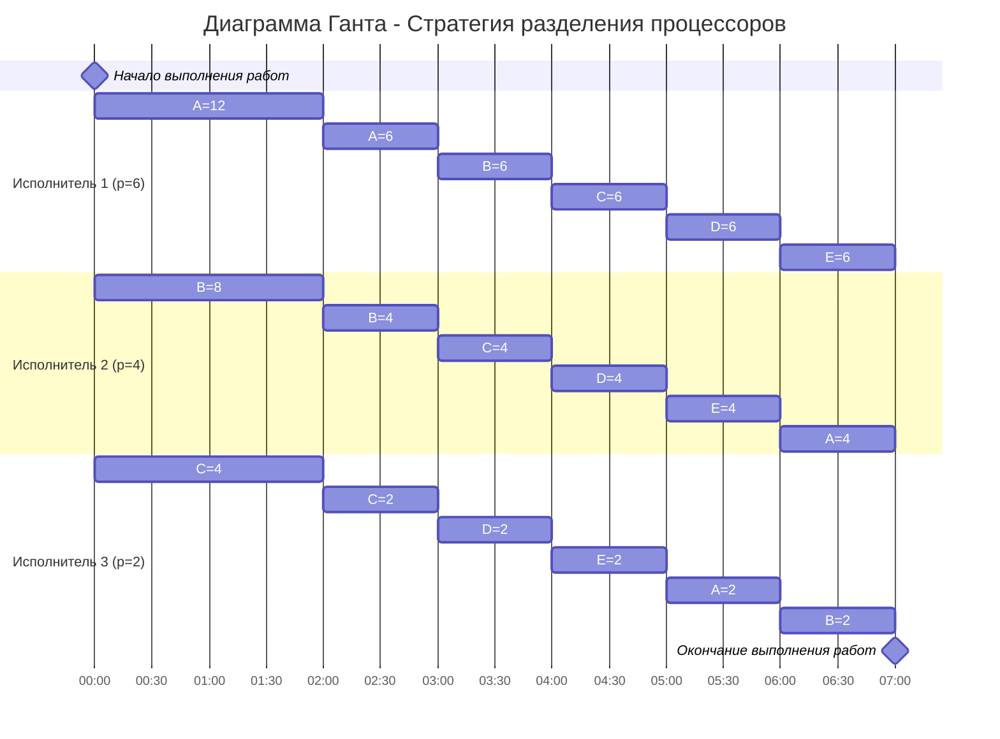

# Оптимальное расписание. Стратегия разделения процессоров 

Необходимо построить расписание, выполняемое в кратчайшие сроки: 
1. Для решения задачи применить Стратегию разделения процессоров, в решении отобразить ход выполнения алгоритма с **подробными комментариями**.
2. В ответе указать длительность полученного расписания.
3. В ответе вывести полученное расписание в виде диаграммы Ганта.

---
### Вариант 9:

| Задания      |  A  |  B  |  C  |  D  |  E  |
|:-------------|:---:|:---:|:---:|:---:|:---:|
| Длительность | 24  |  20 |  16 |  12 | 12  |

| Исполнители           |  1  |  2  |  3  |
|:----------------------|:---:|:---:|:---:|
| Производительность(p) |  6  |  4  |  2  |
---
### Решение

1. Определим длительность оптимального расписания:

$$
T_{min} = \dfrac{24 + 20 + 16 + 12 + 12}{6 + 4 + 2} = \frac{84}{12} = 7 ед.
$$

  Это минимальное время, за которое могут быть выполнены все задачи, если исполнители будут работать без перерывов.

2. Согласно стратегии разделения процессоров, самые приоритетные задания (с самым большим оставшимся объёмом) следует назначать исполнителям с высокой производительностью. Тогда назначим задачи A, B и C исполнителям 1, 2 и 3 соответственно.
3. Теперь определим момент, в который приоритеты задач сравняются и их необходимо будет переназначить. Для каждой из выполняемых задач запишем формулы для определения оставшегося объёма работы:

$$
\begin{aligned}
A :& 24 - 6t,\\
B :& 20 - 4t,\\
C :& 16 - 2t.
\end{aligned}
$$

Тогда приоритеты задач A и B сравняются в момент времени:

$$
24-6t = 20-4t \quad \Rightarrow \quad t_{AB} = 2.
$$

Для задач B и C:

$$
20-4t = 16-2t \quad \Rightarrow \quad t_{BC} = 2.
$$

Рассчитаем оставшиеся объёмы в момент времени $t=2$:

$$
\begin{aligned}
A :& 24 - 6 \cdot 2 = 12,\\
B :& 20 - 4 \cdot 2 = 12,\\
C :& 16 - 2 \cdot 2 = 12.
\end{aligned}
$$

Получаем, что приоритеты всех 5 задач стали одинаковы. 

4. Так как все задачи имеют одинаковый приоритет, а их количество превышает количество исполнителей, то начиная с момента $t=2$ все они будут выполнять задания поочерёдно. Запишем уравнение для определения момента времени, когда оставшийся объём каждой задачи станет равным нулю при средней производительности исполнителей $\frac{6+4+2}{5}=\frac{12}{5}$:

$$
12 - \frac{12}{5}t = 0,
$$ 

откуда $t=5$. Следовательно, в момент времени $2+5=7$ все задачи будут выполнены.

Ответ: оптимальное расписание представлено в виде диаграммы Ганта, его длительность составляет 7 ед., и это время минимально.

