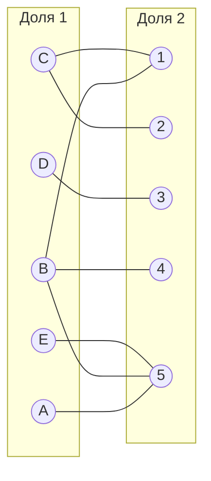
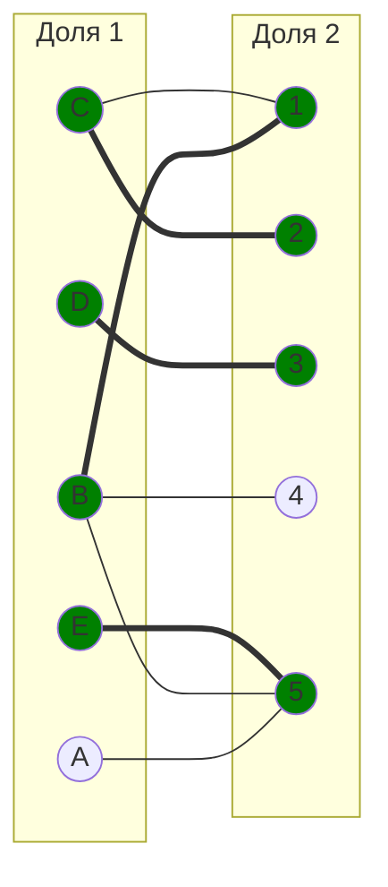
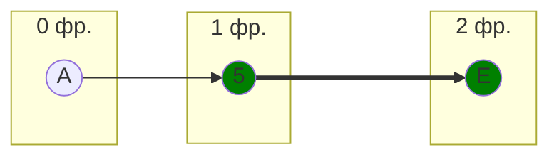
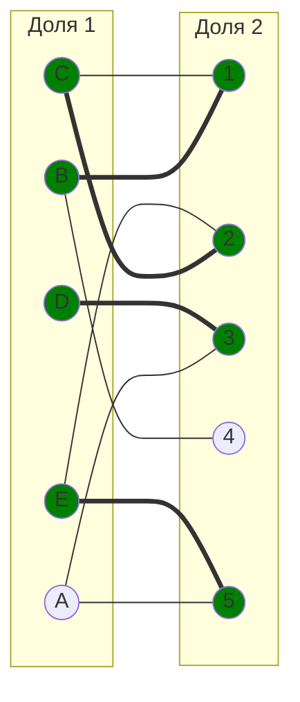
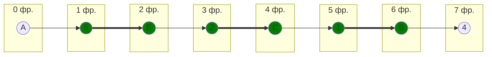
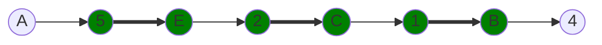
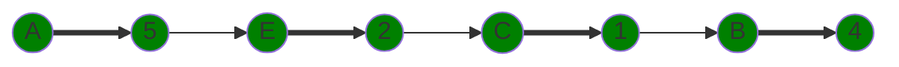
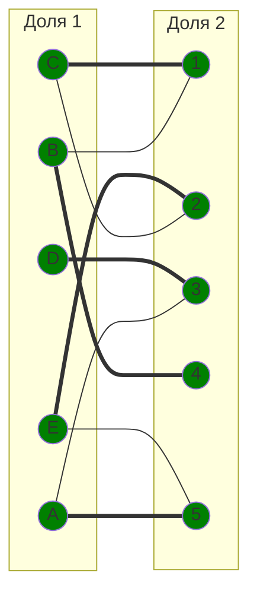

# Задание №14. Задача о назначении. Венгерский алгоритм.

## Вариант: 3
 
Исходная матрица затрат:

|       | **1** | **2** | **3** | **4** | **5** |
|-------|:-----:|:-----:|:-----:|:-----:|:-----:|
| **A** |  12   |  14   |   6   |   8   |   5   |
| **B** |   7   |  10   |  10   |   6   |   6   |
| **C** |   9   |   8   |  13   |  14   |  12   |
| **D** |   7   |   9   |   5   |  10   |  12   |
| **E** |  14   |   6   |  11   |  10   |   5   |

## Шаг 1. Редукция матрицы

### 1.1 Вычитаем минимум по строкам

Смотрим минимум в каждой строке и вычитаем:

|       | **1** | **2** | **3** | **4** | **5** | **Min** |
|-------|:-----:|:-----:|:-----:|:-----:|:-----:|:-------:|
| **A** |   7   |   9   |   1   |   3   |   0   |   -5    |
| **B** |   1   |   4   |   4   |   0   |   0   |   -6    |
| **C** |   1   |   0   |   5   |   6   |   4   |   -8    |
| **D** |   2   |   4   |   0   |   5   |   7   |   -5    |
| **E** |   9   |   1   |   6   |   5   |   0   |   -5    |

### 1.2 Вычитаем минимум по столбцам

Теперь то же самое для столбцов:

|         | **1** | **2** | **3** | **4** | **5** |
|---------|:-----:|:-----:|:-----:|:-----:|:-----:|
| **A**   |   6   |   9   |   1   |   3   |   0   |
| **B**   |   0   |   4   |   4   |   0   |   0   |
| **C**   |   0   |   0   |   5   |   6   |   4   |
| **D**   |   1   |   4   |   0   |   5   |   7   |
| **E**   |   8   |   1   |   6   |   5   |   0   |
| **Min** |  -1   |   0   |   0   |   0   |   0   |

### Редуцированная матрица

|       | **1** | **2** | **3** | **4** | **5** |
|-------|:-----:|:-----:|:-----:|:-----:|:-----:|
| **A** |   6   |   9   |   1   |   3   |   0   |
| **B** |   0   |   4   |   4   |   0   |   0   |
| **C** |   0   |   0   |   5   |   6   |   4   |
| **D** |   1   |   4   |   0   |   5   |   7   |
| **E** |   8   |   1   |   6   |   5   |   0   |

## Шаг 2. Строим двудольный граф

Берём только те рёбра, где в матрице стоят нули: A5, B1, B4, B5, C1, C2, D3, E5

Выбираем начальное паросочетание: $[E, 5]$, $[B, 1]$, $[C, 2]$, $[D, 3]$.

Вершина A осталась непокрытой — она связана только с 5, а 5 уже занята E.

## Шаг 3. Строим чередующееся дерево из A

Начинаем с непокрытой A:

Дошли до E, но у неё нет других нулевых рёбер кроме E-5. Тупик — совершенного паросочетания пока нет.

## Шаг 4. Повторная редукция

Записываем множества:

$$X = \{A, E\}$$

$$Y = \{5\}$$

Ищем минимум в строках X и столбцах не из Y (т.е. столбцы 1, 2, 3, 4):

- A: [6, 9, 1, 3] → min = 1
- E: [8, 1, 6, 5] → min = 1

Минимум = 1. Вычитаем из строк X, прибавляем к столбцам Y:

|       | **1** | **2** | **3** | **4** | **5** |       |
|-------|:-----:|:-----:|:-----:|:-----:|:-----:|:-----:|
| **A** |   5   |   8   | **0** |   2   |   0   |  -1   |
| **B** |   0   |   4   |   4   |   0   |   1   |       |
| **C** |   0   |   0   |   5   |   6   |   5   |       |
| **D** |   1   |   4   |   0   |   5   |   8   |       |
| **E** |   7   | **0** |   5   |   4   |   0   |  -1   |
|       |       |       |       |       |  +1   |       |

Появились новые нули: A3 и E2.

## Шаг 5. Обновляем граф

Добавляем рёбра A-3 и E-2:

## Шаг 6. Снова строим дерево из A

Теперь у E появилось ребро к 2, можно идти дальше:

Нашли чередующуюся цепь от A до 4 (обе вершины непокрыты):

**A → 5 ⇒ E → 2 ⇒ C → 1 ⇒ B → 4**

## Шаг 7. Перекрашиваем цепь

Меняем рёбра местами — те что были в паросочетании убираем, те что не были — добавляем:

## Шаг 8. Итоговый граф

Получили совершенное паросочетание — все вершины покрыты:

## Шаг 9. Считаем стоимость

Берём значения из исходной матрицы:

| Назначение | Стоимость |
|:----------:|:---------:|
|    A → 5   |     5     |
|    B → 4   |     6     |
|    C → 1   |     9     |
|    D → 3   |     5     |
|    E → 2   |     6     |

Сумма = 5 + 6 + 9 + 5 + 6 = **31**

---

## Ответ

**Минимальная стоимость: 31**

Назначения:
- A → исполнитель 5 (стоимость 5)
- B → исполнитель 4 (стоимость 6)
- C → исполнитель 1 (стоимость 9)
- D → исполнитель 3 (стоимость 5)
- E → исполнитель 2 (стоимость 6)
