# Задание №14. Вариант 1
### Матрица затрат:

|       | **1** | **2** | **3** | **4** | **5** |
|-------|:-----:|:-----:|:-----:|:-----:|:-----:|
| **A** |  15   |  15   |  11   |   9   |  14   |
| **B** |   8   |   8   |   6   |  11   |  15   |
| **C** |  12   |  15   |  15   |  10   |   9   |
| **D** |  12   |  15   |  10   |   7   |   5   |
| **E** |  11   |  10   |   7   |  15   |   5   |

# Паросочетания. Венгерский алгоритм.
### Постановка задачи:
1. Дан полный двудольный граф, в котором каждое ребро имеет определенную стоимость. Вершины первой доли представляют задачи, вершины второй доли исполнителей. Стоимость ребра определяет затраты при выполнении соответствующей задачи соответствующим исполнителем. 
2. Затраты неотрицательны и представлены в виде матрицы затрат, в которой на пересечении i-й строки и j-го столбца указаны затраты j-го исполнителя на выполнение i-го задания.
3. Необходимо назначить исполнителей на задачи таким образом, чтобы общая стоимость затрат была минимальной.
4. Задача сводится к нахождению совершенного паросочетания с минимальной суммарной стоимостью в двудольном графе.

### Двудольный граф 
**Двудольный граф** — граф, вершины которого можно разделить на два непересекающихся множества таким образом, что каждое ребро графа соединяет вершину из одного множества с вершиной из другого и ни одно ребро не соединяет вершины внутри одного и того же множества. Эти два множества называют "долями" графа. Если все вершины в одной доле соединены с вершинами в другой доле, то такой граф называется **полным двудольным графом**. Например:

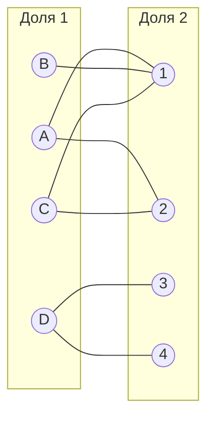

### Цепь в графе
**Цепь в графе** — последовательность вершин и рёбер, в которой каждое ребро (кроме первого и последнего) соединяет две соседние вершины, и при этом все ребра различны.

**Цепь чередующаяся относительно паросочетания** - начинается и заканчивается в вершинах, не покрытых этим паросочетанием, ребра внутри цепи чередуются, после ребра входящего в паросочетание следует ребро не входящее в это паросочетание, и наоборот.

### Паросочетание в графе
**Паросочетание в графе** - набор ребер, в котором никакие два ребра не смежны, то есть каждая вершина инцидентна ровно одному ребру. Вершина считается покрытой паросочетанием, если она является одним из концов ребра, входящего в это паросочетание.

Пример паросочетания в графе (ребра выделены пунктиром).

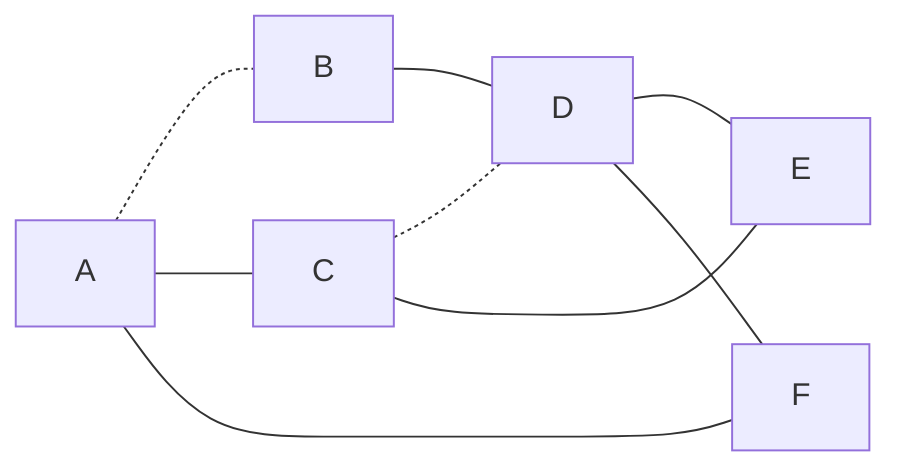

**Максимальное паросочетание в графе** — содержит максимально возможное количество рёбер среди всех паросочетаний в этом графе. То есть, в это паросочетание нельзя добавить ни одного ребра, не нарушив условия паросочетания (каждая вершина инцидентна ровно одному ребру).

**Совершенное паросочетание в графе** — покрывает все вершины графа. Каждая вершина графа является концом ровно одного ребра из этого паросочетания. Совершенное паросочетание существует только в графах с четным числом вершин, так как каждое ребро паросочетания соединяет две вершины. Совершенное паросочетание всегда максимальное, а максимальное не всегда совершенное.

Паросочетание на изображении выше не является совершенным, так как не покрывает вершины F и E (выделены красным). Для поиска совершенного паросочетания попытаемся построить чередующуюся цепь, которая начинается и заканчивается в непокрытых вершинах.  

Найдена чередующаяся цепь, начинающаяся в вершине F и заканчивающуюся в вершине E. 
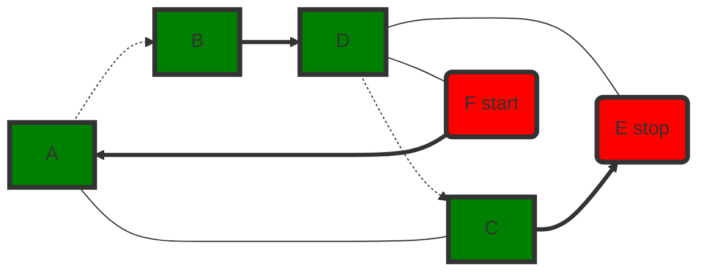

"Перекрасим" найденную цепь и получим совершенное паросочетание.

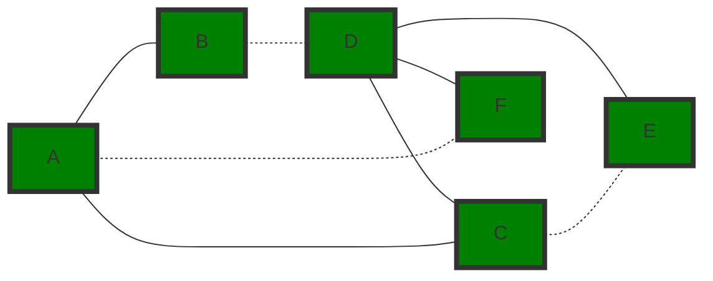

## Решение задачи о назначениях

Дана матрица затрат для задач A, B, C, D, E и исполнителей 1, 2, 3, 4, 5:

|       | **1** | **2** | **3** | **4** | **5** |
|-------|:-----:|:-----:|:-----:|:-----:|:-----:|
| **A** |  15   |  15   |  11   |   9   |  14   |
| **B** |   8   |   8   |   6   |  11   |  15   |
| **C** |  12   |  15   |  15   |  10   |   9   |
| **D** |  12   |  15   |  10   |   7   |   5   |
| **E** |  11   |  10   |   7   |  15   |   5   |

### Шаг 1. Проведем редукцию матрицы затрат 

Вычтем из каждой строки минимальное значение, представленное в этой строке.

|       | **1** | **2** | **3** | **4** | **5** |**Min**|
|-------|:-----:|:-----:|:-----:|:-----:|:-----:|:-----:|
| **A** |   6   |   6   |   2   |   0   |   5   |  -9   |
| **B** |   2   |   2   |   0   |   5   |   9   |  -6   |
| **C** |   3   |   6   |   6   |   1   |   0   |  -9   |
| **D** |   7   |  10   |   5   |   2   |   0   |  -5   |
| **E** |   6   |   5   |   2   |  10   |   0   |  -5   |

После чего вычтем из каждого столбца минимальное значение, представленное в этом столбце.

|       | **1** | **2** | **3** | **4** | **5** |
|-------|:-----:|:-----:|:-----:|:-----:|:-----:|
| **A** |   4   |   4   |   2   |   0   |   5   |
| **B** |   0   |   0   |   0   |   5   |   9   |
| **C** |   1   |   4   |   6   |   1   |   0   |
| **D** |   5   |   8   |   5   |   2   |   0   |
| **E** |   4   |   3   |   2   |  10   |   0   |
|**Min**|  -2   |  -2   |   0   |   0   |   0   |

Получим редуцированную матрицу, где нули обозначают наименее затратные варианты назначений.

|       | **1** | **2** | **3** | **4** | **5** |
|-------|:-----:|:-----:|:-----:|:-----:|:-----:|
| **A** |   4   |   4   |   2   |   0   |   5   |
| **B** |   0   |   0   |   0   |   5   |   9   |
| **C** |   1   |   4   |   6   |   1   |   0   |
| **D** |   5   |   8   |   5   |   2   |   0   |
| **E** |   4   |   3   |   2   |  10   |   0   |

### Шаг 2. Построим двудольный граф
Вынесем на двудольный граф те ребра, для которых в редуцированной матрице указаны нули.

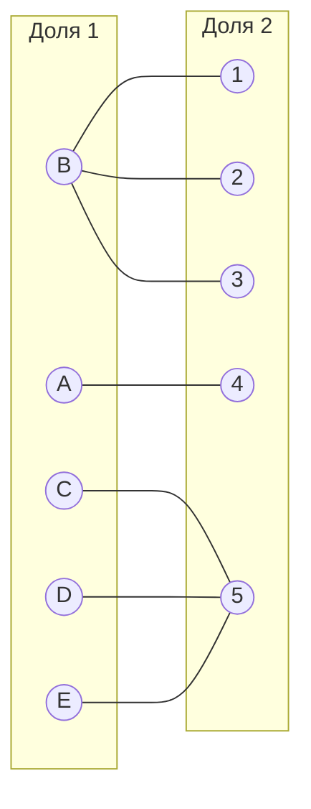

Выберем произвольное паросочетание $[A, 4]$, $[B, 1]$, $[C, 5]$ и попытаемся построить совершенное паросочетание с помощью чередующихся деревьев.

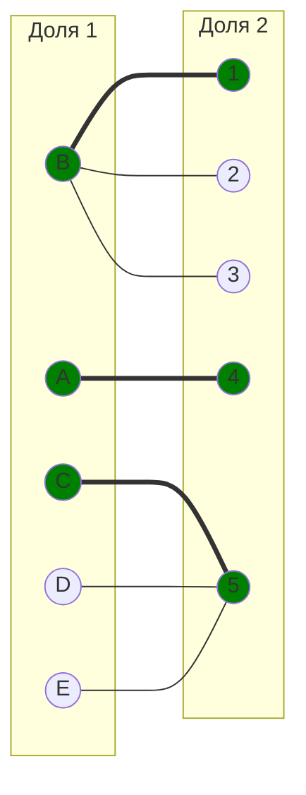

Попытаемся построить дерево из оставшейся непокрытой вершины D.

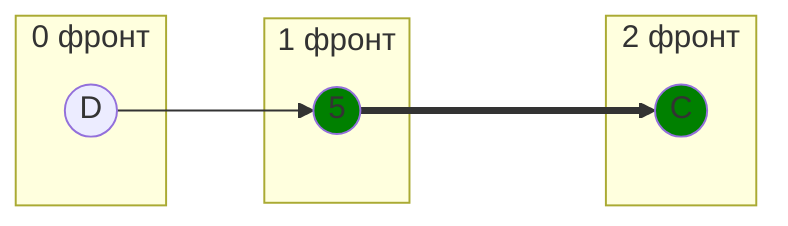

В построенном дереве нет цепи, чередующейся относительно текущего паросочетания, ветка закончилась в покрытой вершине, то есть в указанном графе нет совершенного паросочетания.

### Шаг 3. Проведем повторную редукцию матрицы затрат

Во множество X выпишем все **покрытые построенным деревом** вершины первой доли графа, во множество Y все **покрытые построенным деревом** вершины из второй доли графа.

$$
X = \{C, D\}
$$

$$
Y = \{5 \}
$$

Необходимо найти минимальный элемент из строк, включенных во множество X и столбцов, не включенных во множество Y. В нашем случае это будут строки C, D и столбец 5.

|       | **1** | **2** | **3** | **4** | **5** |
|-------|:-----:|:-----:|:-----:|:-----:|:-----:|
| **A** |   4   |   4   |   2   |   0   |   5   |
| **B** |   0   |   0   |   0   |   5   |   9   |
| **C** |   1   |   4   |   6   |   1   |   0   |
| **D** |   5   |   8   |   5   |   2   |   0   |
| **E** |   4   |   3   |   2   |  10   |   0   |

Минимальный элемент 1, расположен в строке C и столбце 1. 

Вычтем найденное значение из строк множества X и прибавим к столбцам множества Y:

|       | **1** | **2** | **3** | **4** | **5** |       |
|-------|:-----:|:-----:|:-----:|:-----:|:-----:|:-----:|
| **A** |   4   |   4   |   2   |   0   |   6   |       |
| **B** |   0   |   0   |   0   |   5   |  10   |       |
| **C** |   0   |   3   |   5   |   0   |   0   |  -1   |
| **D** |   4   |   7   |   4   |   1   |   0   |  -1   |
| **E** |   4   |   3   |   2   |  10   |   1   |       |
|       |       |       |       |       |  +1   |       |

В ячейках C1, C4 появились новые нулевые значения, добавим соответствующие рёбра в двудольный граф. А в ячейке E5 нулевое значение пропало, поэтому убираем данное ребро.

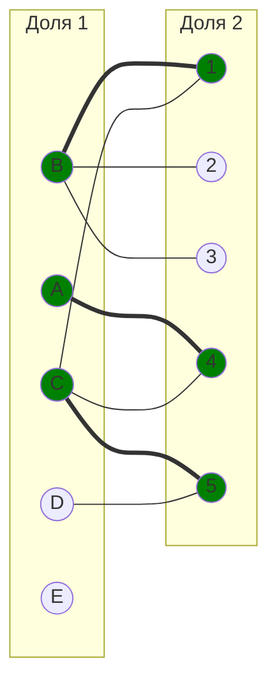

### Шаг 4. Попытаемся построить совершенное паросочетание с помощью чередующихся деревьев снова из непокрытой вершины D

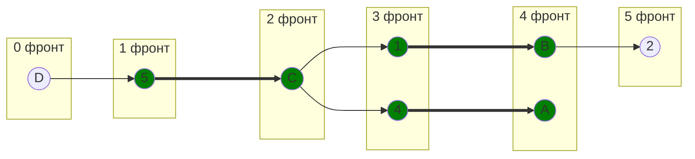

Построенное дерево содержит чередующуюся, относительно текущего паросочетания, цепь D5 - 5C - C1 - 1B - B2, цепь начинается и заканчивается в непокрытых вершинах, все ребра в цепи ***чередуются*** по вхождению в текущее паросочетание.

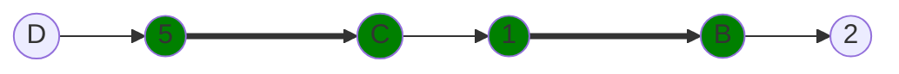

"Перекрасим" найденную цепь и проверим полученное паросочетание.

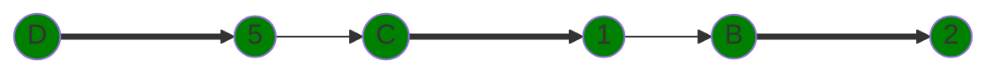

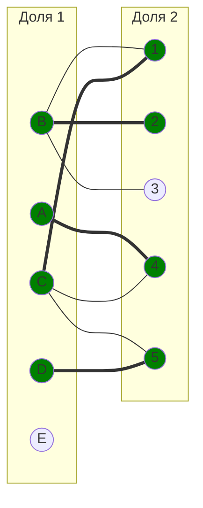

### Шаг 5. Повторная редукция

Попытаемся построить совершенное паросочетание с помощью чередующихся деревьев из непокрытой вершины E.

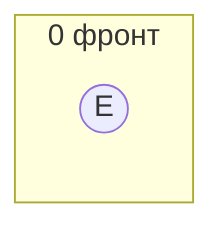

Видим, что из вершины нет рёбер. Снова прибегаем к повторной редукции матрицы. Во множество X выпишем все **покрытые построенным деревом** вершины первой доли графа, во множество Y все **покрытые построенным деревом** вершины из второй доли графа.

$$
X = \{E\}
$$

$$
Y = \{\}
$$

Необходимо найти минимальный элемент из строк, включенных во множество X и столбцов, не включенных во множество Y. В нашем случае это будет строка E.

|       | **1** | **2** | **3** | **4** | **5** |
|-------|:-----:|:-----:|:-----:|:-----:|:-----:|
| **A** |   4   |   4   |   2   |   0   |   6   |
| **B** |   0   |   0   |   0   |   5   |  10   |
| **C** |   0   |   3   |   5   |   0   |   0   |
| **D** |   4   |   7   |   4   |   1   |   0   |
| **E** |   4   |   3   |   2   |  10   |   1   |

Минимальный элемент 1, расположен в строке E и столбце 5. 

Вычтем найденное значение из строк множества X и прибавим к столбцам множества Y:

|       | **1** | **2** | **3** | **4** | **5** |       |
|-------|:-----:|:-----:|:-----:|:-----:|:-----:|:-----:|
| **A** |   4   |   4   |   2   |   0   |   6   |       |
| **B** |   0   |   0   |   0   |   5   |  10   |       |
| **C** |   0   |   3   |   5   |   0   |   0   |       |
| **D** |   4   |   7   |   4   |   1   |   0   |       |
| **E** |   3   |   2   |   1   |   9   |   0   |  -1   |
|       |       |       |       |       |       |       |

В ячейке E5 появилось новое нулевое значение, добавим соответствующее ребро в двудольный граф.

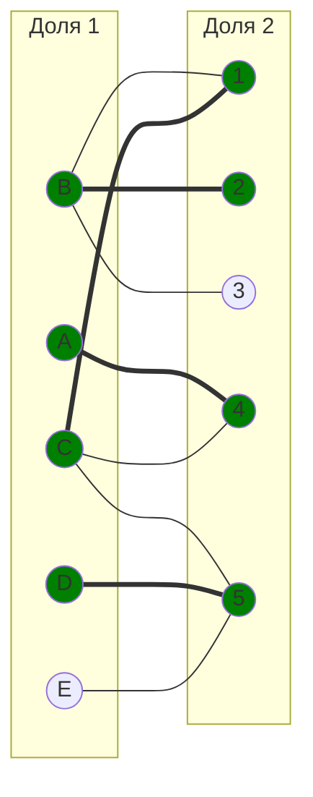

### Шаг 6. Повторная редукция

Попытаемся построить совершенное паросочетание с помощью чередующихся деревьев снова из непокрытой вершины E.

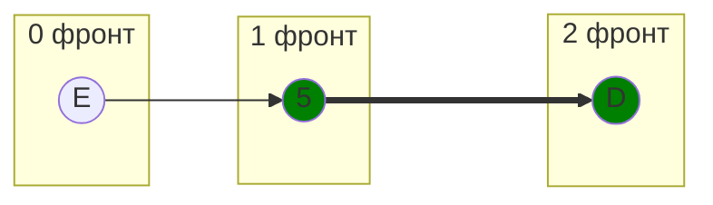

В построенном дереве нет цепи, чередующейся относительно текущего паросочетания, ветка закончилась в покрытой вершине, то есть в указанном графе нет совершенного паросочетания. Снова проводим повторную редукцию матрицы.

Во множество X выпишем все **покрытые построенным деревом** вершины первой доли графа, во множество Y все **покрытые построенным деревом** вершины из второй доли графа.

$$
X = \{D, E\}
$$

$$
Y = \{5 \}
$$

Необходимо найти минимальный элемент из строк, включенных во множество X и столбцов, не включенных во множество Y. В нашем случае это будут строки D, E и столбец 5.

|       | **1** | **2** | **3** | **4** | **5** |
|-------|:-----:|:-----:|:-----:|:-----:|:-----:|
| **A** |   4   |   4   |   2   |   0   |   6   |
| **B** |   0   |   0   |   0   |   5   |  10   |
| **C** |   0   |   3   |   5   |   0   |   0   |
| **D** |   4   |   7   |   4   |   1   |   0   |
| **E** |   3   |   2   |   1   |   9   |   0   |

Минимальный элемент 1, расположен в строке D и столбце 4. 

Вычтем найденное значение из строк множества X и прибавим к столбцам множества Y:

|       | **1** | **2** | **3** | **4** | **5** |       |
|-------|:-----:|:-----:|:-----:|:-----:|:-----:|:-----:|
| **A** |   4   |   4   |   2   |   0   |   7   |       |
| **B** |   0   |   0   |   0   |   5   |  11   |       |
| **C** |   0   |   3   |   5   |   0   |   1   |       |
| **D** |   3   |   6   |   3   |   0   |   0   |  -1   |
| **E** |   2   |   1   |   0   |   8   |   0   |  -1   |
|       |       |       |       |       |  +1   |       |

В ячейках D4, E3 появились новые нулевые значения, добавим соответствующие рёбра в двудольный граф. А ребро C5 утратило нулевое значение, поэтому его мы уберём.

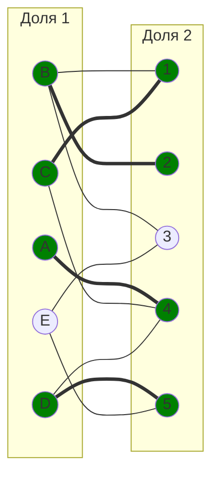

### Шаг 7. Попытаемся построить совершенное паросочетание с помощью чередующихся деревьев снова из непокрытой вершины E

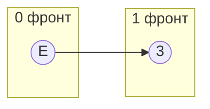

Построенное дерево содержит одно ребро E3, начинается и заканчивается в непокрытых вершинах. "Перекрашиваем" найденную цепь и проверяем полученное паросочетание.

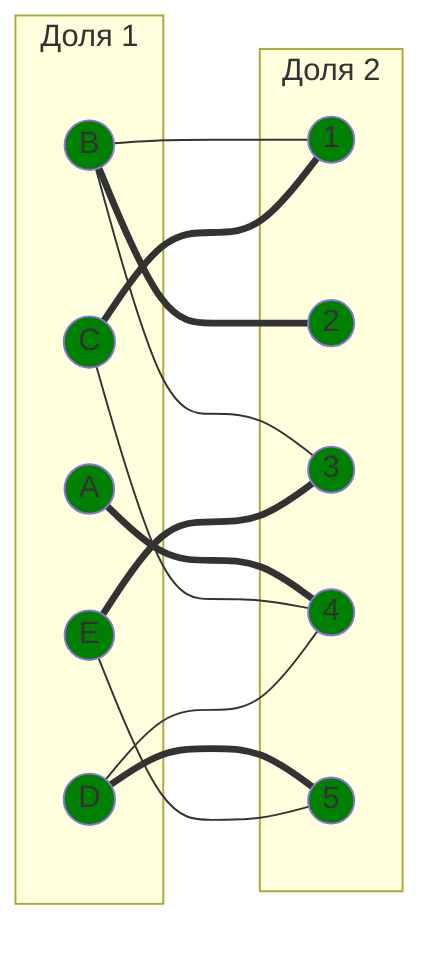

Полученное расписание является совершенным. Выпишем полученные назначения и их стоимости из исходной матрицы:
- B2 - 8
- C1 - 12
- A4 - 9
- E3 - 7
- D5 - 5

Общая стоимость затрат = 8 + 12 + 9 + 7 + 5 = 41.

## Ответ
Минимальная стоимость затрат 41, при следующих назначениях:
- задача C, исполнитель 1,
- задача B, исполнитель 2,
- задача E, исполнитель 3,
- задача A, исполнитель 4,
- задача D, исполнитель 5.