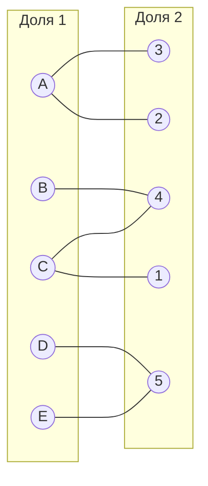
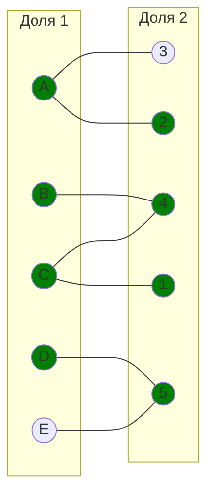
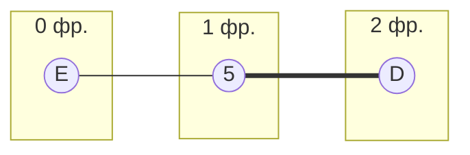
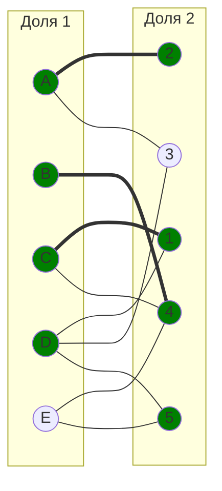
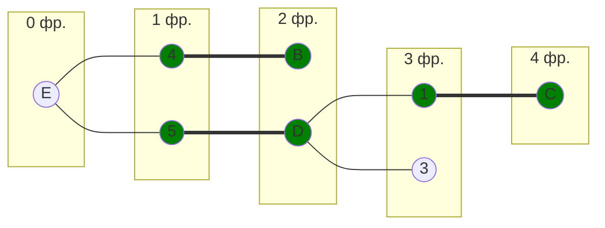
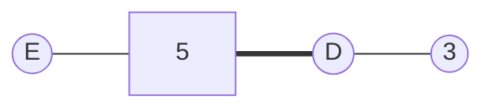
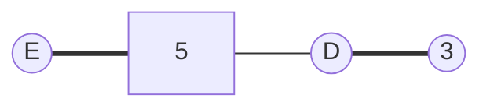
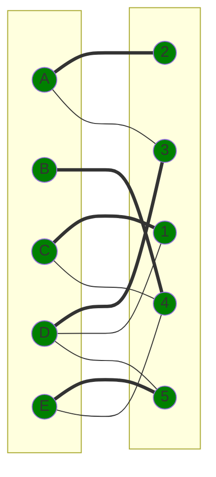
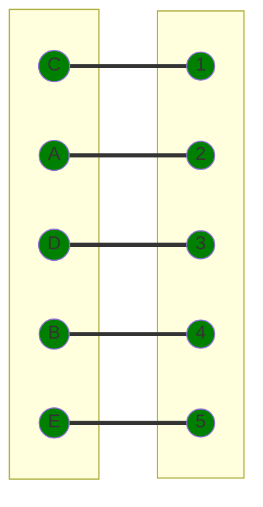

# **Паросочетания. Венгерский алгоритм. Вариант 2**

## **Матрица затрат:**

|       | **1** | **2** | **3** | **4** | **5** |
|-------|:-----:|:-----:|:-----:|:-----:|:-----:|
| **A** |   9   |   8   |   7   |   14  |   14  |
| **B** |  13   |   13  |  14   |   6   |  12   |
| **C** |   7   |   8   |   9   |   6   |   7   |
| **D** |   8   |   9   |   7   |   9   |   5   |
| **E** |   9   |   9   |  14   |   7   |   5   |
---
## **Решение**

**Делаем редукцию матрицы, поэтому вычитаем минимальный элемент из каждой строки**

|       | **1** | **2** | **3** | **4** | **5** |       |
|-------|:-----:|:-----:|:-----:|:-----:|:-----:|:-----:|   
| **A** |   9   |   8   |   7   |  14   |  14   |  -7   |
| **B** |  13   |  13   |  14   |   6   |  12   |  -6   |
| **C** |   7   |   8   |   9   |   6   |   7   |  -6   |
| **D** |   8   |   9   |   7   |   9   |   5   |  -5   |
| **E** |   9   |   9   |  14   |   7   |   5   |  -5   |

|       | **1** | **2** | **3** | **4** | **5** |
|-------|:-----:|:-----:|:-----:|:-----:|:-----:|
| **A** |   2   |   1   |   0   |   7   |   7   |
| **B** |   7   |   7   |   8   |   0   |   6   |
| **C** |   1   |   2   |   3   |   0   |   1   |
| **D** |   3   |   4   |   2   |   4   |   0   |
| **E** |   4   |   4   |   9   |   2   |   0   |
---
**Так как не в каждом столбце есть 0, вычитаем минимальный элемент из столбцов, где нету 0**

|       | **1** | **2** | **3** | **4** | **5** |
|-------|:-----:|:-----:|:-----:|:-----:|:-----:|
| **A** |   2   |   1   |   0   |   7   |   7   |
| **B** |   7   |   7   |   8   |   0   |   6   |
| **C** |   1   |   2   |   3   |   0   |   1   |
| **D** |   3   |   4   |   2   |   4   |   0   |
| **E** |   4   |   4   |   9   |   2   |   0   |
|       |  -1   |  -1   |       |       |       |

|       | **1** | **2** | **3** | **4** | **5** |
|-------|:-----:|:-----:|:-----:|:-----:|:-----:|
| **A** |   1   |   0   |  0    |   7   |   7   |
| **B** |   6   |   6   |  8    |   0   |   6   |
| **C** |   0   |   1   |  3    |   0   |   1   |
| **D** |   2   |   3   |  2    |   4   |   0   |
| **E** |   3   |   3   |  9    |   2   |   0   |
---
**Уже из этой матрницы можно сделать граф**

**Выберем произвольное паросочетание [A, 2], [B, 4], [C, 1], [D, 5] и попытаемся построить дерево из непокрытой вершины E:**

---

**В построенном дереве нет цепей, чередующееся относительно текущего паросочетания, ветка закончилась в покрытой вершине, то есть в указанном графе нет совершенного паросочетания. Поэтому будем проводить повторную редукцию по строках E,D и столбца 5. Ищем минимальный элемент кроме столбца 5 и туда же добавим минимальный элемент, чтобы не получились отрицательные числа**

|       | **1** | **2** | **3** | **4** | **5** |
|-------|:-----:|:-----:|:-----:|:-----:|:-----:|
| **A** |   1   |   0   |  0    |   7   |   7   |
| **B** |   6   |   6   |  8    |   0   |   6   |
| **C** |   0   |   1   |  3    |   0   |   1   |
| **D** |   0   |   1   |  0    |   2   |   0   |
| **E** |   1   |   1   |  7    |   0   |   0   |

**И получаем новый в граф с ребрами:**

**Проверим**

**В полученом графе существует цепь**

**Перекрасим**

---
**Получаем итоговый вариант графа**

Рассчитаем общую стоимость затрат (значения взяты из исходной матрицы):

A2 = 8\
B4 = 6\
C1 = 7\
D3 = 7\
E5 = 5

Общая стоимость затрат: 8 + 6 + 7 + 7 + 5 = 33
Ответ:

Минимальная стоимость затрат - 33, при следующем распределении исполнителей:
- Исполнитель A - задача 2
- Исполнитель B - задача 4
- Исполнитель C - задача 1
- Исполнитель D - задача 3
- Исполнитель E - задача 5