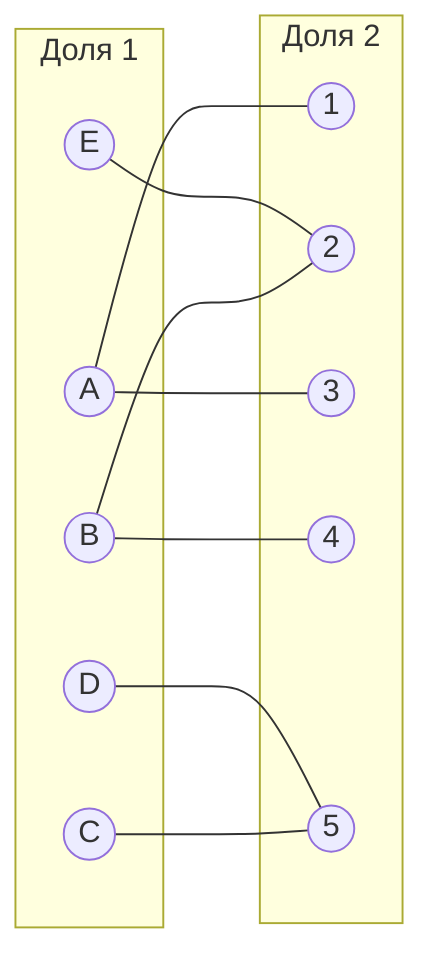
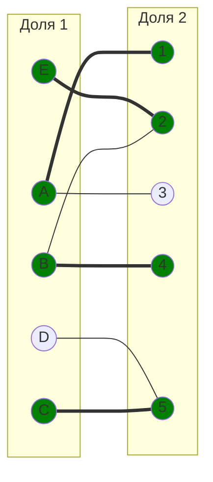
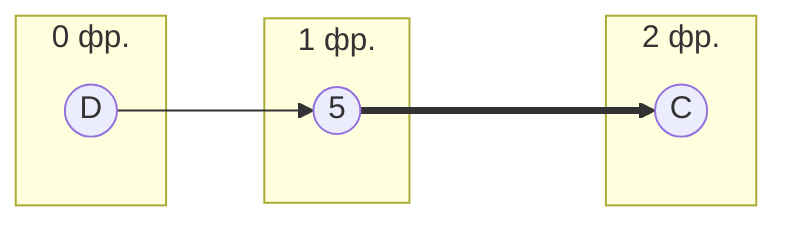
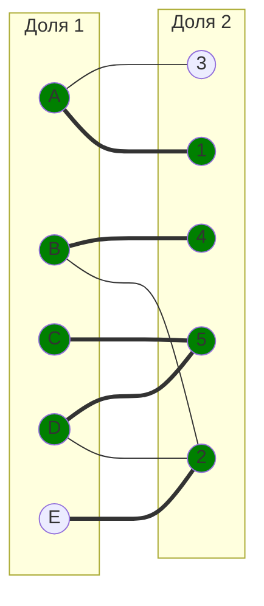
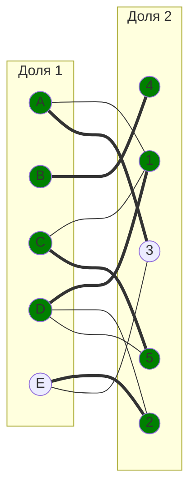
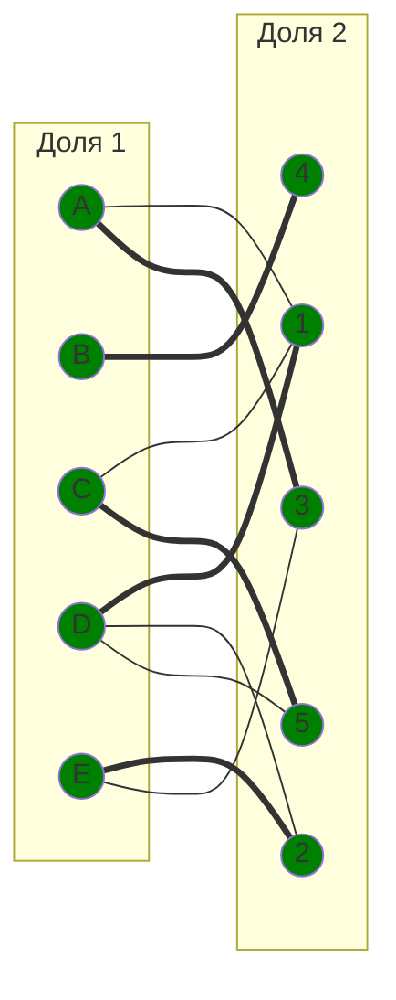

# Задание №14. Задача о назначении. Венгерский алгоритм.

## Вариант: 8
 
Исходная матрица затрат:

|       | **1** | **2** | **3** | **4** | **5** |
|-------|:-----:|:-----:|:-----:|:-----:|:-----:|
| **A** |  12   |  11   |   10  |  13   |  14   |
| **B** |  10   |   6   |  12   |   7   |  15   |
| **C** |   9   |   7   |  15   |  14   |   5   |
| **D** |  11   |   8   |  11   |  14   |   7   |
| **E** |  14   |   5   |   6   |   9   |  10   |

## Редукция матрицы

### Вычитаем минимум по строкам

Смотрим минимум в каждой строке и вычитаем:

|       | **1** | **2** | **3** | **4** | **5** | **Min** |
|-------|:-----:|:-----:|:-----:|:-----:|:-----:|:-------:|
| **A** |   2   |   1   |   0   |   3   |   4   |   -10   |
| **B** |   4   |   0   |   6   |   1   |   9   |   -6    |
| **C** |   4   |   2   |  10   |   9   |   0   |   -5    |
| **D** |   4   |   1   |   4   |   7   |   0   |   -7    |
| **E** |   8   |   0   |   1   |   4   |   5   |   -5    |

### Вычитаем минимум по столбцам

Теперь то же самое для столбцов:

|         | **1** | **2** | **3** | **4** | **5** |
|---------|:-----:|:-----:|:-----:|:-----:|:-----:|
| **A**   |   0   |   1   |   0   |   2   |   4   |
| **B**   |   2   |   0   |   6   |   0   |   9   |
| **C**   |   2   |   2   |  10   |   8   |   0   |
| **D**   |   2   |   1   |   4   |   6   |   0   |
| **E**   |   6   |   0   |   4   |   3   |   5   |
| **Min** |  -2   |   0   |   0   |   1   |   0   |

### Редуцированная матрица

|         | **1** | **2** | **3** | **4** | **5** |
|---------|:-----:|:-----:|:-----:|:-----:|:-----:|
| **A**   |   0   |   1   |   0   |   2   |   4   |
| **B**   |   2   |   0   |   6   |   0   |   9   |
| **C**   |   2   |   2   |  10   |   8   |   0   |
| **D**   |   2   |   1   |   4   |   6   |   0   |
| **E**   |   6   |   0   |   4   |   3   |   5   |

## Строим двудольный граф

Берём только те рёбра, где нули: A1, A3, B2, B4, C5, D5, E2

Выбираем начальное паросочетание: $[A, 1]$, $[B, 4]$, $[C, 5]$, $[E, 2]$.

Вершина D осталась непокрытой — она связана только с 5, а 5 уже занята C.

## Строим чередующееся дерево из D

Начинаем с непокрытой D:

Дошли до C, но у неё нет других нулевых рёбер кроме C-5. Тупик — совершенного паросочетания пока нет.

## Повторная редукция

Ищем минимум в строках D и C и не в столбце 5 (т.е. столбцы 1, 2, 3, 4):

- D: [2, 1, 4, 6] → min = 1
- E: [2, 2, 10, 8] → min = 2

Минимум = 1. Вычитаем из строк D и C, прибавляем к столбцам 5:

|       | **1** | **2** | **3** | **4** | **5** |       |
|-------|:-----:|:-----:|:-----:|:-----:|:-----:|:-----:|
| **A** |   0   |   1   |   0   |   2   |   5   |       |
| **B** |   2   |   0   |   6   |   0   |  10   |       |
| **C** |   1   |   1   |   9   |   7   |   0   |  -1   |
| **D** |   1   | **0** |   3   |   5   |   0   |  -1   |
| **E** |   6   |   0   |   1   |   3   |   6   |       |
|       |       |       |       |       |  +1   |       |

Появился новый нуль: D2.

## Обновляем граф

Добавляем D2:

 E осталось непокрытой

**E → 2 ⇒ D → 5 ⇒ C**
C не имеет другихз нулей

## Повторная редукция

Ищем минимум в строках E, D и C и не в столбцах 2 и 5 (т.е. столбцы 1, 3, 4):

- D: [1, 3 ,5] → min = 1
- E: [6, 1, 5] → min = 1
- C: [1, 9, 7] → min = 1

|       | **1** | **2** | **3** | **4** | **5** |       |
|-------|:-----:|:-----:|:-----:|:-----:|:-----:|:-----:|
| **A** |   0   |   1   |   0   |   2   |   5   |       |
| **B** |   2   |   0   |   6   |   0   |  10   |       |
| **C** |   0   |   1   |   8   |   6   |   0   |  -1   |
| **D** |   0   |   0   |   2   |   4   |   0   |  -1   |
| **E** |   5   |   0   |   0   |   2   |   6   |  -1   |
|       |       |  +1   |       |       |  +1   |       |

## Обновляем граф
Добавляем ребра: C1, D1, E3

## Итоговый граф

Получили совершенное паросочетание — все вершины покрыты:

## Считаем стоимость

Берём значения из исходной матрицы:

| Назначение | Стоимость |
|:----------:|:---------:|
|    A → 3   |     10    |
|    B → 4   |     7     |
|    C → 5   |     5     |
|    D → 1   |     11    |
|    E → 2   |     5     |

Сумма = 10 + 7 + 5 + 11 + 5= **38**

---

## Ответ

**Минимальная стоимость: 38**

Назначения:
- A → исполнитель 3
- B → исполнитель 4
- C → исполнитель 5
- D → исполнитель 1
- E → исполнитель 2
