# Задание №14
# Паросочетания. Венгерский алгоритм.

## Варианты 1-8. Задача о назначении. Венгерский алгоритм
Для выполнения задания необходимо: 
1. Решить задачу о назначении с использованием Венгерского алгоритма **строго** так, как было разобрано на занятиях.
2. Оформить решение задачи по шагам с подробными комментариями, таблицами и диаграммами.
3. В ответе указать минимальную сумму затрат на выполнение всех заданий.
4. В ответе вывести найденные назначения

**Решение должно содержать номер варианта и подробное пошаговое описание.**

## Варианты 9-10. Максимальное и совершенное паросочетание.
Для выполнения задания необходимо найти совершенное и максимальное паросочетание в указанном двудольном графе, начав оиск с указаного начального паросочетания. Необходимо для решения задач нужно выбрать подходящий алгоритм (из рассмотренных на занятии), обосновать свой выбор и строго следовать выбранному алгоритму.

**Решение должно содержать номер варианта и подробное пошаговое описание.**

Условия задачи расположены в файле `Задание 14/Варианты условий.md` в ветке main репозитория для ручных задач.
Решение задачи нужно оформить в формате Markdown в отдельном файле с названием <название_команды>.md, который добавить в каталог `Задание 14` данного репозитория.

## Для выполнения задания необходимо:

1. Обновить ветку main в локальном репозитории (git pull).
2. От ветки main создать ветвь с названием `<название_команды>-task-14`, заменив `<название_команды>` на название команды, решившей задание.
3. В созданной ветке в каталог `Задание 14` добавить файл с решением задачи с названием `<название_команды>.md`.
4. Зафиксировать изменения на ветке (git commit).
5. Отравить ветку с изменениями в репозиторий на Github (git push).
6. Создать на Github запрос на слияние (pull request), указав в качестве base ветки `main`, в качестве compare ветки `<название_команды>-task-14`.

## Задача о назначении
### Постановка задачи:
1. Дан полный двудольный граф, в котором каждое ребро имеет определенную стоимость. Вершины первой доли представляют задачи, вершины второй доли исполнителей. Стоимость ребра определяет затраты при выполнении соответствующей задачи соответствующим исполнителем. 
2. Затраты неотрицательны и представлены в виде матрицы затрат, в которой на пересечении i-й строки и j-го столбца указаны затраты j-го исполнителя на выполнение i-го задания.
3. Необходимо назначить исполнителей на задачи таким образом, чтобы общая стоимость затрат была минимальной.
4. Задача сводится к нахождению совершенного паросочетания с минимальной суммарной стоимостью в двудольном графе.

### Двудольный граф 
**Двудольный граф** — граф, вершины которого можно разделить на два непересекающихся множества таким образом, что каждое ребро графа соединяет вершину из одного множества с вершиной из другого и ни одно ребро не соединяет вершины внутри одного и того же множества. Эти два множества называют "долями" графа. Если все вершины в одной доле соединены с вершинами в другой доле, то такой граф называется **полным двудольным графом**.

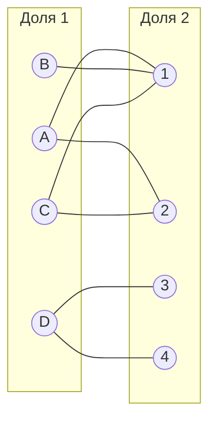

### Цепь в графе
**Цепь в графе** — последовательность вершин и рёбер, в которой каждое ребро (кроме первого и последнего) соединяет две соседние вершины, и при этом все ребра различны.

**Цепь чередующаяся относительно паросочетания** - начинается и заканчивается в вершинах, не покрытых этим паросочетанием, ребра внутри цепи чередуются, после ребра входящего в паросочетание следует ребро не входящее в это паросочетание, и наоборот.

### Паросочетание в графе
**Паросочетание в графе** - набор ребер, в котором никакие два ребра не смежны, то есть каждая вершина инцидентна ровно одному ребру. Вершина считается покрытой паросочетанием, если она является одним из концов ребра, входящего в это паросочетание.

Пример паросочетания в графе (ребра выделены пунктиром).

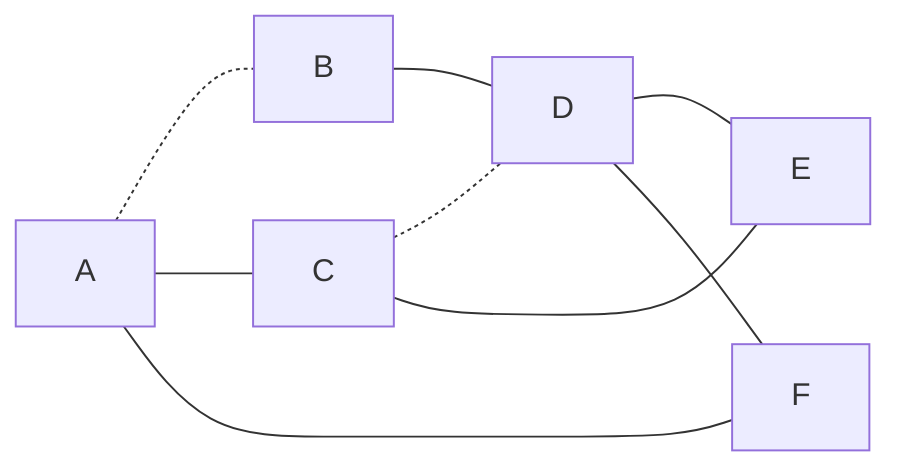

**Максимальное паросочетание в графе** — содержит максимально возможное количество рёбер среди всех паросочетаний в этом графе. То есть, в это паросочетание нельзя добавить ни одного ребра, не нарушив условия паросочетания (каждая вершина инцидентна ровно одному ребру).

**Совершенное паросочетание в графе** — покрывает все вершины графа. Каждая вершина графа является концом ровно одного ребра из этого паросочетания. Совершенное паросочетание существует только в графах с четным числом вершин, так как каждое ребро паросочетания соединяет две вершины. Совершенное паросочетание всегда максимальное, а максимальное не всегда совершенное.

Паросочетание на изображении выше не является совершенным, так как не покрывает вершины F и E (выделены красным). Для поиска совершенного паросочетания попытаемся построить чередующуюся цепь, которая начинается и заканчивается в непокрытых вершинах.  

Найдена чередующаяся цепь, начинающаяся в вершине F и заканчивающуюся в вершине E. 
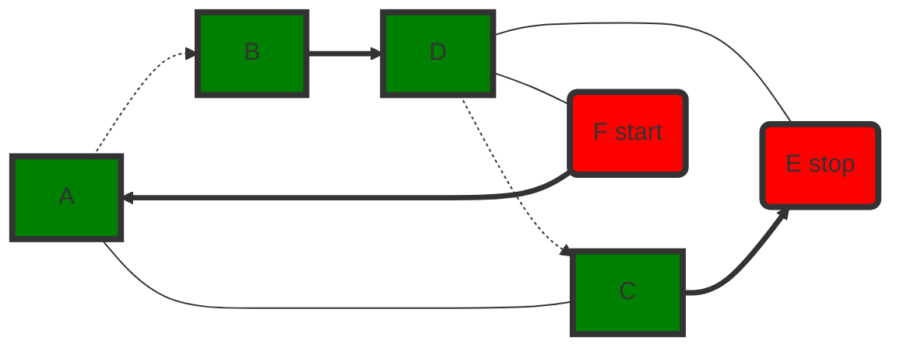

"Перекрасим" найденную цепь и получим совершенное паросочетание.

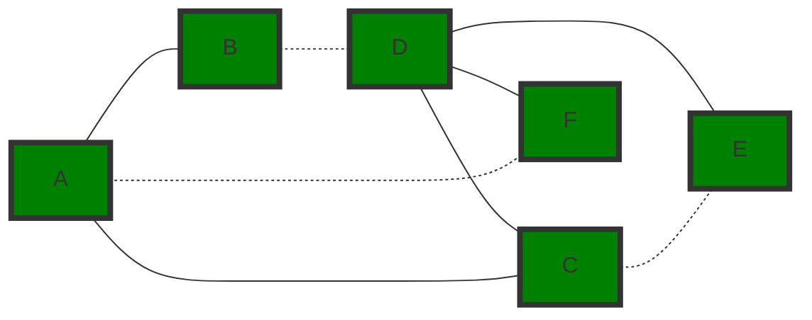

### Пример решения задачи о назначениях

Дана матрица затрат для задач A, B, C, D и исполнителей 1, 2, 3, 4:

|       | **1** | **2** | **3** | **4** |
|-------|:-----:|:-----:|:-----:|:-----:|
| **A** |   1   |   4   |   4   |   3   |
| **B** |   2   |   7   |   6   |   8   |
| **C** |   4   |   7   |   5   |   6   |
| **D** |   2   |   5   |   1   |   1   |

1. Проведем редукцию матрицы затрат. Вычтем из каждой строки минимальное значение, представленное в этой строке.

|       | **1** | **2** | **3** | **4** | **Min** |
|-------|:-----:|:-----:|:-----:|:-----:|:-------:|
| **A** |   0   |   3   |   3   |   2   |   -1    |
| **B** |   0   |   5   |   4   |   6   |   -2    |
| **C** |   0   |   3   |   1   |   2   |   -4    |
| **D** |   1   |   4   |   0   |   0   |   -1    |

После чего вычтем из каждого столбца минимальное значение, представленное в этом столбце.

|         | **1** | **2** | **3** | **4** | **Min** |
|---------|:-----:|:-----:|:-----:|:-----:|:-------:|
| **A**   |   0   |   0   |   3   |   2   |    3    |
| **B**   |   0   |   2   |   4   |   6   |    2    |
| **C**   |   0   |   0   |   1   |   2   |    0    |
| **D**   |   1   |   1   |   0   |   0   |    3    |
| **Min** |   0   |   3   |   0   |   0   |         |

Получим редуцированную матрицу, где нули обозначают наименее затратные варианты назначений.

|       | **1** | **2** | **3** | **4** |
|-------|:-----:|:-----:|:-----:|:-----:|
| **A** |   0   |   0   |   3   |   2   |
| **B** |   0   |   2   |   4   |   6   |
| **C** |   0   |   0   |   1   |   2   |
| **D** |   1   |   1   |   0   |   0   |

2. Построим двудольный граф, вынесем на него те ребра, для которых в редуцированной матрице указаны нули.

Выберем произвольное паросочетание $[B, 1]$, $[C, 2]$, $[D, 3]$ и попытаемся построить совершенное паросочетание с помощью чередующихся деревьев.

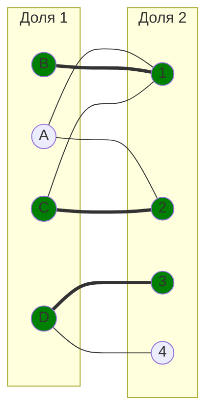

Попытаемся построить дерево из оставшейся непокрытой вершины A.

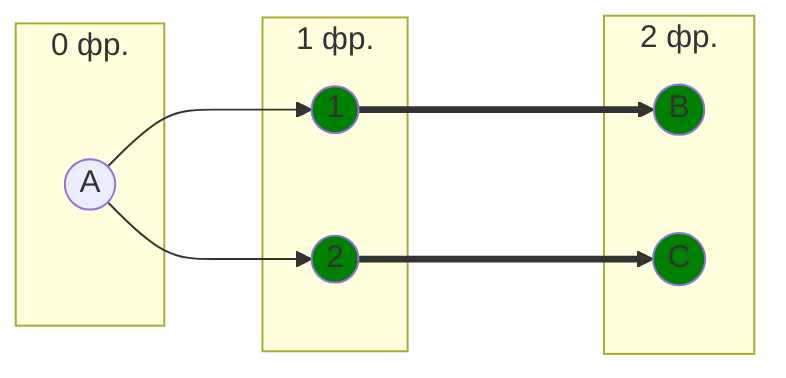

В построенном дереве нет цепей, чередующееся относительно текущего паросочетания, обе ветки закончились в покрытых вершинах, то есть в указанном графе нет совершенного паросочетания.

3. Проведем повторную редукцию матрицы затрат.

Во множество X выпишем все **покрытые построенным деревом** вершины первой доли графа, во множество Y все **покрытые построенным деревом** вершины из второй доли графа.

$$
X = \{A, B, C\}
$$

$$
Y = \{1, 2 \}
$$

Необходимо найти минимальный элемент из строк, включенных во множество X и столбцов, не включенных во множество Y. В нашем случае это будут строки A, B, C и столбцы 3, 4. Минимальный элемент 1, расположен в строке C и столбце 3. 

Вычтем найденное значение из строк множества X и прибавим к столбцам множества Y:

|       | **1** | **2** | **3** | **4** |       |
|-------|:-----:|:-----:|:-----:|:-----:|:-----:|
| **A** |   0   |   0   |   2   |   1   |  -1   |
| **B** |   0   |   2   |   3   |   5   |  -1   |
| **C** |   0   |   0   | **0** |   1   |  -1   |
| **D** |   2   |   2   |   0   |   0   |       |
|       |  +1   |  +1   |       |       |       |

В ячейке C3 появилось новое нулевое значение, добавим соответствующее ребро в двудольный граф.

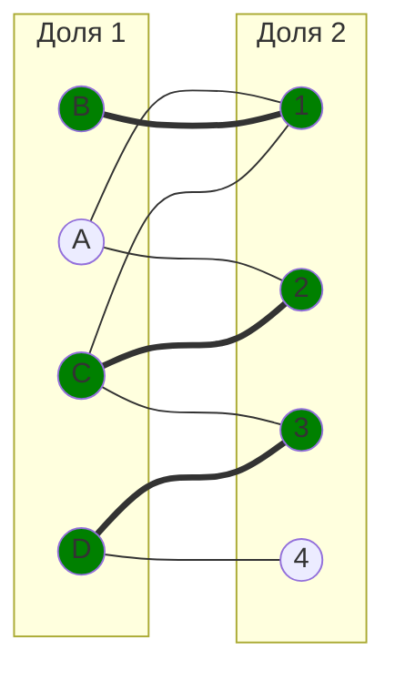

4. Попытаемся построить совершенное паросочетание с помощью чередующихся деревьев.

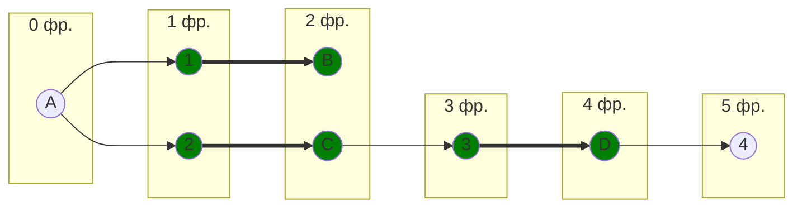

Построенное дерево содержит чередующуюся, относительно текущего паросочетания, цепь A2 - 2C - C3 - 3D - D4, цепь начинается и заканчивается в непокрытых вершинах, все ребра в цепи чередуются по вхождению в текущее паросочетание.

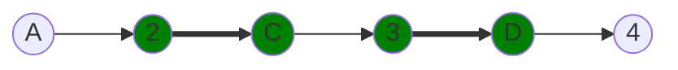

"Перекрасим" найденную цепь и проверим полученное паросочетание.

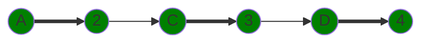

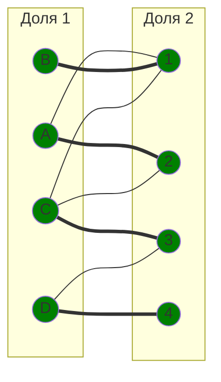

Полученное расписание является совершенным. Выпишем полученные назначения и их стоимости из исходной матрицы:
- B1 - 2
- A2 - 4
- C3 - 5
- D4 - 1

Общая стоимость затрат = 2 + 4 + 5 + 1 = 12.

## Ответ
Минимальная стоимость затрат 12, при следующих назначениях:
- задача B, исполнитель 1,
- задача A, исполнитель 2,
- задача C, исполнитель 3,
- задача D, исполнитель 4.