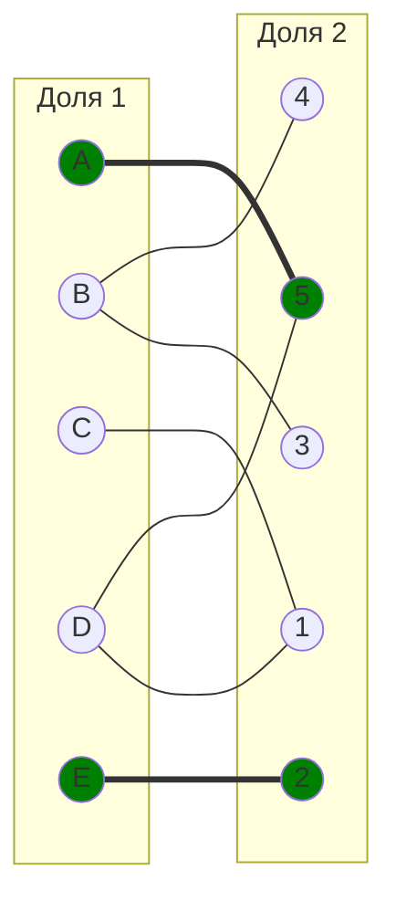
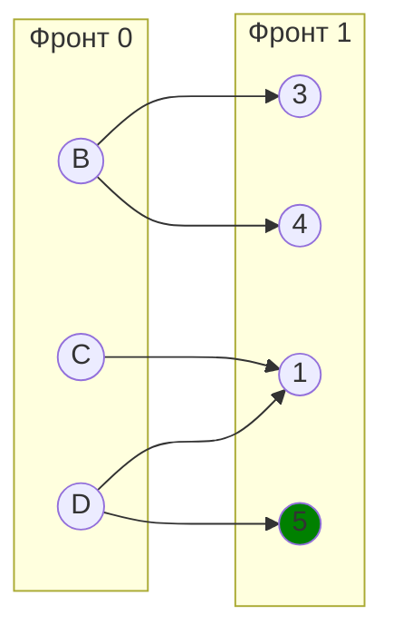
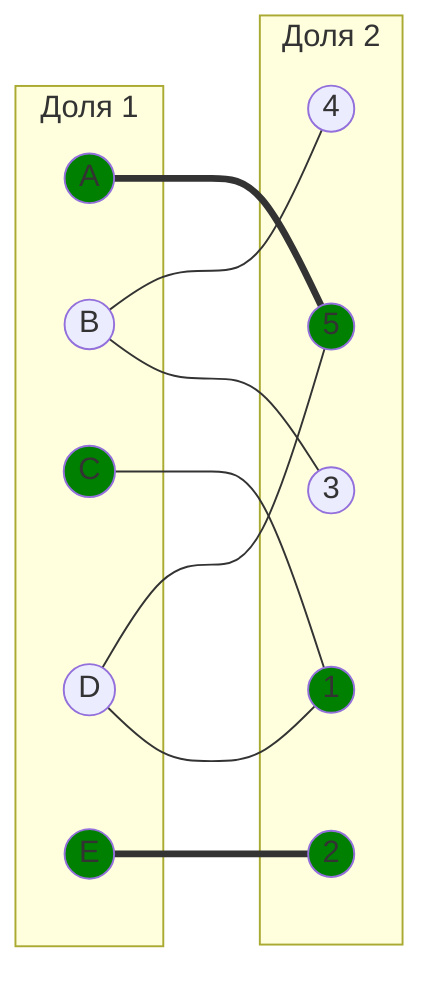
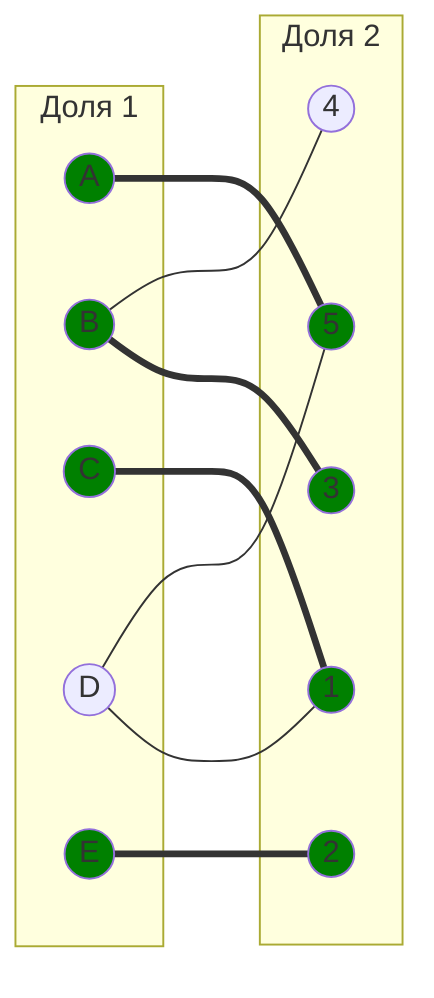
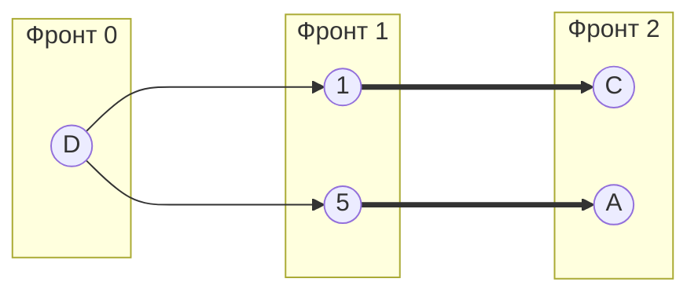

# Вариант 9

## Максимальное и совершенное паросочетание

### Задание 1

1. Найдите максимальное паросочетание в двудольном графе. Для поиска используйте цепи, чередующиеся относительно паросочетания. В качестве начального паросочетания используйте: $[A, 5]$, $[E, 2]$. Строго следуйте алгоритму, рассмотренному на занятиях.

Для решения будем использовать т.н. Волновой метод.

1. У нас уже задано начальное паросочетание - $[A, 5]$, $[E, 2]$, относительно которого необходимо начать поиск. Давайте Сформируем нулевой и первый фронты, состоящие из свободных вершин. В нашем случаем в нулевой фронт войдут вершины $B$, $C$, $D$ - свободные вершины из 1 доли графа. В 1 Фронт должны войти вершины которых не было ранее, а также они должны быть смежны с вершинами из 0 фронта, т.е. в этот фронт войдут вершины: $1$, $3$, $4$, $5$

Выберем ребро $[C, 1]$ в качестве чередующего. Тогда новое текущее паросочетание будет состоять из ребер $[A, 5]$, $[E, 2]$, $[C, 1]$.

3. Построим Фронт 2 для текущей цепи. Для этого посмотрим какие есть свободные вершины из 1 доли это $B$ и $D$ и из 2 доли это $3$ и $4$. Выбираем ребро $[B, 3]$, для их покрытия. Теперь текущее паросочетания стало следующим: $[A, 5], [E, 2], [C, 1], [B, 3]$. Граф:

Таким образом по фронтам картина выглядит следующим образом:

Вывод: Вершины $4$ и $D$ недостижимы с фронта 0, потому что нет чередующегося пути от свободной вершины до любой из этих вершин, поэтому паросочетания не является полным, а также не является совершенным. Мощность максимального паросочетания данного двудольного графа равна 4 в нашем случае относительно паросочетания $[A, 5]$, $[E, 2]$ это $[A, 5], [E, 2], [C, 1], [B, 3]$, потому что больше нет увеличивающего чередующуюся пути из 2 фронта.
