# Вариант 9

## Максимальное и совершенное паросочетание

### Задание 1

1. Найдите максимальное паросочетание в двудольном графе. Для поиска используйте цепи, чередующиеся относительно паросочетания. В качестве начального паросочетания используйте: $[A, 5]$, $[E, 2]$. Строго следуйте алгоритму, рассмотренному на занятиях.

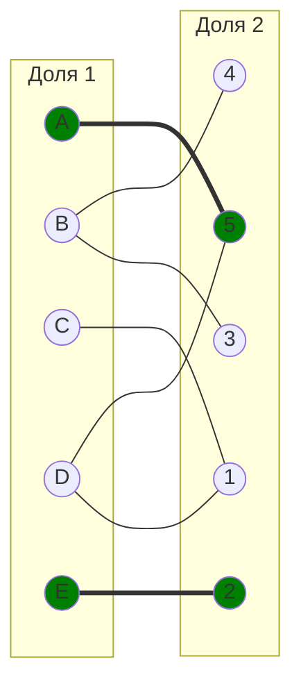

Для решения будем использовать т.н. Волновой метод.

1. У нас уже задано начальное паросочетание - $[A, 5]$, $[E, 2]$, относительно которого необходимо начать поиск. Давайте Сформируем нулевой и первый фронты, состоящие из свободных вершин. В нашем случаем в нулевой фронт войдут вершины $B$, $C$, $D$ - свободные вершины из 1 доли графа. В 1 Фронт должны войти вершины которых не было ранее, а также они должны быть смежны с вершинами из 0 фронта, т.е. в этот фронт войдут вершины: $1$, $3$, $4$, $5$

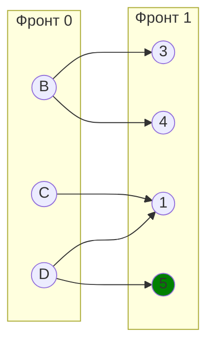

Выберем ребро $[C, 1]$ в качестве чередующего. Тогда новое текущее паросочетание будет состоять из ребер $[A, 5]$, $[E, 2]$, $[C, 1]$.

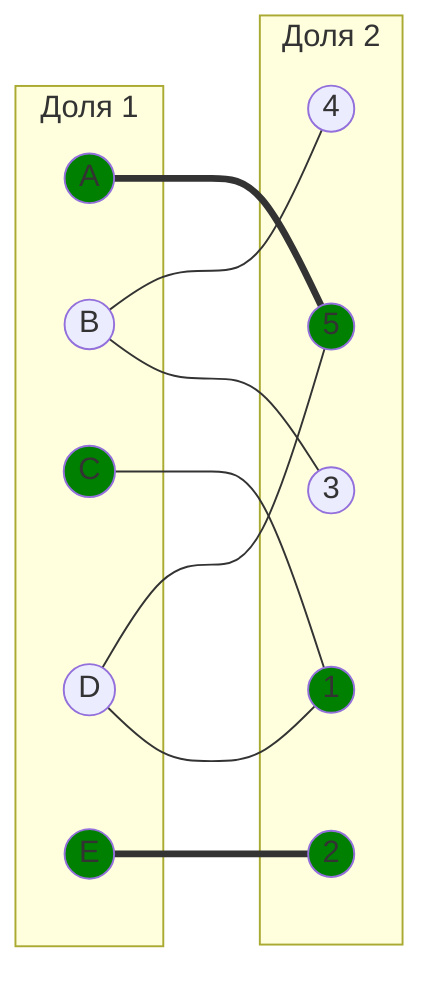

3. Построим Фронт 2 для текущей цепи. Для этого посмотрим какие есть свободные вершины из 1 доли это $B$ и $D$ и из 2 доли это $3$ и $4$. Выбираем ребро $[B, 3]$, для их покрытия. Теперь текущее паросочетания стало следующим: $[A, 5], [E, 2], [C, 1], [B, 3]$. Граф:

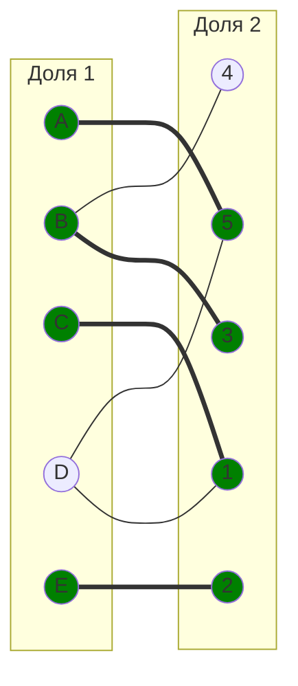

Таким образом по фронтам картина выглядит следующим образом:

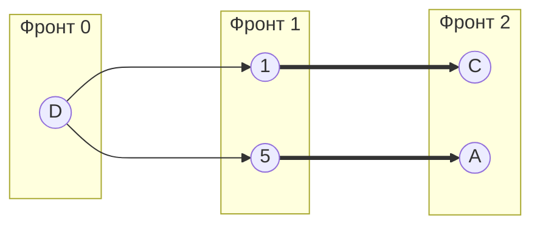

Вывод: Вершины $4$ и $D$ недостижимы с фронта 0, потому что нет чередующегося пути от свободной вершины до любой из этих вершин, поэтому паросочетания не является полным, а также не является совершенным. Мощность максимального паросочетания данного двудольного графа равна 4 в нашем случае относительно паросочетания $[A, 5]$, $[E, 2]$ это $[A, 5], [E, 2], [C, 1], [B, 3]$, потому что больше нет увеличивающего чередующуюся пути из 2 фронта.

### Задание 2
2. Найдите совершенное паросочетание в двудольном графе. Для поиска используйте цепи, чередующиеся относительно паросочетания. В качестве начального паросочетания используйте: $[C, 3]$, $[D, 2]$, $[E, 5]$. Строго следуйте алгоритму, рассмотренному на занятиях.

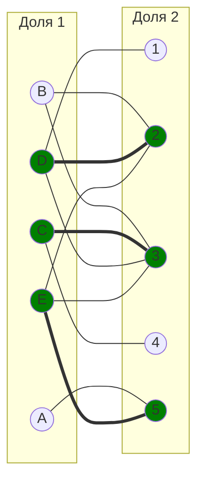

Совершенное паросочетание в графе — покрывает все вершины графа. Каждая вершина графа является концом ровно одного ребра из этого паросочетания. Данное начальное паросочетание не является совершенным, так как не покрывает вершины A, 1, B, 4. Попытаемся построить совершенное паросочетание с помощью чередующихся цепей. 
Цепь чередующаяся относительно паросочетания - начинается и заканчивается в вершинах, не покрытых этим паросочетанием, ребра внутри цепи чередуются, после ребра входящего в паросочетание следует ребро не входящее в это паросочетание, и наоборот.
Строим чередующееся дерево волновым методом из оставшейся непокрытой вершины A.
graph LR
    subgraph " 0 фр."
        A((A))
    end
    subgraph " 1 фр."
        1((1))
        2((2))
    end
    subgraph " 2 фр."
        B((B))
        C((C))
    end
    A --> 1 ===> B
    A --> 2 ===> C
    
    style B fill:#008000
    style C fill:#008000
    style 1 fill:#008000
    style 2 fill:#008000

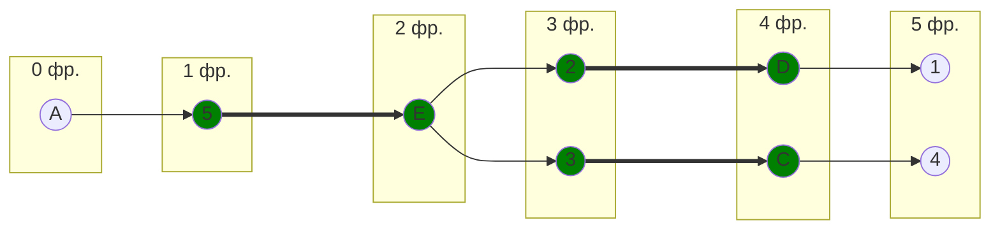

Построенное дерево содержит 2 чередующихся цепи, относительно текущего паросочетания, цепи A -> 5 -> E -> 3 -> C -> 4 и A -> 5 -> E -> 2 -> D -> 1, цепи начинаются и заканчиваются в непокрытых вершинах, все ребра в цепях чередуются по вхождению в текущее паросочетание. Выбираем одну из них и применяем к текущему паросочетанию.
"Перекрасим" найденную цепь и проверим полученное паросочетание.

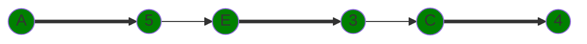

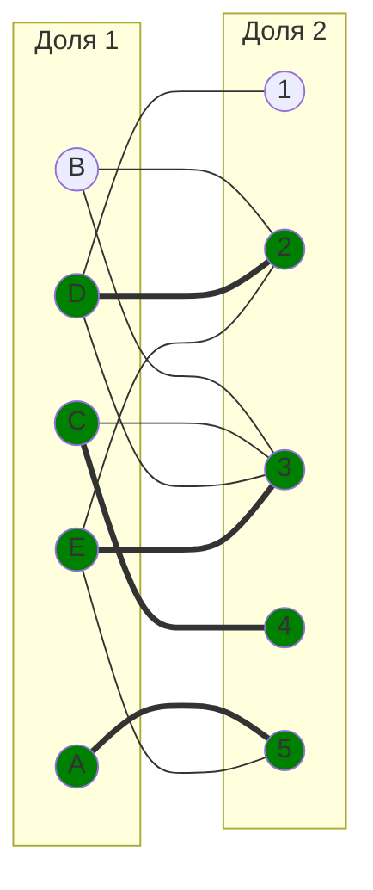

Повторим алгоритм для непокрытых вершин B, 1:

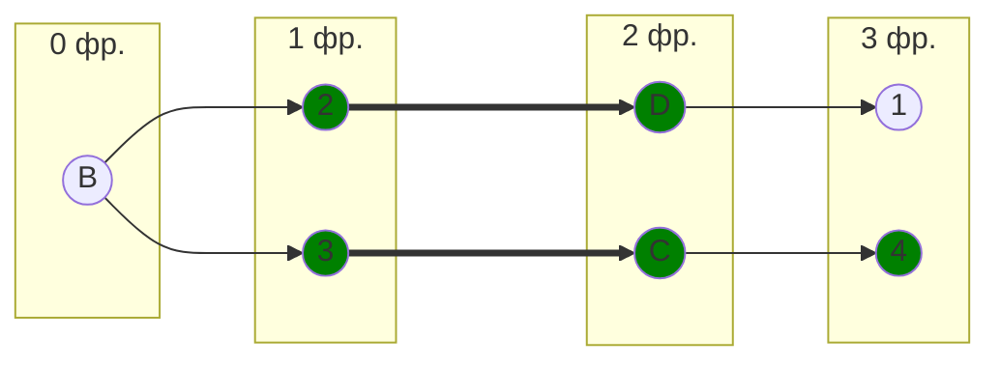

Построенное дерево содержит чередующуюся, относительно текущего паросочетания, цепь B - 2 - D - 1, цепь начинается и заканчивается в непокрытых вершинах, все ребра в цепи чередуются по вхождению в текущее паросочетание.
Перекрашиваем найденную цепь:

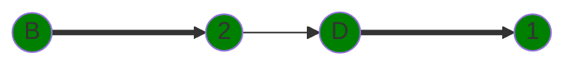

Получившееся паросочетание:

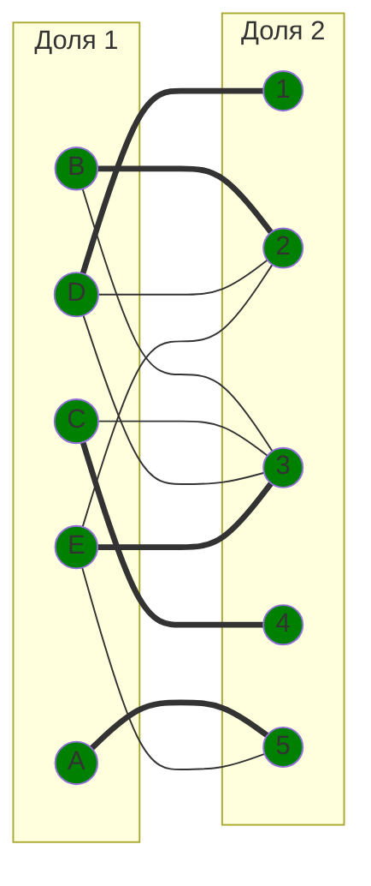

Получаем новое паросочетание: $[A, 5]$, $[B, 2]$, $[C, 4]$, $[D, 1]$, $[E, 3]$. Это паросочетание является совершенным, т.к. покрывает все вершины графа.