### Вариант 4:
#### Матрица затрат:

|       | **1** | **2** | **3** | **4** | **5** |
|-------|:-----:|:-----:|:-----:|:-----:|:-----:|
| **A** |   5   |   6   |  13   |   9   |   6   |
| **B** |   6   |   9   |  15   |  14   |   5   |
| **C** |  13   |   7   |   9   |   8   |  10   |
| **D** |  12   |   6   |   8   |  13   |   5   |
| **E** |   7   |   9   |  14   |  15   |   8   |

#### Редуцируем матрицу затрат

|       | **1** | **2** | **3** | **4** | **5** |
|-------|:-----:|:-----:|:-----:|:-----:|:-----:|
| **A** |   0   |   1   |  8   |   4   |   1   |
| **B** |   1   |   4   |  10   |  9   |   0   |
| **C** |  6   |   0   |   2   |   1   |  3   |
| **D** |  7   |   1   |   3   |  8   |   0   |
| **E** |   0   |   2   |  7   |  8   |   1   |

Заметим, что в стобцах 3 и 4 нулей нет. Вычтем из элементов этих столбцов мнимальные элементы.

|       | **1** | **2** | **3** | **4** | **5** |
|-------|:-----:|:-----:|:-----:|:-----:|:-----:|
| **A** |   0   |   1   |  6   |   3   |   1   |
| **B** |   1   |   4   |  8   |  8   |   0   |
| **C** |  6   |   0   |   0   |   0   |  3   |
| **D** |  7   |   1   |   1   |  7   |   0   |
| **E** |   0   |   2   |  5   |  7   |   1   |

#### На основе редуцированной матрицы затрат построим двудольный граф.

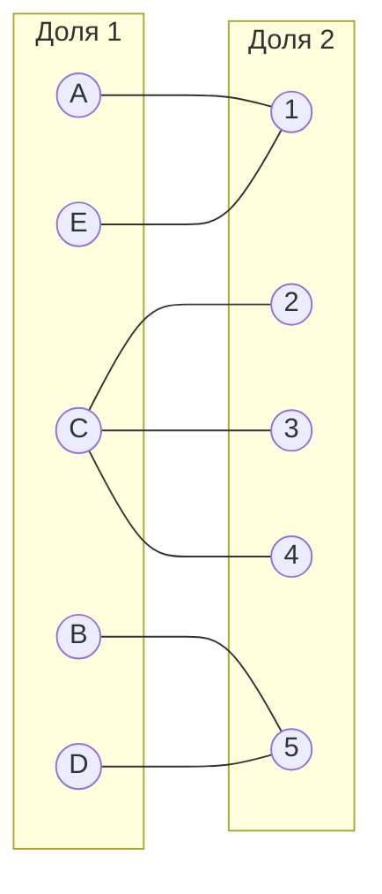

Выберем произвольное паросочетание [A,1], [B,5], [C,2] и попытаемся построить совершенное паросочетание при помощи чередующихся деревьев.

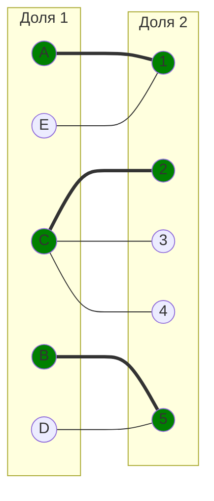

Попытаемся построить дерево из непокрытой вершины D.

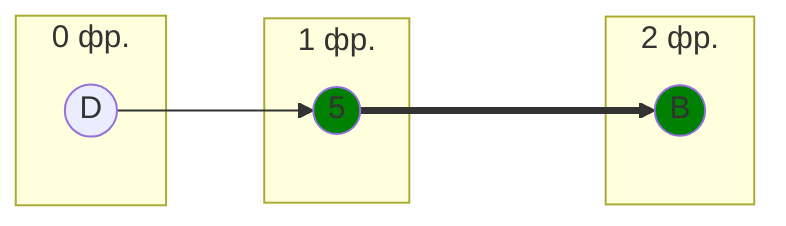
В построенном дереве нет цепей, чередующихся относительно текущего паросочетания. В указанном графе нет совершенного паросочетания. 

#### Проведем повторную редукцию матрицы

Множество X включает в себя строки B и D. Множество Y включает в себя столбец 5. Необходимо найти минимальный элемент из строк, включенных в множество X, и столбцов, не включенных в множество Y.
Это элемент 1 (B1,D2,D3).

Вычтем данное число из строк множества X и прибавим к столбцам  множества Y.

|       | **1** | **2** | **3** | **4** | **5** |
|-------|:-----:|:-----:|:-----:|:-----:|:-----:|
| **A** |   0   |   1   |  6   |   3   |   2   |
| **B** |   0   |   3   |  7   |  7   |   0   |
| **C** |  6   |   0   |   0   |   0   |  4   |
| **D** |  6   |   0   |   0   |  6   |   0   |
| **E** |   0   |   2   |  5   |  7   |   2   |

В ячейках B1, D2, D3 появились новые нулевые значения. Добавим ребра в двудольный граф.

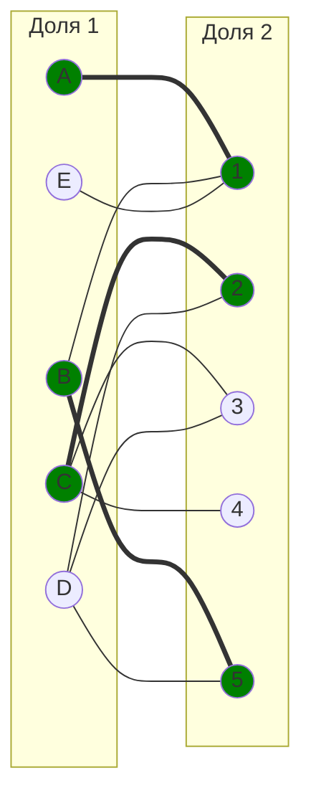

Построим чередующееся дерево с корнем в вершине D.

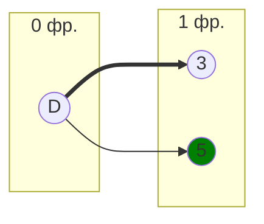

В этом дереве есть чередующаяся цепь, состоящая из ребра [D,3]. С помощью  данной цепи увеличиваем теущее паросочетание.

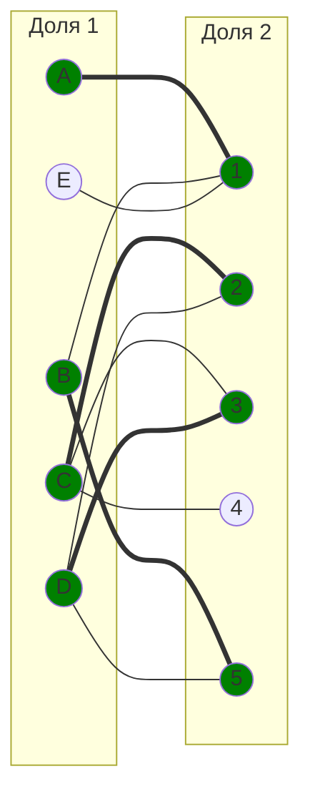

Попытаемся построить дерево из оставшейся непокрытой вершины E.

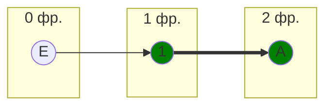

В построенном дереве нет цепей, чередующихся относительно текущего паросочетания. В указанном графе нет совершенного паросочетания. 

#### Проведем повторную редукцию матрицы

X = A, E

Y = 1

Минимальный элемент из строк, включенных в множество X, и столбцов, не включенных в множество Y равен 1 (A2).

Вычтем данное число из строк множества X и прибавим к столбцам  множества Y.

|       | **1** | **2** | **3** | **4** | **5** |
|-------|:-----:|:-----:|:-----:|:-----:|:-----:|
| **A** |   0   |   0   |  5   |   2   |   1   |
| **B** |   1   |   3   |  7   |  7   |   0   |
| **C** |  7   |   0   |   0   |   0   |  4   |
| **D** |  7   |   0   |   0   |  6   |   0   |
| **E** |   0   |   1   |  4   |  6   |   1   |

В ячейке A2 появился 0, добавим ребро в двудольный граф.

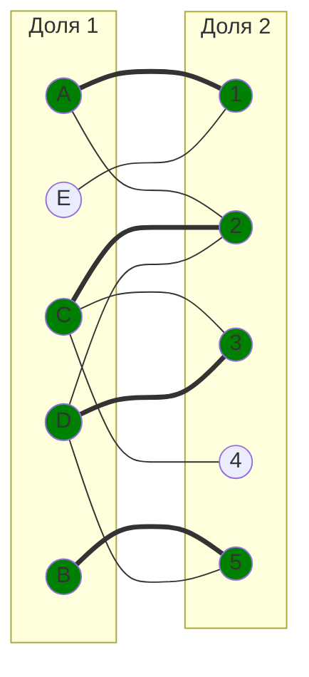

Попытаемся построить дерево из оставшейся непокрытой вершины E.

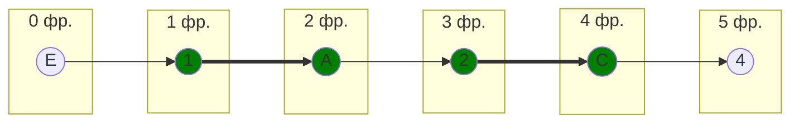

Построенное дерево содержит чередующуюся, относительно текущего паросочетания, цепь E1-1A-A2-2C-C4. Цепь начинается и заканчивается в непокрытых вершинах, все ребра в цепи чередуются по вхождению в текущее паросочетание.

Перекрасим найденную цепь и проверим полученное паросочетание.

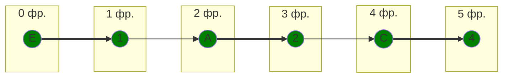

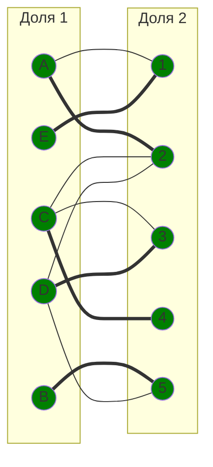

Полученное паросочетание является совершенным. Выпишем полученные назначения и их стоимости из исходной матрицы:

- A2 - 6
- B5 - 5
- C4 - 8
- D3 - 8
- E1 - 7

Общая стоимость затрат = 6 + 5 + 8 + 8 + 7 = 34.

## Ответ
Минимальная стоимость затрат 34, при следующих назначениях:
- задача A, исполнитель 2,
- задача B, исполнитель 5,
- задача C, исполнитель 4,
- задача D, исполнитель 3,
- задача E, исполнитель 1.

