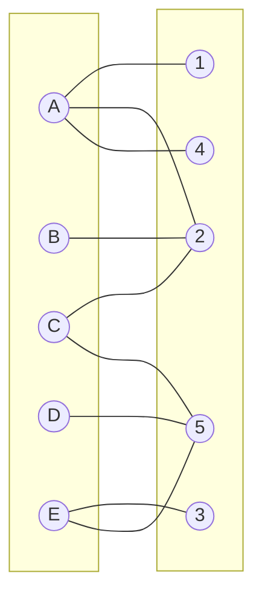
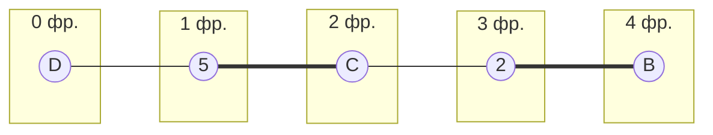
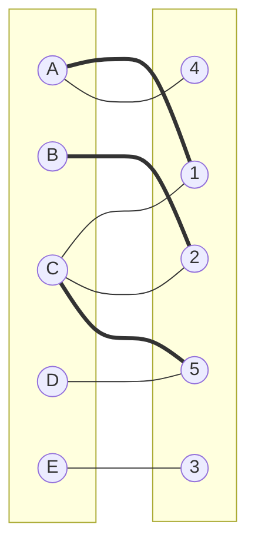
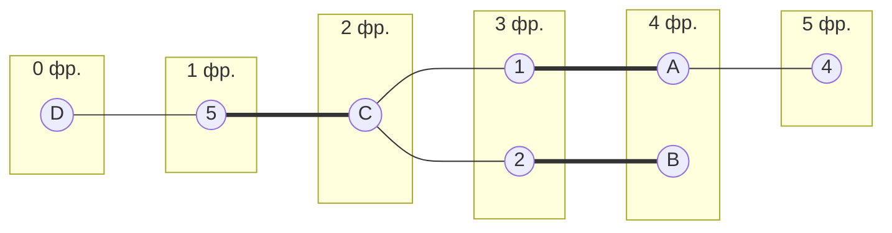
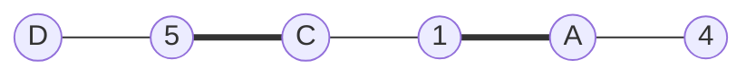
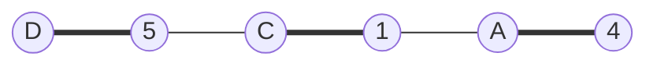
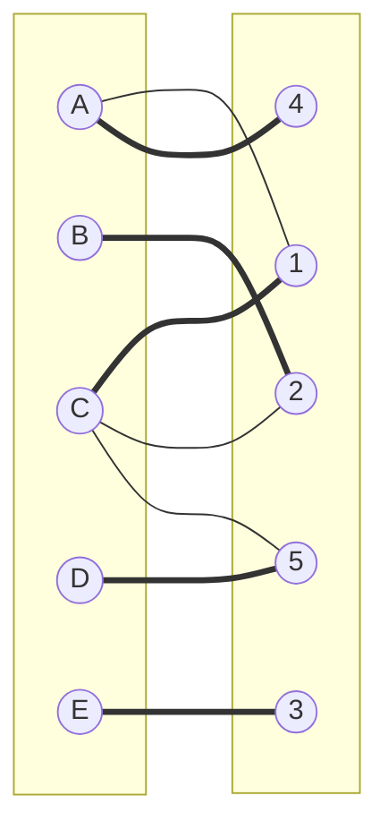

# Паросочетания. Венгерский алгоритм. Вариант 6

## Матрица затрат:

|       | **1** | **2** | **3** | **4** | **5** |
|-------|:-----:|:-----:|:-----:|:-----:|:-----:|
| **A** |   9   |   7   |  12   |   7   |   8   |
| **B** |  12   |   7   |  12   |  12   |  12   |
| **C** |   8   |   5   |  10   |   8   |   5   |
| **D** |  11   |  10   |  14   |  11   |   6   |
| **E** |  12   |  15   |  10   |  14   |   8   |

## Решение

Проведем редукцию матрицы затрат. Для этого вычтем из каждой строки минимальный элемент, получим следующую матрицу:

|       | **1** | **2** | **3** | **4** | **5** |
|-------|:-----:|:-----:|:-----:|:-----:|:-----:|
| **A** |   2   |   0   |   5   |   0   |   1   |
| **B** |   5   |   0   |   5   |   5   |   5   |
| **C** |   3   |   0   |   5   |   3   |   0   |
| **D** |   5   |   4   |   8   |   5   |   0   |
| **E** |   4   |   7   |   2   |   6   |   0   |

Повторим операцию с минимальными значениями каждого столбца:

|       | **1** | **2** | **3** | **4** | **5** |
|-------|:-----:|:-----:|:-----:|:-----:|:-----:|
| **A** |   0   |   0   |   3   |   0   |   1   |
| **B** |   3   |   0   |   3   |   5   |   5   |
| **C** |   1   |   0   |   3   |   3   |   0   |
| **D** |   3   |   4   |   6   |   5   |   0   |
| **E** |   2   |   7   |   0   |   6   |   0   |

Из полученной матрицы может быть составлен следующий граф (ребра добавляются согласно венгерскому алгоритму):

Выберем произвольное паросочетание [A, 1], [B, 2], [C, 5] и попытаемся построить дерево из непокрытой вершины D:

В построенном дереве нет цепей, чередующееся относительно текущего паросочетания, ветка закончилась в покрытой вершине, то есть в указанном графе нет совершенного паросочетания.

Проведем повторную редукцию матрицы затрат (X = {B, C, D}, Y = {2, 5}). Минимальный элемент - единица из ячейки C1. Вычтем его из строк X, получаем следующую матрицу:

|       | **1** | **2** | **3** | **4** | **5** |
|-------|:-----:|:-----:|:-----:|:-----:|:-----:|
| **A** |   0   |   0   |   3   |   0   |   1   |
| **B** |   2   |  -1   |   2   |   4   |   4   |
| **C** |   0   |  -1   |   2   |   2   |  -1   |
| **D** |   2   |   3   |   5   |   4   |  -1   |
| **E** |   2   |   7   |   0   |   6   |   0   |

Добавим это число к столбцам Y:

|       | **1** | **2** | **3** | **4** | **5** |
|-------|:-----:|:-----:|:-----:|:-----:|:-----:|
| **A** |   0   |   1   |   3   |   0   |   2   |
| **B** |   2   |   0   |   2   |   4   |   5   |
| **C** |   0   |   0   |   2   |   2   |   0   |
| **D** |   2   |   4   |   5   |   4   |   0   |
| **E** |   2   |   8   |   0   |   6   |   1   |

Получаем новый граф:

Заново построим дерево из D:

В полученном графе существует чередующаяся цепь:

После "перекращивания" получаем следующую цепь:

Очевидно, что вершины E и 3 могут быть покрыты паросочетанием путем добавления ребра [E, 3]. Итоговый граф:

Рассчитаем общую стоимость затрат (значения взяты из исходной матрицы):

A4 = 7
B2 = 7
C1 = 8
D5 = 6
E3 = 10

Общая стоимость затрат: 7 + 7 + 8 + 6 + 10 = 38

## Ответ:

Минимальная стоимость затрат - 38, при следующем распределении исполнителей:

- Исполнитель A - задача 4
- Исполнитель B - задача 2
- Исполнитель C - задача 1
- Исполнитель D - задача 5
- Исполнитель E - задача 3
