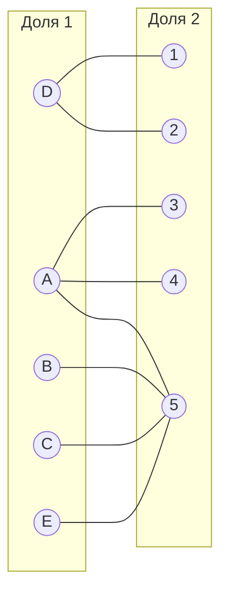
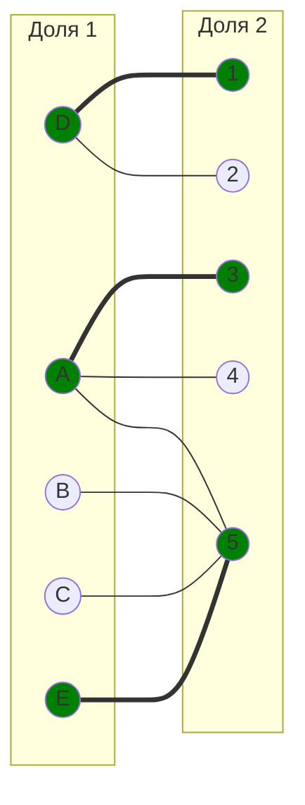
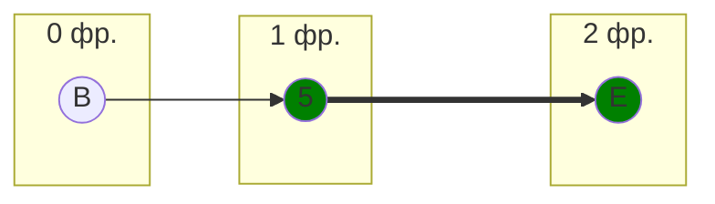
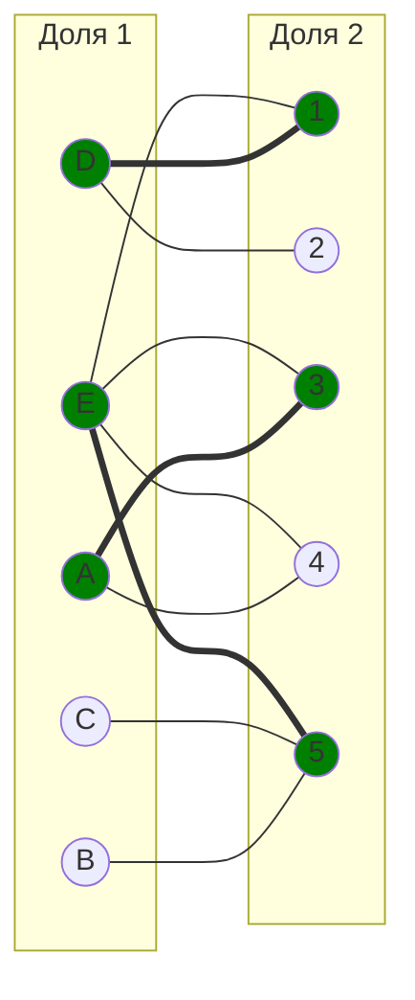
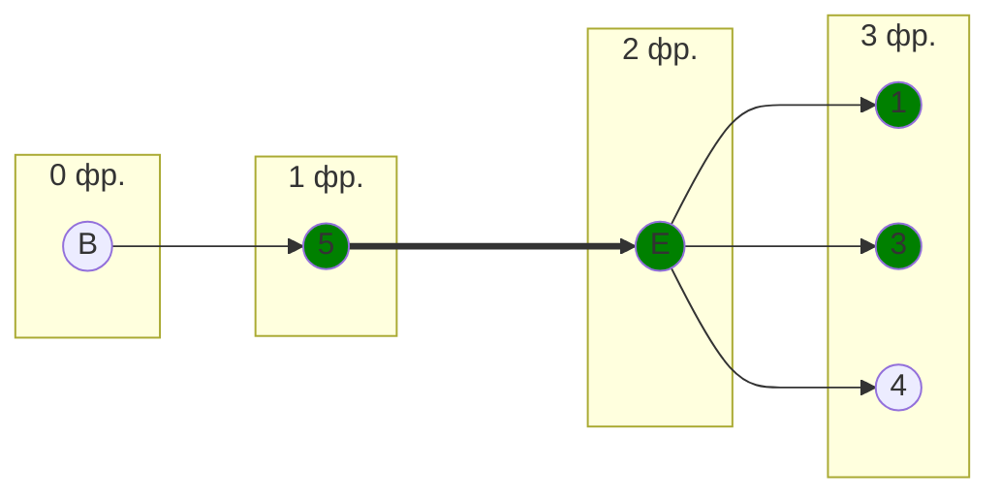
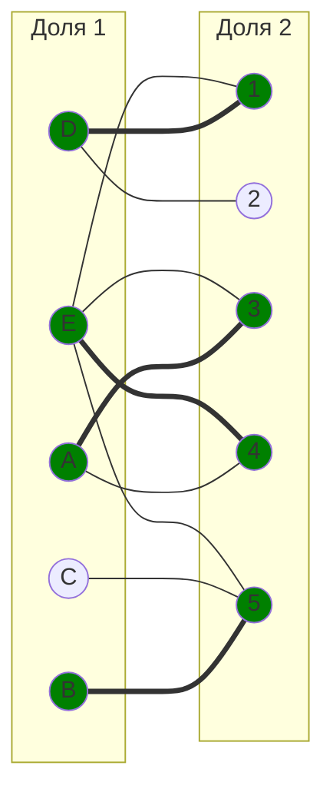
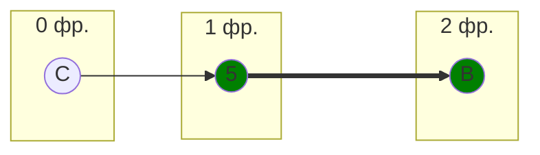
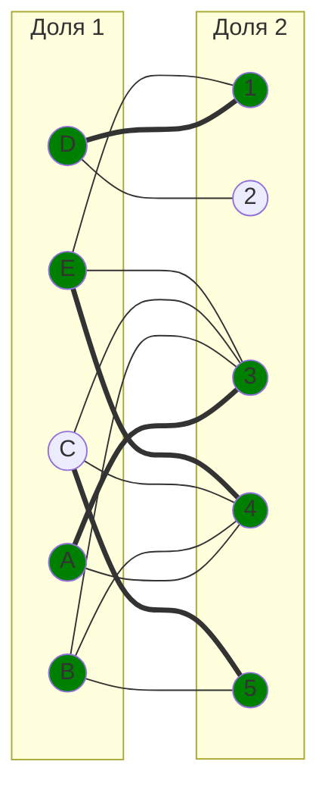
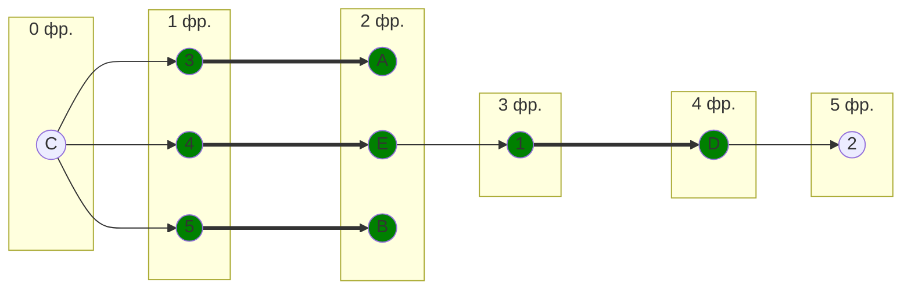
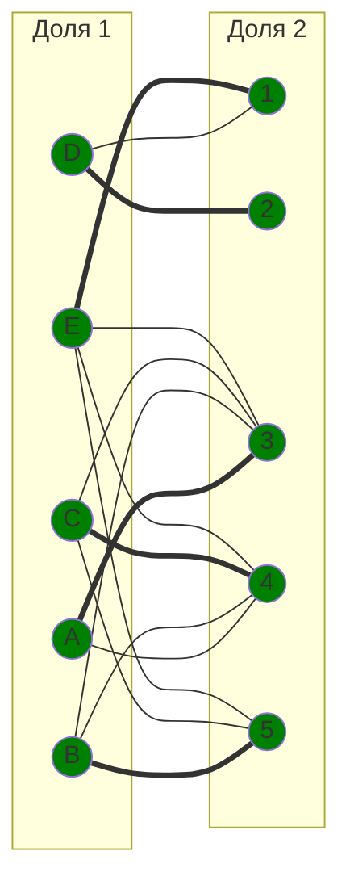

# Задача о назначении. Венгерский алгоритм

Для выполнения задания необходимо: 
1. Решить задачу о назначении с использованием Венгерского алгоритма **строго** так, как было разобрано на занятиях.
2. Оформить решение задачи по шагам с подробными комментариями, таблицами и диаграммами.
3. В ответе указать минимальную сумму затрат на выполнение всех заданий.
4. В ответе вывести найденные назначения.

### Вариант 7:
#### Матрица затрат:

|       | **1** | **2** | **3** | **4** | **5** |
|-------|:-----:|:-----:|:-----:|:-----:|:-----:|
| **A** |   9   |  10   |  11   |   9   |   7   |
| **B** |  10   |  11   |  12   |  10   |   5   |
| **C** |  10   |  14   |  12   |  10   |   5   |
| **D** |   6   |   7   |  14   |  12   |  14   |
| **E** |   8   |  10   |  12   |  10   |   6   |

--- 
## Решение

1. Редуцируем матрицу затрат, для этого вычтем из каждой строки минимальный элемент этой строки.

  |       | **1** | **2** | **3** | **4** | **5** |  |
|-------|:-----:|:-----:|:-----:|:-----:|:-----:|:-----:|
| **A** |   9   |  10   |  11   |   9   |   7   | _-7_ |
| **B** |  10   |  11   |  12   |  10   |   5   | _-5_ |
| **C** |  10   |  14   |  12   |  10   |   5   | _-5_ |
| **D** |   6   |   7   |  14   |  12   |  14   | _-6_ |
| **E** |   8   |  10   |  12   |  10   |   6   | _-6_ |

Получаем:

   |       | **1** | **2** | **3** | **4** | **5** | 
   |-------|:-----:|:-----:|:-----:|:-----:|:-----:|
   | **A** |   2   |  3    |  4    |   2   |   **0**   |
   | **B** |  5    |  6    |  7    |  5    |   **0**   |
   | **C** |  5    |  9    |  7    |  5    |   **0**   |
   | **D** |   **0**   |   1   |  8    |  6    |  8    |
   | **E** |   2   |   4   |  6    |  4    |   **0**   |
   |   | | _-1_ | _-4_  | _-2_ | |

   Отметим, что в столбцах 2, 3 и 4 отсутствуют нули, поэтому из этих столбцов также вычтем их минимальные элементы. В результате имеем редуцированную матрицу затрат:

   |       | **1** | **2** | **3** | **4** | **5** | 
   |-------|:-----:|:-----:|:-----:|:-----:|:-----:|
   | **A** |   2   |  2    |  **0**    |   **0**   |   **0**   |
   | **B** |  5    |  5    |  3    |  3    |   **0**   |
   | **C** |  5    |  8    |  3    |  3    |   **0**   |
   | **D** |   **0**   |   **0**   |  4    |  4    |  8    |
   | **E** |   2   |   3   |  2    |  2    |   **0**   |

2. Нули в матрице затрат обозначают наименее затратные варианты назначений. Отобразим на двудольном графе соответствующие им рёбра.

Выберем произвольное паросочетание $[A, 3]$, $[D, 1]$, $[E, 5]$ и построим совершенное паросочетание с помощью чередующихся деревьев. Непокрытыми остались вершины $B$ и $C$, 2 и 4.

3. Начнём строить дерево из непокрытой вершины $B$.

Не получилось построить цепь из одной непокрытой вершины в другую. Следовательно, в этом графе нет совершенного паросочетания.

4. Выполним повторную редукцию матрицы затрат. Пусть $X$ - это множество всех покрытых в построенном дереве вершин первой доли графа, а $Y$ - множество покрытых в построенном дереве вершин правой доли графа. Получаем:

$$
X = \\{ B, E \\},
$$

$$
Y = \\{ 5 \\}.
$$

Теперь для редукции минимальный элемент надо искать во множестве $\\{X \cap \overline{Y}\\}$, то есть в строках $B$ и $E$ и столбцах 1, 2, 3, 4 матрицы затрат.

   |       | **1** | **2** | **3** | **4** | **5** | |
   |-------|:-----:|:-----:|:-----:|:-----:|:-----:| :-----:|
   | **A** |   2   |  2    |  **0**    |   **0**   |   **0**   |  |
   | **B** |  5    |  5    |  3    |  3    |   **0**   | _-2_ |
   | **C** |  5    |  8    |  3    |  3    |   **0**   | |
   | **D** |   **0**   |   **0**   |  4    |  4    |  8   | |
   | **E** |   2   |   3   |  2    |  2    |   **0**   | _-2_ |
   |       |        |      |       |       |    _+2_    |     |

Минимальный элемент в указанной области - 2, вычтем его из строк $B$ и $E$. Чтобы при вычитании из 0 в столбце 5 не получились отрицательные значения, к элементам столбца прибавим 2. Получаем матрицу:

   |       | **1** | **2** | **3** | **4** | **5** | |
   |-------|:-----:|:-----:|:-----:|:-----:|:-----:| :-----:|
   | **A** |   2   |  2    |  **0**    |   **0**   |     2  |  |
   | **B** |  3    |  3    |  1   |  1    |   **0**   |   |
   | **C** |  5    |  8    |  3    |  3    |   2   | _-2_|
   | **D** |   **0**   |   **0**   |  4    |  4    |  10   | |
   | **E** |   **0**   |   1   |  **0**    |  **0**    |   **0**   |  |

   Обратим внимание, что теперь в строке $C$ отсутствуют нули, поэтому редуцируем матрицу обычным образом - из строки $C$ вычтем её минимальный элемент 2.

   |       | **1** | **2** | **3** | **4** | **5** |
   |-------|:-----:|:-----:|:-----:|:-----:|:-----:|
   | **A** |   2   |  2    |  **0**    |   **0**   |    2   | 
   | **B** |  3    |  3    |  1   |  1    |   **0**   |   
   | **C** |  3    |  6    |  1    |  1    |   **0**   |
   | **D** |   **0**   |   **0**   |  4    |  4    |  10   | 
   | **E** |   **0**   |   1   |  **0**    |  **0**    |   **0**   |  

   Обновим граф в соответствии с полученной матрицей. Добавим на него рёбра, соответствующие новым нулям - $[E, 1]$, $[E, 3]$, $[E, 4]$. При этом в ячейке $[A, 5]$ теперь ненулевое значение, поэтому это ребро следует удалить из графа. Обновлённый граф:

5. Построим чередующуюся цепь из непокрытой вершины $B$.

Получили цепь из непокрытой вершины $B$ в непокрытую вершину 4. Теперь "перекрасим" цепь - в выбранное паросочетание добавим рёбра $[B, 5]$ и $[E, 4]$, а ребро $[E, 5]$ из него уберём. Отобразим новое паросочетание на графе:

Непокрытыми остались вершины $C$ и 2.

6. Начнём строить цепь из вершины $C$.

В этом графе нельзя построить чередующуюся цепь, и, значит, в нём нет совершенного паросочетания.

7. Повторно выполним редукцию матрицы затрат. Выпишем множества: $X = \\{ B, C\\}$,  $Y = \\{ 5\\}$. Минимальный элемент необходимо искать в строках матрицы $B$ и $C$ и столбцах 1, 2, 3, 4. Это элемент 1, вычтем его из указанных строк и прибавим к столбцу 5.
   |       | **1** | **2** | **3** | **4** | **5** | | 
   |-------|:-----:|:-----:|:-----:|:-----:|:-----:|:-----:|
   | **A** |   2   |  2    |  **0**    |   **0**   |    2   |  |
   | **B** |  3    |  3    |  1   |  1    |   **0**   |  _-1_  |
   | **C** |  3    |  6    |  1    |  1    |   **0**   | _-1_|
   | **D** |   **0**   |   **0**   |  4    |  4    |  10  |  |
   | **E** |   **0**   |   1   |  **0**    |  **0**    |   **0**   |  |
   |       |          |      |             |           |     _+1_    |    | 

Получаем матрицу:

   |       | **1** | **2** | **3** | **4** | **5** | 
   |-------|:-----:|:-----:|:-----:|:-----:|:-----:|
   | **A** |   2   |  2    |  **0**    |   **0**   |   3  | 
   | **B** |  2    |  2    |  **0**   |  **0**    |   **0**   |  
   | **C** |  2    |  5    |  **0**   |  **0**   |   **0**   | 
   | **D** |   **0**   |   **0**   |  4    |  4    |  11  | 
   | **E** |   **0**   |   1   |  **0**    |  **0**    |   1   | 

Новые нули появились в ячейках $[B, 3]$, $[B. 4]$, $[C, 3]$, $[C, 4]$, добавим соответствующие им рёбра на граф. В ячейке $[E, 5]$ теперь ненулевое значение, это ребро удалим.

9. Построим чередующуюся цепь из непокрытой вершины $C$.

Получили цепь из непокрытой вершины $C$ в непокрытую вершину 2. "Перекрасим" её: в паросочетание добавим рёбра $[C, 4]$, $[E, 1]$, $[D, 2]$ и уберём из него $[E, 4]$ и $[D, 1]$. Имеем **совершенное** паросочетание: $[A, 3]$, $[B, 5]$, $[C, 4]$, $[D, 2]$, $[E, 1]$.

10. Минимальные стоимости определим по ячейкам матрицы затрат, соответствующим совершенному паросочетанию:
    - $[A, 3]$ = 11,
    - $[B, 5]$ = 5, 
    - $[C, 4]$ = 10,
    - $[D, 2]$ = 7, 
    - $[E, 1]$ = 8.

   Общая стоимость затрат: 11 + 5 + 10 + 7 + 8 = 41.

## Ответ
Минимальная стоимость затрат 41 достигается при назначениях:
- задача $A$, исполнитель 3;
- задача $B$, исполнитель 5;
- задача $C$, исполнитель 4;
- задача $D$, исполнитель 2;
- задача $E$, исполнитель 1.
