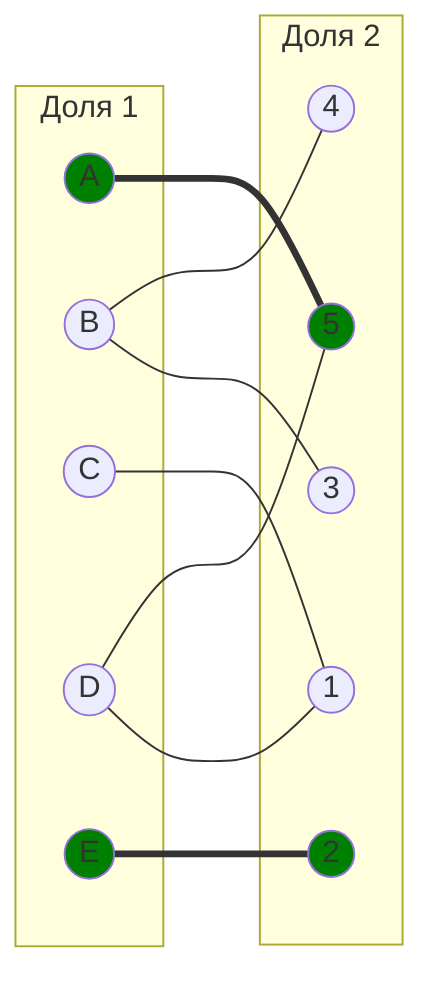
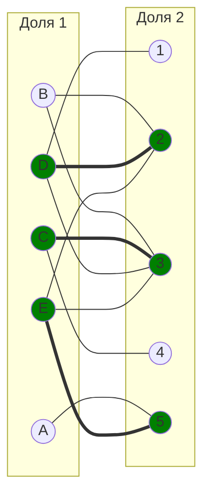

# Паросочетания. Венгерский алгоритм.

## Варианты 1-8. Задача о назначении. Венгерский алгоритм
Для выполнения задания необходимо: 
1. Решить задачу о назначении с использованием Венгерского алгоритма **строго** так, как было разобрано на занятиях.
2. Оформить решение задачи по шагам с подробными комментариями, таблицами и диаграммами.
3. В ответе указать минимальную сумму затрат на выполнение всех заданий.
4. В ответе вывести найденные назначения

**Решение должно содержать номер варианта и подробное пошаговое описание.**

## Варианты 9-10. Максимальное и совершенное паросочетание.
Для выполнения задания необходимо найти совершенное и максимальное паросочетание в указанном двудольном графе, начав оиск с указаного начального паросочетания. Необходимо для решения задач нужно выбрать подходящий алгоритм (из рассмотренных на занятии), обосновать свой выбор и строго следовать выбранному алгоритму.

**Решение должно содержать номер варианта и подробное пошаговое описание.**

### Вариант 1:
#### Матрица затрат:

|       | **1** | **2** | **3** | **4** | **5** |
|-------|:-----:|:-----:|:-----:|:-----:|:-----:|
| **A** |  15   |  15   |  11   |   9   |  14   |
| **B** |   8   |   8   |   6   |  11   |  15   |
| **C** |  12   |  15   |  15   |  10   |   9   |
| **D** |  12   |  15   |  10   |   7   |   5   |
| **E** |  11   |  10   |   7   |  15   |   5   |

### Вариант 2:
#### Матрица затрат:

|       | **1** | **2** | **3** | **4** | **5** |
|-------|:-----:|:-----:|:-----:|:-----:|:-----:|
| **A** |   9   |   8   |   7   |  14   |  14   |
| **B** |  13   |  13   |  14   |   6   |  12   |
| **C** |   7   |   8   |   9   |   6   |   7   |
| **D** |   8   |   9   |   7   |   9   |   5   |
| **E** |   9   |   9   |  14   |   7   |   5   |

### Вариант 3:
#### Матрица затрат:

|       | **1** | **2** | **3** | **4** | **5** |
|-------|:-----:|:-----:|:-----:|:-----:|:-----:|
| **A** |  12   |  14   |   6   |   8   |   5   |
| **B** |   7   |  10   |  10   |   6   |   6   |
| **C** |   9   |   8   |  13   |  14   |  12   |
| **D** |   7   |   9   |   5   |  10   |  12   |
| **E** |  14   |   6   |  11   |  10   |   5   |

### Вариант 4:
#### Матрица затрат:

|       | **1** | **2** | **3** | **4** | **5** |
|-------|:-----:|:-----:|:-----:|:-----:|:-----:|
| **A** |   5   |   6   |  13   |   9   |   6   |
| **B** |   6   |   9   |  15   |  14   |   5   |
| **C** |  13   |   7   |   9   |   8   |  10   |
| **D** |  12   |   6   |   8   |  13   |   5   |
| **E** |   7   |   9   |  14   |  15   |   8   |

### Вариант 5:
#### Матрица затрат:

|       | **1** | **2** | **3** | **4** | **5** |
|-------|:-----:|:-----:|:-----:|:-----:|:-----:|
| **A** |  15   |   7   |   7   |  12   |  12   |
| **B** |  15   |   5   |  14   |  14   |  11   |
| **C** |  11   |  12   |   5   |  11   |   7   |
| **D** |  14   |   5   |  12   |   6   |   6   |
| **E** |  13   |   8   |  13   |  15   |   8   |

### Вариант 6:
#### Матрица затрат:

|       | **1** | **2** | **3** | **4** | **5** |
|-------|:-----:|:-----:|:-----:|:-----:|:-----:|
| **A** |   9   |   7   |  12   |   7   |   8   |
| **B** |  12   |   7   |  12   |  12   |  12   |
| **C** |   8   |   5   |  10   |   8   |   5   |
| **D** |  11   |  10   |  14   |  11   |   6   |
| **E** |  12   |  15   |  10   |  14   |   8   |

### Вариант 7:
#### Матрица затрат:

|       | **1** | **2** | **3** | **4** | **5** |
|-------|:-----:|:-----:|:-----:|:-----:|:-----:|
| **A** |   9   |  10   |  11   |   9   |   7   |
| **B** |  10   |  11   |  12   |  10   |   5   |
| **C** |  10   |  14   |  12   |  10   |   5   |
| **D** |   6   |   7   |  14   |  12   |  14   |
| **E** |   8   |  10   |  12   |  10   |   6   |

### Вариант 8:
#### Матрица затрат:

|       | **1** | **2** | **3** | **4** | **5** |
|-------|:-----:|:-----:|:-----:|:-----:|:-----:|
| **A** |  12   |  11   |  10   |  13   |  14   |
| **B** |  10   |   6   |  12   |   7   |  15   |
| **C** |   9   |   7   |  15   |  14   |   5   |
| **D** |  11   |   8   |  11   |  14   |   7   |
| **E** |  13   |   5   |   6   |   9   |  10   |

### Вариант 9:

1. Найдите максимальное паросочетание в двудольном графе. Для поиска используйте цепи, чередующиеся относительно паросочетания. В качестве начального паросочетания используйте: $[A, 5]$, $[E, 2]$. Строго следуйте алгоритму, рассмотренному на занятиях.

2. Найдите совершенное паросочетание в двудольном графе. Для поиска используйте цепи, чередующиеся относительно паросочетания. В качестве начального паросочетания используйте: $[C, 3]$, $[D, 2]$, $[E, 5]$. Строго следуйте алгоритму, рассмотренному на занятиях.

### Вариант 10:

1. В двудольном графе одна доля состоит из вершин А, В, С, D, Е, а другая - из вершин 1, 2, 3, 4, 5. Список смежных вершин этого графа: A(1,2,4), B(1,4,5), C(3,4), D(2,5), E(5). Волновым методом найти максимальное паросочетание в указанном графе, выбрав в качестве начального паросочетания набор рёбер $[А,1]$, $[С,4]$, $[D,5]$. Строго следуйте алгоритму, рассмотренному на занятиях.

2. В двудольном графе одна доля состоит из вершин А, В, С, D, Е, а другая - из вершин 1, 2, 3, 4, 5. Список смежных вершин этого графа: A(1,2,4), B(2,4), C(2,5), D(5), E(3,4,5). С помощью чередующихся деревьев найти максимальное паросочетание в указанном графе, выбрав в качестве начального паросочетания набор рёбер $[А,1]$, $[B,2]$, $[C,5]$. Строго следуйте алгоритму, рассмотренному на занятиях.
