# Задание №16

# Задача о максимальном потоке.

## Постановка задачи
1. Дана сеть (взвешенный ориентированный граф) с источником s и стоком t.
2. Для каждой дуги определена ее пропускная способность.
3. Необходимо найти максимальный поток для указанной сети. 

### Вариант 4:

#### Пропускная способность дуг сети:

|          Дуги          | sb  | sc  | bt  | ba  | bd  | cd  | ad  | at  | dt  |
| :--------------------: | :-: | :-: | :-: | :-: | :-: | :-: | :-: | :-: | :-: |
| Пропускная способность | 10  | 10  |  3  |  9  |  6  | 12  |  6  |  6  | 12  |

### 1. Построим сеть с источником s, стоком t и указанными пропускными способностями дуг.

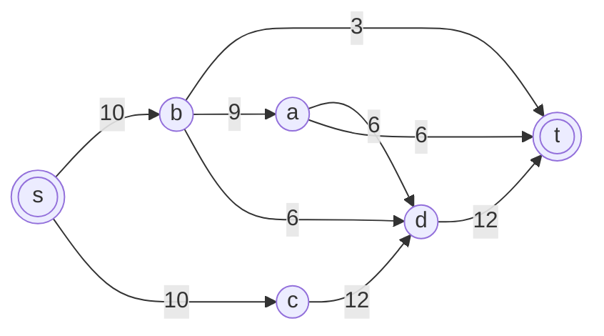

Построим остаточную сеть. Так как изначально поток в сети не задан, все дуги сети являются пустыми (локальный поток равен нулю), соответственно в остаточную сеть необходимо вынести обратную дугу с весом равным пропускной способности.

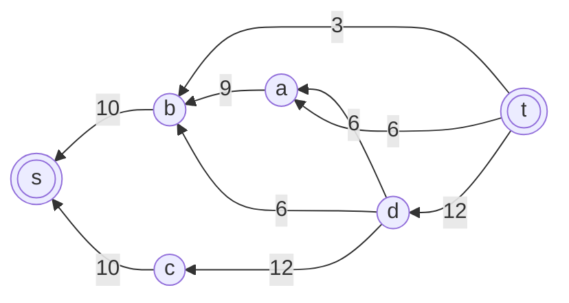

### 2. Проведем поиск увеличивающего пути в остаточной сети

В остаточной сети найден увеличивающий путь t -> d -> c -> s. Минимальный вес дуг на этом пути равен 10.

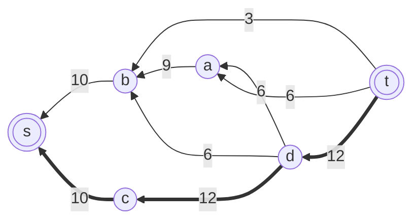

Уменьшим вес дуг на найденном пути, дуги для которых вес стал нулевым удалим из остаточной сети.

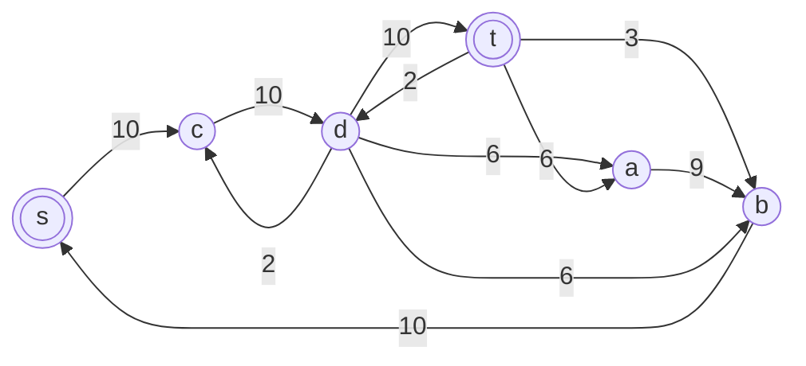

Скорректируем соответствующим образом локальные потоки в исходной сети. Первым числом будем указывать локальный поток, вторым пропускную способность дуги.

### 3. Продолжим поиск увеличивающего пути в остаточной сети

В остаточной сети найден увеличивающий путь t -> b -> s. Минимальный вес дуг на этом пути равен 3.

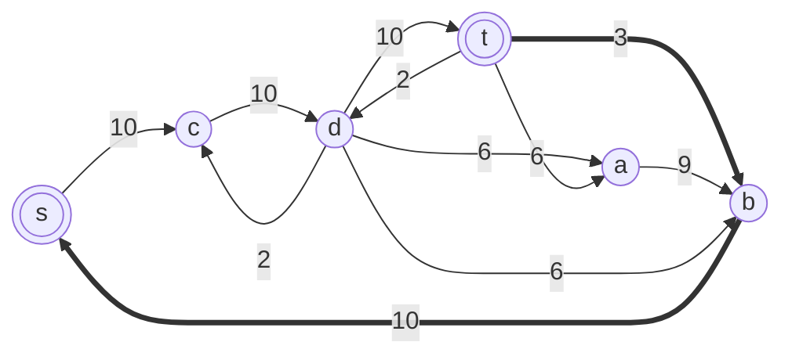

Уменьшим вес дуг на найденном пути, дуги для которых вес стал нулевым удалим из остаточной сети.

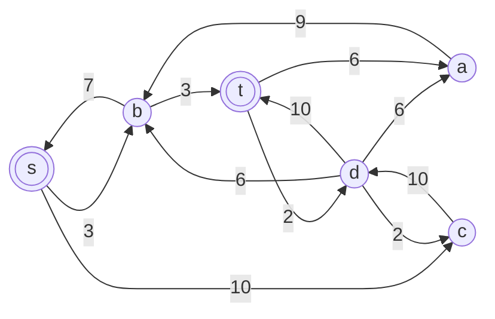

Скорректируем соответствующим образом локальные потоки в исходной сети.

### 4. Продолжим поиск увеличивающего пути в остаточной сети

В остаточной сети найден увеличивающий путь t -> a -> b -> s. Минимальный вес дуг на этом пути равен 6.

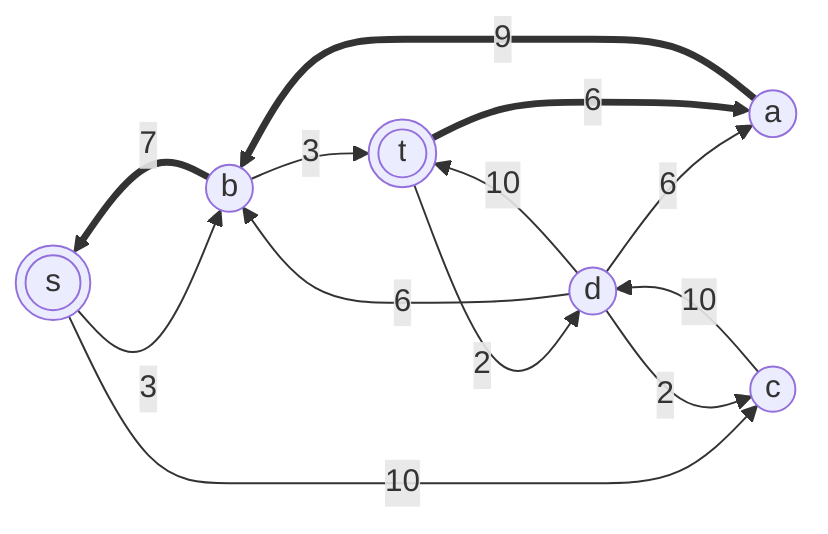

Уменьшим вес дуг на найденном пути, дуги для которых вес стал нулевым удалим из остаточной сети.

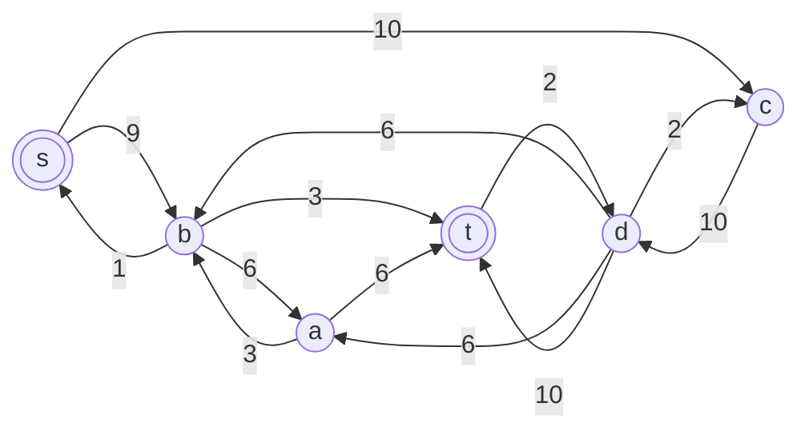

Скорректируем соответствующим образом локальные потоки в исходной сети.

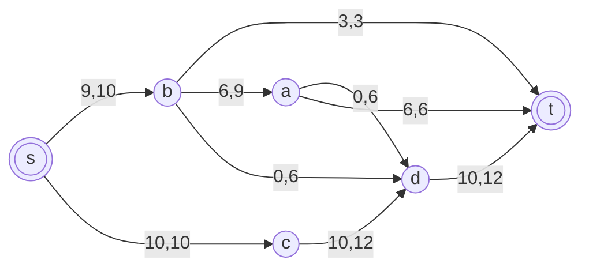

### 5. Продолжим поиск увеличивающего пути в остаточной сети

В остаточной сети найден увеличивающий путь t -> d -> b -> s. Минимальный вес дуг на этом пути равен 1.

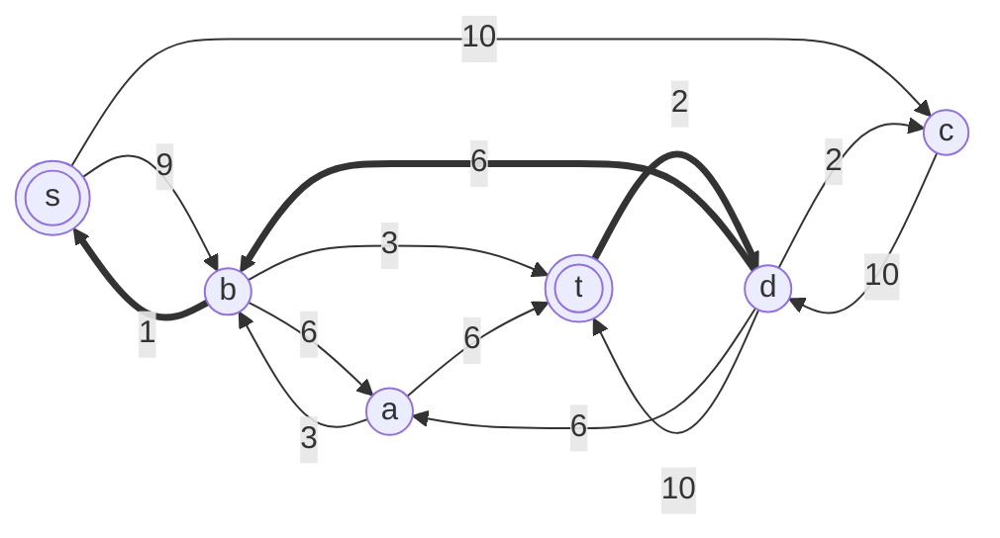

Уменьшим вес дуг на найденном пути, дуги для которых вес стал нулевым удалим из остаточной сети.

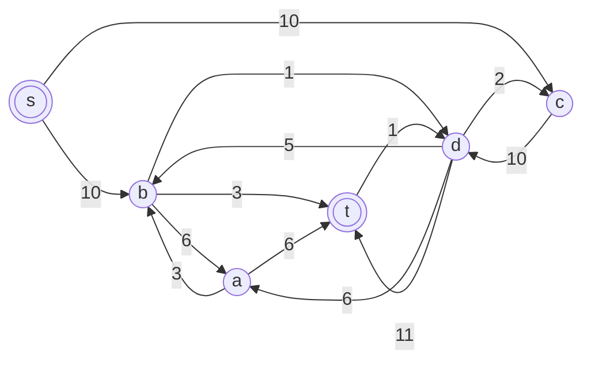

Скорректируем соответствующим образом локальные потоки в исходной сети.

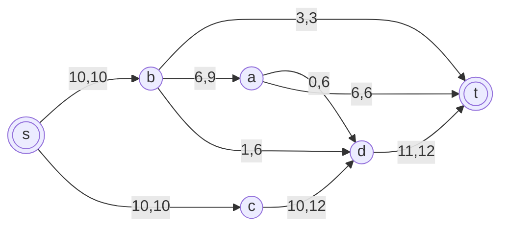

### 6. Продолжим поиск увеличивающего пути в остаточной сети

В остаточной сети не найдено увеличивающих путей из t в s, следовательно, алгоритм завершил работу и найденный поток величиной 20 является максимальным для данной сети.

Проверим: из вершины t доступна только вершина d (по дуге t -> d с весом 1). Из вершины d доступны вершины b, c и a, но ни из одной из них невозможно добраться до s — дуга b -> s была удалена, а дуги c -> s не существует. Таким образом, пути из t в s в остаточной сети не существует.

### 7. Проверим значение максимального потока перебором всех разрезов сети.

Разрез сети - разбиение множества вершин на два подмножества $V_1$ и $V_2$, где во множество $V_1$ входит источник, а в $V_2$ входит сток.

Пропускная способность разреза - сумма пропускной способности дуг, начинающихся в вершинах из множества $V_1$ и оканчивающихся в вершинах из $V_2$.

Для сети из n вершин существует $2^{n-2}$ различных разрезов, так как две вершины (источник и сток) «зафиксированы» в $V_1$ и $V_2$, остальные вершины можно различными способами распределять между множествами $V_1$ и $V_2$.

Для сети из 6 вершин нужно найти $2^{6-2}$ = $2^4$ = 16 разрезов.

| №  | V₁          | V₂          | Пропускная способность разреза          |
|----|-------------|-------------|-----------------------------------------|
| 1  | {s}         | {a,b,c,d,t} | sb + sc = 10 + 10 = **20**              |
|    | **s + одна вершина из a, b, c, d** | | |
| 2  | {s,a}       | {b,c,d,t}   | sb + sc + ad + at = 10 + 10 + 6 + 6 = 32 |
| 3  | {s,b}       | {a,c,d,t}   | sc + bt + ba + bd = 10 + 3 + 9 + 6 = 28 |
| 4  | {s,c}       | {a,b,d,t}   | sb + cd = 10 + 12 = 22                  |
| 5  | {s,d}       | {a,b,c,t}   | sb + sc + dt = 10 + 10 + 12 = 32        |
|    | **s + пара вершин из a, b, c, d** | | |
| 6  | {s,a,b}     | {c,d,t}     | sc + bt + bd + ad + at = 10 + 3 + 6 + 6 + 6 = 31 |
| 7  | {s,a,c}     | {b,d,t}     | sb + cd + ad + at = 10 + 12 + 6 + 6 = 34 |
| 8  | {s,a,d}     | {b,c,t}     | sb + sc + at + dt = 10 + 10 + 6 + 12 = 38 |
| 9  | {s,b,c}     | {a,d,t}     | bt + ba + bd + cd = 3 + 9 + 6 + 12 = 30 |
| 10 | {s,b,d}     | {a,c,t}     | sc + bt + ba + dt = 10 + 3 + 9 + 12 = 34 |
| 11 | {s,c,d}     | {a,b,t}     | sb + dt = 10 + 12 = 22                  |
|    | **s + три вершины из a, b, c, d** | | |
| 12 | {s,a,b,c}   | {d,t}       | bt + bd + ad + cd + at = 3 + 6 + 6 + 12 + 6 = 33 |
| 13 | {s,a,b,d}   | {c,t}       | sc + bt + at + dt = 10 + 3 + 6 + 12 = 31 |
| 14 | {s,a,c,d}   | {b,t}       | sb + at + dt = 10 + 6 + 12 = 28         |
| 15 | {s,b,c,d}   | {a,t}       | bt + ba + dt = 3 + 9 + 12 = 24          |
|    | **s + четыре вершины из a, b, c, d** | | |
| 16 | {s,a,b,c,d} | {t}         | bt + at + dt = 3 + 6 + 12 = 21          |

Минимальная пропускная способность разреза равна 20 ( {s} / {a, b, c, d, t} ), что совпадает с найденной величиной максимального потока в сети.

### Ответ:

Максимальный поток в сети равен 20, он реализуется следующими локальными потоками:

