# Задание №16. Вариант 1
# Задача о максимальном потоке.

***Остаточная сеть*** – это сеть с тем же набором вершин, что и у исходной сети. Наличие дуг и их веса в остаточной сети определяются по следующим правилам: 
1. Если дуга $e$ исходной сети является насыщенной (т.е. локальный поток $f(e)$ равен пропускной способности), то в остаточной сети проводим дугу $e$ с весом $p(e)$;
2. Если дуга $e=[v_{i},v_{j}]$ исходной сети является пустой (т.е. локальный поток $f(e)$ равен нулю), то в остаточной сети проводим обратную дугу $[v_{j},v_{i}]$ с весом $p(e)$;
3. Если дуга $e=[v_{i},v_{j}]$ исходной сети не является ни пустой, ни насыщенной (т.е. для неё выполняются неравенства $0<f(e)<p(e)$ ), то в остаточной сети проводим две дуги: саму дугу $e=[v_{i},v_{j}]$ с весом $f(e)$ и обратную дугу $[v_{j},v_{i}]$ с весом, равным $p(e)-f(e)$.

*Остаточная сеть* содержит информацию о незадействованном резерве, который можно использовать для наращивания в исходной сети уже существующего потока.

Любой ориентированный путь в остаточной сети из стока $t$ в источник $s$ называется ***увеличивающим путём***.

### Алгоритм для нахождения максимального потока

Рассмотрим теперь алгоритм для нахождения максимального потока. Он состоит в постепенном наращивании уже имеющегося потока вдоль некоторого ориентированного пути из источника $s$ в сток $t$. Поиск такого пути осуществляется с помощью остаточной сети. Наращивание потока происходит до тех пор, пока его величина не станет максимально возможной для заданной сети. В качестве начального можно взять, например, нулевой поток.

Уменьшение весов дуг $e_{i},e_{j},e_{k}$ на величину $d$ (минимальный вес дуг, образующих этот путь) в остаточной сети означает следующую корректировку локальных потоков в исходной сети:
1. Если дуга $e$ из увеличивающего пути существует в исходной сети, то локальный поток вдоль неё $f(e)$ уменьшается на величину $d$. 
2. Если же дуга $e$ в исходной сети отсутствует, то в ней имеется дуга, обратная по отношению к $e$. Уменьшение веса дуги $e$ на величину $d$ в остаточной сети означает уменьшение резерва в исходной сети, что эквивалентно увеличению локального потока вдоль дуги, обратной по отношению к $e$, на величину $d$. Вследствие указанной корректировки локальных потоков ровно на величину $d$ возрастает и величина потока. 

После нахождения увеличивающего пути в остаточной сети происходит корректировка обеих сетей – и остаточной, и исходной. 

В скорректированной остаточной сети снова ищут увеличивающий путь и корректируют обе сети и т.д. Алгоритм завершает работу, как только в остаточной сети не останется ни одного увеличивающего пути. В этот момент веса дуг в остаточной сети будут показывать реальные локальные потоки, а также неиспользованные резервы, что тоже может представлять интерес, например, для внесения изменений в исходную сеть (добавление дуг, повышение пропускных способностей дуг) с целью увеличить уже существующий поток.

## Постановка задачи
1. Дана сеть (взвешенный ориентированный граф) с источником s и стоком t, для каждой дуги определена ее пропускная способность.
2. Построить сеть с указанием пропускной способности дуг.
3. Построить остаточную сеть.
4. Определить максимальный поток методом поиска увеличивающих путей в остаточной сети.
5. Проверить величину максимального потока через поиск минимальной пропускной способности разрезов сети, то есть рассчитать пропускную способность всех разрезов сети.

Пропускная способность дуг сети указана в таблице.

|          Дуги          | sa | sс | aс | ba | cb | at | bt | ct |
|:----------------------:|:--:|:--:|:--:|:--:|:--:|:--:|:--:|:--:|
| Пропускная способность | 8  | 6  | 7  | 4  | 10 | 3  | 9  | 4  |

## 1. Построим сеть с источником **s**, стоком **t** и указанными пропускными способностями дуг.

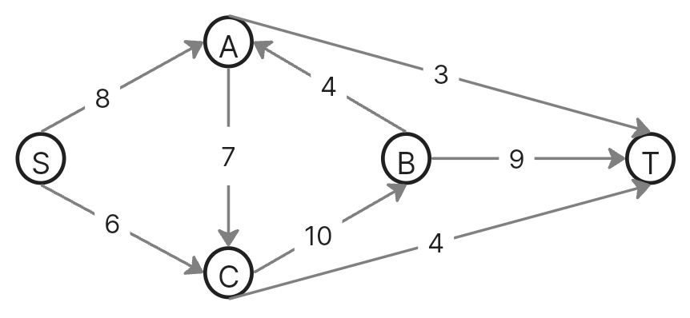

Построим остаточную сеть. Так как изначально поток в сети не задан, все дуги сети являются пустыми (локальный поток равен нулю), соответственно в остаточную сеть необходимо вынести обратную дугу с весом равным пропускной способности. 

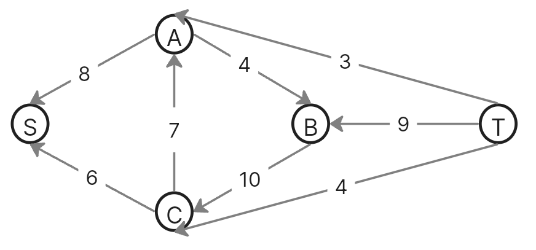

## 2. Проведем поиск увеличивающего пути в остаточной сети
В остаточной сети найден увеличивающий путь t -> b -> c -> s. Минимальный вес дуг на этом пути равен 6.

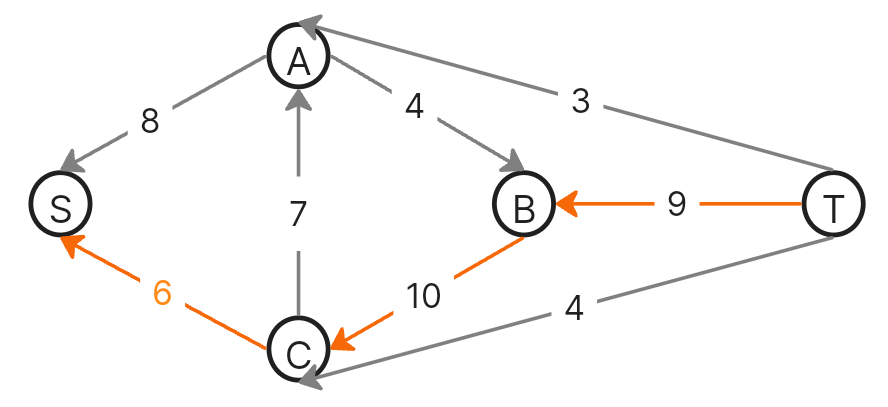

Уменьшим вес дуг на найденном пути и при этом увеличим на то же число вес дуг локального потока.

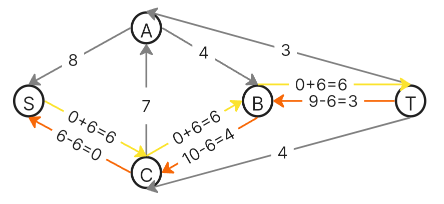

Дуги для которых вес стал нулевым удалим из остаточной сети.

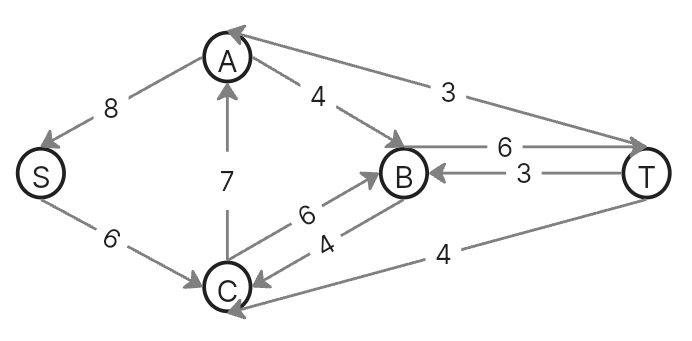

Скорректируем соответствующим образом локальные потоки в исходной сети. Первым числом будем указывать локальный поток, вторым пропускную способность дуги. 

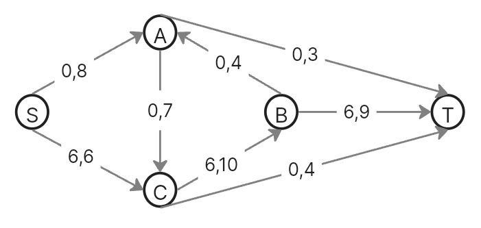

## 3. Продолжим поиск увеличивающего пути в остаточной сети

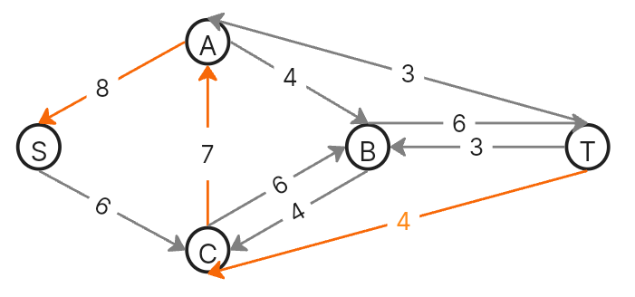

В остаточной сети найден увеличивающий путь t -> c -> a -> s. Минимальный вес дуг на этом пути равен 4.

Уменьшим вес дуг на найденном пути, дуги для которых вес стал нулевым удалим из остаточной сети.

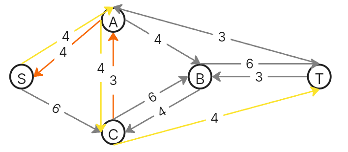

Скорректируем соответствующим образом локальные потоки в исходной сети.

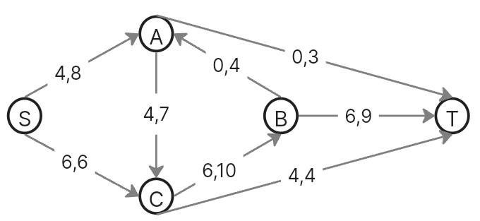

## 4. Продолжим поиск увеличивающего пути в остаточной сети

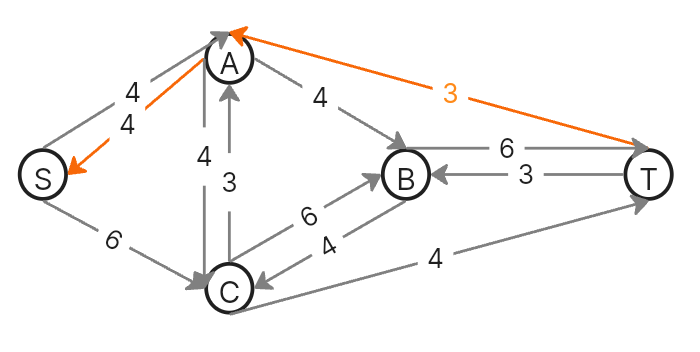

В остаточной сети найден увеличивающий путь t -> a -> s. Минимальный вес дуг на этом пути равен 3.

Уменьшим вес дуг на найденном пути, дуги для которых вес стал нулевым удалим из остаточной сети.

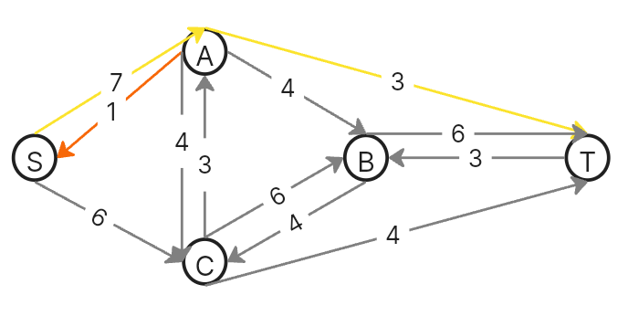

Скорректируем соответствующим образом локальные потоки в исходной сети.

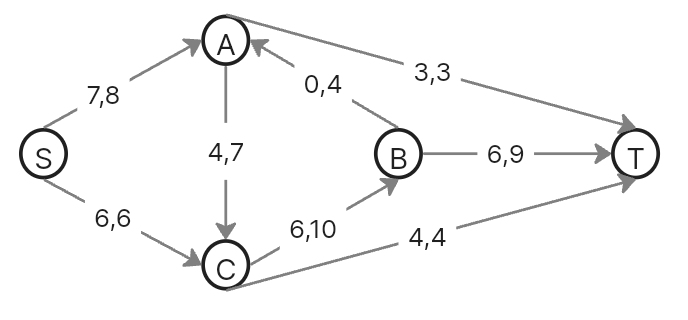

## 5. Продолжим поиск увеличивающего пути в остаточной сети

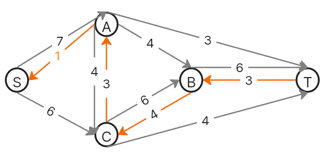

В остаточной сети найден увеличивающий путь t -> b -> c -> a -> s. Минимальный вес дуг на этом пути равен 1.

Уменьшим вес дуг на найденном пути, дуги для которых вес стал нулевым удалим из остаточной сети.

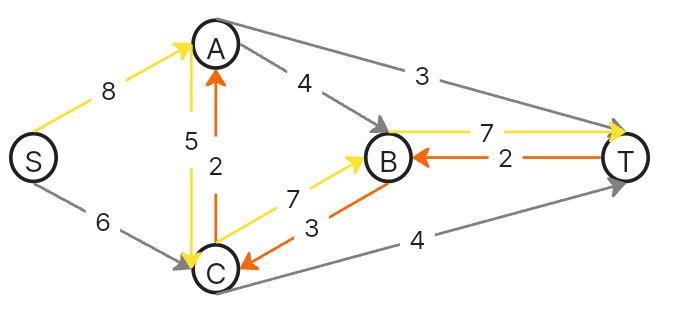

Скорректируем соответствующим образом локальные потоки в исходной сети.

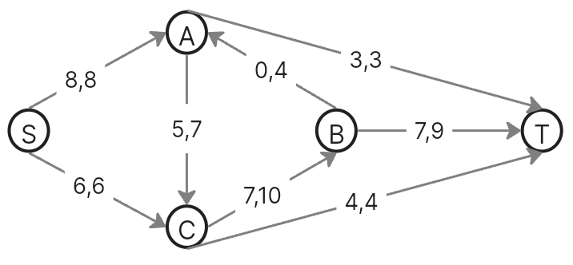

## 6. Продолжим поиск увеличивающего пути в остаточной сети
В остаточной сети не найдено увеличивающих путей, следовательно, алгоритм завершил работу и найденный поток величиной 14 является максимальным для данной сети.

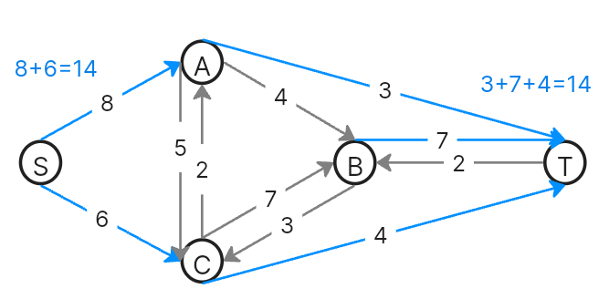

## 7. Проверим значение максимального потока перебором всех разрезов сети.

Разрез сети - разбиение множества вершин на два подмножества V1 и V2, где во множество V1 входит источник, а в V2 входит сток.

Пропускная способность разреза - сумма пропускной способности дуг, начинающихся в вершинах из множества V1 и оканчивающихся в вершинах из V2.

Для сети из _n_ вершин существует 2n - 2 различных разрезов, так как две вершины из множества (источник и сток) "зафиксированы" в V1 и V2, остальные вершины можно различными способами распределять между множествами V1 и V2.

Для сети из 5 вершин нужно найти 25 - 2 = 23 = 8 разрезов. 

| № | V1                   | V2 | Пропускная способность разреза |
|---|:--------------------------------|:--------------|:------------------------------:|
|   | **s + ноль вершин из a, b, c**  |               |                                |
| 1 | s                               | a, b, c, t    |           8 + 6 = 14           |

Ситуация 1:
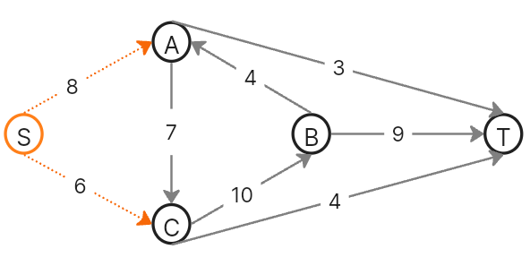

| № | V1                   | V2 | Пропускная способность разреза |
|---|:--------------------------------|:--------------|:------------------------------:|
|   | **s + одна вершина из a, b, c** |               |                                |
| 2 | s, a                            | b, c, t       |         6 + 7 + 3 = 16         |
| 3 | s, b                            | a, c, t       |       8 + 6 + 4 + 9 = 27       |
| 4 | s, c                            | a, b, t       |         8 + 10 + 4 = 22        |

Ситуация 2:
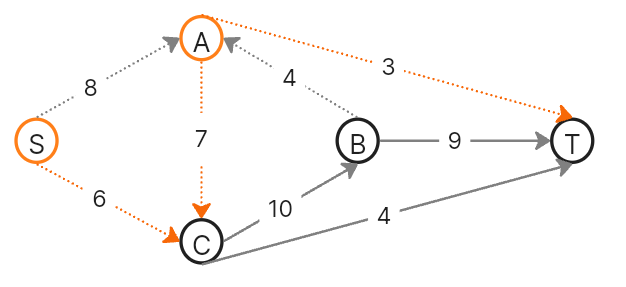

Ситуация 3:
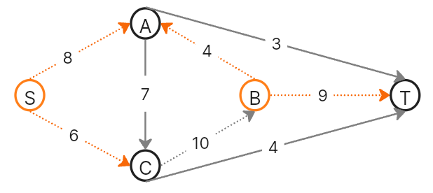

Ситуация 4:
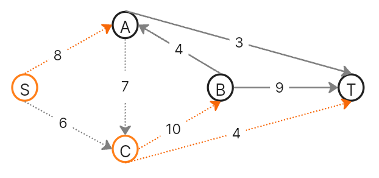

| № | V1                   | V2 | Пропускная способность разреза |
|---|:--------------------------------|:--------------|:------------------------------:|
|   | **s + пара вершин из a, b, c**  |               |                                |
| 5 | s, a, b                         | c, t          |       6 + 7 + 3 + 9 = 25       |
| 6 | s, a, c                         | b, t          |         3 + 10 + 4 = 17        |
| 7 | s, b, c                         | a, t          |       8 + 4 + 9 + 4 = 25       |

Ситуация 5:
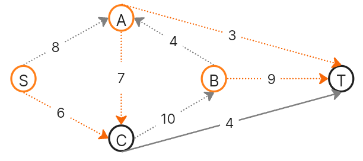

Ситуация 6:
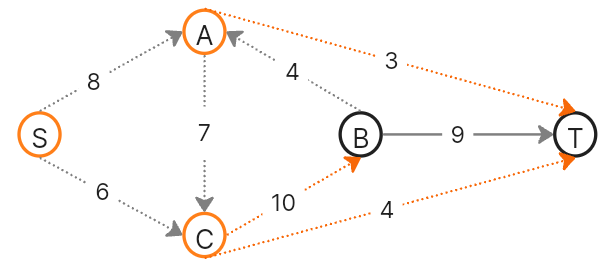

Ситуация 7:
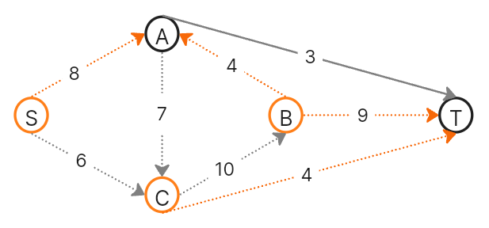

| № | V1                   | V2 | Пропускная способность разреза |
|---|:--------------------------------|:--------------|:------------------------------:|
|   | **s + три вершины из a, b, c**  |               |                                |
| 8 | s, a, b, c                      | t             |         3 + 9 + 4 = 16         |

Ситуация 8:
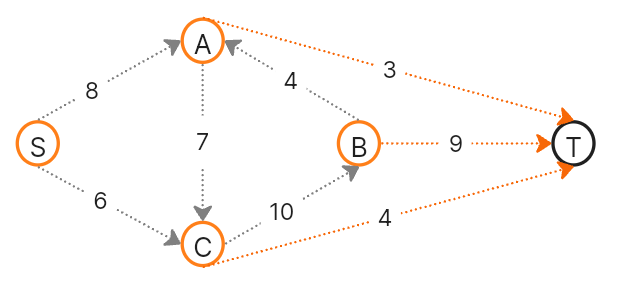

Минимальная пропускная способность разреза равна 14 ( {s} / {a, b, c, t} ), что совпадает с найденной величиной максимального потока в сети.

## Ответ:
Максимальный поток в сети равен 14, он реализуется следующим локальными потоками:

