# Задание №16

## Вариант №3

## Задача о максимальном потоке.

1. Дана сеть (взвешенный ориентированный граф) с источником s и стоком t.
2. Для каждой дуги определена ее пропускная способность.
3. Необходимо найти максимальный поток для указанной сети.

#### Пропускная способность дуг сети указана в таблице.

|          Дуги          | sa  | sb  | ac  | ba  | bc  | bd  | cd  | dt  | ct  |
| :--------------------: | :-: | :-: | :-: | :-: | :-: | :-: | :-: | :-: | :-: |
| Пропускная способность |  1  |  5  |  4  |  1  |  3  |  7  |  8  | 12  |  3  |

### 1. Построим сеть с источником s, стоком t и указанными пропускными способностями дуг.

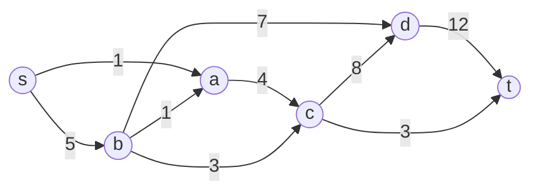

Построим остаточную сеть. Так как изначально поток в сети не задан, все дуги сети являются пустыми (локальный поток равен нулю), соответственно в остаточную сеть необходимо вынести обратную дугу с весом равным пропускной способности.

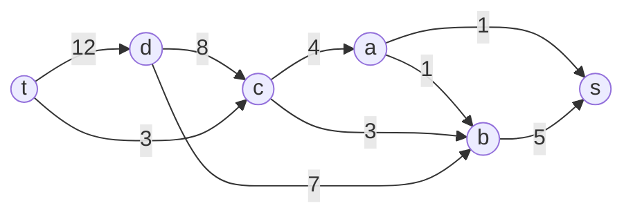

### 2. Проведем поиск увеличивающего пути в остаточной сети

В остаточной сети найден увеличивающий путь t -> c -> b -> s. Минимальный вес дуг на этом пути равен 3.

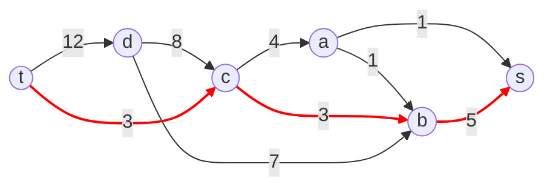

Уменьшим вес дуг на найденном пути, дуги для которых вес стал нулевым удалим из остаточной сети.

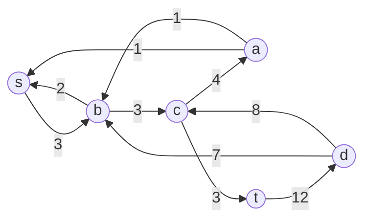

Скорректируем соответствующим образом локальные потоки в исходной сети. Первым числом будем указывать локальный поток, вторым пропускную способность дуги.

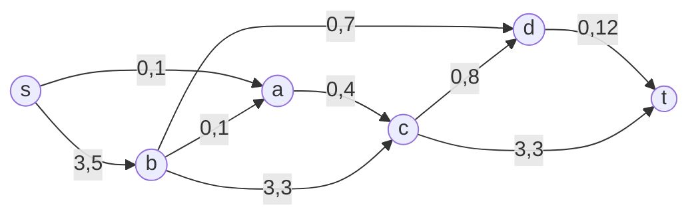

### 3. Продолжим поиск увеличивающего пути

В остаточной сети найден увеличивающий путь t -> d -> c -> a -> s. Минимальный вес дуг на этом пути равен 1.

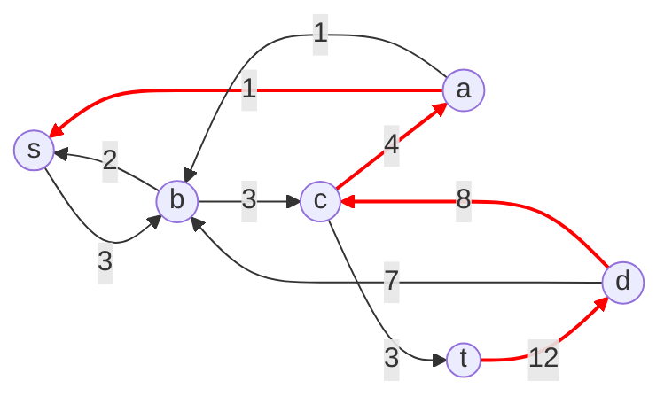

Уменьшим вес дуг на найденном пути, дуги для которых вес стал нулевым удалим из остаточной сети.

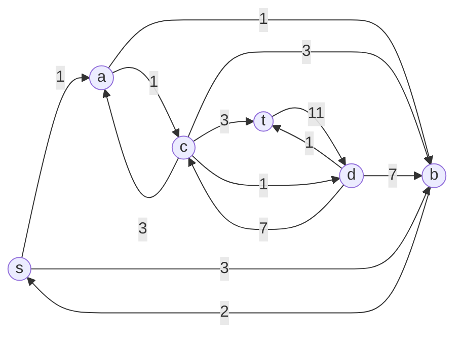

Скорректируем соответствующим образом локальные потоки в исходной сети. Первым числом будем указывать локальный поток, вторым пропускную способность дуги.

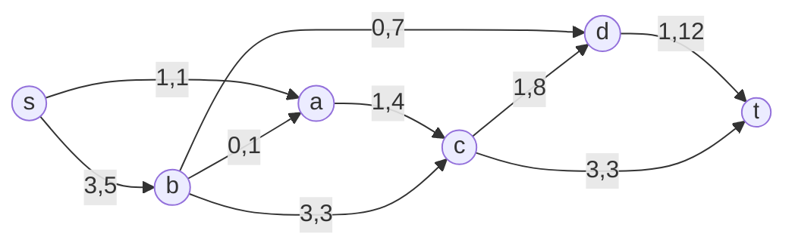

### 4. Продолжим поиск увеличивающего пути

В остаточной сети найден увеличивающий путь t -> d -> b -> s. Минимальный вес дуг на этом пути равен 2.

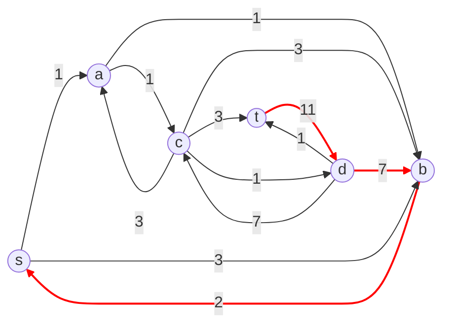

Уменьшим вес дуг на найденном пути, дуги для которых вес стал нулевым удалим из остаточной сети.

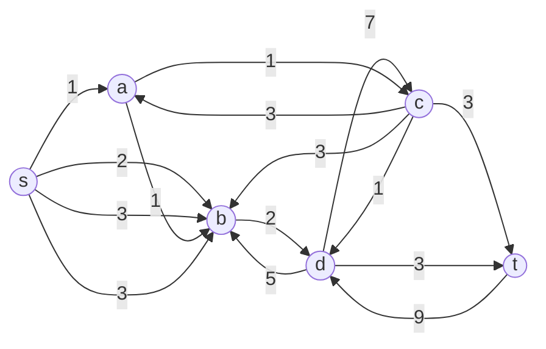

Скорректируем соответствующим образом локальные потоки в исходной сети. Первым числом будем указывать локальный поток, вторым пропускную способность дуги.

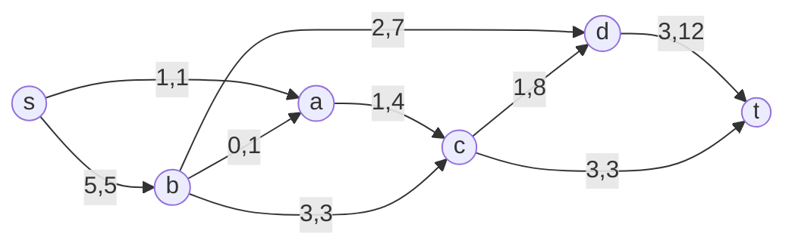

### 5. Продолжим поиск увеличивающего пути

В остаточной сети не найдено увеличивающих путей, следовательно, алгоритм завершил работу и найденный поток величиной 6 является максимальным для данной сети.

### 6. Проверим значение максимального потока перебором всех разрезов сети.

Разрез сети - разбиение множества вершин на два подмножества $V_1$ и $V_2$, где во множество $V_1$ входит источник, а в $V_2$ входит сток.

Пропускная способность разреза - сумма пропускной способности дуг, начинающихся в вершинах из множества $V_1$ и оканчивающихся в вершинах из $V_2$.

Для сети из _n_ вершин существует $2^{n - 2}$ различных разрезов, так как две вершины из множества (источник и сток) "зафиксированы" в $V_1$ и $V_2$, остальные вершины можно различными способами распределять между множествами $V_1$ и $V_2$.

Для сети из 6 вершин нужно найти $2^{6-2}$ = $2^4$ = 16 разрезов.

| №   | V₁          | V₂          | Пропускная способность                                  |
| --- | ----------- | ----------- | ------------------------------------------------------- |
| 1   | {s}         | {a,b,c,d,t} | 1 + 5 = **6**                                           |
|     | {**s + **одна вершина из a, b, c, d**}                                              |            
| 2   | {s,a}       | {b,c,d,t}   | 5 + 4 = 9                                               |
| 3   | {s,b}       | {a,c,d,t}   | 1 + 1 + 3 + 7 = 12                                      |
| 4   | {s,c}       | {a,b,d,t}   | 1 + 5 + 8 + 3 = 17                                      |
| 5   | {s,d}       | {a,b,c,t}   | 1 + 5 + 12 = 18                                         |
|     | {**s + пара вершин из a, b, c, d**}                                                 |                                          |
| 6   | {s,a,b}     | {c,d,t}     | 4 + 3 + 7 = 14                                          |
| 7   | {s,a,c}     | {b,d,t}     | 5 + 8 + 3 = 16                                      |
| 8   | {s,a,d}     | {b,c,t}     | 5 + 4 + 12 = 21                                         |
| 9   | {s,b,c}     | {a,d,t}     | 1 + 1 + 7 + 8 + 3 = 20                                      |
| 10  | {s,b,d}     | {a,c,t}     | 1 + 1 + 3 + 12 = 17                                     |
| 11  | {s,c,d}     | {a,b,t}     | 1 + 5 + 3 + 12 = 21                                           |
|     | {**s + три вершины из a, b, c, d**}                                                 |                                          |
| 12  | {s,a,b,c}   | {d,t}       | 7 + 8 + 3 = 18                                          |
| 13  | {s,a,b,d}   | {c,t}       | 4 + 3 + 12 = 19                                         |
| 14  | {s,a,c,d}   | {b,t}       | 5 + 3 + 12 = 20                                           |
| 15  | {s,b,c,d}   | {a,t}       | 1 + 1 + 3 + 12 = 17                                               |
|     | {**s + четыре вершины из a, b, c, d**}                                                 |                                               |
| 16  | {s,a,b,c,d} | {t}         | 12 + 3 = 15                                             |

Минимальная пропускная способность разреза равна 6 ({s} / {a,b,c,d,t}), что совпадает с найденной величиной максимального потока в сети.

### Ответ:

Максимальный поток в сети равен 6, он реализуется следующим локальными потоками:

