## Задание №16
## Задача о максимальном потоке.

### Вариант 6
#### Пропускная способность дуг сети:

|          Дуги          | sa | sb | sc | ba | bc | cd | dt | ac | at |
|:----------------------:|:--:|:--:|:--:|:--:|:--:|:--:|:--:|:--:|:--:|
| Пропускная способность | 6  | 4  | 6  | 5  | 5  | 10 | 8  | 5  | 8  |

### 1. Построим сеть с источником **s**, стоком **t** и указанными пропускными способностями дуг.

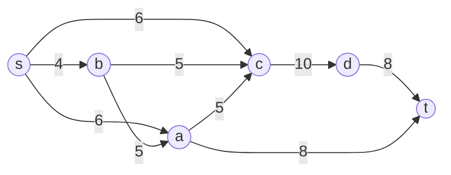

Построим начальную остаточную сеть. Все потоки нулевые, поэтому проводим обратные дуги

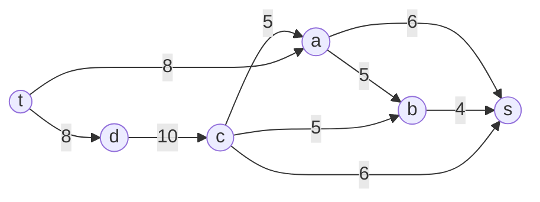

### 2. Проведем поиск увеличивающего пути в остаточной сети

В остаточной сети найден увеличивающий путь t -> a -> s. Минимальный вес дуг на пути: min(8, 6) = 6

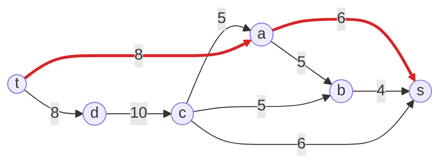

Уменьшим веса дуг на найденном пути и добавим обратные дуги для уже проведенного потока

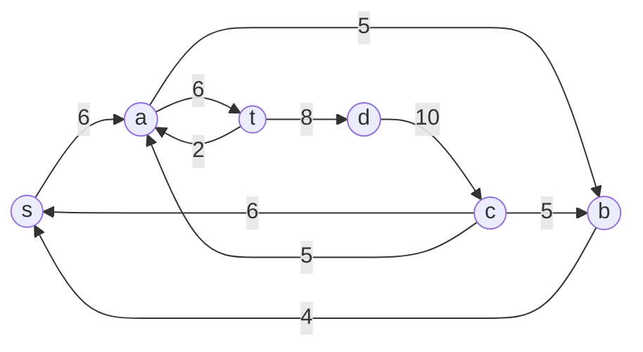

Скорректируем локальные потоки в исходной сети

### 3. Продолжим поиск увеличивающего пути в остаточной сети

В остаточной сети найден увеличивающий путь t -> d -> c -> s. Минимальный вес дуг на пути: min(8, 10, 6) = 6

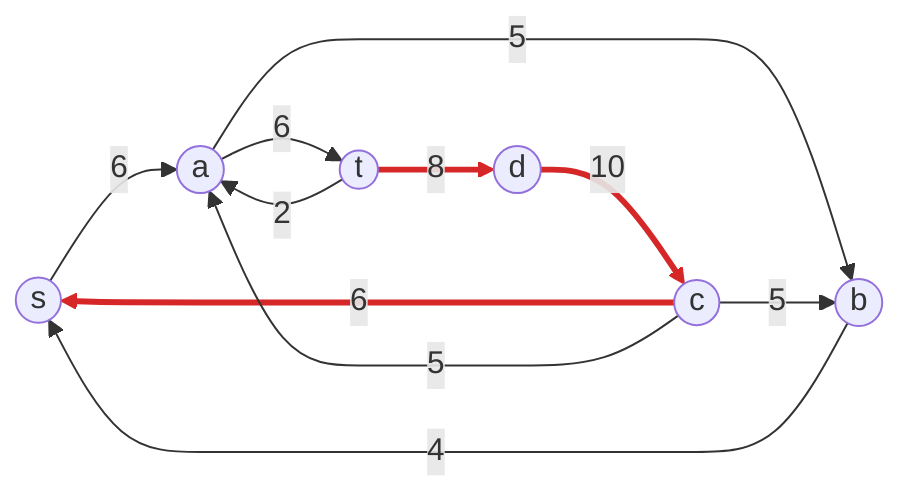

После уменьшения весов по пути получим такую остаточную сеть

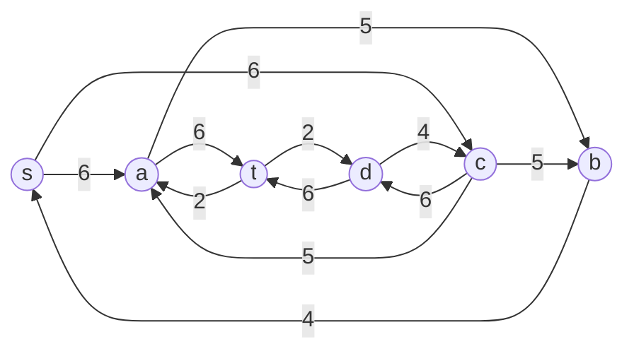

Скорректируем локальные потоки в исходной сети

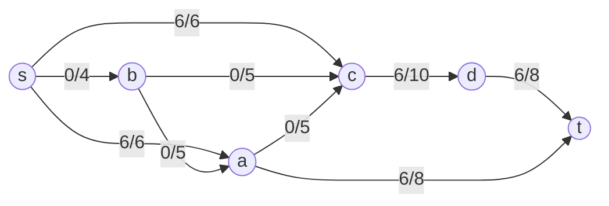

### 4. Продолжим поиск увеличивающего пути в остаточной сети

В остаточной сети найден увеличивающий путь t -> a -> b -> s. Минимальный вес дуг на пути: min(2, 5, 4) = 2

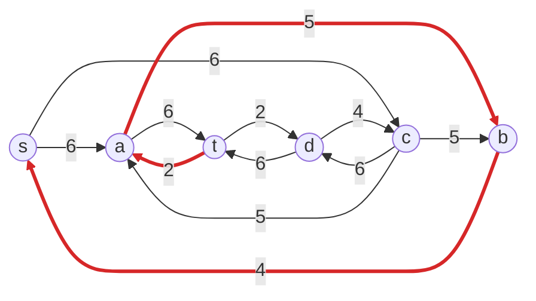

После уменьшения весов по пути получим такую остаточную сеть

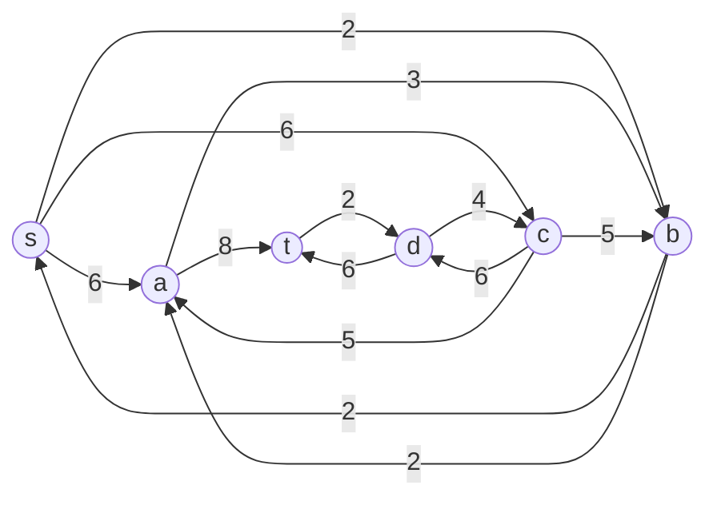

Скорректируем локальные потоки в исходной сети

### 5. Продолжим поиск увеличивающего пути в остаточной сети

В остаточной сети найден увеличивающий путь t -> d -> c -> b -> s. Минимальный вес дуг на пути: min(2, 4, 5, 2) = 2

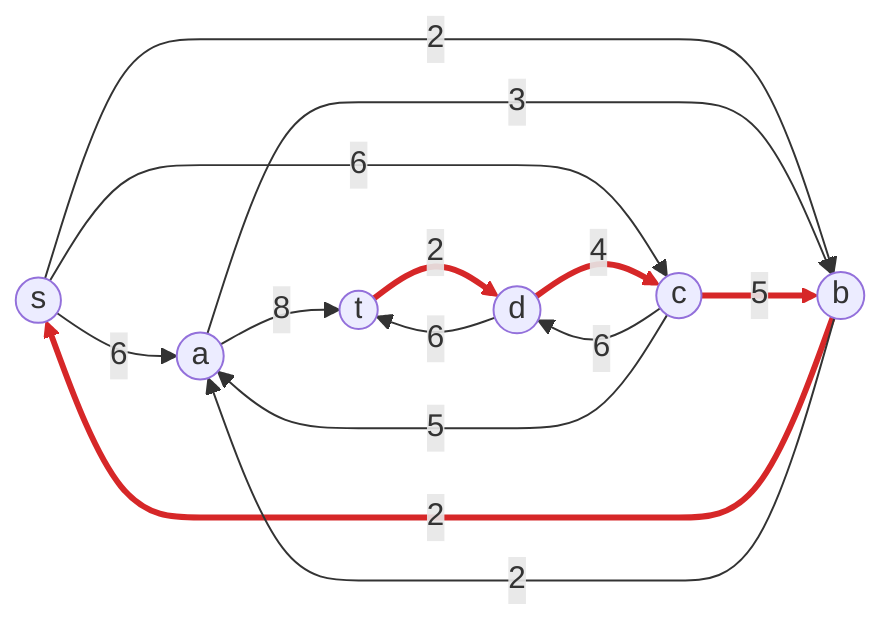

После уменьшения весов по пути получим такую остаточную сеть

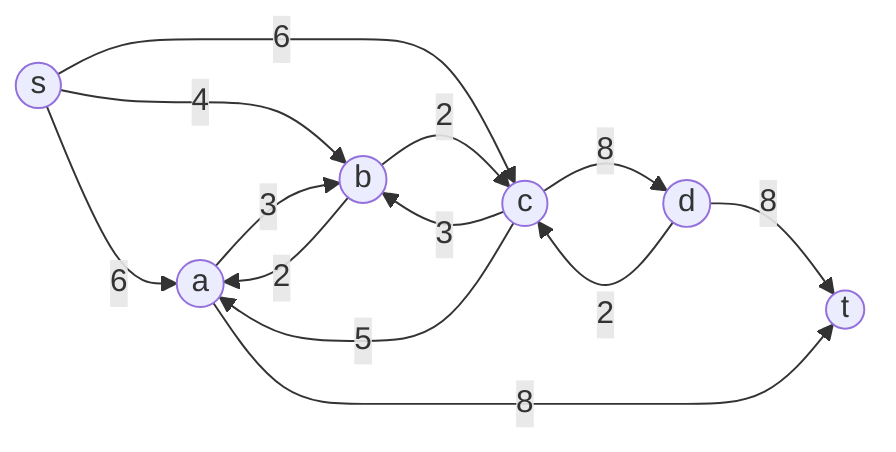

Скорректируем локальные потоки в исходной сети

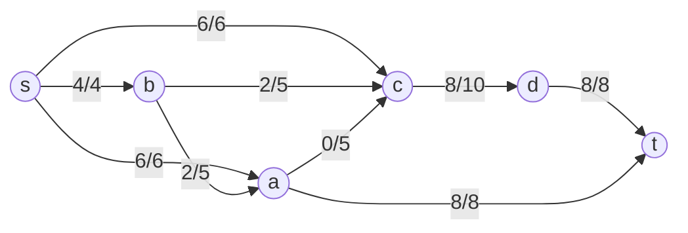

### 6. Продолжим поиск увеличивающего пути в остаточной сети

В остаточной сети больше нет увеличивающих путей(из вершины t не выходит ни одной дуги), значит алгоритм завершен

Следовательно, найденный поток является максимальным и равняется 16

### 7. Проверим значение максимального потока перебором всех разрезов сети.

В сети 6 вершин, значит число разрезов равно 2^(n-2) = 2^(6-2) = 16

| №  | V1         | V2      | Пропускная способность разреза |
|:--:|:----------------------|:-------------------|:------------------------------:|
| 1  | s                     | a, b, c, d, t      |        6 + 4 + 6 = 16          |
| 2  | s, a                  | b, c, d, t         |      4 + 6 + 5 + 8 = 23        |
| 3  | s, b                  | a, c, d, t         |      6 + 6 + 5 + 5 = 22        |
| 4  | s, c                  | a, b, d, t         |       6 + 4 + 10 = 20          |
| 5  | s, d                  | a, b, c, t         |      6 + 4 + 6 + 8 = 24        |
| 6  | s, a, b               | c, d, t            |      6 + 5 + 5 + 8 = 24        |
| 7  | s, a, c               | b, d, t            |        4 + 10 + 8 = 22         |
| 8  | s, a, d               | b, c, t            |    4 + 6 + 8 + 5 + 8 = 31      |
| 9  | s, b, c               | a, d, t            |       6 + 5 + 10 = 21          |
| 10 | s, b, d               | a, c, t            |    6 + 6 + 5 + 5 + 8 = 30      |
| 11 | s, c, d               | a, b, t            |        6 + 4 + 8 = 18          |
| 12 | s, a, b, c            | d, t               |          10 + 8 = 18           |
| 13 | s, a, b, d            | c, t               |    6 + 5 + 8 + 5 + 8 = 32      |
| 14 | s, a, c, d            | b, t               |         4 + 8 + 8 = 20         |
| 15 | s, b, c, d            | a, t               |         6 + 5 + 8 = 19         |
| 16 | s, a, b, c, d         | t                  |          8 + 8 = 16            |

Минимальная пропускная способность разреза равна 16 (разрезы №1 и №16), что совпадает с найденным максимальным потоком

### Ответ

Максимальный поток в сети равен 16