# Задание №16

# Задача о максимальном потоке.

1. Дана сеть (взвешенный ориентированный граф) с источником s и стоком t.
2. Для каждой дуги определена ее пропускная способность.
3. Необходимо найти максимальный поток для указанной сети.

### Вариант 8:
#### Пропускная способность дуг сети:

|          Дуги          | sc | sb | ac | ba | bc | bd | cd | dt | ct |
|:----------------------:|:--:|:--:|:--:|:--:|:--:|:--:|:--:|:--:|:--:|
| Пропускная способность | 9  | 5  | 4  | 1  | 3  | 7  | 8  | 12 |  2 |

### 1. Построим сеть с источником **s**, стоком **t** и указанными пропускными способностями дуг.

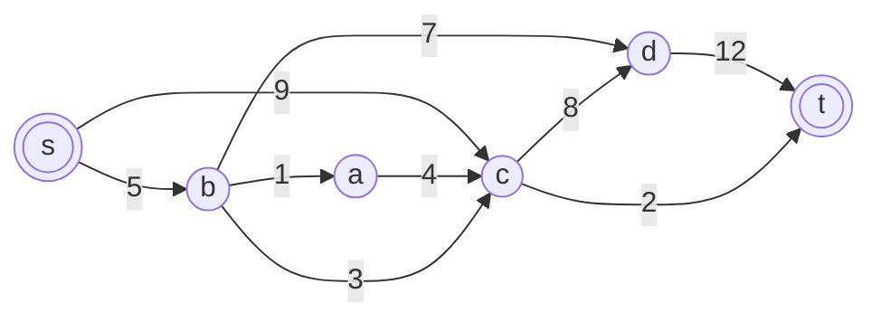

Построим остаточную сеть. Так как изначально поток в сети не задан, все дуги сети являются пустыми (локальный поток равен нулю), соответственно в остаточную сеть необходимо вынести обратную дугу с весом равным пропускной способности.

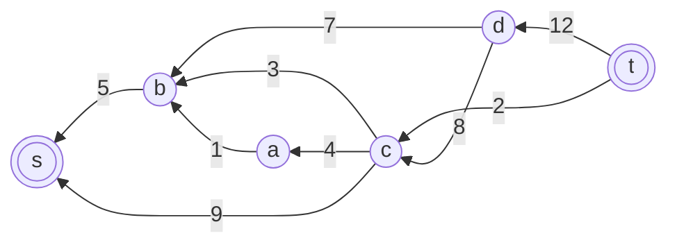

### 2. Проведем поиск увеличивающего пути в остаточной сети

В остаточной сети найден увеличивающий путь t -> c -> s. Минимальный вес дуг на этом пути равен 2.

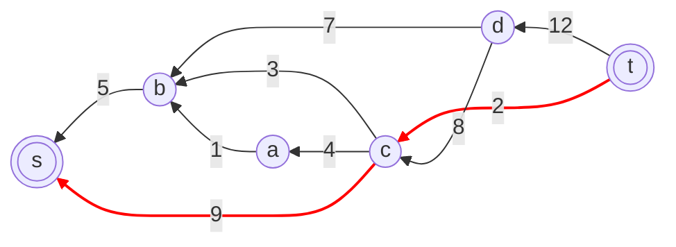

Уменьшим вес дуг на найденном пути, дуги для которых вес стал нулевым удалим из остаточной сети.

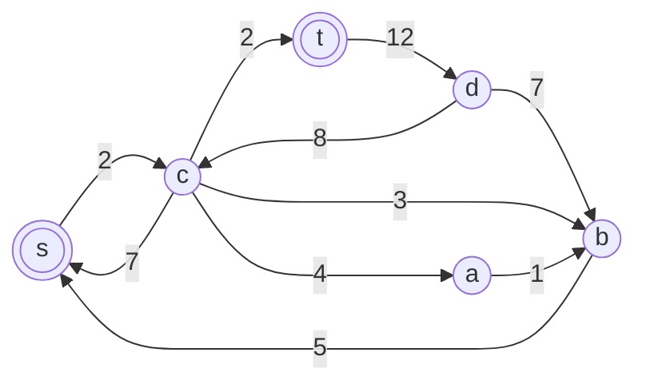

Скорректируем соответствующим образом локальные потоки в исходной сети. Первым числом будем указывать локальный поток, вторым пропускную способность дуги.

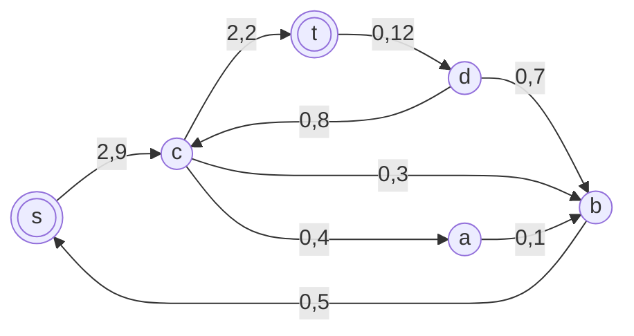

### 3. Продолжим поиск увеличивающего пути

В остаточной сети найден увеличивающий путь t -> d -> b -> s. Минимальный вес дуг на этом пути равен 5.

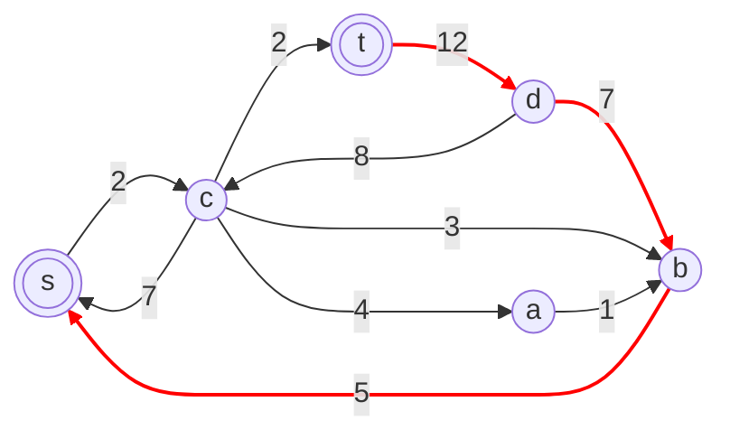

Уменьшим вес дуг на найденном пути, дуги для которых вес стал нулевым удалим из остаточной сети.

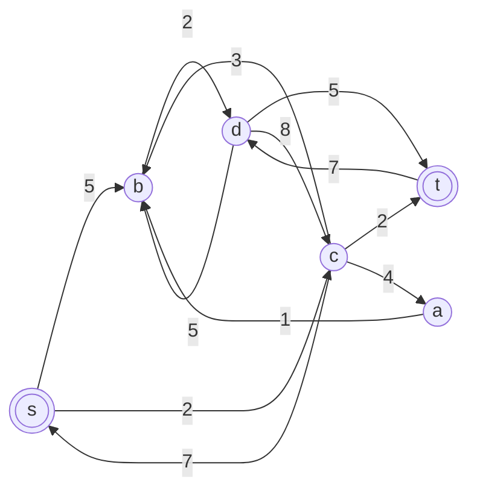

Скорректируем соответствующим образом локальные потоки в исходной сети. Первым числом будем указывать локальный поток, вторым пропускную способность дуги.

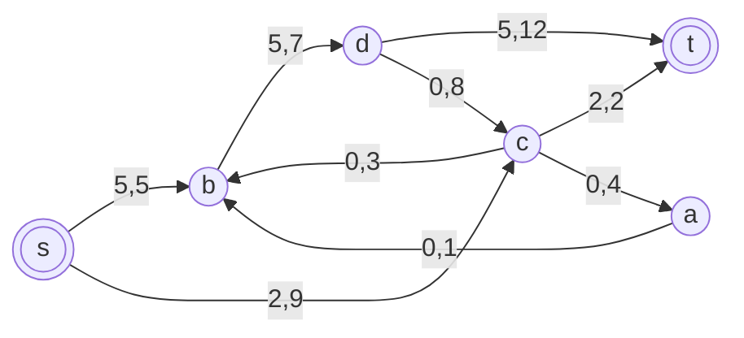

### 4. Продолжим поиск увеличивающего пути

В остаточной сети найден увеличивающий путь t -> d -> c -> s. Минимальный вес дуг на этом пути равен 7.

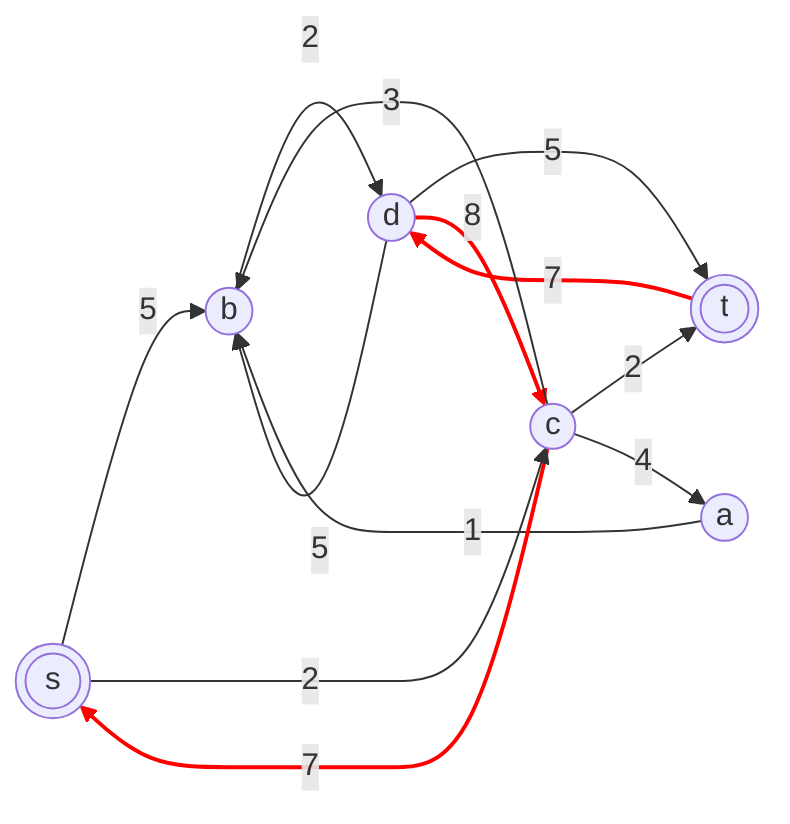

Уменьшим вес дуг на найденном пути, дуги для которых вес стал нулевым удалим из остаточной сети.

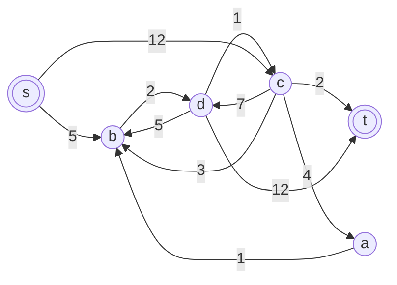

Скорректируем соответствующим образом локальные потоки в исходной сети. Первым числом будем указывать локальный поток, вторым пропускную способность дуги.

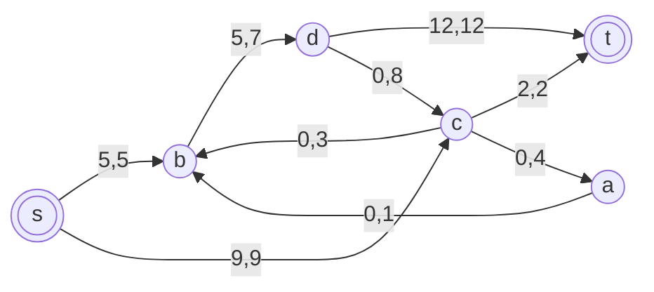

### 5. Продолжим поиск увеличивающего пути

В остаточной сети не найдено увеличивающих путей, следовательно, алгоритм завершил работу и найденный поток величиной 14 является максимальным для данной сети.

### 6. Проверим значение максимального потока перебором всех разрезов сети.

## Проверка значения максимального потока перебором всех разрезов сети

Разрез сети — разбиение множества вершин на два подмножества \(V_1\) и \(V_2\),
где во множество \(V_1\) входит источник \(s\), а в \(V_2\) входит сток \(t\).

Пропускная способность разреза — сумма пропускных способностей дуг,
начинающихся в вершинах множества \(V_1\) и оканчивающихся в вершинах множества \(V_2\).

Для сети из \(n\) вершин существует \(2^{n-2}\) различных разрезов,
так как вершины \(s\) и \(t\) зафиксированы в множествах \(V_1\) и \(V_2\),
а остальные вершины могут быть распределены между множествами произвольным образом.

В данной сети \(n = 6\), следовательно, необходимо рассмотреть
\(2^{6-2} = 16\) разрезов.

| №  | \(V_1\)           | \(V_2\)           | Пропускная способность |
|----|-------------------|-------------------|------------------------|
| 1  | {s}               | {a,b,c,d,t}       | 9 + 5 = **14**         |
| 2  | {s,a}             | {b,c,d,t}         | 9 + 5 + 4 = 18         |
| 3  | {s,b}             | {a,c,d,t}         | 9 + 3 + 7 = 19         |
| 4  | {s,c}             | {a,b,d,t}         | 5 + 8 + 2 = 15         |
| 5  | {s,d}             | {a,b,c,t}         | 9 + 5 + 12 = 26        |
| 6  | {s,a,b}           | {c,d,t}           | 4 + 3 + 7 = 14         |
| 7  | {s,a,c}           | {b,d,t}           | 5 + 8 + 2 = 15         |
| 8  | {s,a,d}           | {b,c,t}           | 9 + 5 + 12 = 26        |
| 9  | {s,b,c}           | {a,d,t}           | 1 + 8 + 2 = 11         |
| 10 | {s,b,d}           | {a,c,t}           | 1 + 3 + 12 = 16        |
| 11 | {s,c,d}           | {a,b,t}           | 5 + 2 + 12 = 19        |
| 12 | {s,a,b,c}         | {d,t}             | 7 + 8 + 2 = 17         |
| 13 | {s,a,b,d}         | {c,t}             | 4 + 3 + 12 = 19        |
| 14 | {s,a,c,d}         | {b,t}             | 5 + 2 + 12 = 19        |
| 15 | {s,b,c,d}         | {a,t}             | 1 + 2 + 12 = 15        |
| 16 | {s,a,b,c,d}       | {t}               | 12 + 2 = **14**        |

Минимальная пропускная способность разреза равна **14**

### Ответ:

Максимальный поток в сети равен 14, он реализуется следующим локальными потоками:

