# Задание №16

# Задача о максимальном потоке.

1. Дана сеть (взвешенный ориентированный граф) с источником s и стоком t.
2. Для каждой дуги определена ее пропускная способность.
3. Необходимо найти максимальный поток для указанной сети.

### Вариант 9:

#### Пропускная способность дуг сети:

|          Дуги          | sa  | ac  | sd  | ab  | cb  | dc  | bt  | ct  | dt  |
| :--------------------: | :-: | :-: | :-: | :-: | :-: | :-: | :-: | :-: | :-: |
| Пропускная способность | 10  |  6  |  7  |  5  |  4  |  3  |  8  |  4  |  5  |

### 1. Построим сеть с источником **s**, стоком **t** и указанными пропускными способностями дуг.

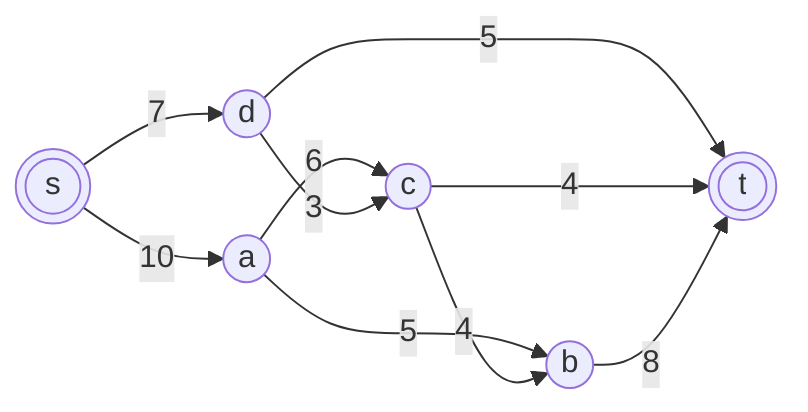

Построим остаточную сеть. Так как изначально поток в сети не задан, все дуги сети являются пустыми (локальный поток равен нулю), соответственно в остаточную сеть необходимо вынести обратную дугу с весом равным пропускной способности.

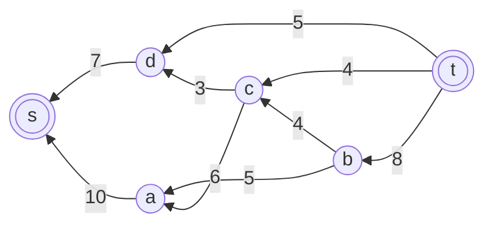

### 2. Проведем поиск увеличивающего пути в остаточной сети

В остаточной сети найден увеличивающий путь t -> d -> s. Минимальный вес дуг на этом пути равен 5.

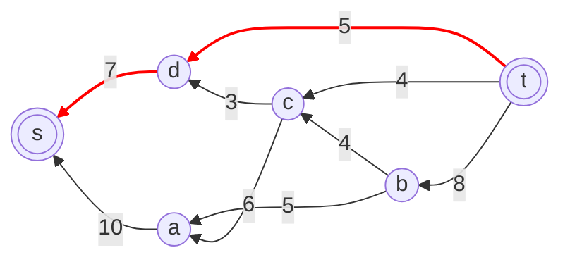

Уменьшим вес дуг на найденном пути, дуги для которых вес стал нулевым удалим из остаточной сети.

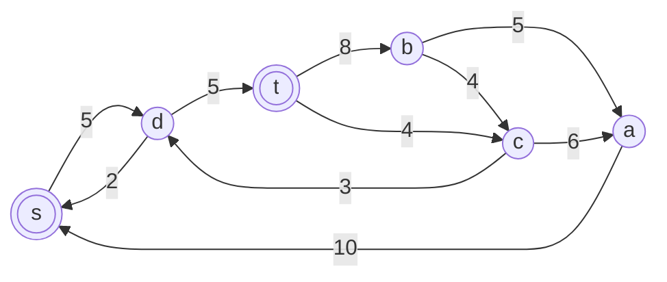

Скорректируем соответствующим образом локальные потоки в исходной сети. Первым числом будем указывать локальный поток, вторым пропускную способность дуги.


### 3. Продолжим поиск увеличивающего пути

В остаточной сети найден увеличивающий путь t -> b -> a -> s. Минимальный вес дуг на этом пути равен 5.

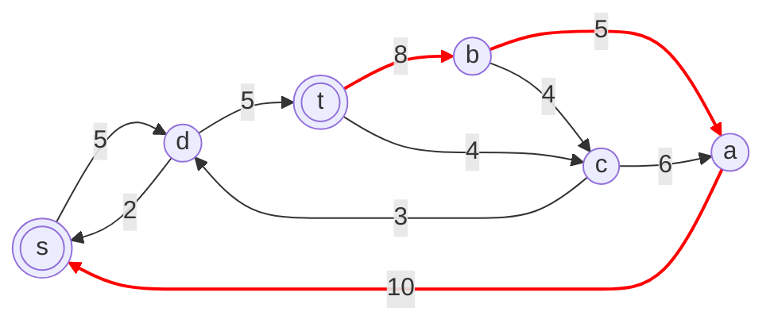

Уменьшим вес дуг на найденном пути, дуги для которых вес стал нулевым удалим из остаточной сети.

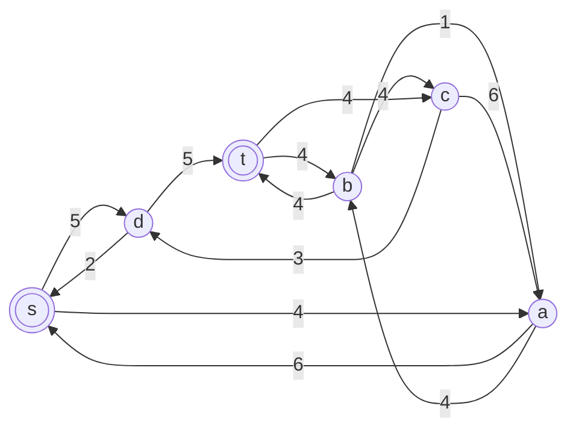

Скорректируем соответствующим образом локальные потоки в исходной сети. Первым числом будем указывать локальный поток, вторым пропускную способность дуги.

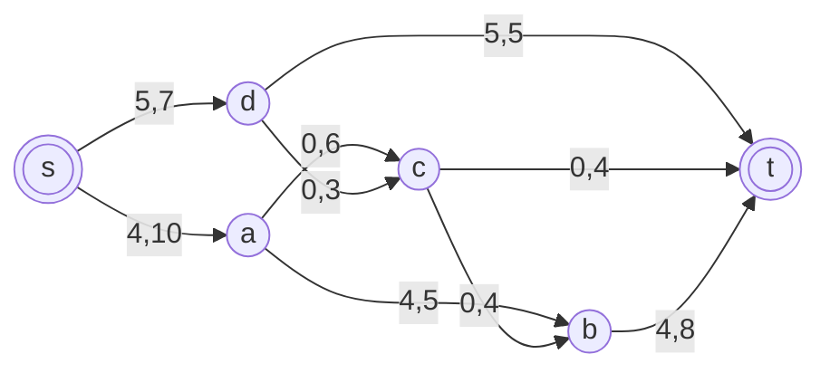

### 4. Продолжим поиск увеличивающего пути

В остаточной сети найден увеличивающий путь t -> c -> a -> s. Минимальный вес дуг на этом пути равен 4.

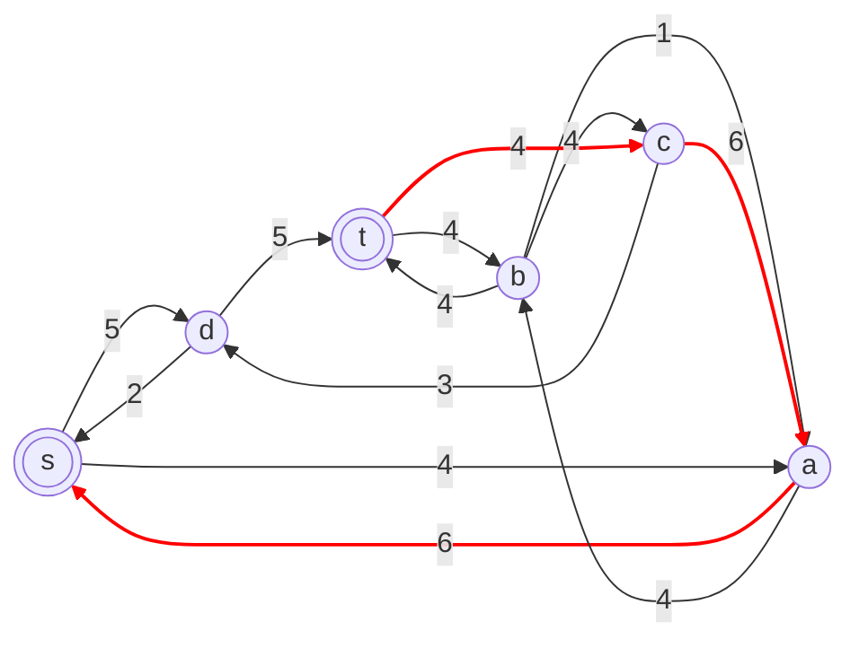

Уменьшим вес дуг на найденном пути, дуги для которых вес стал нулевым удалим из остаточной сети.

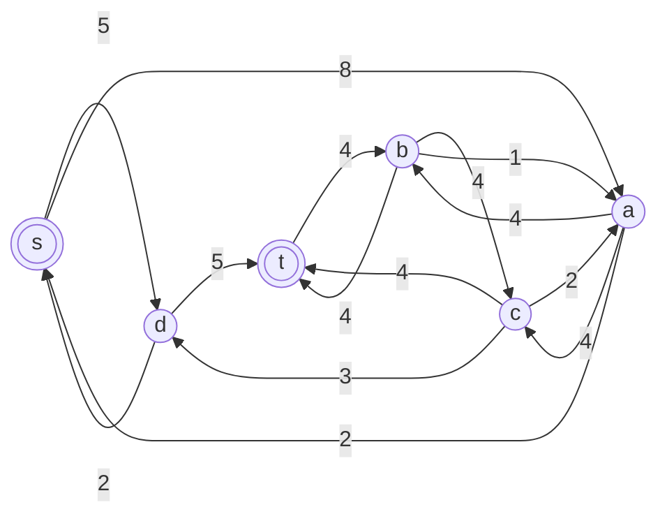

Скорректируем соответствующим образом локальные потоки в исходной сети. Первым числом будем указывать локальный поток, вторым пропускную способность дуги.


### 5. Продолжим поиск увеличивающего пути

В остаточной сети найден увеличивающий путь t -> b -> a -> s. Минимальный вес дуг на этом пути равен 1.

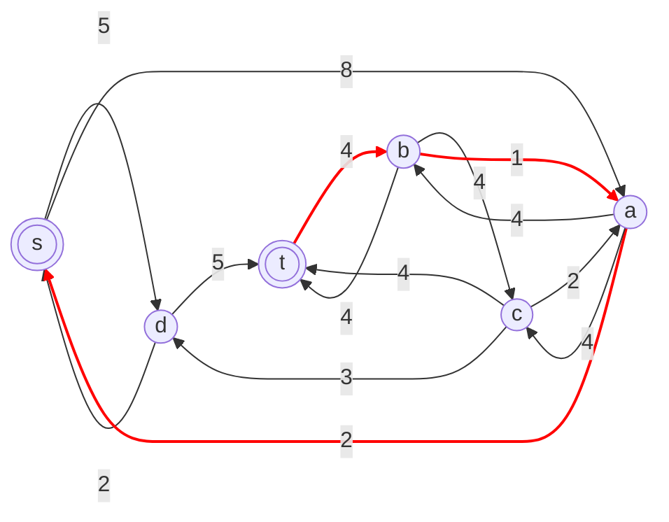

Уменьшим вес дуг на найденном пути, дуги для которых вес стал нулевым удалим из остаточной сети.

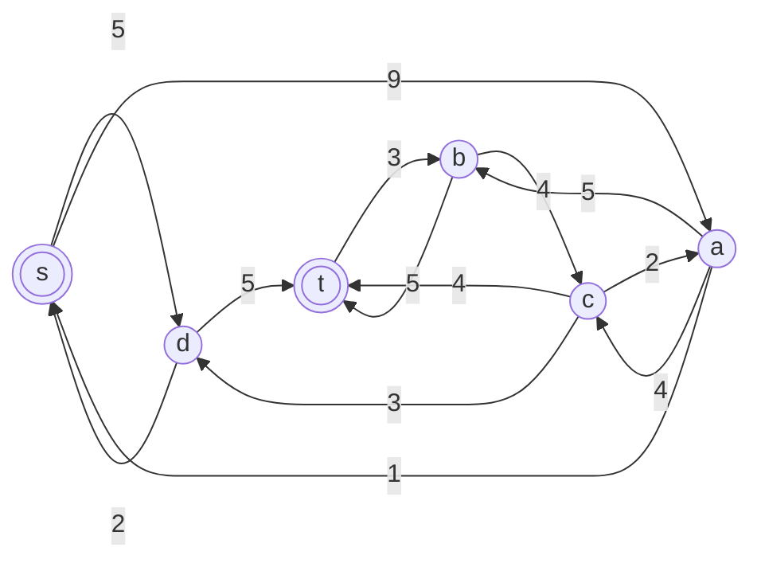

Скорректируем соответствующим образом локальные потоки в исходной сети. Первым числом будем указывать локальный поток, вторым пропускную способность дуги.


### 6. Продолжим поиск увеличивающего пути

В остаточной сети найден увеличивающий путь t -> b -> с -> d -> s. Минимальный вес дуг на этом пути равен 2.

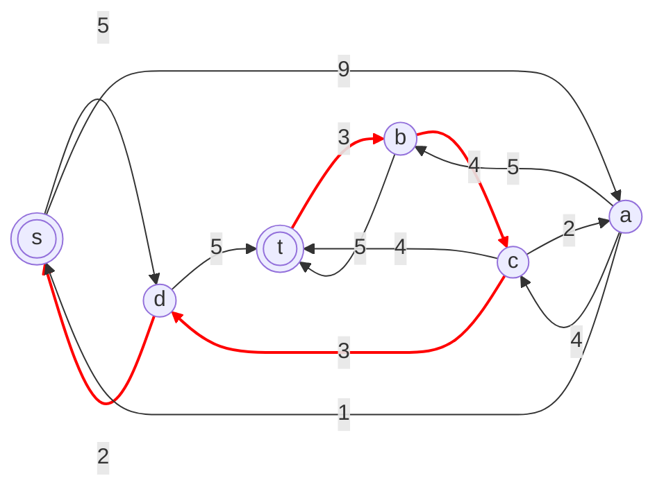

Уменьшим вес дуг на найденном пути, дуги для которых вес стал нулевым удалим из остаточной сети.

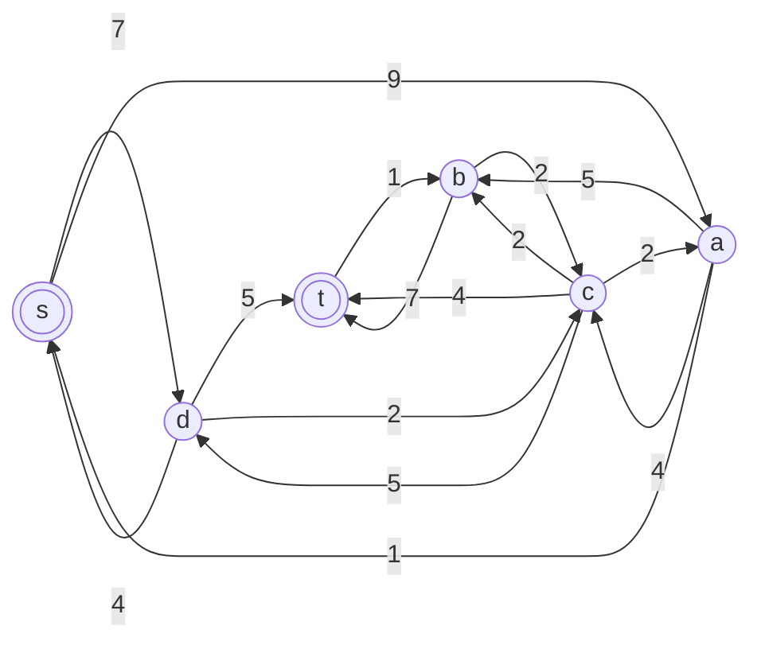

Скорректируем соответствующим образом локальные потоки в исходной сети. Первым числом будем указывать локальный поток, вторым пропускную способность дуги.


### 7. Продолжим поиск увеличивающего пути

В остаточной сети найден увеличивающий путь t -> b -> с -> a -> s. Минимальный вес дуг на этом пути равен 2.

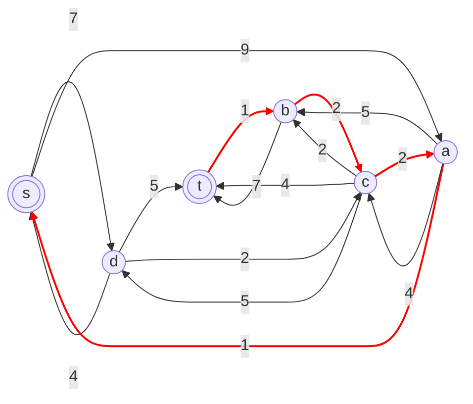

Уменьшим вес дуг на найденном пути, дуги для которых вес стал нулевым удалим из остаточной сети.

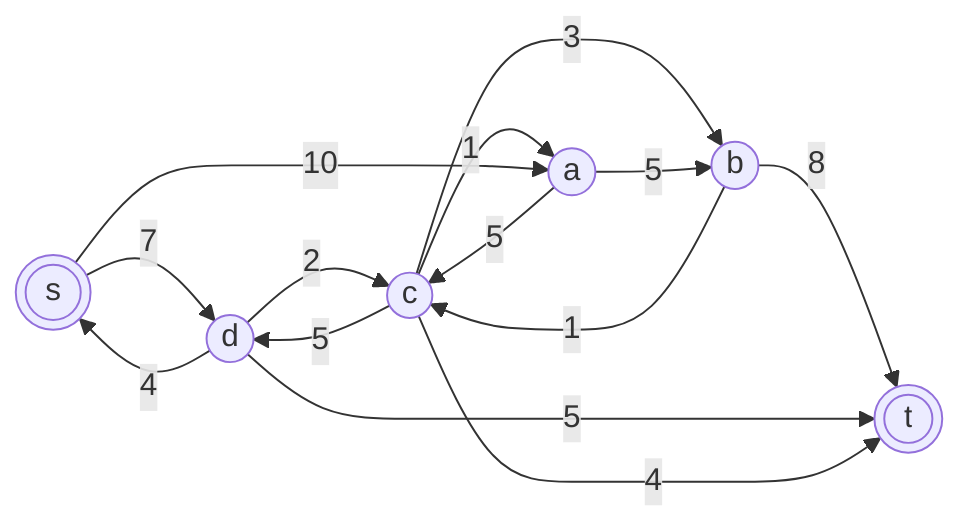

Скорректируем соответствующим образом локальные потоки в исходной сети. Первым числом будем указывать локальный поток, вторым пропускную способность дуги.

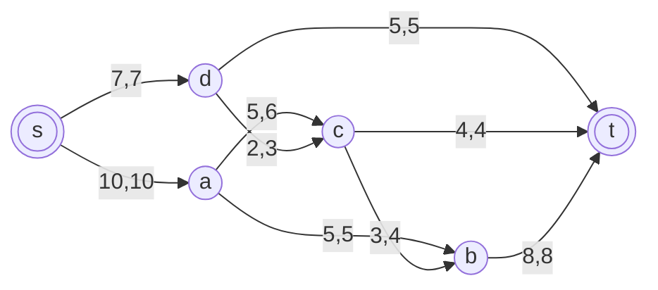

### 8. Продолжим поиск увеличивающего пути

В остаточной сети не найдено увеличивающих путей, следовательно, алгоритм завершил работу и найденный поток величиной 17 является максимальным для данной сети.

### 6. Проверим значение максимального потока перебором всех разрезов сети.

Разрез сети — разбиение множества вершин на два подмножества $V_1$ и $V_2$, где во множество $V_1$ входит источник, а в $V_2$ входит сток.

Пропускная способность разреза — сумма пропускной способности дуг, начинающихся в вершинах из множества $V_1$ и оканчивающихся в вершинах из $V_1$.

Для сети из n вершин существует $2^{n-2}$ различных разрезов, так как две вершины (источник и сток) «зафиксированы» в $V_1$ и $V_2$, остальные вершины можно различными способами распределять между множествами $V_1$ и $V_2$.

Для сети из 6 вершин нужно найти $2^{6-2}$ = $2^4$ = 16 разрезов.

| №   | V₁          | V₂          | Пропускная способность |
| --- | ----------- | ----------- | ---------------------- |
| 1   | {s}         | {a,b,c,d,t} | 10 + 7 = **17**        |
| 2   | {s,a}       | {b,c,d,t}   | 7 + 6 + 5 = 18         |
| 3   | {s,b}       | {a,c,d,t}   | 10 + 7 + 8 = 25        |
| 4   | {s,c}       | {a,b,d,t}   | 10 + 7 + 4 + 4 = 25    |
| 5   | {s,d}       | {a,b,c,t}   | 10 + 3 + 5 = 18        |
| 6   | {s,a,b}     | {c,d,t}     | 7 + 6 + 8 = 21         |
| 7   | {s,a,c}     | {b,d,t}     | 7 + 5 + 4 + 4 = 20     |
| 8   | {s,a,d}     | {b,c,t}     | 5 + 6 + 3 + 5 = 19     |
| 9   | {s,b,c}     | {a,d,t}     | 10 + 7 + 8 + 4 = 29    |
| 10  | {s,b,d}     | {a,c,t}     | 10 + 3 + 5 + 8 = 26    |
| 11  | {s,c,d}     | {a,b,t}     | 10 + 4 + 4 + 5 = 23    |
| 12  | {s,a,b,c}   | {d,t}       | 7 + 8 + 4 = 19         |
| 13  | {s,a,b,d}   | {c,t}       | 6 + 3 + 8 + 5 = 22     |
| 14  | {s,a,c,d}   | {b,t}       | 5 + 4 + 4 + 5 = 18     |
| 15  | {s,b,c,d}   | {a,t}       | 10 + 8 + 4 + 5 = 27    |
| 16  | {s,a,b,c,d} | {t}         | 8 + 4 + 5 = **17**     |

Минимальная пропускная способность разреза равна 17 (разрезы №1 и №16), что совпадает с найденной величиной максимального потока в сети.

### Ответ:

Максимальный поток в сети равен 17, он реализуется следующим локальными потоками:

```mermaid
graph LR
    s(((s)))
    a((a))
    b((b))
    c((c))
    d((d))
    t(((t)))

    s -->|10,10| a
    s -->|7,7| d
    a -->|5,6| c
    a -->|5,5| b
    d -->|2,3| c
    d -->|5,5| t
    c -->|3,4| b
    c -->|4,4| t
    b -->|8,8| t
```
