### Вариант 7:
#### Пропускная способность дуг сети:

|          Дуги          | sa | sc | ac | ab | ad | cd | bd | bt | dt |
|:----------------------:|:--:|:--:|:--:|:--:|:--:|:--:|:--:|:--:|:--:|
| Пропускная способность | 10 | 10 | 9  | 9  | 6  | 12 | 6  | 6  | 12 |

### 1. Построим сеть с источником **s**, стоком **t** и указанными пропускными способностями дуг.

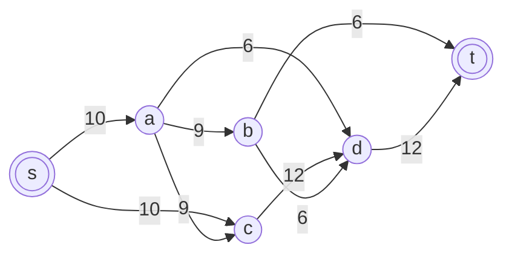

Построим остаточную сеть. Так как изначально поток в сети не задан, все дуги сети являются пустыми (локальный поток равен нулю), соответственно в остаточную сеть необходимо вынести обратную дугу с весом равным пропускной способности.

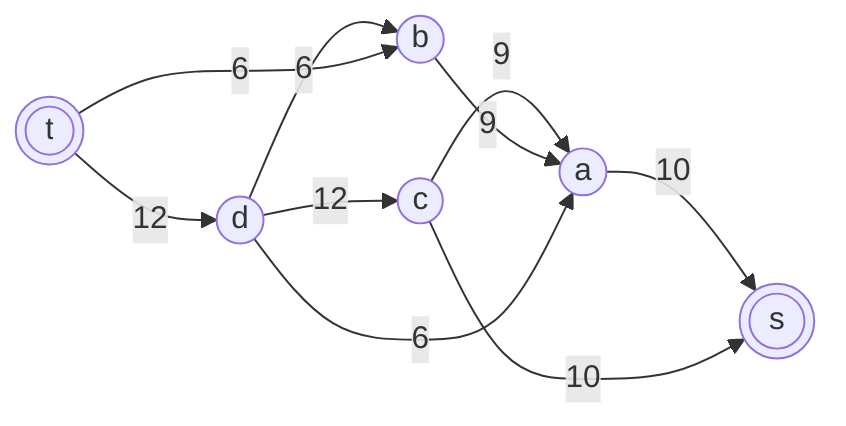

### 2. Проведем поиск увеличивающего пути в остаточной сети
В остаточной сети найден увеличивающий путь t -> d -> c -> s. Минимальный вес дуг на этом пути равен 10.

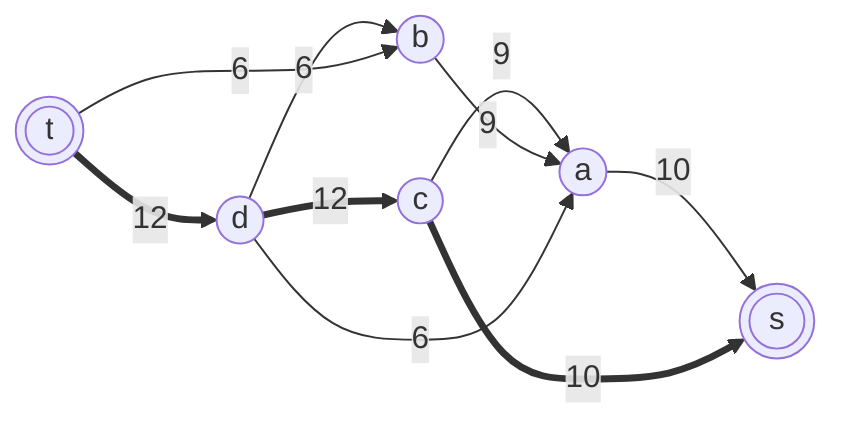

Уменьшим вес дуг на найденном пути, дуги для которых вес стал нулевым удалим из остаточной сети.

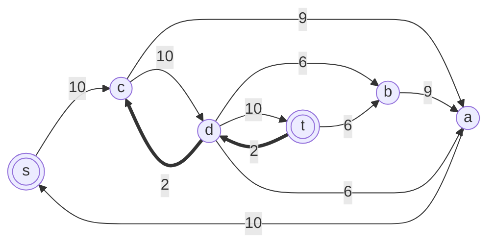

Скорректируем соответствующим образом локальные потоки в исходной сети. Первым числом будем указывать локальный поток, вторым пропускную способность дуги.

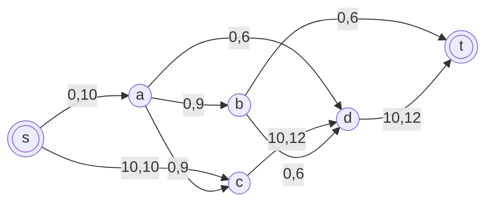

### 3. Продолжим поиск увеличивающего пути в остаточной сети

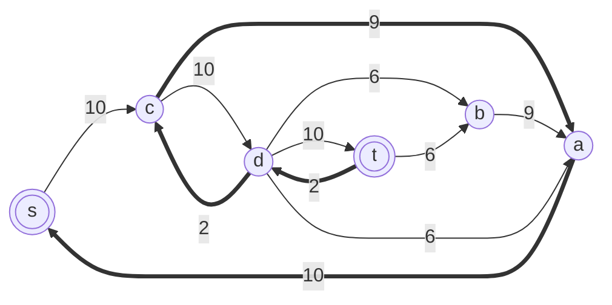

В остаточной сети найден увеличивающий путь t -> d -> c -> a -> s. Минимальный вес дуг на этом пути равен 2.

Уменьшим вес дуг на найденном пути, дуги для которых вес стал нулевым удалим из остаточной сети.

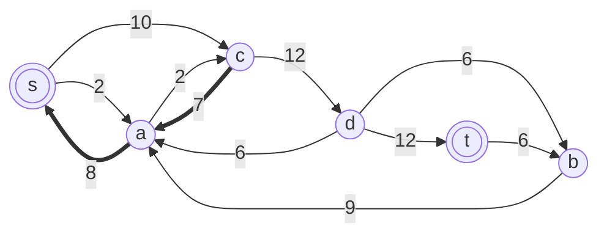

Скорректируем соответствующим образом локальные потоки в исходной сети.

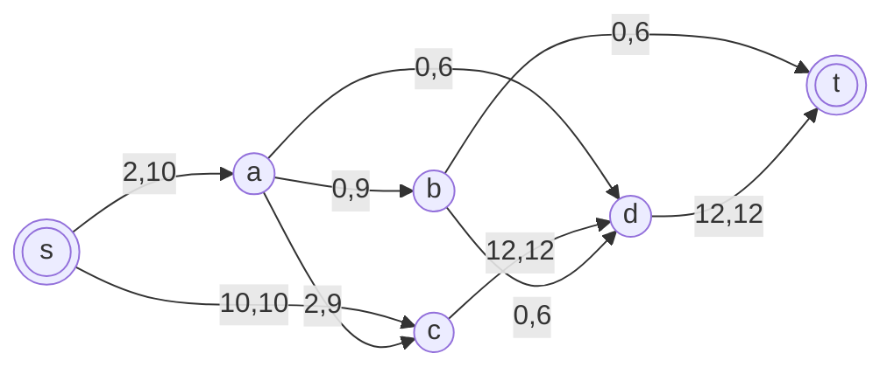

### 4. Продолжим поиск увеличивающего пути в остаточной сети

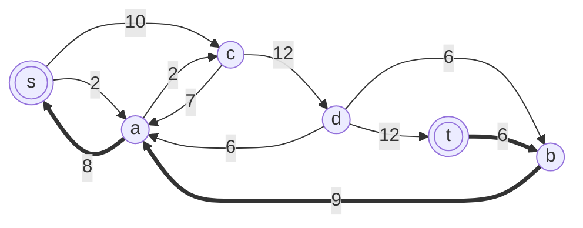

В остаточной сети найден увеличивающий путь t -> b -> a -> s. Минимальный вес дуг на этом пути равен 6.

Уменьшим вес дуг на найденном пути, дуги для которых вес стал нулевым удалим из остаточной сети.

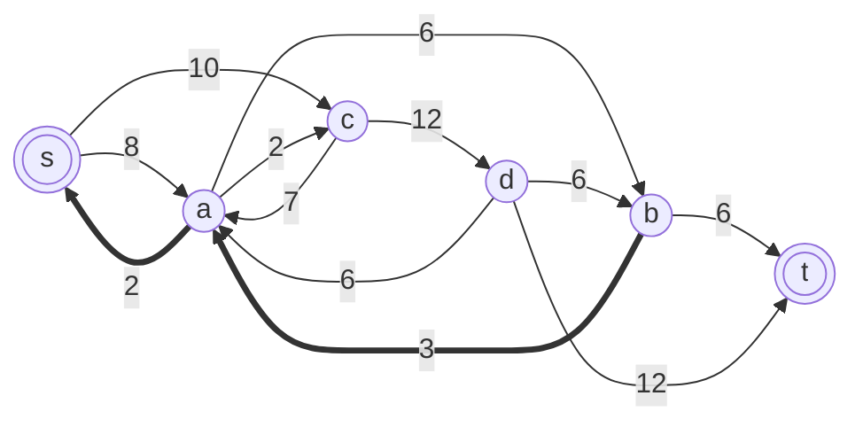

Скорректируем соответствующим образом локальные потоки в исходной сети.

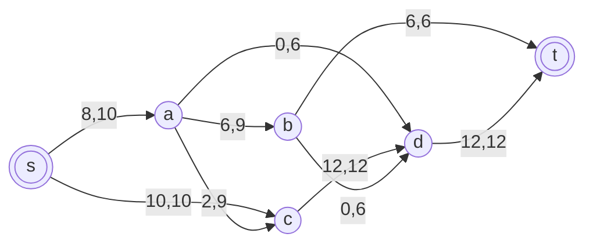

### 5. Продолжим поиск увеличивающего пути в остаточной сети
В остаточной сети не найдено увеличивающих путей, следовательно, алгоритм завершил работу и найденный поток величиной 18 является максимальным для данной сети.

### 6. Проверим значение максимального потока перебором всех разрезов сети.

Для сети из 6 вершин нужно найти 26 - 2 = 24 = 16 разрезов. 

| № | V1                          | V2 | Пропускная способность разреза |
|---|:---------------------------------------|:--------------|:------------------------------:|
| 1 | s                                      | a, b, c, d, t |              10 + 10 = 20      |
|   | **s + одна вершина из a, b, c, d**     |               |                                |
| 2 | s, a                                   | b, c, d, t    |          10 + 9 + 9 + 6 = 34   |
| 3 | s, b                                   | a, c, d, t    |        10 + 10 + 6 + 6  = 32   |
| 4 | s, c                                   | a, b, d, t    |           10 + 12 = 22         |
| 5 | s, d                                   | a, b, c, t    |          10 + 10 + 12 = 32     |
|   | **s + пара вершин из a, b, c, d**      |               |                                |
| 6 | s, a, b                                | c, d, t       |       10 + 9 + 6 + 6 + 6 = 37  |
| 7 | s, a, c                                | b, d, t       |         9 + 6 + 12 = 27        |
| 8 | s, a, d                                | b, c, t       |        10 + 9 + 9 + 12 = 40    |
| 9 | s, b, c                                | a, d, t       |         10 + 6 + 6 + 12 = 34   |
|10 | s, b, d                                | a, c, t       |       10 + 10 + 6 + 12 = 38    |
|11 | s, c, d                                | a, b, t       |         10 + 12 = 22           |
|   | **s + три вершины из a, b, c, d**      |               |                                |
|12 | s, a, b, c                             | d, t          |         6 + 6 + 6 + 12 = 30    |
|13 | s, a, b, d                             | c, t          |          10 + 9 + 12 + 6 = 37  |
|14 | s, a, c, d                             | b, t          |          9 + 12 = 21           |
|15 | s, b, c, d                             | a, t          |          10 + 6 + 12 = 28      |
|   | **s + четыре вершины из a, b, c, d**   |               |                                |
|16 | s, a, b, c, d                          | t             |              6 + 12 = 18       |

Минимальная пропускная способность разреза равна 18 ( {s, a, b, c, d} / {t} ), что совпадает с найденной величиной максимального потока в сети.

### Ответ:
Максимальный поток в сети равен 18, он реализуется следующим локальными потоками:

