# Задание №17. Вариант 2
# Задача о максимальном потоке минимальной стоимости.

Алгоритм для нахождения максимального потока минимальной стоимости вначале находит какой-либо максимальный поток, а затем перераспределяет потоки вдоль некоторых дуг так, чтобы, с одной стороны, поток остался допустимым и его величина не уменьшилась, а, с другой стороны, его стоимость стала минимально возможной. 

## Остаточная сеть
Как и при решении задачи о максимальном потоке мы будем использовать остаточную сеть. Принципы её построения такие же, как и в задаче нахождения максимального потока. Есть только одно отличие: каждая дуга остаточной сети теперь имеет не только вес, но и стоимость.

Если в исходной сети уже найден некоторый максимальный поток, построим соответствующую ей остаточную сеть с тем же набором вершин, что и у исходной сети, применяя к каждой дуге исходной сети следующие правила:
1. Если дуга $e$ исходной сети является насыщенной, т.е. для неё выполняется равенство $f(e)=p(e)$, то в остаточной сети проводим такую же дугу с весом $p(e)$ и отрицательной стоимостью ( $-c(e)$ ), где $c(e)$ – стоимость перемещения единицы потока вдоль дуги $e$ в исходной сети;
2. Если дуга $e=[u,v]$ исходной сети является пустой, т.е. поток вдоль неё $f(e)$ равен нулю, то в остаточной сети проводим обратную дугу $[v,u]$ с весом $p(e)$ и стоимостью $c(e)$;
3. Если дуга $e=[u,v]$ исходной сети не является ни пустой, ни насыщенной, т.е. для неё выполняются неравенства $0<f(e)<p(e)$, то в остаточной сети проводим две дуги:
   - дугу $[u,v]$ с весом $f(e)$ и отрицательной стоимостью ( $-c(e)$ );
   - обратную дугу $[v,u]$ с весом $p(e)-f(e)$ и стоимостью $c(e)$.

Таким образом, в остаточной сети могут появиться дуги с отрицательной стоимостью. Далее под стоимостью ориентированного цикла в остаточной сети будем понимать сумму стоимостей всех дуг, образующих этот цикл.

## Алгоритм для нахождения максимального потока минимальной стоимости

Пусть в исходной сети уже найден некоторый максимальный поток. Если в соответствующей остаточной сети нет ни одного ориентированного цикла отрицательной стоимости, то алгоритм завершил работу, а найденный максимальный поток имеет минимально возможную стоимость.

Если же в остаточной сети есть ориентированный цикл $e_{i},e_{j},\dots ,e_{k}$ отрицательной стоимости $cost$, то через $d$ обозначим минимальный вес дуг, образующих этот цикл. 

В остаточной сети выполним следующие преобразования. Уменьшим на $d$ вес каждой из дуг $e_{i},e_{j},\dots ,e_{k}$ и удалим те из них, вес которых станет равным нулю. Одновременно увеличим на $d$ веса всех дуг, обратных по отношению к $e_{i},e_{j},\dots ,e_{k}$. Если какая-либо из дуг $e_{i},e_{j},\dots ,e_{k}$ в остаточной сети не имела обратной дуги, то в новой остаточной сети добавим такую дугу и положим её вес равным $d$.

Указанные преобразования остаточной сети означают, что в исходной сети мы перенаправили локальные потоки на некоторых дугах так, что величина глобального потока $F$ не изменилась (т.е. он остался максимальным), но его стоимость уменьшилась на величину, равную $d\cdot (-cost)$, где $cost$ – отрицательная стоимость обнаруженного цикла $e_{i},e_{j},\dots ,e_{k}$.

В результате указанных действий в остаточной сети исчезает хотя бы один цикл отрицательной стоимости, а в исходной сети происходит перераспределение локальных потоков так, что глобальный поток остаётся максимальным по величине, но его стоимость при этом уменьшается. 

В преобразованной остаточной сети снова ищут ориентированный цикл отрицательной стоимости и удаляют его, что приводит к перераспределению локальных потоков с сохранением величины глобального потока $F$ и т.д. 

Алгоритм завершает работу, как только в остаточной сети не останется ни одного ориентированного цикла отрицательной стоимости. Окончательные локальные потоки вдоль дуг исходной сети будут равны весам соответствующих дуг в остаточной сети.

## Постановка задачи
1. Дана сеть (взвешенный ориентированный граф) с источником s и стоком t.
2. Для каждой дуги определена пропускная способность и стоимость транспортировки. 
3. Построить сеть с указанием пропускной способности дуг.
4. Построить остаточную сеть.
5. Определить максимальный поток методом поиска увеличивающих путей в остаточной сети.
6. Минимизировать стоимость максимального потока посредством поиска циклов отрицательной стоимости.

## Решение задачи на поиск максимального потока в сети

Пропускная способность дуг сети и стоимость транспортировки указана в таблице.

| Дуги                                          | sa | sb | sc | ba | bc | cd | ac | ad | dt |
|:----------------------------------------------|:--:|:--:|:--:|:--:|:--:|:--:|:--:|:--:|:--:|
| Пропускная способность p(e)                   | 6  | 6  | 6  | 6  | 5  | 10 | 5  | 8  | 15 |
| Стоимость транспортировки единицы потока c(e) | 2  | 2  | 4  | 1  | 1  | 1  | 3  | 4  | 3  |

### 1. Построим сеть с источником **s**, стоком **t** и указанными пропускными способностями дуг для поиска максимального потока.

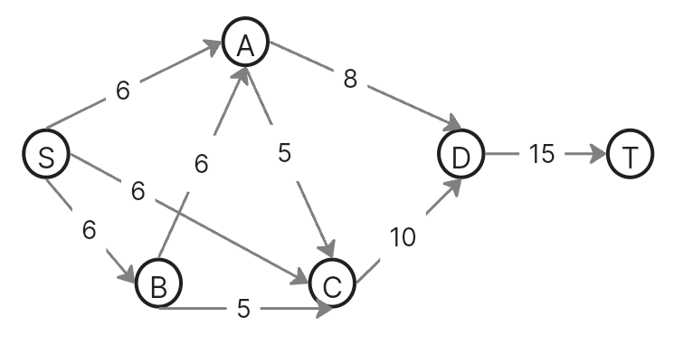

Укажем начальный поток величиной 6: s -> c -> d -> t. 

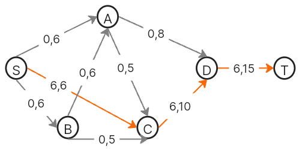

### 2. Построим остаточную сеть.

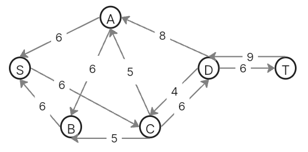

### 3. Определим максимальный поток методом поиска увеличивающих путей в остаточной сети.

Проведем поиск увеличивающего пути в остаточной сети. Найден увеличивающий путь t -> d -> a -> s. Минимальный вес дуг на этом пути равен 6.

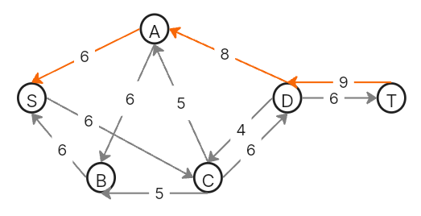

Уменьшим вес дуг на найденном пути, дуги для которых вес стал нулевым удалим из остаточной сети.

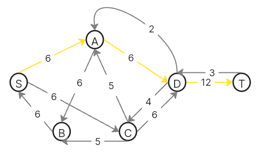

Продолжим поиск увеличивающего пути в остаточной сети. Найден путь t -> d -> c -> b -> s. Минимальный вес дуг на этом пути равен 3.

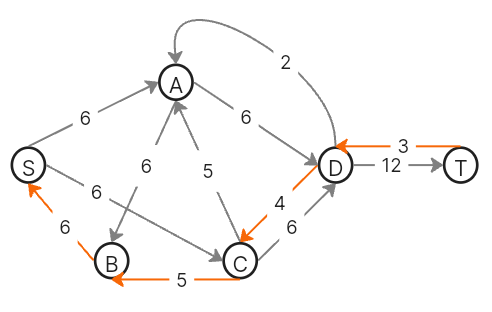

Уменьшим вес дуг на найденном пути, дуги для которых вес стал нулевым удалим из остаточной сети.

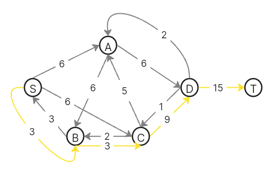

В остаточной сети не найдено увеличивающих путей, следовательно, алгоритм завершил работу и найденный поток величиной 15 является максимальным для данной сети.

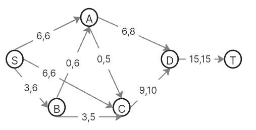

### 4. Рассчитаем стоимость полученного максимального потока.

| Дуги                                          | sa | sb | sc | ba | bc | cd | ac | ad | dt | Итого  |
|:----------------------------------------------|:--:|:--:|:--:|:--:|:--:|:--:|:--:|:--:|:--:|:------:|
| Пропускная способность p(e)                   | 6  | 6  | 6  | 6  | 5  | 10 | 5  | 8  | 15 |        |
| Локальный поток f(e)                          | 6  | 3  | 6  | 0  | 3  | 9  | 0  | 6  | 15 |        |
| Стоимость транспортировки единицы потока c(e) | 2  | 2  | 4  | 1  | 1  | 1  | 3  | 4  | 3  |        |
| Суммарная стоимость f(e)*c(e)                 | 12 | 6  | 24 | 0  | 3  | 9  | 0  | 24 | 45 | **123**|

Стоимость полученного потока составляет 123. 

### 5. Попробуем уменьшить стоимость потока для чего построим остаточную сеть.
Для каждого ребра остаточной сети укажем стоимость транспортировки единицы потока.

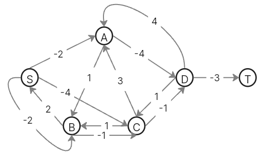

В остаточной сети найден ориентированный цикл отрицательной стоимости s -> c -> b -> s (- 4 + 1 + 2 = -1). Найдем минимальный вес ребра в указанном цикле, изображенном <u>***в остаточной сети с указанием величины потока***.</u>  

  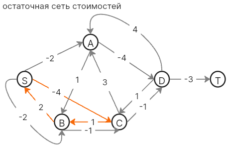
  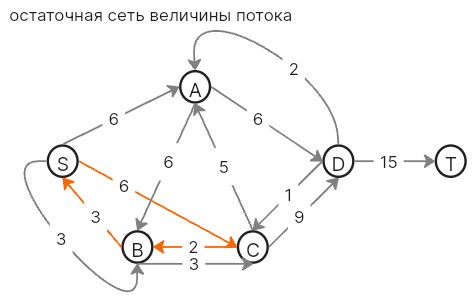 

Минимальный вес ребра в цикле 2 - это неиспользованный резерв ребра b -> c. Удалим найденный цикл - уменьшим на 2 вес всех ребер, входящих в цикл. Скорректируем остаточную сеть с указанием стоимости транспортировки единицы потока.

  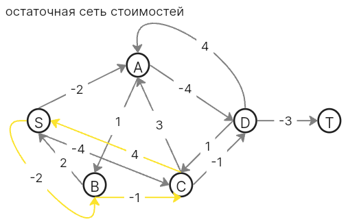
  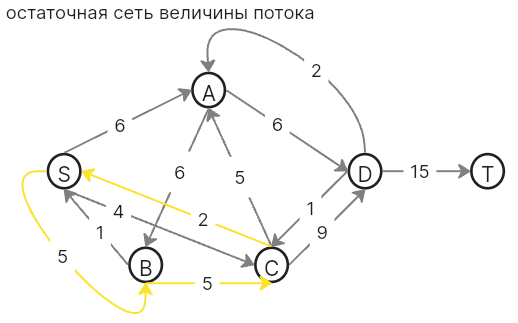 

Проведем повторный поиск цикла отрицательной стоимости в остаточной сети. Найден цикл s -> a -> d -> c -> s (- 2 - 4 + 1 + 4 = -1). Найдем минимальный вес ребра в указанном цикле, изображенном <u>***в остаточной сети с указанием величины потока***.</u>

  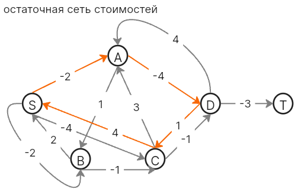
  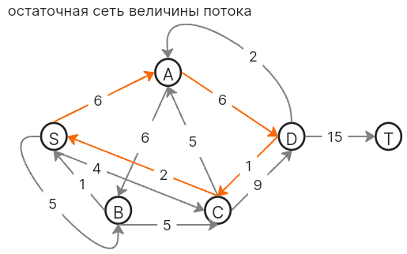 

Минимальный вес ребра в цикле 1 - это неиспользованный резерв ребра c -> d. Удалим найденный цикл - уменьшим на 2 вес всех ребер, входящих в цикл. Скорректируем остаточную сеть с указанием стоимости транспортировки единицы потока.

  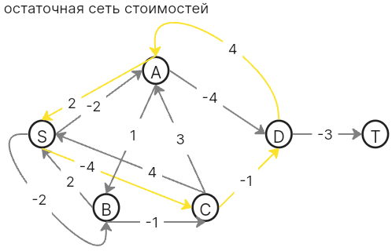
  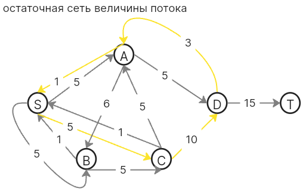 

В остаточной сети отсутствуют циклы отрицательной стоимости, следовательно, стоимость максимального потока минимальна.

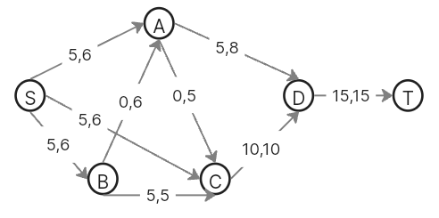

### 6. Рассчитаем стоимость полученного максимального потока.

| Дуги                                          | sa | sb | sc | ba | bc | cd | ac | ad | dt | Итого  |
|:----------------------------------------------|:--:|:--:|:--:|:--:|:--:|:--:|:--:|:--:|:--:|:------:|
| Пропускная способность p(e)                   | 6  | 6  | 6  | 6  | 5  | 10 | 5  | 8  | 15 |        |
| Локальный поток f(e)                          | 5  | 5  | 5  | 0  | 5  | 10 | 0  | 5  | 15 |        |
| Стоимость транспортировки единицы потока c(e) | 2  | 2  | 4  | 1  | 1  | 1  | 3  | 4  | 3  |        |
| Суммарная стоимость f(e)*c(e)                 | 10 | 10 | 20 | 0  | 5  | 10 | 0  | 20 | 45 | **120**|

Стоимость полученного потока составляет 120. 

### Ответ:
Максимальный поток в сети равен 15, минимальная стоимость потока 120, она реализуется следующим локальными потоками:

