# Задание №17

# Вариант №1

# Задача о максимальном потоке минимальной стоимости.

1. Дана сеть (взвешенный ориентированный граф) с источником s и стоком t.
2. Для каждой дуги определена пропускная способность и стоимость транспортировки.
3. Необходимо найти для указанной сети максимальный поток минимальной стоимости.

#### Пропускная способность дуг сети (p(e)) и стоимость транспортировки единицы потока (c(e)):

| Дуги                                          | sa  | sb  | sc  | ac  | ad  | ab  | bd  | ct  | dt  |
| :-------------------------------------------- | :-: | :-: | :-: | :-: | :-: | :-: | :-: | :-: | :-: |
| Пропускная способность p(e)                   | 10  | 10  |  5  |  7  |  8  |  5  |  8  | 10  | 10  |
| Стоимость транспортировки единицы потока c(e) |  1  |  1  |  1  |  2  |  3  |  1  |  1  |  2  |  1  |

---

### 1. Построим сеть с источником **s**, стоком **t** и указанными пропускными способностями дуг для поиска максимального потока.

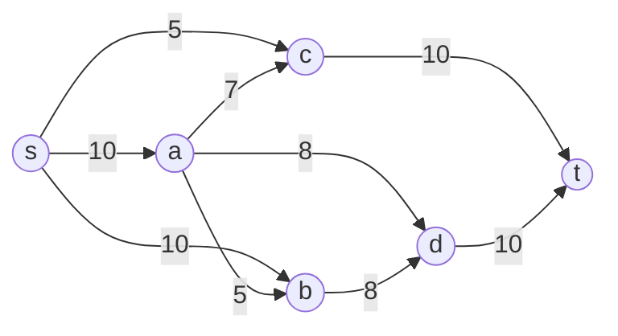

### 2. Построим остаточную сеть

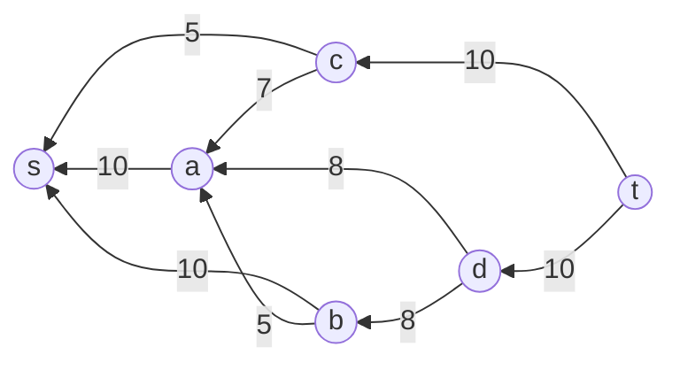

### 3. Поиск увеличивающих путей (поиск из t в s)

**Путь 1:** t → c → s, минимальный поток = 5.

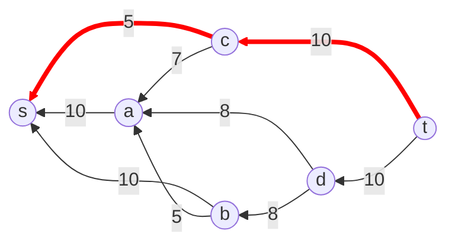

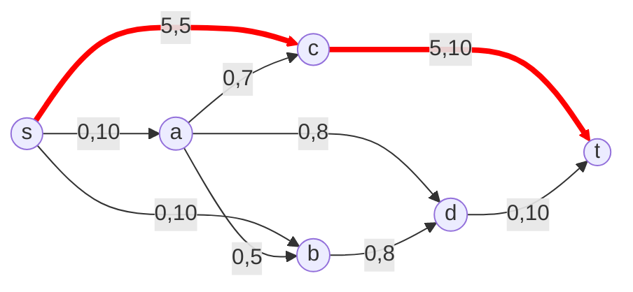

**Путь 2:** t → d → b → s, минимальный поток = 8.

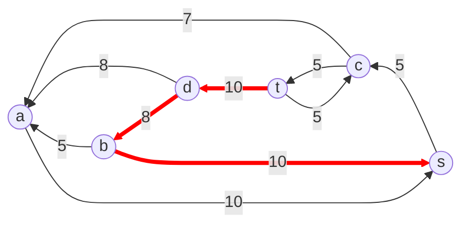

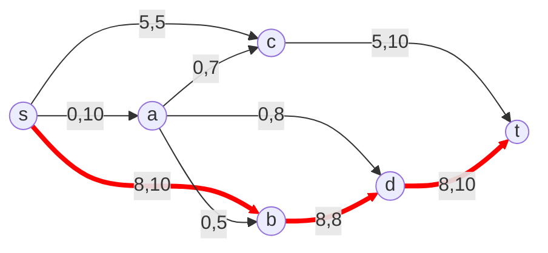

**Путь 3:** t → d → a → s, минимальный поток = 2.

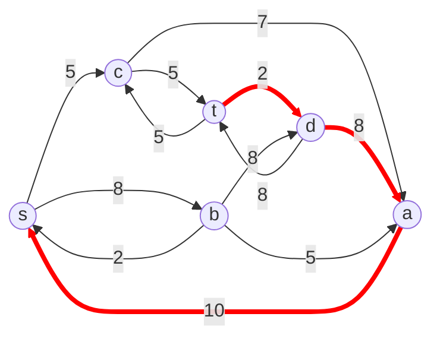

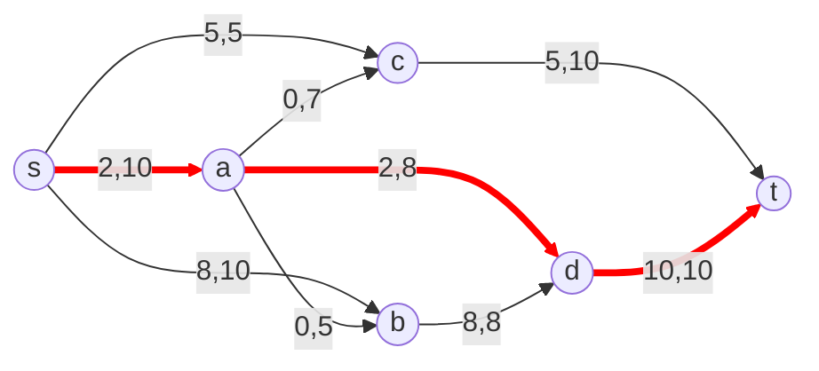

**Путь 4:** t → c → a → s, минимальный поток = 5.

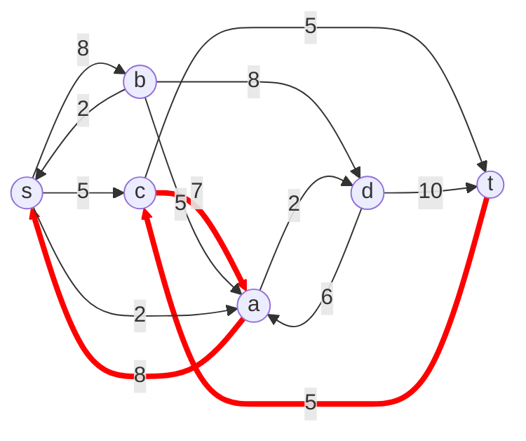

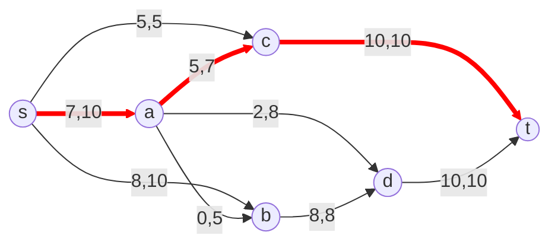

В остаточной сети не найдено увеличивающих путей (дуги, ведущие в сток t, полностью насыщены), следовательно, алгоритм завершил работу и найденный поток величиной 20 является максимальным для данной сети.

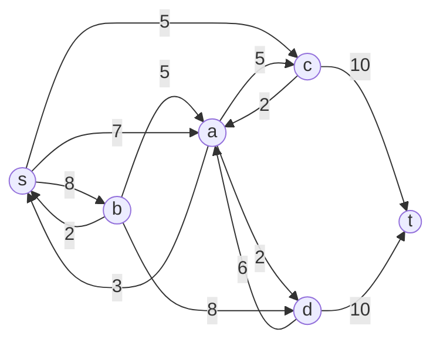

### 4. Рассчитаем стоимость полученного максимального потока.

| Дуги | sa | sb | sc | ac | ad | ab | bd | ct | dt |
| --- | --- | --- | --- | --- | --- | --- | --- | --- | --- |
| Пропускная способность p(e) | 10 | 10 | 5 | 7 | 8 | 5 | 8 | 10 | 10 |
| Локальный поток f(e) | 7 | 8 | 5 | 5 | 2 | 0 | 8 | 10 | 10 |
| Стоимость транспортировки единицы потока c(e) | 1 | 1 | 1 | 2 | 3 | 1 | 1 | 2 | 1 |
| Суммарная стоимость f(e)*c(e) | 7 | 8 | 5 | 10 | 6 | 0 | 8 | 20 | 10 |

Итог 74

### 5. Попробуем уменьшить стоимость потока для чего построим остаточную сеть.

Для каждого ребра остаточной сети укажем стоимость транспортировки единицы потока.

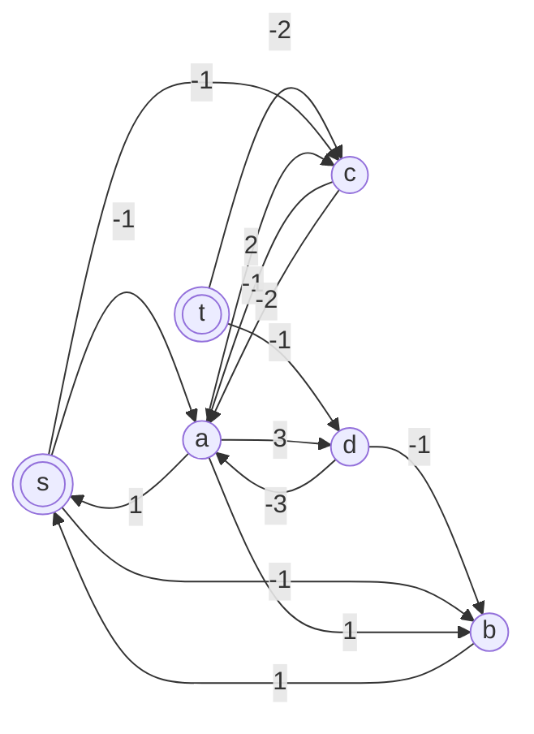

Проведем поиск цикла отрицательной стоимости в остаточной сети.
В остаточной сети отсутствуют циклы отрицательной стоимости. Следовательно, стоимость потока минимальна.

### Ответ:

Максимальный поток в сети равен 20, минимальная стоимость потока 74, она реализуется следующим локальными потоками:

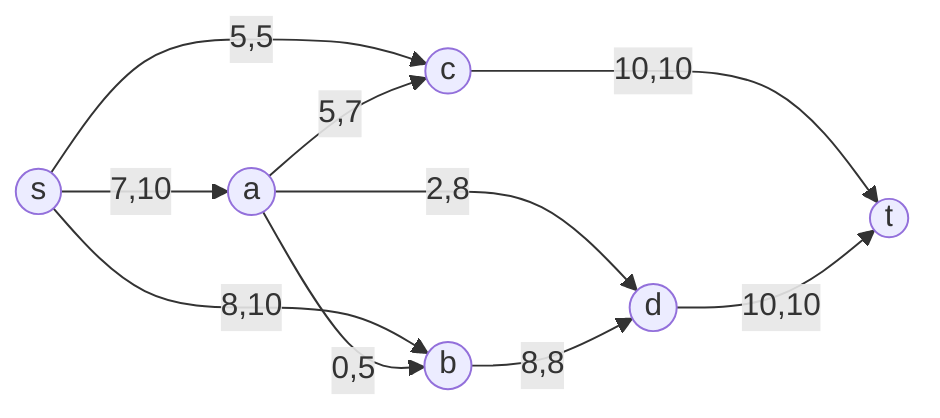