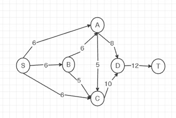
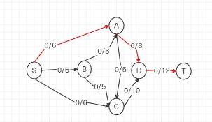
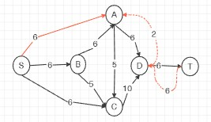
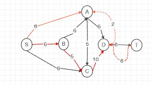
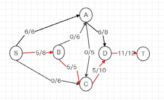
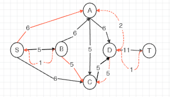
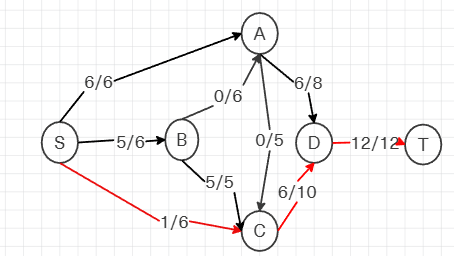
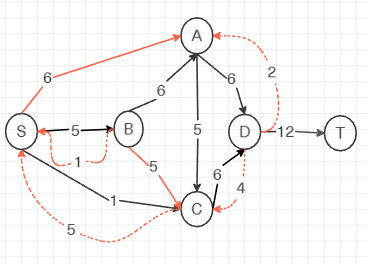
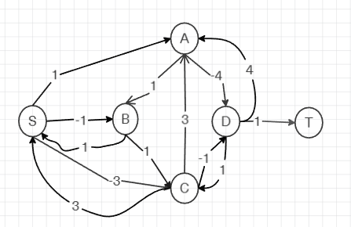
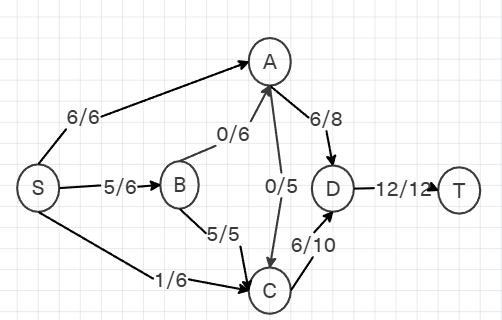

# Задание №17

# Задача о максимальном потоке минимальной стоимости.

## Постановка задачи

1. Дана сеть (взвешенный ориентированный граф) с источником s и стоком t.
2. Для каждой дуги определена пропускная способность и стоимость транспортировки.
3. Необходимо найти для указанной сети максимальный поток минимальной стоимости.

### Вариант 9:

#### Пропускная способность дуг сети p(e) и стоимость транспортировки единицы потока c(e):

| Дуги                                          | sa | sb | sc | ba | bc | cd | ac | ad | dt |
|:----------------------------------------------|:--:|:--:|:--:|:--:|:--:|:--:|:--:|:--:|:--:|
| Пропускная способность p(e)                   | 6  | 6  | 6  | 6  | 5  | 10 | 5  | 8  | 12 |
| Стоимость транспортировки единицы потока c(e) | 1  | 1  | 3  | 1  | 1  | 1  | 3  | 4  | 1  |

### 1. Построим сеть с источником **s**, стоком **t** и указанными пропускными способностями дуг для поиска максимального потока.

### 2. Найдем максимальный поток

Начальный поток ведичиной 6 S → A → D → T

Построим соответствующую остаточную сеть

2. Поиск увеличивающего пути

В остаточной сети найден путь:

s → b → c → d → t 
min(6,5,10,6)=5

Корректируем остаточную сеть

Построим соответствующую остаточную сеть

## Продолжим поиск увеличивающего пути
Найден путь:
s → c → d → t                
min(6,5,1)=1

Корректировка

Максимальный поток:

6+5+1=126 + 5 + 1 = 126+5+1=12

### 3. Рассчитаем стоимость полученного максимального потока

| Дуги                                           |  sa |  sb | sc | ba  | bc  | cd  |  ac | ad | dt | Итого|
|:-----------------------------------------------|:---:|:---:|:--:|:---:|:---:|:---:|:---:|:--:|:--:|:-----:
| Пропускная способность p(e)                    |  6  |  6  | 6  |  6  |  5  |  10 |  5  |  8 | 12 |
| Локальный поток f(e)                           |  6  |  5  | 1  |  0  |  5  |  6  |  0  |  6 | 12 |
| Стоимость транспортировки единицы потока c(e)  |  1  |  1  | 3  |  1  |  1  |  1  |  3  |  4 |  1 |
| Суммарная стоимость f(e)*c(e)                  |  6  |  5  | 3  |  0  |  5  |  6  |  0  | 24 | 12 |**61**|

Стоимость полученного потока составляет 61.

### 4. Попробуем уменьшить стоимость потока для чего построим остаточную сеть

Ищем отрицательный цикл.

Отрицательного цикла в остаточной сети нет, следовательно, стоимость потока минимальна.

### 5. Рассчитаем стоимость полученного максимального потока.

| Дуги                                           |  sa |  sb | sc | ba  | bc  | cd  |  ac | ad | dt | Итого|
|:-----------------------------------------------|:---:|:---:|:--:|:---:|:---:|:---:|:---:|:--:|:--:|:-----:
| Пропускная способность p(e)                    |  6  |  6  | 6  |  6  |  5  |  10 |  5  |  8 | 12 |
| Локальный поток f(e)                           |  6  |  5  | 1  |  0  |  5  |  6  |  0  |  6 | 12 |
| Стоимость транспортировки единицы потока c(e)  |  1  |  1  | 3  |  1  |  1  |  1  |  3  |  4 |  1 |
| Суммарная стоимость f(e)*c(e)                  |  6  |  5  | 3  |  0  |  5  |  6  |  0  | 24 | 12 |**61**|

Стоимость полученного потока составляет 61.

### Ответ:

Максимальный поток в сети равен 12, минимальная стоимость потока 61
и он реализуется следующим локальными потоками:

