# Задание №17
# Задача о максимальном потоке минимальной стоимости.

Для каждого варианта представлены условия задачи, в соответствии с которыми необходимо: 
1. Построить сеть с указанием пропускной способности дуг.
2. Построить остаточную сеть.
3. Определить максимальный поток методом поиска увеличивающих путей в остаточной сети (**строго** так, как было разобрано на занятиях).
4. Минимизировать стоимость максимального потока посредством поиска циклов отрицательной стоимости (**решение необходимо построить так, чтобы найти и обработать как минимум один цикл отрицательной стоимости**).
5. Оформить решение задачи по шагам с подробными комментариями, таблицами и диаграммами.
6. В ответе указать максимальную величину потока, минимальную стоимость транспортировки и сеть с указанием соответствующих локальных потоков.

**Решение должно содержать номер варианта и подробное пошаговое описание.**

Условия задачи расположены в файле `Задание 17/Варианты условий.md` в ветке main репозитория для ручных задач.
Решение задачи нужно оформить в формате Markdown в отдельном файле с названием <название_команды>.md, который добавить в каталог `Задание 17` данного репозитория.

## Для выполнения задания необходимо:

1. Обновить ветку main в локальном репозитории (git pull).
2. От ветки main создать ветвь с названием `<название_команды>-task-17`, заменив `<название_команды>` на название команды, решившей задание.
3. В созданной ветке в каталог `Задание 17` добавить файл с решением задачи с названием `<название_команды>.md`.
4. Зафиксировать изменения на ветке (git commit).
5. Отравить ветку с изменениями в репозиторий на Github (git push).
6. Создать на Github запрос на слияние (pull request), указав в качестве base ветки `main`, в качестве compare ветки `<название_команды>-task-17`.

## Постановка задачи
1. Дана сеть (взвешенный ориентированный граф) с источником s и стоком t.
2. Для каждой дуги определена пропускная способность и стоимость транспортировки.
3. Необходимо найти для указанной сети максимальный поток минимальной стоимости. 

## Пример решения задачи на поиск максимального потока в сети

Пропускная способность дуг сети и стоимость транспортировки указана в таблице.

| Дуги                                          | sa | sb | sc | ad | bd | cd | dt |
|:----------------------------------------------|:--:|:--:|:--:|:--:|:--:|:--:|:--:|
| Пропускная способность p(e)                   | 3  | 4  | 5  | 3  | 4  | 5  | 10 |
| Стоимость транспортировки единицы потока c(e) | 4  | 3  | 1  | 1  | 3  | 2  | 2  |

### 1. Построим сеть с источником **s**, стоком **t** и указанными пропускными способностями дуг для поиска максимального потока.

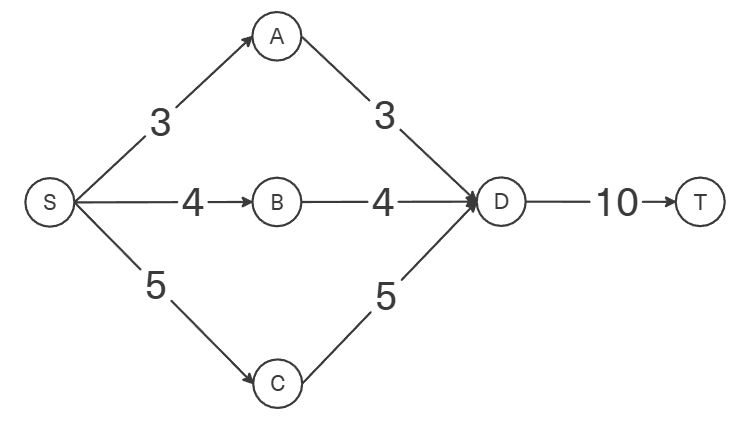

Укажем начальный поток величиной 3 **s -> a -> d -> t**. 

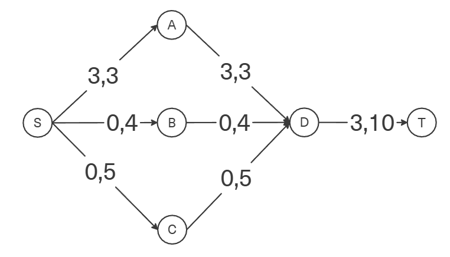

Построим соответствующую остаточную сеть.

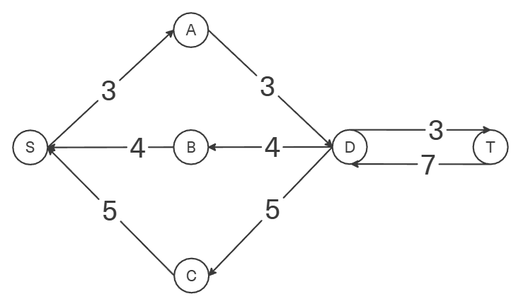

### 2. Проведем поиск увеличивающего пути в остаточной сети
В остаточной сети найден увеличивающий путь t -> d -> b -> s. Минимальный вес дуг на этом пути равен 4.

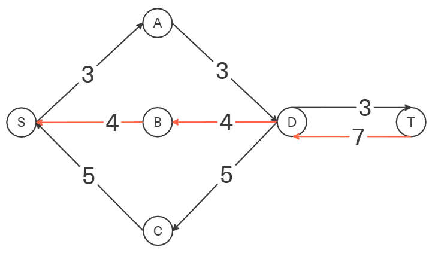

Уменьшим вес дуг на найденном пути, дуги для которых вес стал нулевым удалим из остаточной сети.

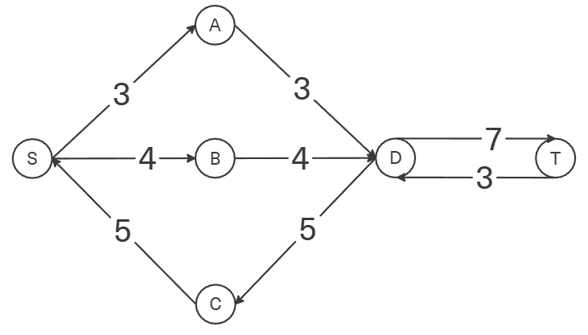

### 3. Продолжим поиск увеличивающего пути в остаточной сети
В остаточной сети найден увеличивающий путь t -> d -> c -> s. Минимальный вес дуг на этом пути равен 3.

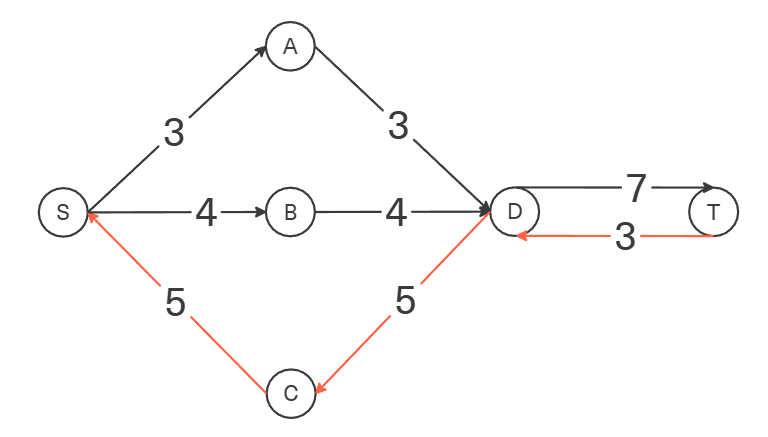

Уменьшим вес дуг на найденном пути, дуги для которых вес стал нулевым удалим из остаточной сети.

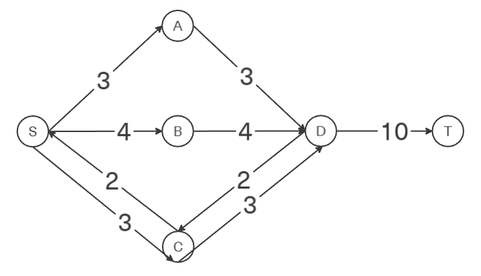

### 4. Продолжим поиск увеличивающего пути в остаточной сети

В остаточной сети не найдено увеличивающих путей, следовательно, алгоритм завершил работу и найденный поток величиной 10 является максимальным для данной сети.

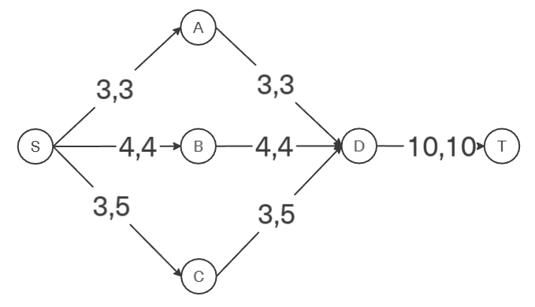

### 5. Рассчитаем стоимость полученного максимального потока.

| Дуги                                          | sa | sb | sc | ad | bd | cd | dt | Итого  |
|:----------------------------------------------|:--:|:--:|:--:|:--:|:--:|:--:|:--:|:------:|
| Пропускная способность p(e)                   | 3  | 4  | 5  | 3  | 4  | 5  | 10 |        |
| Локальный поток f(e)                          | 3  | 4  | 3  | 3  | 4  | 3  | 10 |        |
| Стоимость транспортировки единицы потока c(e) | 4  | 3  | 1  | 1  | 3  | 2  | 2  |        |
| Суммарная стоимость f(e)*c(e)                 | 12 | 12 | 3  | 3  | 12 | 6  | 20 | **68** |

Стоимость полученного потока составляет 68. 

### 6. Попробуем уменьшить стоимость потока для чего построим остаточную сеть.
Для каждого ребра остаточной сети укажем стоимость транспортировки единицы потока.

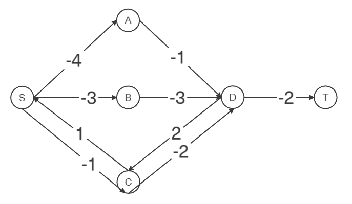

В остаточной сети найден ориентированный цикл отрицательной стоимости s -> a -> d -> c -> s (- 4 - 1 + 2 + 1 = -2). 

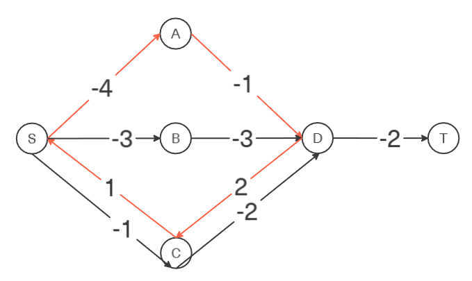

Найдем минимальный вес ребра в указанном цикле, изображенном **в остаточной сети с указанием величины потока**.  

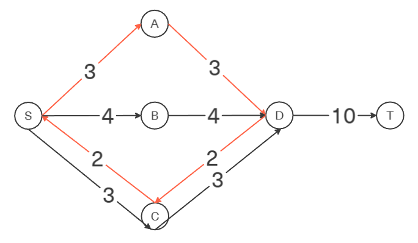

Минимальный вес ребра в цикле 2 - это неиспользованный резерв ребра c -> d.

Удалим найденный цикл - уменьшим на 2 вес всех ребер, входящих в цикл.

Скорректируем остаточную сеть с указанием стоимости транспортировки единицы потока.

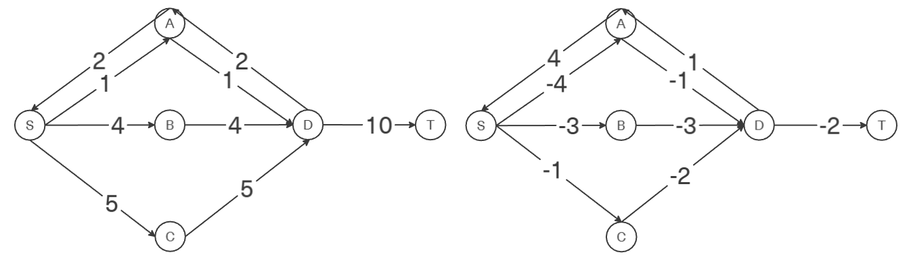

### 6. Проведем повторный поиск цикла отрицательной стоимости в остаточной сети.

В остаточной сети найден ориентированный цикл отрицательной стоимости s -> b -> d -> a -> s (- 3 - 3 + 1 + 4 = -1). 

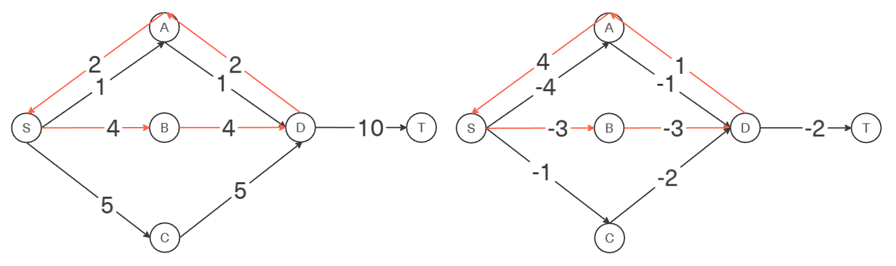

Найдем минимальный вес ребра в указанном цикле, изображенном **в остаточной сети с указанием величины потока**.  

Минимальный вес ребра в цикле 2 - это неиспользованный резерв ребер s -> a и a -> d.

Удалим найденный цикл - уменьшим на 2 вес всех ребер, входящих в цикл.

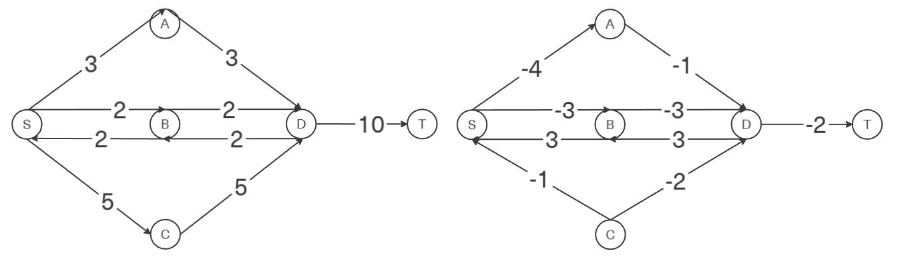

Скорректируем остаточную сеть с указанием стоимости транспортировки единицы потока.

### 7. Проведем повторный поиск цикла отрицательной стоимости в остаточной сети.

В остаточной сети отсутствуют циклы отрицательной стоимости, следовательно, стоимость потока минимальна.

### 8. Рассчитаем стоимость полученного максимального потока.

| Дуги                                          | sa | sb | sc | ad | bd | cd | dt | Итого  |
|:----------------------------------------------|:--:|:--:|:--:|:--:|:--:|:--:|:--:|:------:|
| Пропускная способность p(e)                   | 3  | 4  | 5  | 3  | 4  | 5  | 10 |        |
| Локальный поток f(e)                          | 3  | 2  | 5  | 3  | 2  | 5  | 10 |        |
| Стоимость транспортировки единицы потока c(e) | 4  | 3  | 1  | 1  | 3  | 2  | 2  |        |
| Суммарная стоимость f(e)*c(e)                 | 12 | 6  | 5  | 3  | 6  | 10 | 20 | **62** |

Стоимость полученного потока составляет 62. 

### Ответ:
Максимальный поток в сети равен 10, минимальная стоимость потока 62, она реализуется следующим локальными потоками:

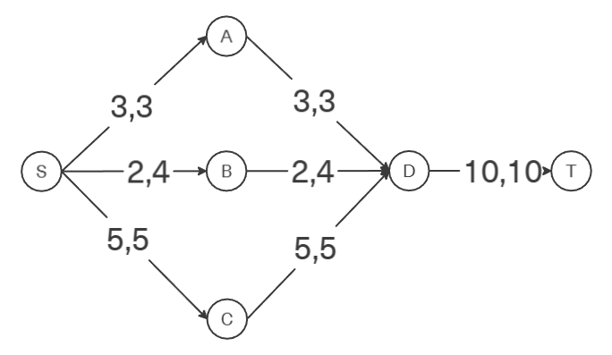
