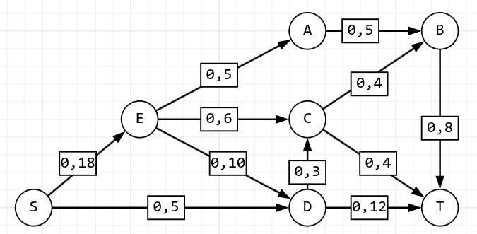
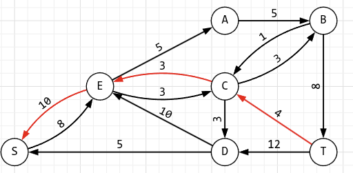
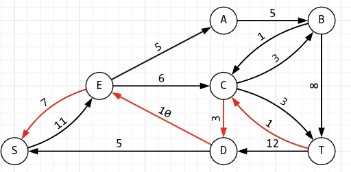
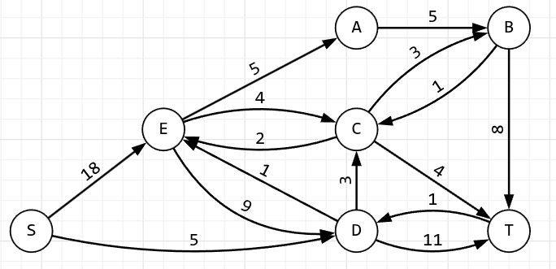
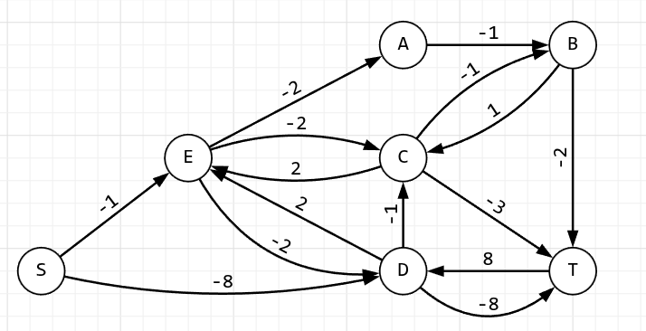
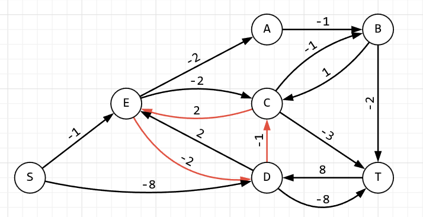
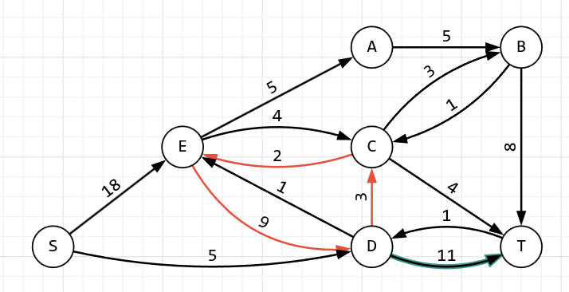
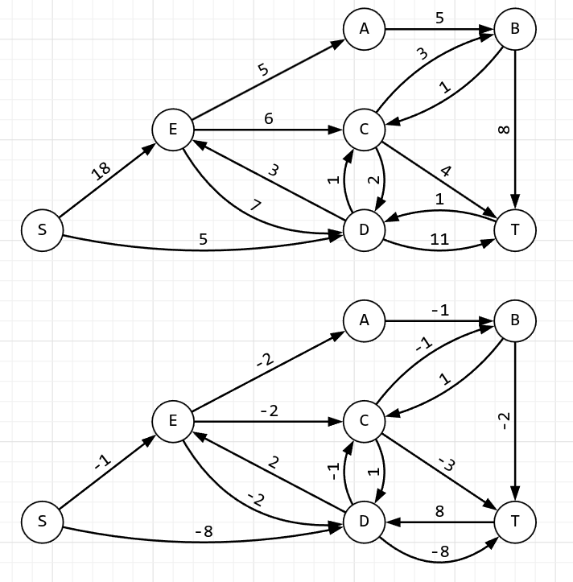
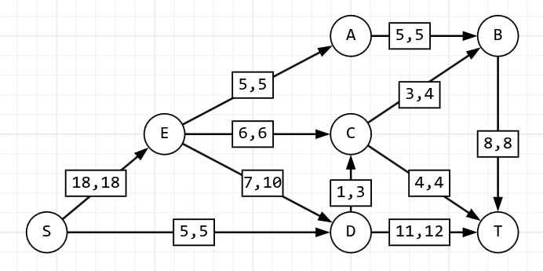

# Задание №17

# Задача о максимальном потоке минимальной стоимости.

## Постановка задачи

1. Дана сеть (взвешенный ориентированный граф) с источником s и стоком t.
2. Для каждой дуги определена пропускная способность и стоимость транспортировки.
3. Необходимо найти для указанной сети максимальный поток минимальной стоимости.

### Вариант 6:

#### Пропускная способность дуг сети p(e) и стоимость транспортировки единицы потока c(e):

| Дуги                                          | se  | ea  | ec  | ed  | ab  | cb  | dc  | bt  | ct  | sd  | dt  |
| :-------------------------------------------- | :-: | :-: | :-: | :-: | :-: | :-: | :-: | :-: | :-: | :-: | :-: |
| Пропускная способность p(e)                   | 18  |  5  |  6  | 10  |  5  |  4  |  3  |  8  |  4  |  5  | 12  |
| Стоимость транспортировки единицы потока c(e) |  1  |  2  |  3  |  2  |  1  |  1  |  1  |  2  |  3  |  8  |  8  |

### 1. Построим сеть с источником **s**, стоком **t** и указанными пропускными способностями дуг для поиска максимального потока.

### 2. Найдем максимальный поток

1.

2.

3.

4.

5.

В остаточной сети не найдено увеличивающих путей, следовательно, алгоритм завершил работу и найденный поток величиной 23 является максимальным для данной сети.

### 3. Рассчитаем стоимость полученного максимального потока

| Дуги                                          | se  | ea  | ec  | ed  | ab  | cb  | dc  | bt  | ct  | sd  | dt  |  Итого  |
| :-------------------------------------------- | :-: | :-: | :-: | :-: | :-: | :-: | :-: | :-: | :-: | :-: | :-: | :-----: |
| Пропускная способность p(e)                   | 18  |  5  |  6  | 10  |  5  |  4  |  3  |  8  |  4  |  5  | 12  |         |
| Локальный поток f(e)                          | 18  |  5  |  3  | 10  |  5  |  3  |  3  |  8  |  3  |  5  | 12  |         |
| Стоимость транспортировки единицы потока c(e) |  1  |  2  |  3  |  2  |  1  |  1  |  1  |  2  |  3  |  8  |  8  |         |
| Суммарная стоимость f(e)\*c(e)                | 18  | 10  |  9  | 20  |  5  |  3  |  3  | 16  |  9  | 40  | 96  | **229** |

Стоимость полученного потока составляет 229.

### 4. Попробуем уменьшить стоимость потока для чего построим остаточную сеть

Для каждого ребра остаточной сети укажем стоимость транспортировки единицы потока

1. В остаточной сети найден ориентированный цикл отрицательной стоимости t -> c -> e -> d -> t (3 + 2 - 2 - 8 = -5)

Найдем минимальный вес ребра в указанном цикле, изображенном в остаточной сети с указанием величины потока.

Минимальный вес ребра в цикле = 1 - это неиспользованный резерв ребра c -> t.

Удалим найденный цикл - уменьшим на 1 вес всех ребер, входящих в цикл.
Скорректируем остаточную сеть с указанием стоимости транспортировки единицы потока.

2. Проведем повторный поиск цикла отрицательной стоимости в остаточной сети.
   В остаточной сети найден ориентированный цикл отрицательной стоимости d -> c -> e -> d = -1

Минимальный вес ребра в цикле = 2 - это неиспользованный резерв ребра e -> c.

Удалим найденный цикл - уменьшим на 2 вес всех ребер, входящих в цикл.

В остаточной сети отсутствуют циклы отрицательной стоимости, следовательно, стоимость потока минимальна.

### 5. Рассчитаем стоимость полученного максимального потока.

| Дуги                                          | se  | ea  | ec  | ed  | ab  | cb  | dc  | bt  | ct  | sd  | dt  |  Итого  |
| :-------------------------------------------- | :-: | :-: | :-: | :-: | :-: | :-: | :-: | :-: | :-: | :-: | :-: | :-----: |
| Пропускная способность p(e)                   | 18  |  5  |  6  | 10  |  5  |  4  |  3  |  8  |  4  |  5  | 12  |         |
| Локальный поток f(e)                          | 18  |  5  |  6  |  7  |  5  |  3  |  1  |  8  |  4  |  5  | 11  |         |
| Стоимость транспортировки единицы потока c(e) |  1  |  2  |  3  |  2  |  1  |  1  |  1  |  2  |  3  |  8  |  8  |         |
| Суммарная стоимость f(e)\*c(e)                | 18  | 10  |  18  | 14  |  5  |  3  |  1  | 16  |  12  | 40  | 88  | **225** |

Стоимость полученного потока составляет 225.

### Ответ:

Максимальный поток в сети равен 23, минимальная стоимость потока 225
и он реализуется следующим локальными потоками:

