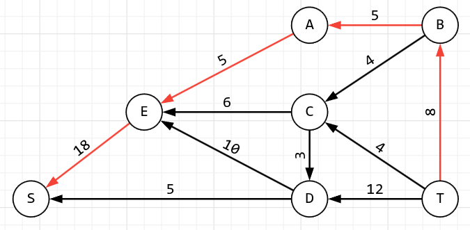
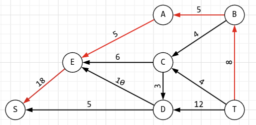
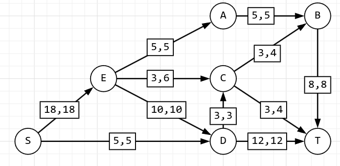
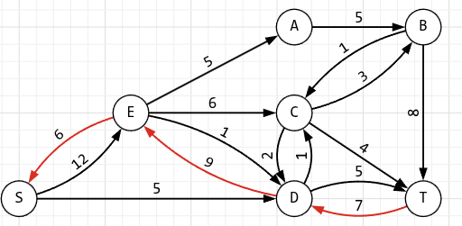
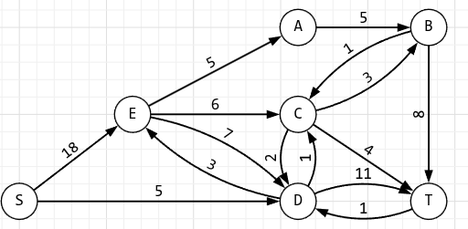
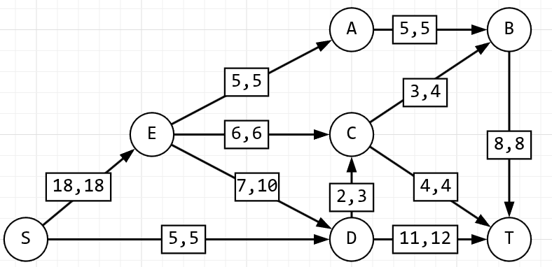
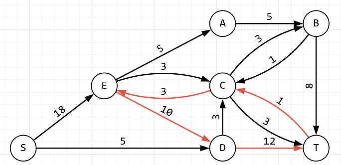

# Задание №17

# Задача о максимальном потоке минимальной стоимости.

## Постановка задачи

1. Дана сеть (взвешенный ориентированный граф) с источником s и стоком t.
2. Для каждой дуги определена пропускная способность и стоимость транспортировки.
3. Необходимо найти для указанной сети максимальный поток минимальной стоимости.

### Вариант 6:

#### Пропускная способность дуг сети p(e) и стоимость транспортировки единицы потока c(e):

| Дуги                                          | se  | ea  | ec  | ed  | ab  | cb  | dc  | bt  | ct  | sd  | dt  |
| :-------------------------------------------- | :-: | :-: | :-: | :-: | :-: | :-: | :-: | :-: | :-: | :-: | :-: |
| Пропускная способность p(e)                   | 18  |  5  |  6  | 10  |  5  |  4  |  3  |  8  |  4  |  5  | 12  |
| Стоимость транспортировки единицы потока c(e) |  1  |  2  |  3  |  2  |  1  |  1  |  1  |  2  |  3  |  8  |  8  |

### 1. Построим сеть с источником **s**, стоком **t** и указанными пропускными способностями дуг для поиска максимального потока.

### 2. Найдем максимальный поток

1.

2.

](.Rehash_assets/image-2.png)](../assets/Rehash-17-3.png)

3.

](.Rehash_assets/image-3.png)](../assets/Rehash-17-4.png)

4.

5.

6.

В остаточной сети не найдено увеличивающих путей, следовательно, алгоритм завершил работу и найденный поток величиной 23 является максимальным для данной сети.

### 3. Рассчитаем стоимость полученного максимального потока

| Дуги                                          | se  | ea  | ec  | ed  | ab  | cb  | dc  | bt  | ct  | sd  | dt  |  Итого  |
| :-------------------------------------------- | :-: | :-: | :-: | :-: | :-: | :-: | :-: | :-: | :-: | :-: | :-: | :-----: |
| Пропускная способность p(e)                   | 18  |  5  |  6  | 10  |  5  |  4  |  3  |  8  |  4  |  5  | 12  |         |
| Локальный поток f(e)                          | 18  |  5  |  6  |  7  |  5  |  3  |  2  |  8  |  4  |  5  | 11  |         |
| Стоимость транспортировки единицы потока c(e) |  1  |  2  |  3  |  2  |  1  |  1  |  1  |  2  |  3  |  8  |  8  |         |
| Суммарная стоимость f(e)\*c(e)                | 18  | 10  | 18  | 14  |  5  |  3  |  2  | 16  | 12  | 40  | 88  | **226** |

Стоимость полученного потока составляет 230.

### 4. Попробуем уменьшить стоимость потока для чего построим остаточную сеть

Для каждого ребра остаточной сети укажем стоимость транспортировки единицы потока

В остаточной сети найден ориентированный цикл отрицательной стоимости e -> a -> b -> t -> d -> e
