# Вариант 7

#### Пропускная способность дуг сети (p(e)) и стоимость транспортировки единицы потока (c(e)):

| Дуги                                          |  sa |  sb |  sc |  ac |  at |  ab |  bd |  ct |  dt |
| :-------------------------------------------- | :-: | :-: | :-: | :-: | :-: | :-: | :-: | :-: | :-: |
| Пропускная способность p(e)                   |  9  |  9  |  4  |  6  |  7  |  4  |  7  |  9  |  9  |
| Стоимость транспортировки единицы потока c(e) |  4  |  2  |  2  |  3  |  8  |  2  |  2  |  3  |  2  |

---

### 1. Построим сеть с источником **s**, стоком **t** и указанными пропускными способностями дуг.

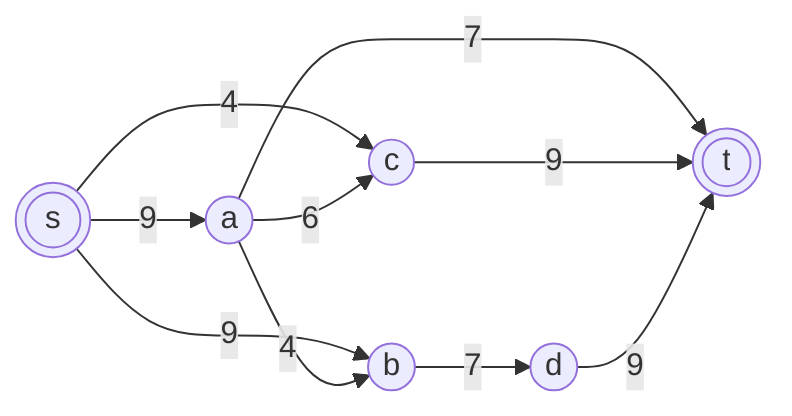

### 2. Построим остаточную сеть

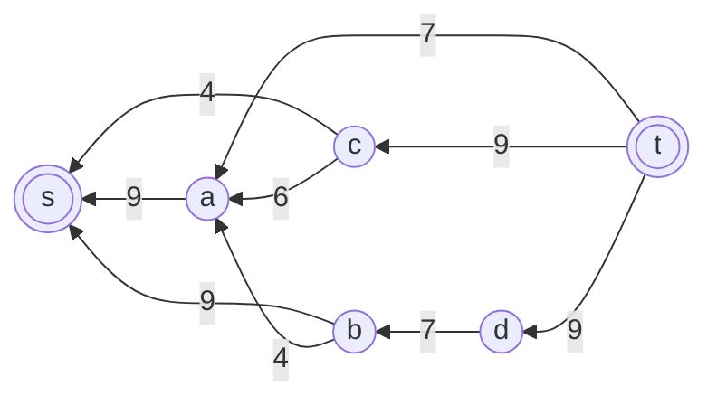

### 3. Поиск увеличивающих путей

**Путь 1:** t → a → s, Минимальный вес дуг на этом пути равен 7.
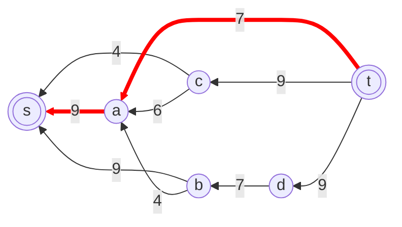
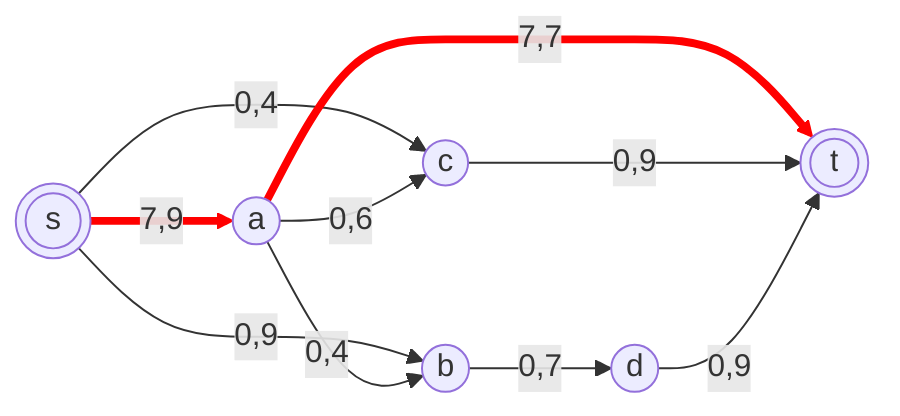
**Путь 2:** t → d → b → s, Минимальный вес дуг на этом пути равен 7.
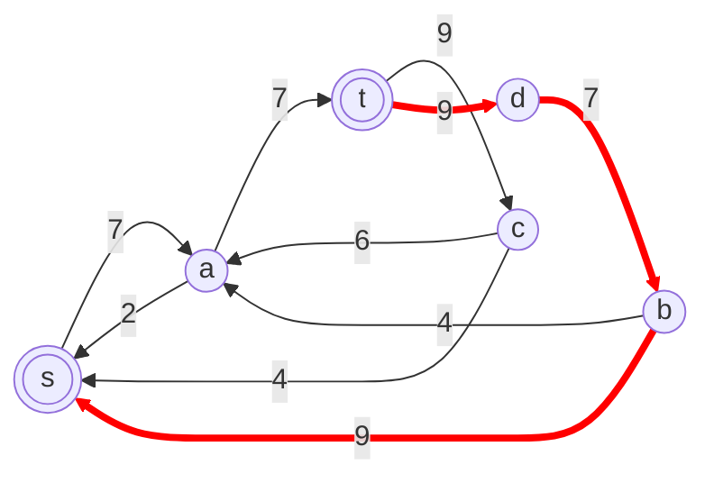

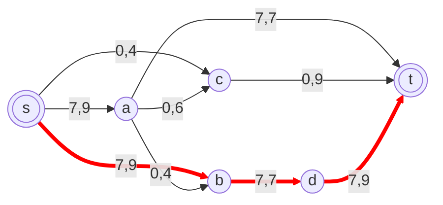
**Путь 3:** t → c → s, Минимальный вес дуг на этом пути равен 4.
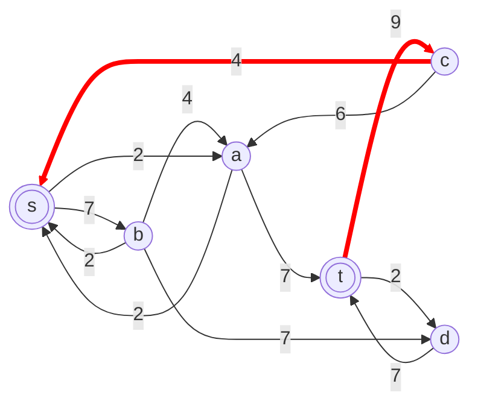

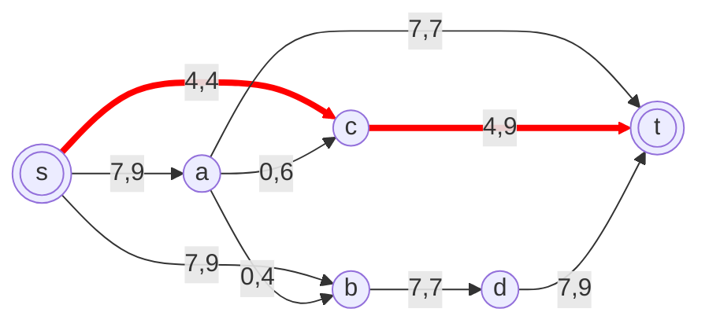
**Путь 3:** t → c → a → s, Минимальный вес дуг на этом пути равен 2.
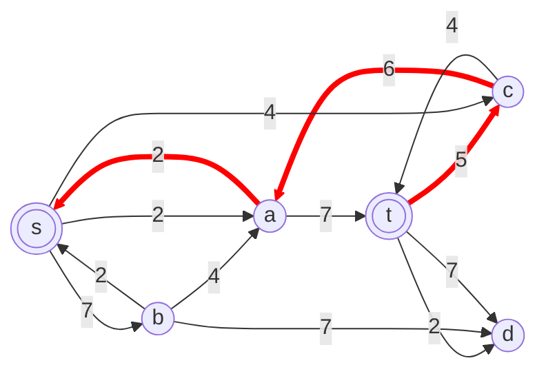

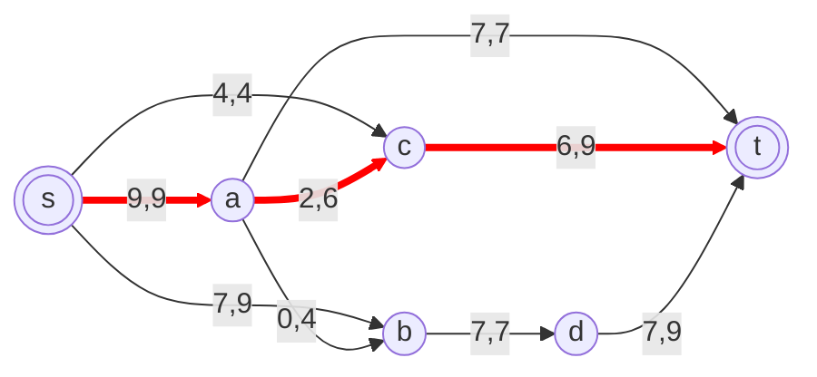

В остаточной сети не найдено увеличивающих путей, следовательно, алгоритм завершил работу и найденный поток величиной 20 является максимальным для данной сети.

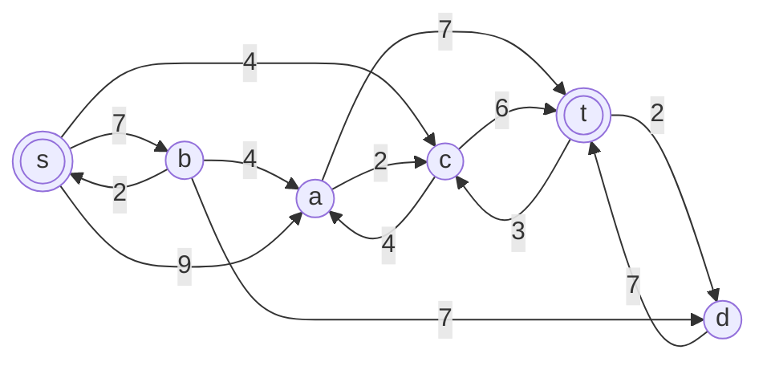
### 4. Рассчитаем стоимость полученного максимального потока.

| Дуги                                          | sa | sb | sc | ac | at | ab | bd | ct | dt |
| :-------------------------------------------- |:--:|:--:|:--:|:--:|:--:|:--:|:--:|:--:|:--:|
| Пропускная способность p(e)                   | 9  | 9  | 4  | 6  | 7  | 4  | 7  | 9  | 9  |
| Локальный поток f(e)                          | 9  | 7  | 4  | 2  | 7  | 0  | 7  | 6  | 7  |
| Стоимость транспортировки единицы потока c(e) | 4  | 2  | 2  | 3  | 8  | 2  | 2  | 3  | 2  |
| Суммарная стоимость f(e)*c(e)                 | 36 | 14 | 8  | 6  | 56 | 0  | 14 | 18 | 14 |
  
Итог 166
### 5. Попробуем уменьшить стоимость потока для чего построим остаточную сеть.
Для каждого ребра остаточной сети укажем стоимость транспортировки единицы потока.

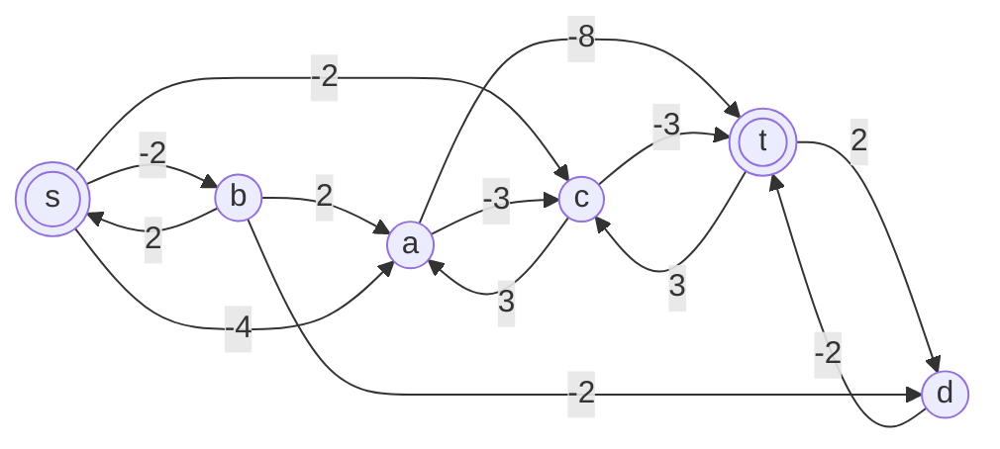

В остаточной сети найден ориентированный цикл отрицательной стоимости a -> t -> c -> a (- 8 + 3 + 3 = -2).

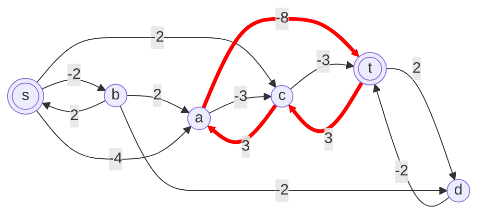

Найдем минимальный вес ребра в указанном цикле, изображенном в остаточной сети с указанием величины потока.

Минимальный вес ребра в цикле 3 - это неиспользованный резерв ребра t -> c.

Удалим найденный цикл - уменьшим на 3 вес всех ребер, входящих в цикл.

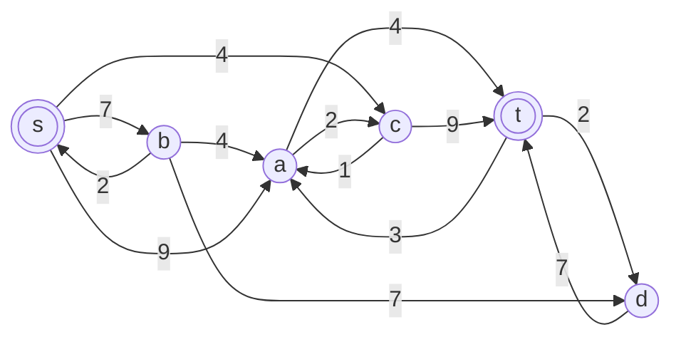

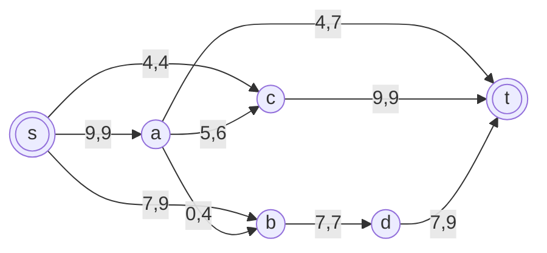
Скорректируем остаточную сеть с указанием стоимости транспортировки единицы потока.

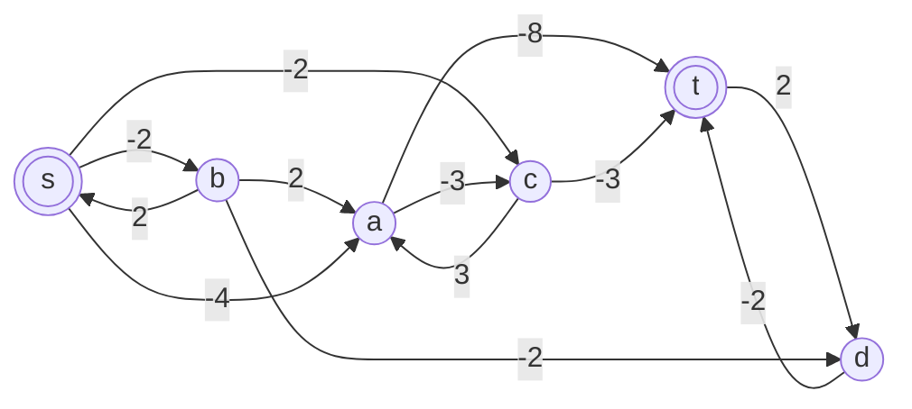
### 5. Проведем повторный поиск цикла отрицательной стоимости в остаточной сети.
В остаточной сети отсутствуют циклы отрицательной стоимости, следовательно, стоимость потока минимальна.

| Дуги                                          | sa | sb | sc | ac | at | ab | bd | ct | dt |
| :-------------------------------------------- |:--:|:--:|:--:|:--:|:--:|:--:|:--:|:--:|:--:|
| Пропускная способность p(e)                   | 9  | 9  | 4  | 6  | 7  | 4  | 7  | 9  | 9  |
| Локальный поток f(e)                          | 9  | 7  | 4  | 5  | 4  | 0  | 7  | 9  | 7  |
| Стоимость транспортировки единицы потока c(e) | 4  | 2  | 2  | 3  | 8  | 2  | 2  | 3  | 2  |
| Суммарная стоимость f(e)*c(e)                 | 36 | 14 | 8  | 15 | 32 | 0  | 14 | 27 | 14 |
  
Стоимость полученного потока составляет 160

### Ответ:
Максимальный поток в сети равен 20, минимальная стоимость потока 160, она реализуется следующим локальными потоками:

