# Задание №17. Вариант 3.
# Задача о максимальном потоке минимальной стоимости.

## Условие задачи

Пропускная способность дуг сети p(e) и стоимость транспортировки единицы потока c(e):

| Дуги                                          | sa | se | ea | ec | ed | ab | ac | cb | dc | bt | ct | dt |
|:----------------------------------------------|:--:|:--:|:--:|:--:|:--:|:--:|:--:|:--:|:--:|:--:|:--:|:--:|
| Пропускная способность p(e)                   | 5  | 18 | 5  | 6  | 10 | 9  | 5  | 4  | 3  | 8  | 4  | 8  |
| Стоимость транспортировки единицы потока c(e) | 1  | 1  | 2  | 3  | 2  | 1  | 1  | 1  | 1  | 10 | 3  | 5  |

Вершины графа: **s** (источник), **a**, **b**, **c**, **d**, **e**, **t** (сток).

---

## 1. Построим сеть с источником **s**, стоком **t** и указанными пропускными способностями дуг для поиска максимального потока.

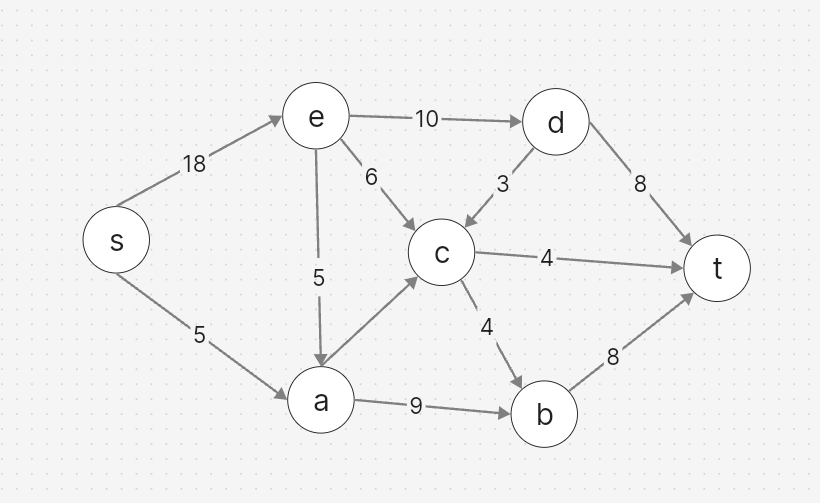

Укажем начальный поток величиной 5 **s → a → b → t**.

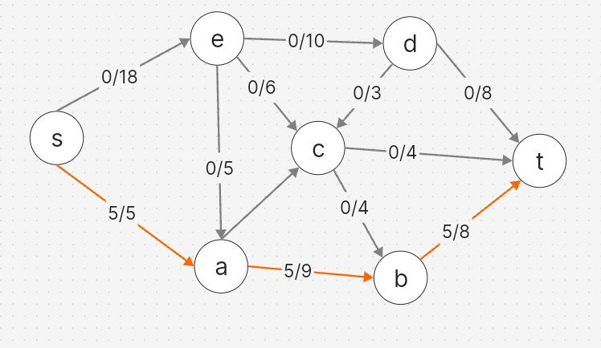

Построим соответствующую остаточную сеть.

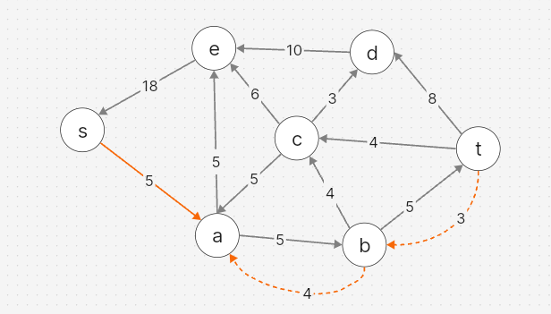

## 2. Проведем поиск увеличивающего пути в остаточной сети.

В остаточной сети найден увеличивающий путь **t → d → e → s**. Минимальный вес дуг на этом пути: min(18, 10, 8) = **8**.

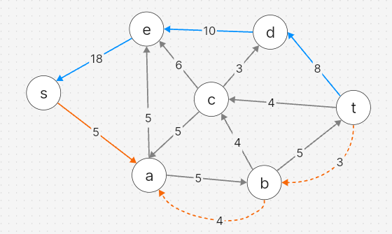

Увеличим поток на 8. Величина потока: 5 + 8 = **13**.

Уменьшим вес дуг на найденном пути, дуги для которых вес стал нулевым удалим из остаточной сети.

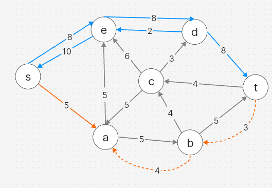

Исходная сеть 

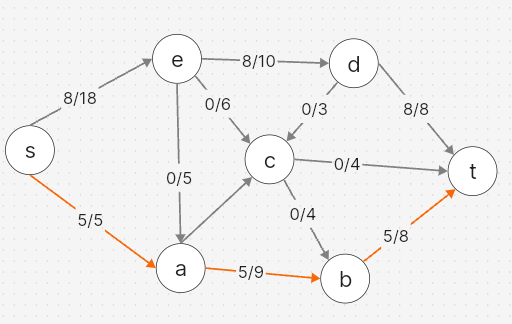

## 3. Продолжим поиск увеличивающего пути в остаточной сети.

В остаточной сети найден увеличивающий путь **t → c → e → s**. Минимальный вес дуг на этом пути: min(8, 6, 4) = **4**.

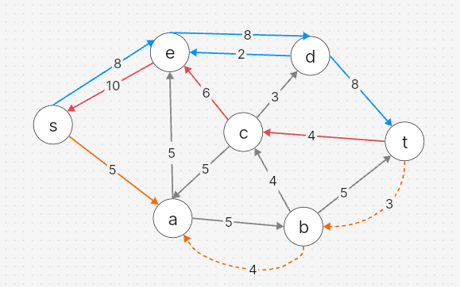

Увеличим поток на 4. Величина потока: 13 + 4 = **17**.

Уменьшим вес дуг на найденном пути, дуги для которых вес стал нулевым удалим из остаточной сети.

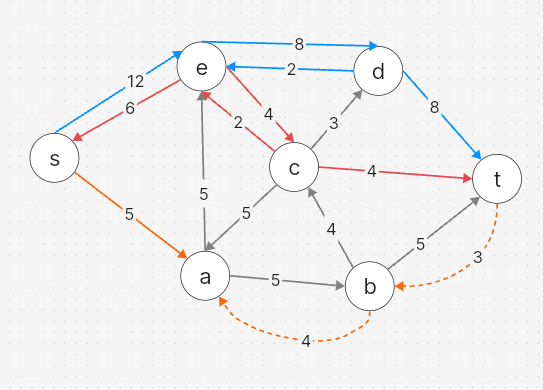

Исходная сеть 

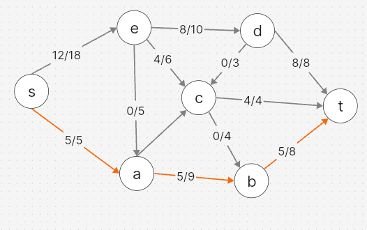

## 4. Продолжим поиск увеличивающего пути в остаточной сети.

В остаточной сети найден увеличивающий путь **t → b → a → e → s**. Минимальный вес дуг на этом пути: min(6, 5, 4, 3) = **3**.

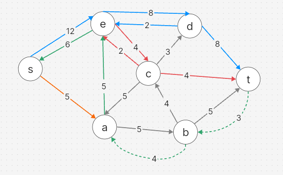

Увеличим поток на 3. Величина потока: 17 + 3 = **20**.

Уменьшим вес дуг на найденном пути, дуги для которых вес стал нулевым удалим из остаточной сети.

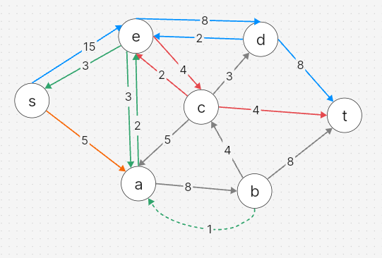

Исходная сеть 

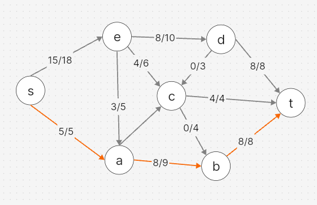

## 7. Рассчитаем стоимость полученного максимального потока.

| Дуги                                          | sa | se | ea | ec | ed | ab | ac | cb | dc | bt | ct | dt | Итого  |
|:----------------------------------------------|:--:|:--:|:--:|:--:|:--:|:--:|:--:|:--:|:--:|:--:|:--:|:--:|:------:|
| Пропускная способность p(e)                   | 5  | 18 | 5  | 6  | 10 | 9  | 5  | 4  | 3  | 8  | 4  | 8  |        |
| Стоимость транспортировки единицы потока c(e) | 1  | 1  | 2  | 3  | 2  | 1  | 1  | 1  | 1  | 10 | 3  | 5  |        |
| Суммарная стоимость f(e)*c(e)                 | 5  | 15 | 6  | 12 | 16 | 8  | 0  | 0  | 0  | 80 | 12 | 40 | **194** |

Стоимость полученного потока составляет **194**.

## 8. Попробуем уменьшить стоимость потока для чего построим остаточную сеть.

Для каждого ребра остаточной сети укажем стоимость транспортировки единицы потока.

Остаточная сеть с указанием стоимости транспортировки единицы потока:

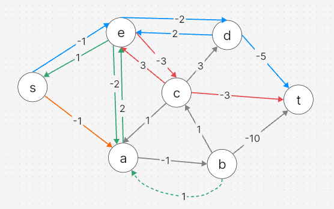

## 9. Поиск цикла отрицательной стоимости в остаточной сети.

Отрицательных циклов в графе не обнаружено — все проверенные циклы имеют неотрицательную суммарную стоимость.

## Ответ

Максимальный поток в сети равен **20**, минимальная стоимость потока **194**.

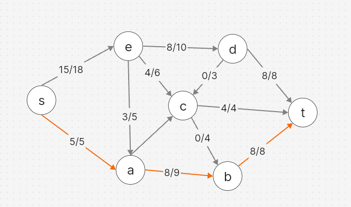

Максимальный поток минимальной стоимости реализуется следующими локальными потоками:

| Дуги                  | sa | se | ea | ec | ed | ab | ac | cb | dc | bt | ct | dt |
|:----------------------|:--:|:--:|:--:|:--:|:--:|:--:|:--:|:--:|:--:|:--:|:--:|:--:|
| Пропускная способность p(e) | 5  | 18 | 5  | 6  | 10 | 9  | 5  | 4  | 3  | 8  | 4  | 8  |
| Локальный поток f(e)  | 5  | 15 | 3  | 4  | 8  | 8  | 0  | 0  | 0  | 8  | 4  | 8  |
