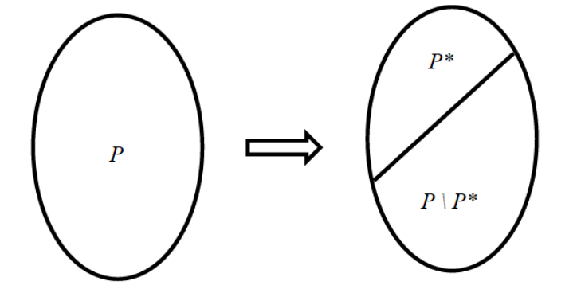
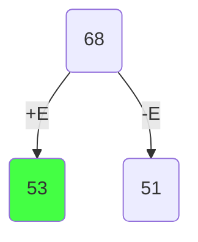
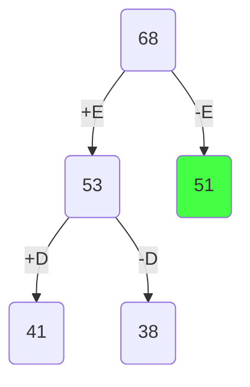
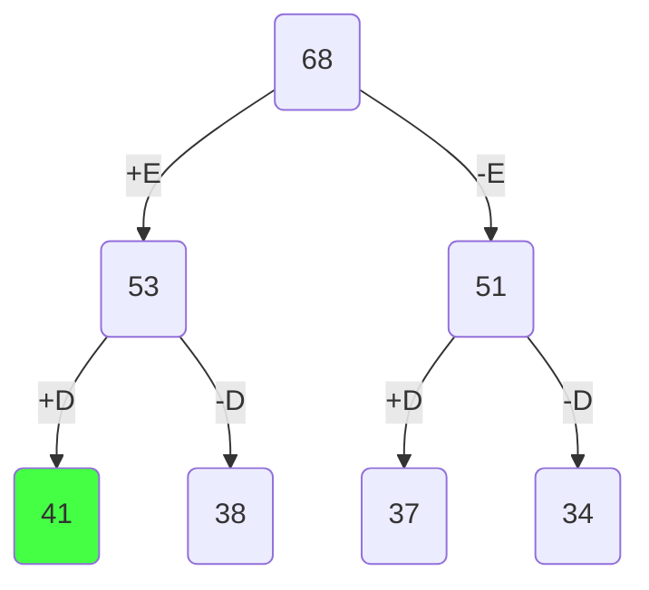
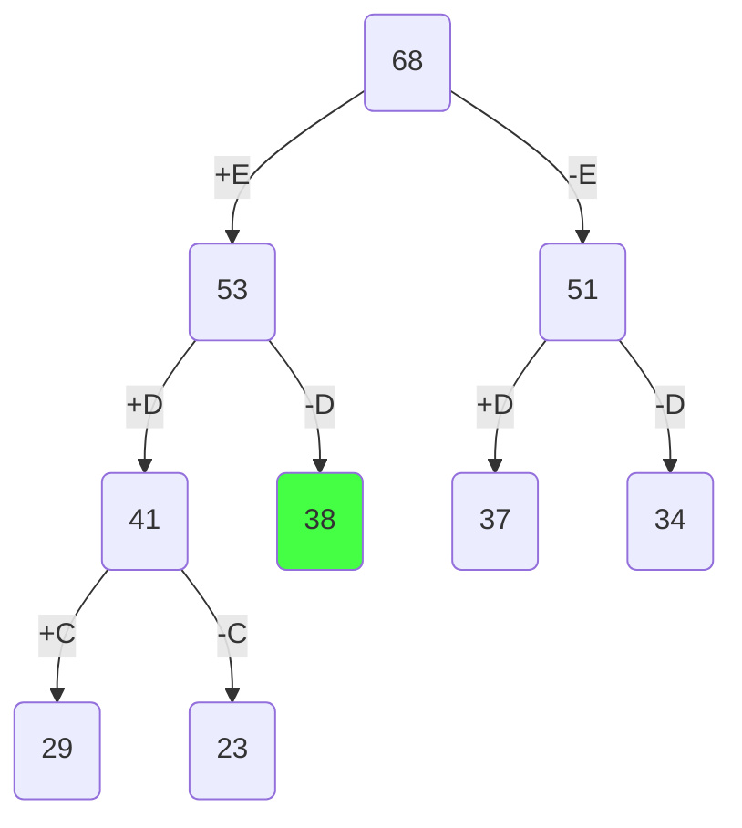
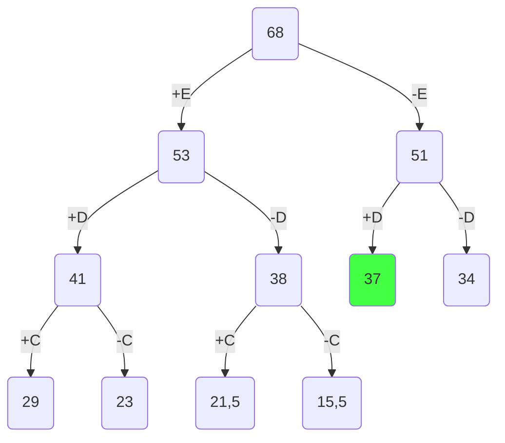
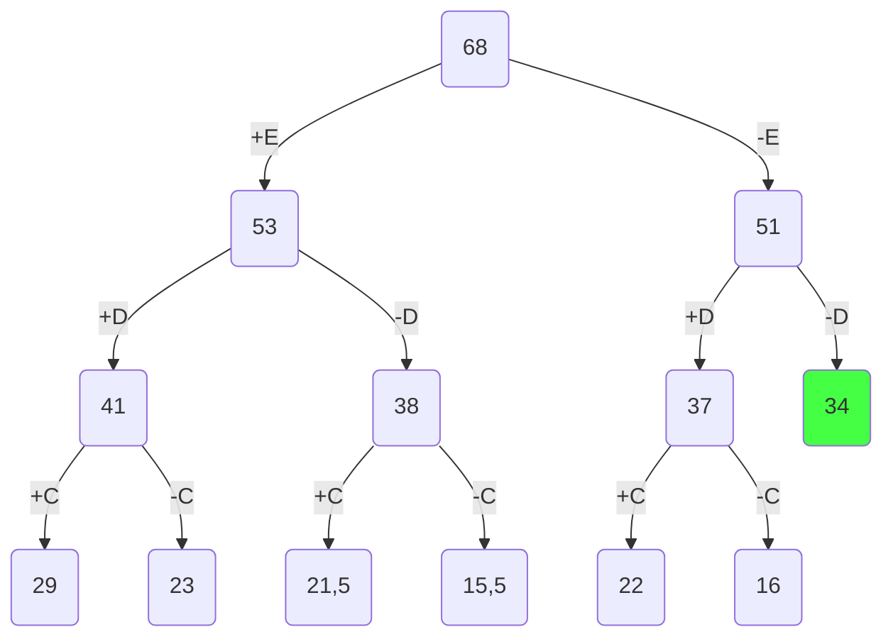
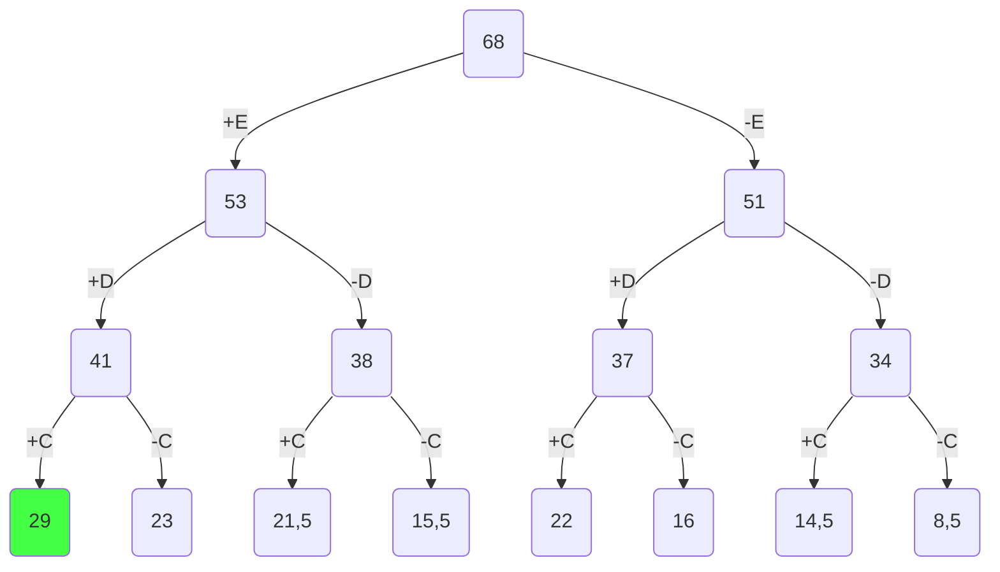
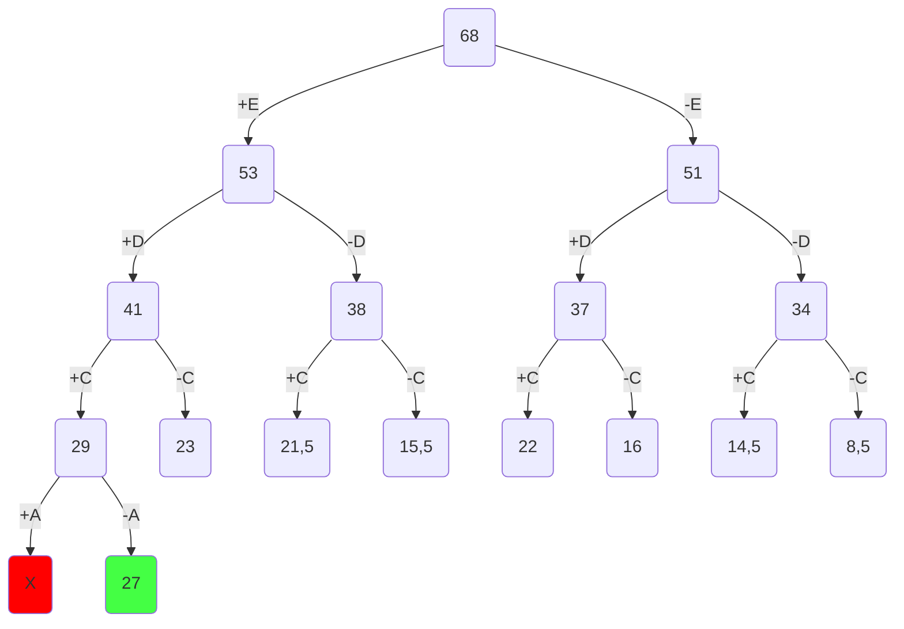
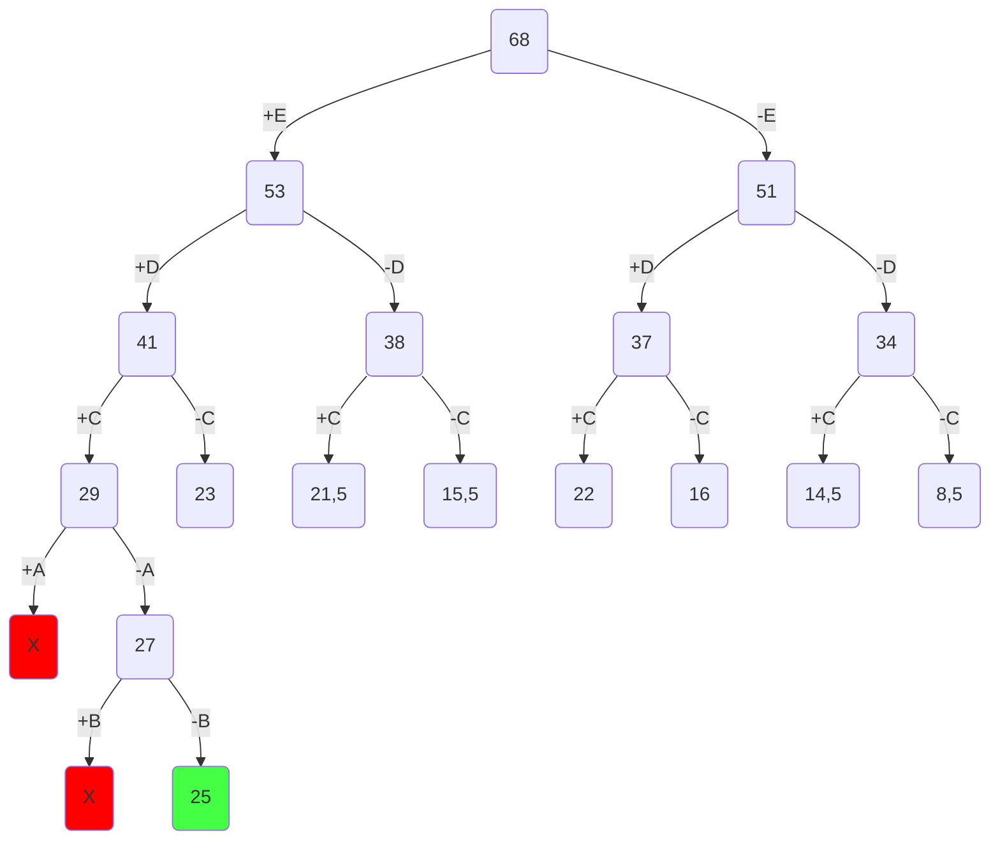

# Задание №18. Вариант 2
# 🎯 Метод ветвей и границ

Метод ветвей и границ – это один из методов решения задач комбинаторной оптимизации. Он позволяет найти точку максимума (или минимума) целевой функции $f(x_{1},x_{2},\dots ,x_{n})$ в пространстве поиска $P$, состоящем из большого числа точек (возможных вариантов). 

Метод ветвей и границ успешно работает, например, при решении задачи о рюкзаке в следующей постановке:
1. имеется рюкзак, вместимость которого равна $V$;
2. имеется множество из $n$ предметов;
3. каждый предмет имеет объём $v_{i}$ и стоимость $s_{i}$, причем суммарный объём всех предметов превосходит вместимость рюкзака (т.е. сразу все предметы не помещаются в рюкзак);
4. требуется найти такой набор предметов, который помещается в рюкзак и имеет максимально возможную стоимость.

Целевая функция $f(x_{1},x_{2},\dots ,x_{n})$ в этой задаче — это суммарная стоимость набора предметов, положенных в рюкзак.

Пространство поиска $P$ — это множество всех допустимых вариантов заполнения рюкзака. 

Метод ветвей и границ позволяет справиться с перебором за счёт быстрого отбрасывания (отсечения) многих заведомо не перспективных вариантов заполнения рюкзака, которые точно не могут быть ответом к задаче. Не случайно другое название метода ветвей и границ — **поиск с отсечением**. 

С помощью процедуры ветвления мы выбираем из множества поиска $P$ некоторое его подмножество вариантов $P^{\star}$ , а с помощью процедуры оценивания мы оцениваем перспективность подмножества $P^{\star}$ и подмножества остальных вариантов $P\setminus P^{\star}$.

Если мы уверены, что наилучший вариант из подмножества $P^{\star}$ не может быть ответом к задаче, то мы отбрасываем всё подмножество $P^{\star}$, тем самым сужая область поиска ответа к задаче до множества $P\setminus P^{\star}$. Если же ответом к задаче не может быть наилучший вариант из множества $P\setminus P^{\star}$, то новой областью поиска становится подмножество $P^{\star}$.

# ✍️ Задача о рюкзаке
## Постановка задачи
Задача о рюкзаке (англ. Knapsack problem) — дано N предметов, ni предмет имеет массу wi > 0 и стоимость pi > 0. Необходимо выбрать из этих предметов такой набор, чтобы суммарная масса не превосходила заданной величины W (вместимость рюкзака), а суммарная стоимость была максимальна.

Необходимо: 
1. Решить задачу о рюкзаке с применением метода ветвей и границ.
2. **В узлах построенного дерева привести расчет оценки и указать порядковый номер, по которым можно проверить порядок исследования узлов дерева**, либо оформить решение с пошаговым построением дерева.
3. В ответе указать:
   - максимально возможную стоимость предметов в рюкзаке,
   - набор предметов, обеспечивающих максимальную стоимость,
   - общий вес предметов в рюкзаке,
   - свободное место в рюкзаке.

## Условие задачи

|    **Предметы**   | **A** | **B** | **C** | **D** | **E** |
|-------------------|:-----:|:-----:|:-----:|:-----:|:-----:|
| **Стоимость**     |   5   |   3   |   8   |   9   |   8   |
| **Вес**           |   10  |  12   |   4   |   3   |   2   |

Ограничение вместимости - 17 у.е.

## Шаг 1
Сортируем предметы по их ценности $(\frac {Стоимость}{вес})$

|    **Предметы**   | **E** | **D** | **C** |     **A**     |     **B**     |
|-------------------|:-----:|:-----:|:-----:|:-------------:|:-------------:|
| **Стоимость**     |   8   |   9   |   8   |       5       |       3       |
| **Вес**           |   2   |   3   |   4   |      10       |      12       |
| **Ценность**      |   4   |   3   |   2   | $\frac{1}{2}$ | $\frac{1}{4}$ |

## Шаг 2
Представим, что самого ценного предмета из тех, что еще не обработаны, у нас бесконечное количество и мы можем делить его на сколь угодно малые части. Тогда мы можем все оставшееся в рюкзаке место заполнить этим предметом. Тогда ценность будет:

$$
4 * 17 = 68
$$

Это значение будет корнем нашего дерева, оно представляет оценку перспективности для задачи в целом.

## Шаг 3
Разобьем множество решений на два подмножества и начнем строить дерево. Левым потомком будет подмножество решений, в которых мы взяли самый ценный из оставшихся предметов, правым - где не взяли. 

|    **Предметы**   | **E** | **D** | **C** |     **A**     |     **B**     |
|-------------------|:-----:|:-----:|:-----:|:-------------:|:-------------:|
| **Стоимость**     |   8   |   9   |   8   |       5       |       3       |
| **Вес**           |   2   |   3   |   4   |      10       |      12       |
| **Ценность**      |   4   |   3   |   2   | $\frac{1}{2}$ | $\frac{1}{4}$ |

Оценка перспективности левого потомка = 

$$
8 + (17 - 2) * 3 = 53 
$$

> Мы считаем, что, положив предмет E в рюкзак, увеличили его стоимость с 0 до 8. Затем оставшееся место (17 единиц объёма - 2 единицы объёма предмета E) заполняем вторым по ценности предметом D (ценность 3).

Оценка перспективности правого потомка = 

$$
17 * 3 = 51
$$

>Мы считаем, что, не положив предмет E в рюкзак,  не увеличили его стоимость. Поэтому считаем оставшееся место (17 единиц объёма) заполненным вторым по ценности предметом D (ценность 3).

## Шаг 4

Повторяем шаг и продолжаем строить дерево из самой перспективной вершины.

|    **Предметы**   | **E** | **D** | **C** |     **A**     |     **B**     |
|-------------------|:-----:|:-----:|:-----:|:-------------:|:-------------:|
| **Стоимость**     |   8   |   9   |   8   |       5       |       3       |
| **Вес**           |   2   |   3   |   4   |      10       |      12       |
| **Ценность**      |   4   |   3   |   2   | $\frac{1}{2}$ | $\frac{1}{4}$ |

Оценка перспективности левого потомка =

$$
8 + 9 + (17 - 2 - 3) * 2 = 17 + 12 * 2 = 41 
$$

> Мы считаем, что, положив предметы E и D в рюкзак, увеличили его стоимость с 0 до 17 (8 + 9). Затем оставшееся место (17 единиц объёма - 2 - 3 единицы объёма предметов E и D) заполняем третьим по ценности предметом C (ценность 2).

Оценка перспективности правого потомка = 

$$
8 + (17 - 2) * 2 = 38
$$

> Мы считаем, что, положив предмет E в рюкзак, увеличили его стоимость с 0 до 8. Затем оставшееся место (17 единиц объёма - 2 единицы объёма предмета E) заполняем третьим по ценности предметом C (ценность 2).

## Шаг 5

Заметим, что самая перспективная вершина оказалась на другой ветке. Продолжаем строить из вершины с оценкой 51.

|    **Предметы**   | **E** | **D** | **C** |     **A**     |     **B**     |
|-------------------|:-----:|:-----:|:-----:|:-------------:|:-------------:|
| **Стоимость**     |   8   |   9   |   8   |       5       |       3       |
| **Вес**           |   2   |   3   |   4   |      10       |      12       |
| **Ценность**      |   4   |   3   |   2   | $\frac{1}{2}$ | $\frac{1}{4}$ |

Оценка перспективности левого потомка =

$$
9 + (17 - 3) * 2 = 9 + 14 * 2 = 37 
$$

> Мы считаем, что, положив предмет D в рюкзак, увеличили его стоимость с 0 до 9. Затем оставшееся место (17 единиц объёма - 3 единицы объёма предмета D) заполняем третьим по ценности предметом C (ценность 2).

Оценка перспективности правого потомка = 

$$
17 * 2 = 34
$$

> Мы считаем, что, не положив предметы в рюкзак, заполняем оставшееся место (17 единиц объёма) третьим по ценности предметом C (ценность 2).

## Шаг 6

Самая перспективная вершина - 41.

|    **Предметы**   | **E** | **D** | **C** |     **A**     |     **B**     |
|-------------------|:-----:|:-----:|:-----:|:-------------:|:-------------:|
| **Стоимость**     |   8   |   9   |   8   |       5       |       3       |
| **Вес**           |   2   |   3   |   4   |      10       |      12       |
| **Ценность**      |   4   |   3   |   2   | $\frac{1}{2}$ | $\frac{1}{4}$ |

Оценка перспективности левого потомка =

$$
8 + 9 + 8 + (17 - 2 - 3 - 4) * \frac{1}{2} = 25 + 8 * \frac{1}{2} = 29
$$

> Мы считаем, что, положив предметы E, D и C в рюкзак, увеличили его стоимость с 0 до 25 (8 + 9 + 8). Затем оставшееся место (17 единиц объёма - 2 - 3 - 4 единицы объёма предметов E, D и C) заполняем четвёртым по ценности предметом A (ценность $\frac{1}{2}$).

Оценка перспективности правого потомка = 

$$
8 + 9 + (17 - 2 - 3) * \frac{1}{2} = 17 + 12 * \frac{1}{2} = 23
$$

> Мы считаем, что, положив предметы E и D в рюкзак, увеличили его стоимость с 0 до 17 (8 + 9). Затем оставшееся место (17 единиц объёма - 2 - 3 единицы объёма предметов E и D) заполняем четвёртым по ценности предметом A (ценность $\frac{1}{2}$).

## Шаг 7

Самая перспективная вершина - 38.

|    **Предметы**   | **E** | **D** | **C** |     **A**     |     **B**     |
|-------------------|:-----:|:-----:|:-----:|:-------------:|:-------------:|
| **Стоимость**     |   8   |   9   |   8   |       5       |       3       |
| **Вес**           |   2   |   3   |   4   |      10       |      12       |
| **Ценность**      |   4   |   3   |   2   | $\frac{1}{2}$ | $\frac{1}{4}$ |

Оценка перспективности левого потомка =

$$
8 + 8 + (17 - 2 - 4) * \frac{1}{2} = 16 + 11 * \frac{1}{2} = 21,5 
$$

> Мы считаем, что, положив предметы E и C в рюкзак, увеличили его стоимость с 0 до 16 (8 + 8). Затем оставшееся место (17 единиц объёма - 2 - 4 единицы объёма предметов E и C) заполняем четвёртым по ценности предметом A (ценность $\frac{1}{2}$).

Оценка перспективности правого потомка = 

$$
8 + (17 - 2) * \frac{1}{2} = 8 + 15 * \frac{1}{2} = 15,5
$$

> Мы считаем, что, положив предмет E в рюкзак, увеличили его стоимость с 0 до 8. Затем оставшееся место (17 единиц объёма - 2 единицы объёма предмета E) заполняем четвёртым по ценности предметом A (ценность $\frac{1}{2}$).

## Шаг 8

Самая перспективная вершина - 37.

|    **Предметы**   | **E** | **D** | **C** |     **A**     |     **B**     |
|-------------------|:-----:|:-----:|:-----:|:-------------:|:-------------:|
| **Стоимость**     |   8   |   9   |   8   |       5       |       3       |
| **Вес**           |   2   |   3   |   4   |      10       |      12       |
| **Ценность**      |   4   |   3   |   2   | $\frac{1}{2}$ | $\frac{1}{4}$ |

Оценка перспективности левого потомка =

$$
9 + 8 + (17 - 3 - 4) * \frac{1}{2} = 17 + 10 * \frac{1}{2} = 22 
$$

> Мы считаем, что, положив предметы D и C в рюкзак, увеличили его стоимость с 0 до 17 (9 + 8). Затем оставшееся место (17 единиц объёма - 3 - 4 единицы объёма предметов D и C) заполняем четвёртым по ценности предметом A (ценность $\frac{1}{2}$).

Оценка перспективности правого потомка = 

$$
9 + (17 - 3) * \frac{1}{2} = 9 + 14 * \frac{1}{2} = 16
$$

> Мы считаем, что, положив предмет D в рюкзак, увеличили его стоимость с 0 до 9. Затем оставшееся место (17 единиц объёма - 3 единицы объёма предмета D) заполняем четвёртым по ценности предметом A (ценность $\frac{1}{2}$).

## Шаг 9

Самая перспективная вершина - 34.

|    **Предметы**   | **E** | **D** | **C** |     **A**     |     **B**     |
|-------------------|:-----:|:-----:|:-----:|:-------------:|:-------------:|
| **Стоимость**     |   8   |   9   |   8   |       5       |       3       |
| **Вес**           |   2   |   3   |   4   |      10       |      12       |
| **Ценность**      |   4   |   3   |   2   | $\frac{1}{2}$ | $\frac{1}{4}$ |

Оценка перспективности левого потомка =

$$
8 + (17 - 4) * \frac{1}{2} = 8 + 13 * \frac{1}{2} = 14,5
$$

> Мы считаем, что, положив предмет C в рюкзак, увеличили его стоимость с 0 до 8. Затем оставшееся место (17 единиц объёма - 4 единицы объёма предмета C) заполняем четвёртым по ценности предметом A (ценность $\frac{1}{2}$).

Оценка перспективности правого потомка = 

$$
17 * \frac{1}{2} = 8,5
$$

> Мы считаем, что, не положив предметы в рюкзак, заполняем оставшееся место (17 единиц объёма) четвёртым по ценности предметом A (ценность $\frac{1}{2}$).

## Шаг 10

Самая перспективная вершина - 29.

|    **Предметы**   | **E** | **D** | **C** |     **A**     |     **B**     |
|-------------------|:-----:|:-----:|:-----:|:-------------:|:-------------:|
| **Стоимость**     |   8   |   9   |   8   |       5       |       3       |
| **Вес**           |   2   |   3   |   4   |      10       |      12       |
| **Ценность**      |   4   |   3   |   2   | $\frac{1}{2}$ | $\frac{1}{4}$ |

Оценка перспективности левого потомка =

$$
8 + 9 + 8 + 5 + (17 - 2 - 3 - 4 - 10) * \frac{1}{4} = 30 + (-2) * \frac{1}{4}
$$

> Мы считаем, что, положив предметы E, D, C и A в рюкзак, увеличили его стоимость с 0 до 30 (8 + 9 + 8 + 5). Затем оставшееся место (17 единиц объёма - 2 - 3 - 4 - 10 единицы объёма предметов E, D, C и A) заполняем пятым по ценности предметом B (ценность $\frac{1}{4}$).

❗️Получили отрицательное значение, что значит предмет не поместится в рюкзак. Соответственно от этой вершины мы не будем продолжать поиск.

Оценка перспективности правого потомка = 

$$
8 + 9 + 8 + (17 - 2 - 3 - 4) * \frac{1}{4} = 25 + 8 * \frac{1}{4} = 27
$$

> Мы считаем, что, положив предметы E, D и C в рюкзак, увеличили его стоимость с 0 до 25 (8 + 9 + 8). Затем оставшееся место (17 единиц объёма - 2 - 3 - 4 единицы объёма предметов E, D и C) заполняем пятым по ценности предметом B (ценность $\frac{1}{4}$).

## Шаг 11

Самая перспективная вершина - 27.

|    **Предметы**   | **E** | **D** | **C** |     **A**     |     **B**     |
|-------------------|:-----:|:-----:|:-----:|:-------------:|:-------------:|
| **Стоимость**     |   8   |   9   |   8   |       5       |       3       |
| **Вес**           |   2   |   3   |   4   |      10       |      12       |
| **Ценность**      |   4   |   3   |   2   | $\frac{1}{2}$ | $\frac{1}{4}$ |

Оценка перспективности левого потомка =

$$
8 + 9 + 8 + 3 + (17 - 2 - 3 - 4 - 12) * 0 = 28 + (-4) * 0 
$$

> Мы считаем, что, положив предметы E, D, C и B в рюкзак, увеличили его стоимость с 0 до 28 (8 + 9 + 8 + 3). Затем оставшееся место (17 единиц объёма - 2 - 3 - 4 - 12 единицы объёма предметов E, D, C и B) нам больше нечем заполнять, так как мы использовали все предметы.

❗️Снова получили отрицательное значение - не рассматриваем эту вершину

Оценка перспективности правого потомка =

$$
8 + 9 + 8 + (17 - 2 - 3 - 4) * 0 = 25 + 8 * 0 = 25
$$

> Мы считаем, что, положив предметы E, D и C в рюкзак, увеличили его стоимость с 0 до 25 (8 + 9 + 8). Затем оставшееся место (17 единиц объёма - 2 - 3 - 4 единицы объёма предметов E, D и C) нам больше нечем заполнять, так как мы использовали все предметы.

Поскольку мы опустились до самого нижнего уровня (рассмотрели все предметы) и вершина на самом нижнем уровне является самой перспективной, то это и будет ответом.

Чтобы восстановить все положенные в рюкзак предметы пройдемся по ребрам, которые привели нас к ответу.

## Ответ
- В рюкзак пойдут предметы E, D, C
- Максимальная стоимость рюкзака: 8 + 9 + 8 = 25
- Общий вес предметов в рюкзаке: 2 + 3 + 4 = 9 у.е.
- Свободное место в рюкзаке: 17 - 9 = 8 у.е.
