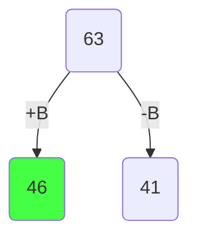
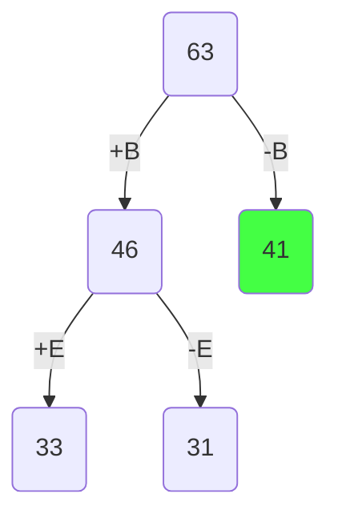
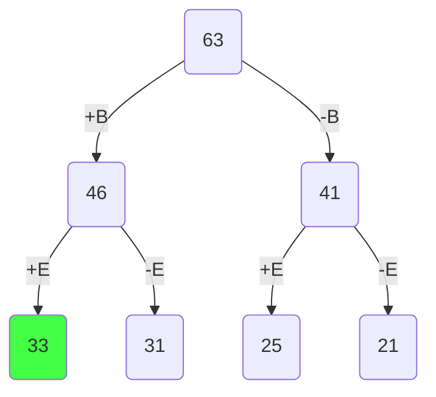
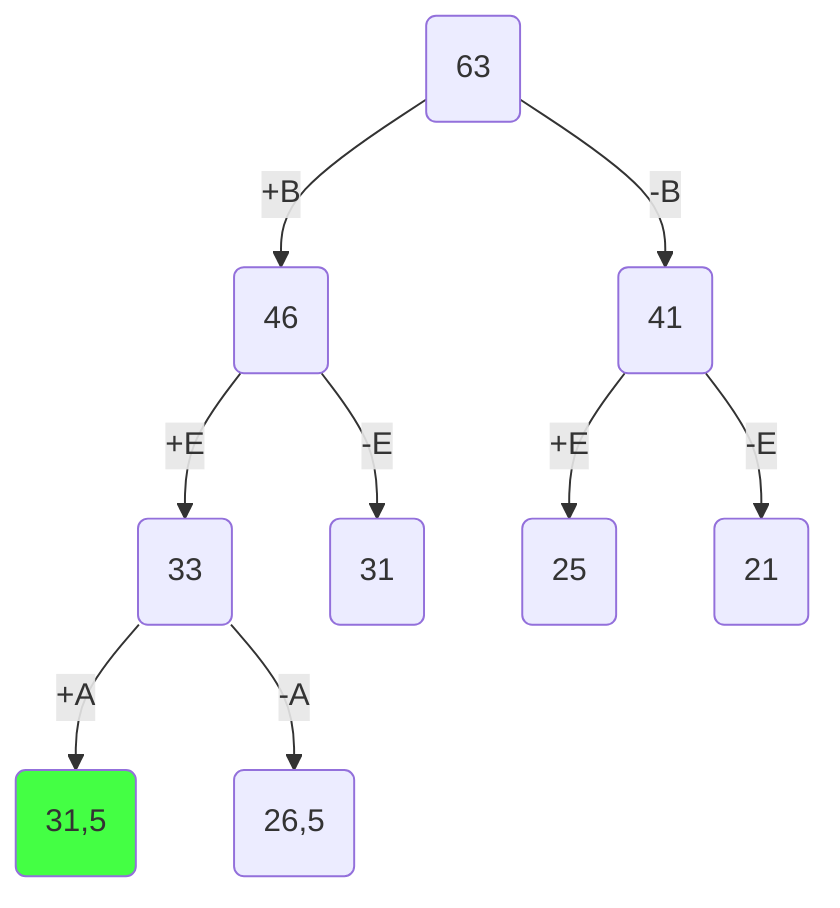
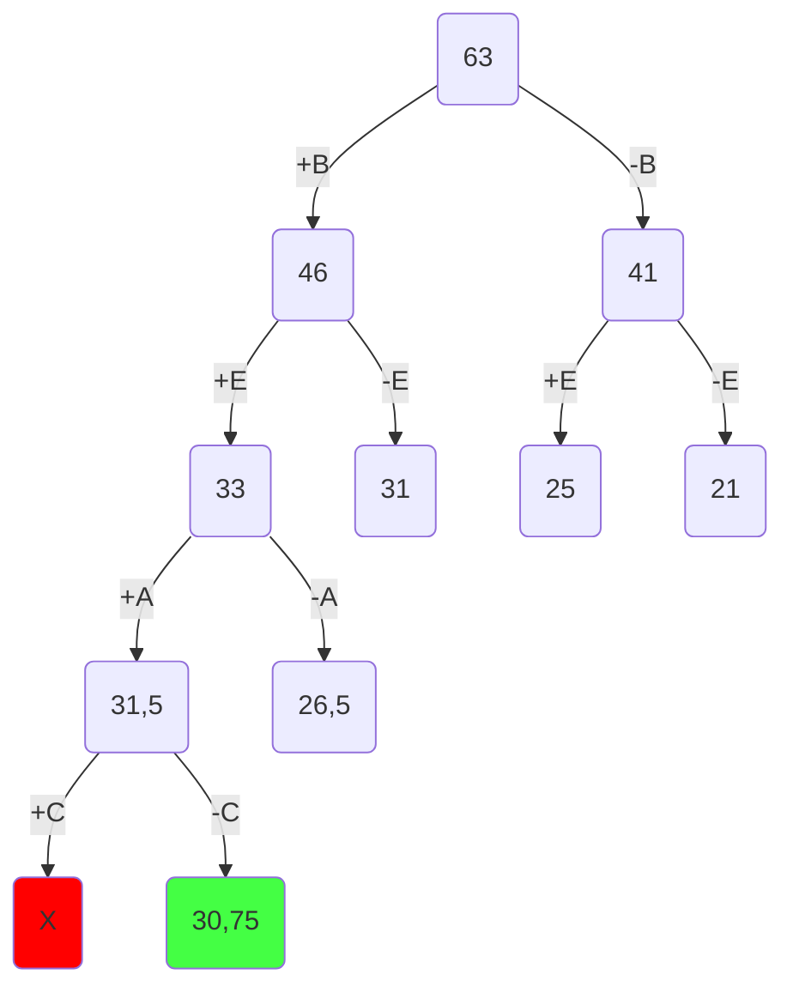
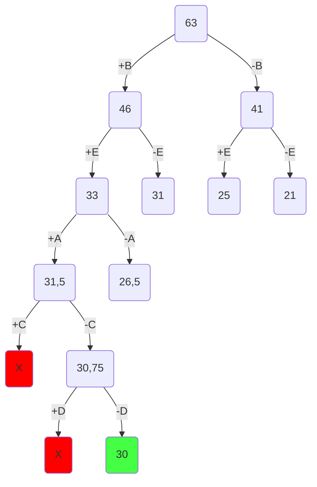

### Вариант 8:

| Предметы  | A  | B  | C  | D  | E |
|:----------|:--:|:--:|:--:|:--:|:-:|
| Стоимость | 10 | 12 | 5  | 3  | 8 |
| Вес       | 10 | 4  | 10 | 12 | 4 |

Ограничение вместимости: 21

## Шаг 1
Сортируем предметы по их ценности $(\frac {Стоимость}{вес})$

|    **Предметы**   | **B** | **E** | **A** | **C** | **D** |
|-------------------|:-----:|:-----:|:-----:|:-----:|:-----:|
| **Стоимость**     |  12   |   8   |  10   |   5   |   3   |
| **Вес**           |   4   |   4   |  10   |  10   |  12   |
| **Ценность**      |   3   |   2   |   1   |$\frac{1}{2}$|$\frac{1}{4}$|

## Шаг 2
Представим, что самого ценного предмета из тех, что еще не обработаны, у нас бесконечное количество и мы можем делить его на сколь угодно малые части. Тогда мы можем все оставшееся в рюкзаке место заполнить этим предметом. Тогда ценность будет

$$
3 * 21 = 63
$$

Это значение будет корнем нашего дерева, оно представляет оценку перспективности для задачи в целом.

## Шаг 3
Разобьем множество решений на два подмножества и начнем строить дерево. Левым потомком будет подмножество решений, в которых мы взяли самый ценный из оставшихся предметов, правым - где не взяли. 

Оценка перспективности левого потомка = 

$$
12 + (21 - 4) * 2 = 46 
$$

Оценка перспективности правого потомка = 

$$
21 * 2 = 41
$$

Повторяем шаг 3 и продолжаем строить дерево из самой перспективной вершины.

Оценка перспективности левого потомка =

$$
12 + 8 + (21 - 4 - 4) * 1 = 33
$$

Оценка перспективности правого потомка =

$$
12 + (21 - 2) * 1 = 31
$$

Заметим, что самая перспективная вершина оказалась на другой ветке. Продолжаем строить из вершины с оценкой 41.

Оценка перспективности левого потомка =

$$
8 + (21 - 4) * 1 = 25
$$

Оценка перспективности правого потомка =

$$
21 * 1 = 21
$$

Самая перспективная вершина - 33.

Оценка перспективности левого потомка =

$$
12 + 8 + 10 + (21 - 4 - 4 - 10) * 0.5 = 31.5
$$

Оценка перспективности правого потомка =

$$
12 + 8 + (21 - 4 - 4) * 0.5 = 26.5
$$

Самая перспективная вершина - 31,5.

Оценка перспективности левого потомка =

12 + 8 + 10 + 5 + (21 - 4 - 4 - 10 - 10) * 0.25 = 35 - 7 * 0.25  
Получили отрицательное значение, что значит предмет не поместится в рюкзак. Соответственно от этой вершины мы не будем продолжать поиск.

Оценка перспективности правого потомка =

$$
12 + 8 + 10 + (21 - 4 - 4 - 10) * 0.25 = 30.75
$$

Самая перспективная вершина - 30,75.

Оценка перспективности левого потомка =

12 + 8 + 10 + 5 + (21 - 4 - 4 - 10 - 10) * 0 = 35 - 7 * 0 
Получили отрицательное значение, что значит предмет не поместится в рюкзак. Соответственно от этой вершины мы не будем продолжать поиск.

Оценка перспективности правого потомка =

$$
12 + 8 + 10 + (21 - 4 - 4 - 10) * 0 = 30
$$

Поскольку мы опустились до самого нижнего уровня (рассмотрели все предметы) и вершина на самом нижнем уровне является самой перспективной, то это и будет ответом.

Чтобы восстановить все положенные в рюкзак предметы пройдемся по ребрам, которые привели нас к ответу.

# Ответ

В рюкзак пойдут предметы B, E, A. Максимальная стоимость рюкзака: 12 + 8 + 10 = 30.
