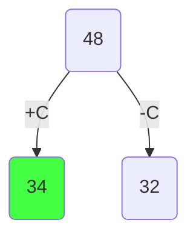
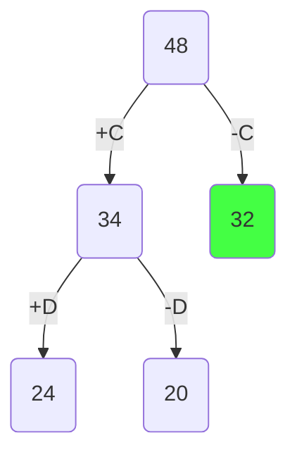
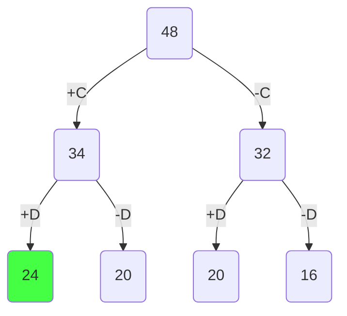
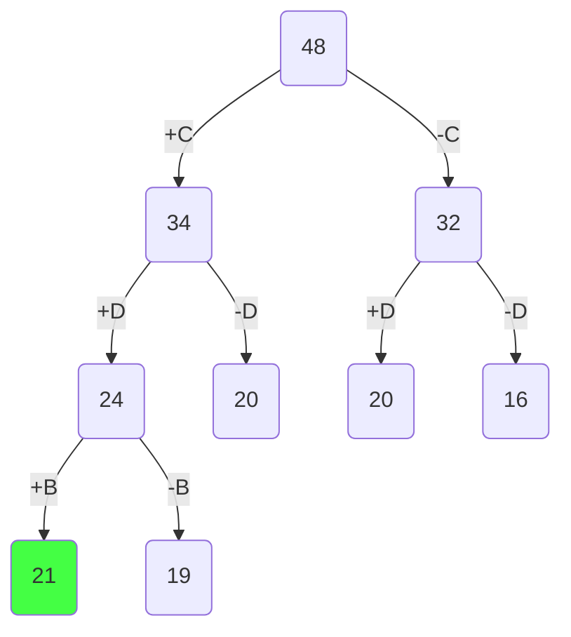
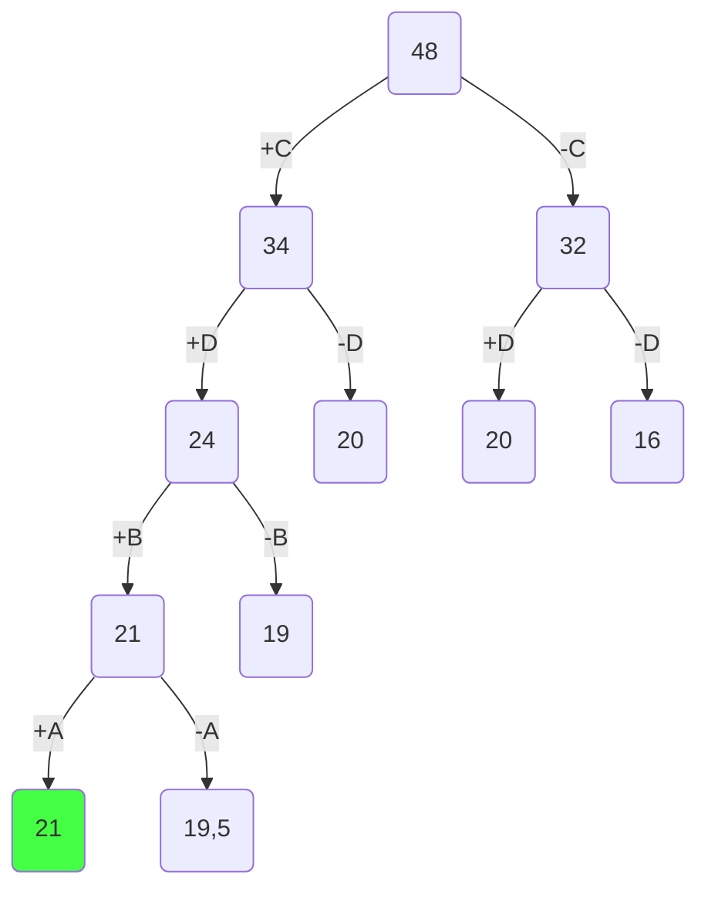
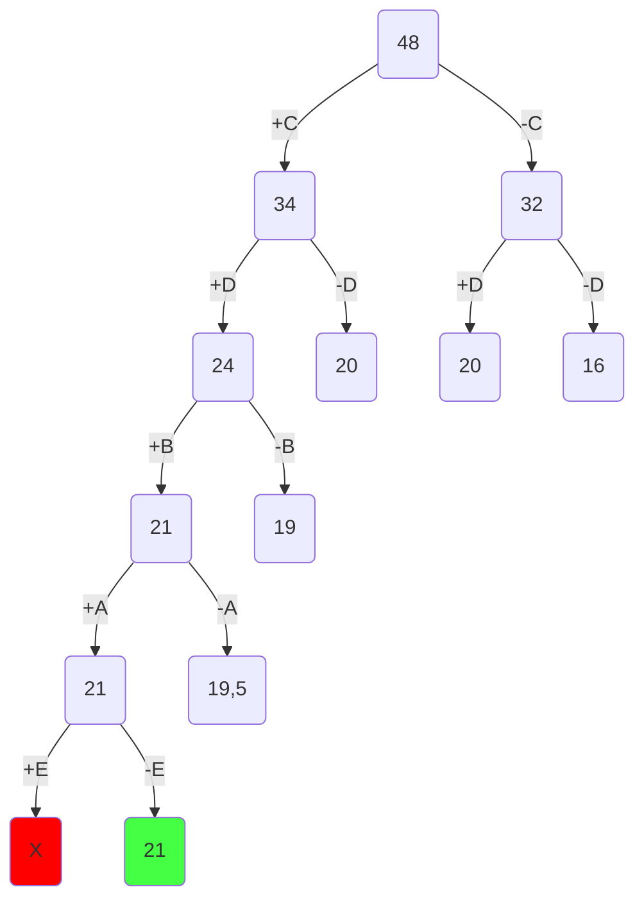

# Постановка задачи

Задача о рюкзаке (англ. Knapsack problem) — дано N предметов, ni предмет имеет массу wi > 0 и стоимость pi > 0. Необходимо выбрать из этих предметов такой набор, чтобы суммарная масса не превосходила заданной величины W (вместимость рюкзака), а суммарная стоимость была максимальна.

# Условия задачи

| Предметы  |  A  |  B  |  C  |  D  |  E  |
| :-------- | :-: | :-: | :-: | :-: | :-: |
| Стоимость |  3  |  4  |  6  |  8  |  3  |
| Вес       |  6  |  4  |  2  |  4  | 12  |

Ограничение вместимости: 16

# Шаг 1

Сортируем предметы по их ценности $(\frac {Стоимость}{вес})$

| Предметы  |  A  |  B  |  C  |  D  |  E   |
| :-------- | :-: | :-: | :-: | :-: | :--: |
| Стоимость |  3  |  4  |  6  |  8  |  3   |
| Вес       |  6  |  4  |  2  |  4  |  12  |
| Ценность  | 0.5 |  1  |  3  |  2  | 0.25 |

| Предметы  |  C  |  D  |  B  |  A  |  E   |
| :-------- | :-: | :-: | :-: | :-: | :--: |
| Стоимость |  6  |  8  |  4  |  3  |  3   |
| Вес       |  2  |  4  |  4  |  6  |  12  |
| Ценность  |  3  |  2  |  1  | 0.5 | 0.25 |

# Шаг 2

Представим, что самого ценного предмета из тех, что еще не обработаны, у нас бесконечное количество и мы можем делить его на сколь угодно малые части. Тогда мы можем все оставшееся в рюкзаке место заполнить этим предметом. Тогда ценность будет

$$
3 * 16 = 48
$$

Это значение будет корнем нашего дерева, оно представляет оценку перспективности для задачи в целом.

# Шаг 3

Разобьем множество решений на два подмножества и начнем строить дерево. Левым потомком будет подмножество решений, в которых мы взяли самый ценный из оставшихся предметов, правым - где не взяли.

Оценка перспективности левого потомка =

$$
6 + (16 - 2) * 2 = 34
$$

Оценка перспективности правого потомка =

$$
16 * 2 = 32
$$

Повторяем шаг 3 и продолжаем строить дерево из самой перспективной вершины.

Оценка перспективности левого потомка =

$$
6 + 8 + (16 - 2 - 4) * 1 = 24
$$

Оценка перспективности правого потомка =

$$
6 + (16 - 2) * 1 = 20
$$

Заметим, что самая перспективная вершина оказалась на другой ветке. Продолжаем строить из вершины с оценкой 32.

Оценка перспективности левого потомка =

$$
8 + (16 - 4) * 1 = 20
$$

Оценка перспективности правого потомка =

$$
16 * 1 = 16
$$

Самая перспективная вершина - 24.

Оценка перспективности левого потомка =

$$
6 + 8 + 4 + (16 - 2 - 4 - 4) * 0.5 = 21
$$

Оценка перспективности правого потомка =

$$
6 + 8 + (16 - 2 - 4) * 0.5 = 19
$$

Самая перспективная вершина - 21.

Оценка перспективности левого потомка =

$$
6 + 8 + 4 + 3 + (16 - 2 - 4 - 4 - 6) * 0.25 = 21
$$

Оценка перспективности правого потомка =

$$
6 + 8 + 4 + (16 - 2 - 4 - 4) * 0.25 = 19.5
$$

Самая перспективная вершина - 21.

При оценке перспективности левого потомка мы упираемся в лимит рюкзака, который мы не можем превысить, т.е. $16 - 2 - 4 - 4 - 6 - 12 = -12$. Соответственно от этой вершины мы не будем продолжать поиск.

Оценка перспективности правого потомка =

$$
6 + 8 + 4 + 3 + (16 - 2 - 4 - 4 - 6) * 0 = 21
$$

Поскольку мы опустились до самого нижнего уровня (рассмотрели все предметы) и вершина на самом нижнем уровне является самой перспективной, то это и будет ответом.

Чтобы восстановить все положенные в рюкзак предметы пройдемся по ребрам, которые привели нас к ответу.

# Ответ

В рюкзак пойдут предметы A, B, D, C. Максимальная стоимость рюкзака: 3 + 4 + 6 + 8 = 21.
